## 목차
- [Spring Framework](#spring-framework)
  - [특징](#특징)
- [Spring Boot](#spring-boot)
  - [특징](#특징-1)
- [Spring 개념](#spring-개념)
  - [IoC, DO](#ioc-do)
    - [IoC (Inversion Of Control)](#ioc-inversion-of-control)
    - [DI (Dependency Injection)](#di-dependency-injection)
  - [스프링 컨테이너, Bean](#스프링-컨테이너-bean)
- [Spring Boot 프로젝트 생성](#spring-boot-프로젝트-생성)
- [Spring Boot 프로젝트 구조](#spring-boot-프로젝트-구조)
  - [`src/main/java`](#srcmainjava)
    - [`FirstSpringApplication`](#firstspringapplication)
  - [`src/main/resources`](#srcmainresources)
  - [`src/test/java`](#srctestjava)
  - [Project and External Dependencies](#project-and-external-dependencies)
  - [`gradle/wrapper/`](#gradlewrapper)
  - [gradlew, gradlew.bat](#gradlew-gradlewbat)
  - [build.gradle](#buildgradle)
- [MVC 패턴](#mvc-패턴)
- [타임리프](#타임리프)
  - [타임리프의 표현식](#타임리프의-표현식)
- [Spring Boot로 게시판 만들기](#spring-boot로-게시판-만들기)
  - [1. 데이터베이스 생성](#1-데이터베이스-생성)
  - [2. 프로젝트에 데이터 소스(Driver, URL, UserName, PassWord) 설정](#2-프로젝트에-데이터-소스driver-url-username-password-설정)
  - [3. DTO 생성](#3-dto-생성)
  - [4. MyBatis 설정](#4-mybatis-설정)
  - [5. 컨트롤러 생성](#5-컨트롤러-생성)
  - [6. Service 인터페이스, Imple 클래스 생성](#6-service-인터페이스-imple-클래스-생성)
  - [7. Mapper 인터페이스 생성](#7-mapper-인터페이스-생성)
  - [8. Mapper xml 파일 생성](#8-mapper-xml-파일-생성)
  - [9. 테스트 코드 작성해보기](#9-테스트-코드-작성해보기)
  - [10. 게시물 목록 디자인](#10-게시물-목록-디자인)

<br/>
<br/>
<br/>
<br/>

# Spring Framework
- [공식 홈페이지](https://spring.io/)
- 기본적인 Java 웹 개발의 핵심은 자바와 서블릿이라 볼 수 있지만, 학습용이 아닌 실무(엔터프라이즈 애플리케이션)에서 개발하는 서비스는 고려할 사항이 많아진다.
  - 엔터프라이즈 애플리케이션 : 대규모의 복잡한 데이터를 관리하는 애플리케이션.
  - 많은 사용자의 요청을 동시에 처리해야 하기 때문에 서버의 성능과 안정성, 보안이 매우 중요하다
- Spring Framework는 Java 기반의 OpenSource Framework로 단순하고 효율적인 해결이 가능하도록 설계되었다
## 특징
- 경량 프레임워크
  - 스프링은 필요한 라이브러리만 선택적으로 사용할 수 있는 경량 프레임워크이다.
  - 애플리케이션의 크기를 최소화하고, 실행 속도를 최적화할 수 있다.
- 제어의 역행(Inversion Of Control, IOC)
  - 객체의 생성, 소멸과 같은 생명 주기를 스프링 컨테이너가 관리하게 된다.
  - 이를 통해 코드의 유연성과 재사용성을 높일 수 있다.
- 의존성 주입(Dependency Injection, DI)
  - 각 계층이나 서비스 간의 의존성이 존재하는 경우, 프레임워크가 연결해준다.
  - 객체 간의 의존성을 외부에서 주입하여 코드의 결합도는 낮추고 테스트와 유지보수를 쉽게 할 수 있다.
- 관점지향 프로그래밍(Aspect-Oriented Programming, AOP)
  - AOP는 여러 모듈에서 공통적으로 사용하는 기능(예: 트랜잭션, 로깅, 보안)을 분리하여 관리할 수 있도록 한다.
  - AOP를 통해 관심사를 모듈화하고, 코드 중복을 줄이며 기능을 핵심 관점과 부가 관점으로 명확히 분리할 수 있다.
- POJO(Plain Old Java Object) 기반 개발 지향
  - 기존의 Java 객체를 그대로 사용 가능하다.

<br/>
<br/>
<br/>
<br/>

# Spring Boot
- 스프링 부트는 스프링 프레임워크를 더 쉽고 빠르게 이용할 수 있도록 만들어주는 도구이다.
- 빠르게 스프링 프로젝트를 설정할 수 있고, 의존성 세트라고 불리는 스타터(starter)를 사용해 간편하게 의존성을 사용하거나 관리할 수 있다
## 특징
- 웹 애플리케이션 서버(WAS)가 내장되어 있어서 따로 설치하지 않아도 독립적으로 실행할 수 있다. (바로 개발 가능)
- 빌드 구성을 단순화하는 스프링 부트 스타터를 제공한다.
- XML 설정 없이, Java 코드로 모두 작성할 수 있다.
- JAR를 이용해서 자바 옵션만으로도 배포가 가능하다.

<br/>
<br/>
<br/>
<br/>

# Spring 개념
## IoC, DO
- 스프링은 모든 기능의 기반을 제어의 역전(IoC)와 의존성 주입(DI)에 두고 있다.
### IoC (Inversion Of Control)
- 객체를 직접 생성하거나 제어하는 것이 아니라 외부에서 관리하는 객체를 가져와 사용하는 것을 의미한다.
### DI (Dependency Injection)
- IoC를 구현하기 위해 사용되는 방법으로, 특정 클래스가 다른 클래스에 의존하는 것을 의미한다.
- `@Autowired`라는 애너테이션으로 스프링 컨테이너에 있는 빈(Bean, 스프링 컨테이너에서 관리하는 객체)을 주입한다.
## 스프링 컨테이너, Bean
- 스프링 컨테이너는 빈(Bean)을 생성하고 관리한다.
- 빈이 생성되고 소멸되기까지의 생명주기를 스프링 컨테이너가 관리한다.
- 빈(Bean)은 스프링 컨테이너가 생성하고 관리하는 객체이다.
- 빈을 스프링 컨테이너에 등록하기 위해서는 XML 파일을 설정하거나 애너테이션을 추가하는 방법을 사용한다.
- 빈의 이름은 클래스 이름의 첫 글자를 소문자로 바꿔 관리한다

<br/>
<br/>
<br/>
<br/>

# Spring Boot 프로젝트 생성
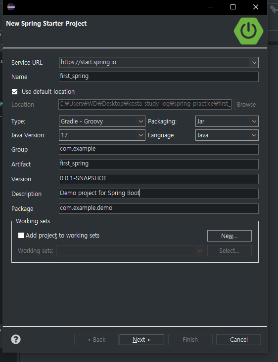
- Group은 보통 패키지를 적는 것이 관례이다.
- Spring Starter Project는 손쉽게 스프링 부트 기반의 프로젝트를 생성한다.

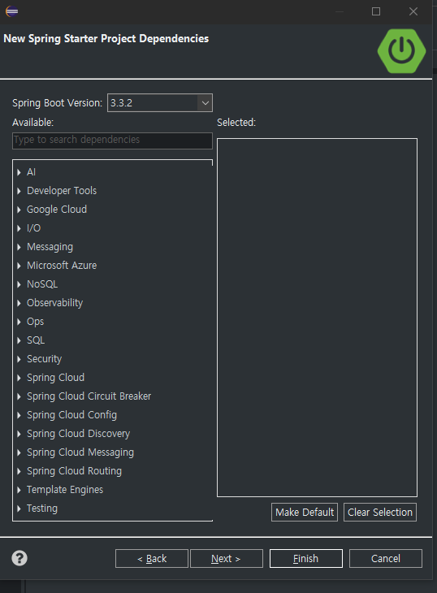
- 프로젝트 이름, 빌드 관리 도구 및 아티팩트, 자바 버전, 패키지 등 프로젝트의 기본적인 사항들을 설정은 물론, 필요한 의존성 라이브러리들을 선택하면 된다. 
- 프로젝트 생성 후에 의존성을 추가할 수도 있다.

<br/>

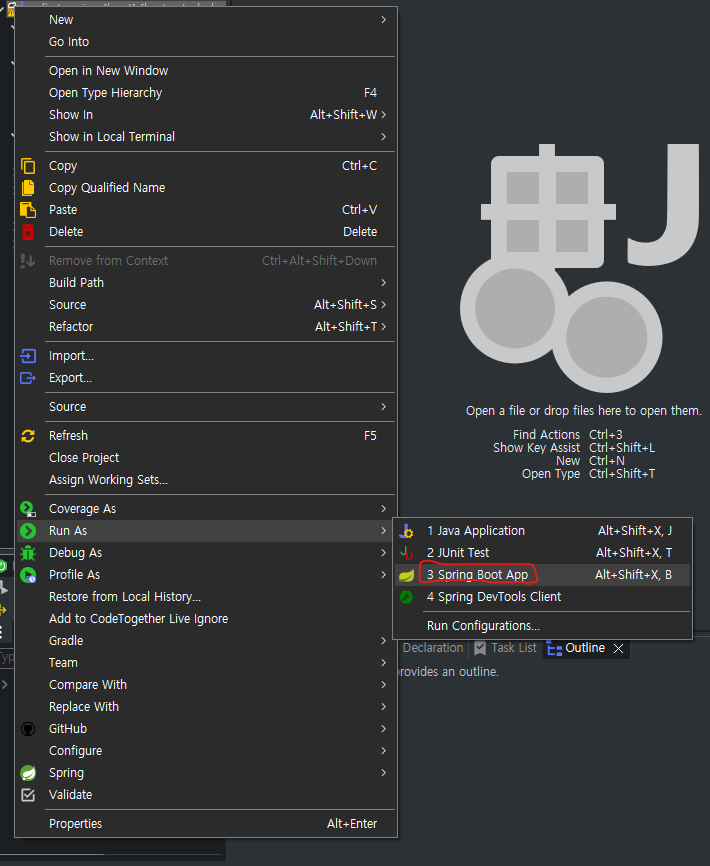
- Run as > Spring Boot App 클릭해서 서버 실행

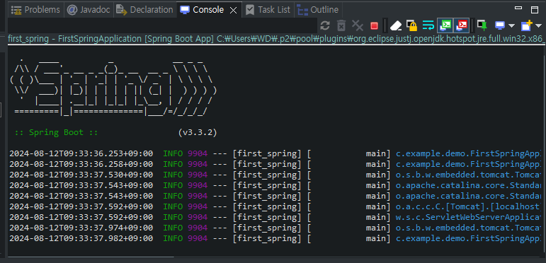
- 콘솔 로그를 통해 프로젝트가 톰캣으로 실행되었으며, 8080 포트를 사용한다는 것을 알 수 있다.
- 웹 브라우저에서도 정상적으로 실행되는지 살펴보기 위해 localhost:8080을 입력하면 된다.

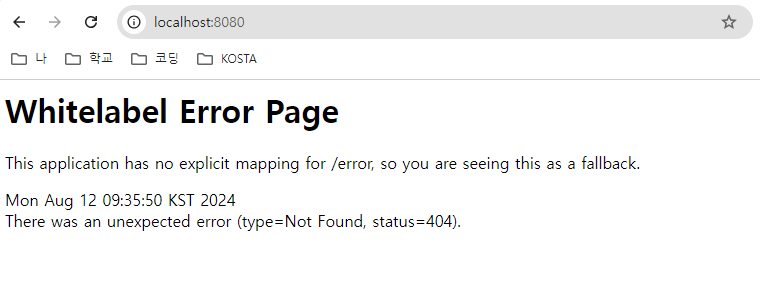
- 404 에러 페이지가 나타나는 것이 정상적인 결과이다.
- 스프링부트로 프로젝트를 생성하면 프로젝트의 실행에 관련된 기능이 자동으로 설정되지만, 화면에 보이는 부분은 자동으로 만들어지지 않기 때문이다.

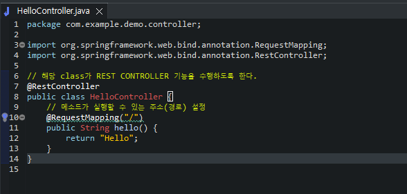

- `@RestController` : 해당 클래스가 REST Controller 기능을 수행하도록 한다.
- `@RequestController` : 해당 메소드를 실행할 수 있는 주소를 설정한다.

<br/>
<br/>
<br/>
<br/>

# Spring Boot 프로젝트 구조
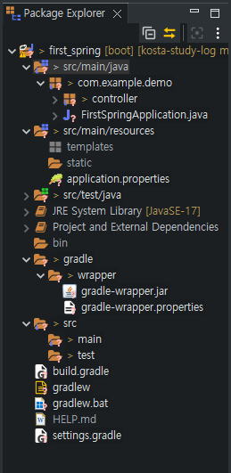
## `src/main/java`
- 프로젝트의 java 소스 코드가 위치하는 디렉토리
### `FirstSpringApplication` 
- 애플리케이션을 시작할 수 있는 스프링 메인 클래스
- 스프링 부트 애플리케이션의 구성과 실행을 담당하는 중요한 클래스이다.

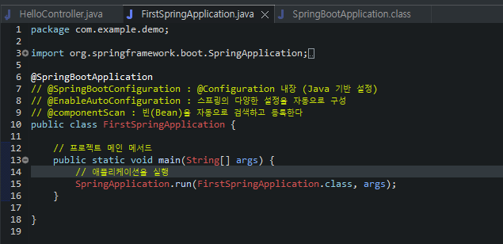
- `@SpringBootApplication`은 SpringBoot 사용에 필요한 기본설정으로, 주요한 어노테이션 세 개로 구성되어 있다.
  - `@EnableAutoConfiguration` : 스프링의 다양한 설정을 자동으로 구성
  - `@ComponentScan` : Bean을 일일이 선언하지 않고, 자동으로 컴포넌트 클래스를 검색하고 컨텍스트에 등록
  - `@SpringBootConfiguration` : Java 기반 설정 (`@Configuration`이 내장되어 있음)
## `src/main/resources`
- 애플리케이션의 리소스 파일이 위치하는 디렉토리
- `static` : CSS, JS, image 등 정적 리소스 디렉토리
- `templates` : 스프링 부트에서 사용 가능한 뷰 템플릿 디렉토리 (화면 부분 담당)
- `application.properties` 또는 `application.yml` : 설정에 필요한 프로퍼티
## `src/test/java`
- 테스트 소스 코드가 위치하는 디렉토리
## Project and External Dependencies
- Gradle에 명시한 프로젝트의 필수 라이브러리
## `gradle/wrapper/`
- 특정 버전의 Gradle을 사용할 수 있게 하는 관련 파일
## gradlew, gradlew.bat
- Gradle Wraper 실행 스크립트
## build.gradle
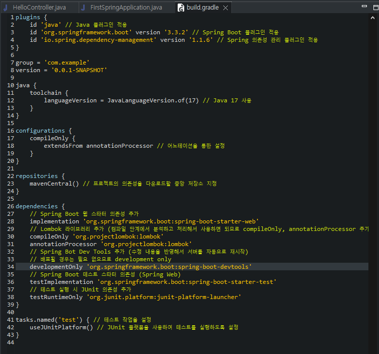
- Gradle 빌드 설정 파일

<br/>
<br/>
<br/>
<br/>

# MVC 패턴
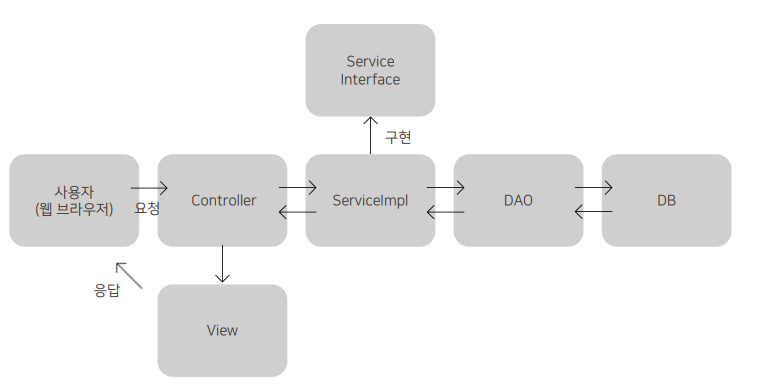
- MVC 패턴(Model, View, Controller 패턴)에는 모델1,모델2가 있지만 최근 웹개발은 대부분 모델2를 사용한다.
  - 따라서 MVC 패턴이라고 이야기하면 모델2를 의미한다.
- MVC 패턴을 이용하면 사용자 인터페이스와 비즈니스 로직을 분리하여 개발할 수 있다.
- 즉, 서로의영향을최소화하여개발하고변경이쉬운애플리케이션을만들수있다.


<br/>
<br/>
<br/>
<br/>

# 타임리프
- 템플릿 엔진(HTML 상에 데이터를 넣어 보여주는 도구)이다.
- 스프링에서 공식 지원한다.
## 타임리프의 표현식
|표현식|설명|
|---|---|
|${ } | 변수의 값 표현|
|#{ } | 속성 파일 값 표현|
|@{ }, \| \| | URL 표현|
|*{ } | 선택한 변수 표현|

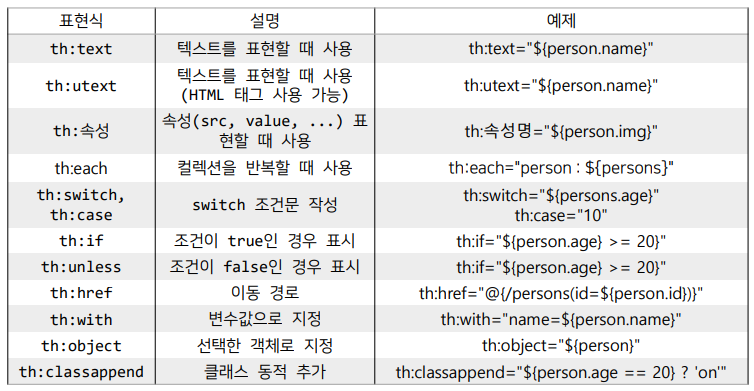

<br/>
<br/>
<br/>
<br/>

# Spring Boot로 게시판 만들기
## 1. 데이터베이스 생성
```sql
DROP DATABASE IF EXISTS `board_db`;
CREATE DATABASE board_db DEFAULT CHARACTER SET = 'utf8mb4' COLLATE = 'utf8mb4_0900_ai_ci';

USE board_db;

CREATE TABLE board_tbl (
id INT PRIMARY KEY AUTO_INCREMENT COMMENT '글 번호',
title VARCHAR(300) NOT NULL COMMENT '글 제목',
content TEXT NOT NULL COMMENT '글 내용',
hit INT NOT NULL DEFAULT 0 COMMENT '조회 수',
created_at DATETIME NOT NULL DEFAULT CURRENT_TIMESTAMP COMMENT '작성일',
creator VARCHAR(50) NOT NULL COMMENT '작성자',
updated_at DATETIME DEFAULT NULL ON UPDATE CURRENT_TIMESTAMP COMMENT '수정일',
is_deleted CHAR(1) NOT NULL DEFAULT 'n' COMMENT '삭제 여부'
);
```
## 2. 프로젝트에 데이터 소스(Driver, URL, UserName, PassWord) 설정
- `application.properties` 또는 `application.yml` 파일에 선언하면 된다.
```properties
spring.application.name=board

# DB 연결 (데이터 소스 설정)
spring.datasource.driver-class-name=com.mysql.cj.jdbc.Driver
spring.datasource.url=jdbc:mysql://localhost:3306/board_db
spring.datasource.username=root
spring.datasource.password=1234
```
## 3. DTO 생성
- DTO(Data Transfer Object) : 애플리케이션 내에서 각 계층(뷰, 컨트롤러, 서비스, DAO, DB) 간 데이터를 주고 받을 때 사용되는 객체이다.
```java
package com.board.dto;

import java.time.LocalDateTime;

import lombok.Data;

@Data
public class BoardDTO {
	private int id;
	private String title, content;
	private int hit;
	private LocalDateTime createdAt;
	private String creator;
	private LocalDateTime updatedAt;
}
```
## 4. MyBatis 설정
- 마이바티스(MyBatis)는 쿼리 기반 웹 애플리케이션을 개발할 때 가장 많이 사용되는 SQL 매퍼 프레임워크이다.
- MyBatis는 SQL을 XML 파일에 분리하여 작성하기 때문에, SQL의 변환이 자유롭고 가독성이 좋다는 특징이 있다.
- 먼저 Java가 사용하는 카멜 표기법과 MySQL에서 사용하는 스네이크 케이스 표기법이 자동으로 일치되도록 설정하자
```properties
mybatis.configuration.map-underscore-to-camel-case=true
```
## 5. 컨트롤러 생성
- 컨트롤러는 요청에 필요한 비즈니스 로직을 호출하고, 그 결과를 포함한 응답을 해주는 Dispatcher 역할을 한다. 
<hr/>

1. 컨트롤러는 클래스에 @Controller 어노테이션을 적용한다.
2. @RequestMapping 어노테이션을 이용해 요청에 맞는 주소를 지정한다.
3. 요청에 필요한 비즈니스 로직을 호출한다.
4. 실행된 비즈니스 로직의 결과를 뷰로 반환한다.

<hr/>

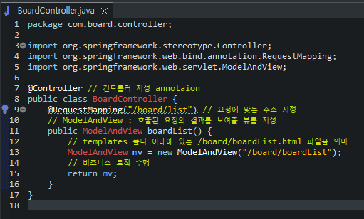
- `ModelAndView` : 호출된 요청의 결과를 보여줄 뷰를 지정
- "/board/boardList"는 templates 폴더 아래에 있는 "/board/boardList.html"을 의미한다.
## 6. Service 인터페이스, Imple 클래스 생성
- 서비스 영역은 일반적으로 Service 인터페이스와 Serivce 인터페이스를 구현한  Impl 클래스로 구성된다.
- 인터페이스와 인터페이스의 구현 클래스로 분리하여 얻는 장점은 아래와 같다.
  - 느슨한 결합을 유지하여 각 기능 간의 의존 관계를 최소화한다. 
  -  기능의 변화에도 최소한의 수정으로 개발할 수 있는 유연함을 갖는다.
  - 모듈화를 통해 어디서든 사용할 수 있어, 재사용성이 높아진다.
  - 스프링의 IoC, DI을 이용하여 관리할 수 있다.

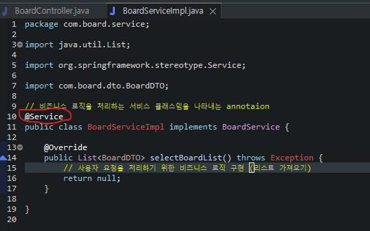
- Service 인터페이스 구현 클래스는 비즈니스 로직을 처리하는 서비스 클래스임을 나타내는 어노테이션 `@Service`를 명시한다.
- 인터페이스 구현을 나타내는 implements도 명시하여, 추상메소드를 Override 해준다.
- 메소드 내부에서 사용자 요청을 처리하는 비즈니스 로직을 수행하게 된다.

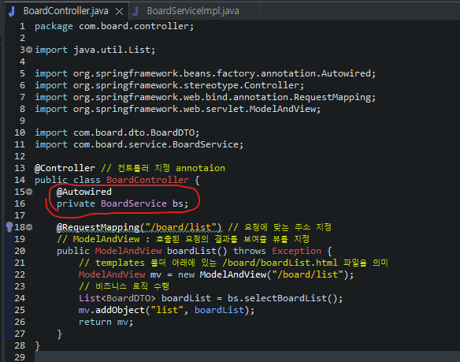
- 서비스 빈(Bean)을 연결해주어야 하는데, `@Autowired` 어노테이션이 필요한 의존 객체의 타입에 해당하는 빈을 찾아 자동으로 주입해준다.
## 7. Mapper 인터페이스 생성
- Spring boot에서는 일일이 DAO를 만들지 않고, Mapper 인터페이스를 만들기만 하면 된다.
- @Mapper 어노테이션을 붙여 Mybatis의 매퍼 인터페이스임을 선언한다.
- Mapper 인터페이스에서 작성된 추상 메소드의 이름이 자동으로 XML과 매핑된다.

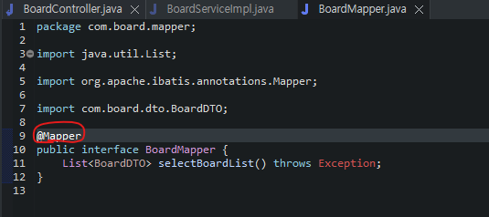

- Service에서 BoardMapper를 통해 데이터베이스에서 접근할 수 있도록 `@Autowired` 어노테이션으로 자동 주입을 해주어야 한다.

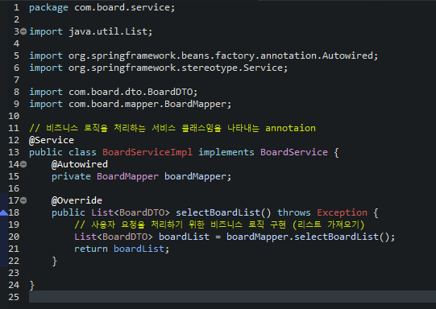
## 8. Mapper xml 파일 생성
- `src/main/resources`에 XML 파일을 생성해서 BoardMapper 인터페이스와 XML 파일 내 쿼리가 매칭되어 사용될 수 있도록 한다.
- 매퍼 파일(XML) namespace는 BoardMapper 인터페이스의 경로를 명시해줘야 한다.
- select 태그의 id 값은 BoardMapper 메소드의 이름과 동일해야 한다.
- resultType의 값은 해당 쿼리의 실행 결과의 형식을 의미한다.

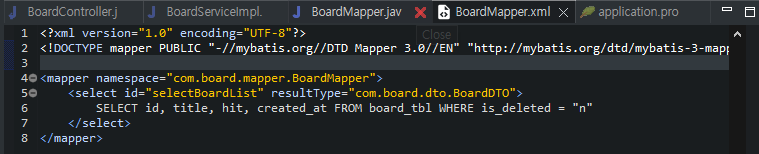

- mapper 파일 경로를 알려주면 자동으로 매칭이 된다.
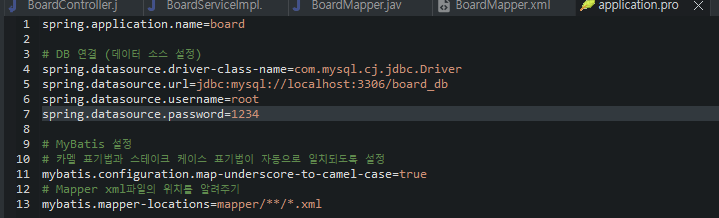
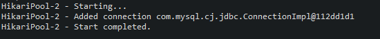
## 9. 테스트 코드 작성해보기
- src/test/java에 board 폴더 생성 후 BoardServiceTest 파일 생성해보기

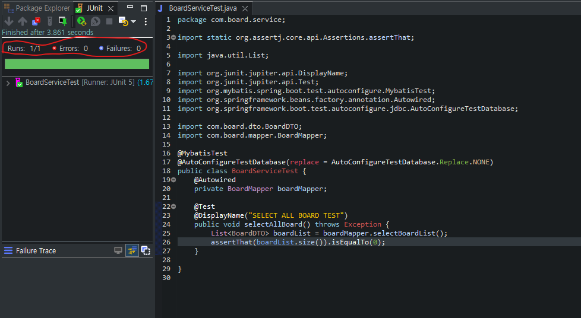

- JUnit으로 실행해보면 테스트 코드의 성공/실패 여부를 볼 수 있다.
## 10. 게시물 목록 디자인
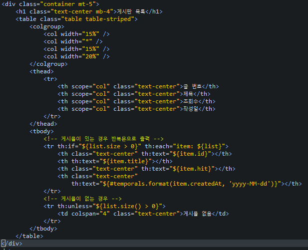   
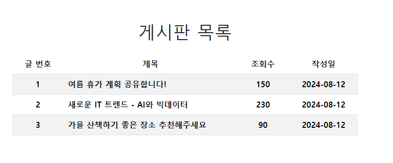