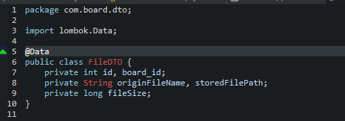
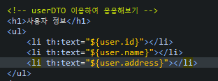

## 목차
- [필터와 인터셉터](#필터와-인터셉터)
- [인터셉터 구현하기](#인터셉터-구현하기)
  - [인터셉터 사용 \[실습\]](#인터셉터-사용-실습)
- [트랜잭션 사용하기](#트랜잭션-사용하기)
  - [트랜잭션 실습](#트랜잭션-실습)
- [예외 처리하기](#예외-처리하기)
  - [예외 처리 \[실습\] - @ExceptionHandler](#예외-처리-실습---exceptionhandler)
  - [예외 처리 \[실습\] - @ControllerAdvice](#예외-처리-실습---controlleradvice)
- [파일 업로드](#파일-업로드)
  - [1. 파일 첨부를 위한 DB 설정](#1-파일-첨부를-위한-db-설정)
  - [2. 파일 첨부를 위한 html 수정](#2-파일-첨부를-위한-html-수정)
  - [3. controller 수정](#3-controller-수정)
  - [4. service interface, imple 메소드 수정](#4-service-interface-imple-메소드-수정)
  - [5. Mapper 파일 수정](#5-mapper-파일-수정)
  - [6. FileDTO 생성](#6-filedto-생성)
  - [7. ServiceImple에 파일 업로드 관련 코드 추가](#7-serviceimple에-파일-업로드-관련-코드-추가)
  - [8. Mapper 파일에 파일 업로드 sql문 추가](#8-mapper-파일에-파일-업로드-sql문-추가)
- [파일 다운로드](#파일-다운로드)
  - [1. BoardDTO 변경](#1-boarddto-변경)
  - [2. BoardMapper, FileMapper 분리](#2-boardmapper-filemapper-분리)
  - [3. ServiceImpl 코드 수정](#3-serviceimpl-코드-수정)
  - [4. Mapper 파일 수정](#4-mapper-파일-수정)
  - [5. detail.html 수정](#5-detailhtml-수정)
  - [6. download controller 추가](#6-download-controller-추가)
  - [7. Service에 메소드 추가](#7-service에-메소드-추가)
  - [8. Mapper에 추가](#8-mapper에-추가)
- [Thymeleaf](#thymeleaf)
  - [실습](#실습)
  - [실습2 \[응용\]](#실습2-응용)
  - [실습3 \[반복문, 조건문\]](#실습3-반복문-조건문)

<br/>
<br/>
<br/>
<br/>

# 필터와 인터셉터


- 어떤 URI를 호출했을 때, 해당 요청의 컨트롤러가 처리되기 전과 후에 특정 작업을 하기 위해서는 필터 또는 인터셉트를 사용할 수 있다.
- 필터는 DispatcherServlet 앞 단에서 동작한다.
- 인터셉터는 DispatcherServlet에서 컨트롤러로 가기 전에 동작한다.
- 필터는 서블릿의 기능 중 일부이지만, 인터셉터는 스프링 프레임워크에서 제공되는 기능이다. 
- 즉, 인터셉터에서만 스프링 빈을 사용할 수 있다.

<br/>

- **필터** : 서버와 클라이언트가 주고 받는 HTTP 요청과 응답에 대해 일괄적인 전처리/후처리
- **인터셉터** : Controller와 View page 사이에 오가는 신호를 처리

<br/>
<br/>
<br/>
<br/>

# 인터셉터 구현하기
- 스프링에서 인터셉터는 `HandleInterceptor` 인터페이스를 구현하여 사용할 수 있다.
- `HandleInterceptor` 인터페이스의 세 가지 메소드
  - `preHandle` : 컨트롤러 실행 전에 수행
  - `postHandle` : 컨트롤러 수행 후 결과를 뷰로 보내기 전에 수행
  - `afterCompletion` : 뷰의 작업까지 완료된 후 수행
## 인터셉터 사용 [실습]
1. 각 요청의 시작과 끝을 보여주는 로그를 출력하는 인터셉터 작성

2. LoggerInterceptor를 스프링빈으로 등록해주기 위한 설정

3. 콘솔에 찍히는 인터셉터


<br/>
<br/>
<br/>
<br/>

#  트랜잭션 사용하기
- 트랜잭션 : 데이터베이스의 상태를 변화시킬 때, 더 이상 분리할 수 없는 작은 단위
- 하나의 트랜잭션에서 일련의 작업이 처리되어야 한다.
- 즉, 되려면 모두 되어야 하고, 하나라도 안 되면 다 안되어야 한다..
## 트랜잭션 실습
- 조회수 : 오류가 생긴 경우에는 조회수가 +1이 되지 않도록 트랜잭션을 추가한다.


<br/>
<br/>
<br/>
<br/>

# 예외 처리하기
- 각각의 컨트롤러에서 `@ExceptionHandler`를 이용한 예외처리
- `@ControllerAdvice`를 이용한 전역 예외 처리
## 예외 처리 [실습] - @ExceptionHandler
1. Controller에 `@ExceptionHandler` 추가

2. 예외 확인해보기
    - errorMessage 추가하면 어디서 에러났는지 알 수 있다.
    - 배포 후에는 상세한 오류 기록은 필요 없다.

    
## 예외 처리 [실습] - @ControllerAdvice
1. `com.board.common` 패키지 생성 후 `ExcpetionHandlers` 클래스 생성


<br/>
<br/>
<br/>
<br/>

# 파일 업로드
## 1. 파일 첨부를 위한 DB 설정
```sql
CREATE TABLE file_tbl (
        id INT PRIMARY KEY AUTO_INCREMENT COMMENT '파일 번호',
        board_id INT NOT NULL COMMENT '게시글 번호',
        origin_file_name VARCHAR(255) NOT NULL COMMENT '원본 파일명',
        stored_file_path VARCHAR(255) NOT NULL COMMENT '파일 저장 경로',
        file_size INT NOT NULL COMMENT '파일 크기',
        creator VARCHAR(50) NOT NULL COMMENT '작성자',
        created_at DATETIME NOT NULL DEFAULT CURRENT_TIMESTAMP COMMENT '작성일',
        updated_at DATETIME DEFAULT NULL ON UPDATE CURRENT_TIMESTAMP COMMENT '수정일',
        is_deleted CHAR(1) NOT NULL DEFAULT 'n' COMMENT '삭제 여부',
        foreign key(board_id) references board_tbl(id)
);
```
## 2. 파일 첨부를 위한 html 수정

## 3. controller 수정

## 4. service interface, imple 메소드 수정

## 5. Mapper 파일 수정

- useGeneratekeys="true", keyProperty="id"로 id 값을 갱신한다
- id값이 자동으로 증가해서 id값을 얻을 수 있다.
## 6. FileDTO 생성

## 7. ServiceImple에 파일 업로드 관련 코드 추가

## 8. Mapper 파일에 파일 업로드 sql문 추가


<br/>
<br/>
<br/>
<br/>

# 파일 다운로드
## 1. BoardDTO 변경

## 2. BoardMapper, FileMapper 분리


## 3. ServiceImpl 코드 수정

## 4. Mapper 파일 수정
- Mapper 인터페이스에 추가   

- Mapper 파일에 sql문 작성   
  
## 5. detail.html 수정

- 다운로드 페이지로 넘어가기 위해 `th:href` 추가
- `"@{download(id=${list.id}, boardId=${list.boardId})}"`
  - 키-value 타입으로 id를 받아오면 다운로드할 파일의 id를 알수가 있다.   
  
  - boardId는 실습을 위해 같이 불러왔다 (원래는 없어도 된다)
## 6. download controller 추가
## 7. Service에 메소드 추가
   

## 8. Mapper에 추가
   


<br/>
<br/>
<br/>
<br/>

# Thymeleaf 
- 타임리프틑 자바 기반의 서버 템플릿 엔진이다.
- HTML 파일에서 서버 데이터를 표현하고 조작할 수 있도록 도와준다
- 타임리프의 속성들은 `th:`로 시작한다
- 이를 통해 데이터를 바인딩하거나, 표현식을 사용할 수 있다.
- `${변수}` : Spring 모델에서 변수를 가져와서 사용한다.
## 실습
   
   

## 실습2 [응용]
   
   

## 실습3 [반복문, 조건문]
   
   
