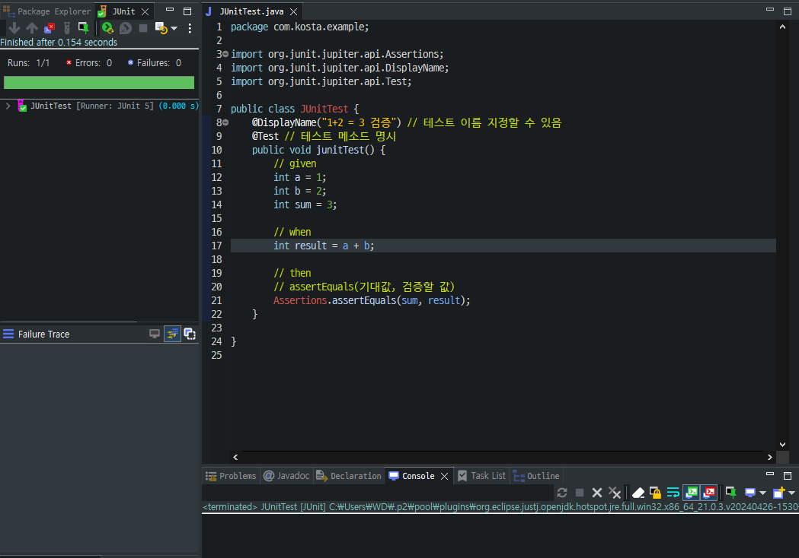
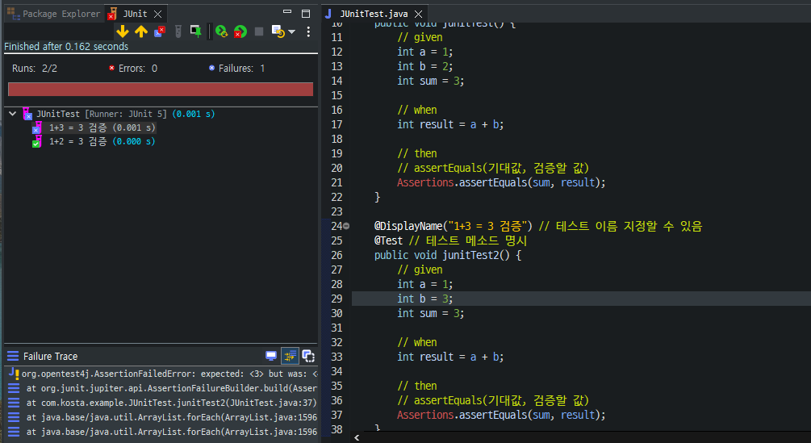
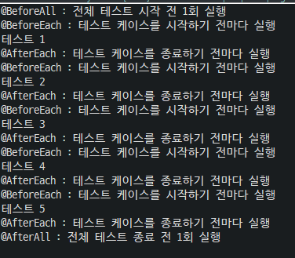
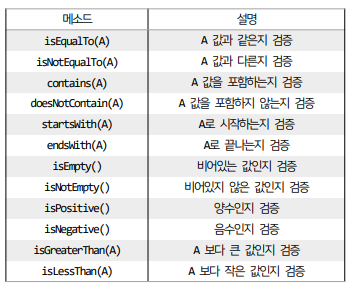
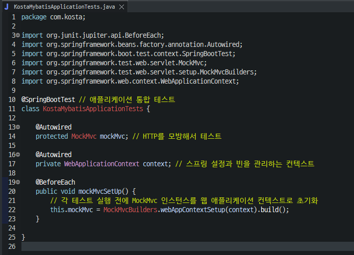
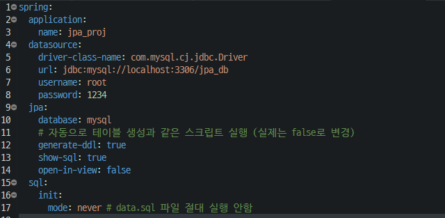
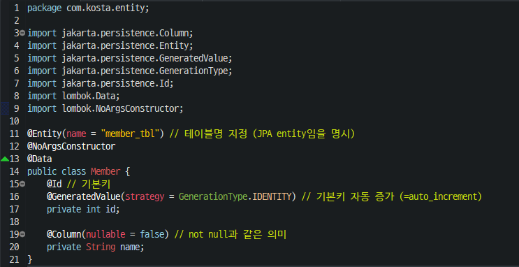
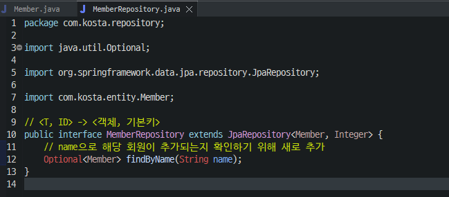

## 목차
- [테스트 코드](#테스트-코드)
  - [`given-when-then` 패턴](#given-when-then-패턴)
- [JUnit](#junit)
  - [특징](#특징)
  - [예제](#예제)
  - [JUnit에서 사용하는 애너테이션들](#junit에서-사용하는-애너테이션들)
    - [@BeforeAll](#beforeall)
    - [@BeforeEach](#beforeeach)
    - [@AfterAll](#afterall)
    - [@AfterEach](#aftereach)
  - [애너테이션들 실습](#애너테이션들-실습)
- [AssertJ](#assertj)
  - [적용 예제](#적용-예제)
- [\[실습\] 테스트 코드 적용해보기](#실습-테스트-코드-적용해보기)
  - [MockMvc 인스턴스 작성](#mockmvc-인스턴스-작성)
  - [전체 테스트 코드](#전체-테스트-코드)
- [JPA](#jpa)
  - [JPA의 장점](#jpa의-장점)
  - [JPA의 단점](#jpa의-단점)
- [스프링 데이터 JPA](#스프링-데이터-jpa)
  - [실습](#실습)
    - [application.yml 설정](#applicationyml-설정)
    - [data.sql 파일 생성](#datasql-파일-생성)
    - [Member 클래스 생성](#member-클래스-생성)
    - [MemberRepository 클래스 생성](#memberrepository-클래스-생성)
    - [Test 코드 생성](#test-코드-생성)

<br/>
<br/>
<br/>
<br/>

# 테스트 코드
- 작성한 코드가 의도대로 잘 동작하고 예상치 못한 문제가 없는지 확인할 목적으로 작성하는 코드
- 테스트 코드는 `test` 디렉토리에서 작업하게 된다.
## `given-when-then` 패턴
- 테스트의 실행을 준비하는 given 단계
- 테스트를 진행하는 when 단계
- 테스트 결과를 검증하는 then 단계

<br/>
<br/>
<br/>
<br/>

# JUnit
- 자바 언어를 위한 단위 테스트 프레임워크
- 단위 테스트 : 작성한 코드가 의도대로 작동하는지 작은 단위로 검증하는 것 (작은 단위 - 보통 메소드)
## 특징
- 테스트 방식을 구분할 수 있는 애너테이션을 제공한다.
- @Test 애너테이션으로 메소드를 호출할 때마다 새 인스턴스를 생성하여 독립적인 테스트가 가능하다.
- 예상 결과를 검증하는 assertion 메소드를 제공한다.
- 사용 방법이 단순하여, 테스트 코드 작성 시간이 적다.
- 자동 실행, 자체 결과를 확인하고 즉각적인 피드백을 얻을 수 있다.
## 예제


## JUnit에서 사용하는 애너테이션들
### @BeforeAll
- 전체 테스트를 시작하기 전에 처음으로 한 번만 실행(정적 메소드로 선언)
- DB 연결 또는 테스트 환경 초기화할 때 사용
### @BeforeEach
- 각 테스트 케이스를 시작하기 전에 매번 실행
- 테스트 메소드에서 사용하는 객체 초기화 또는 테스트에 필요한 값을 미리 넣을 때 사용
### @AfterAll
- 전체 테스트를 마치고 종료하기 전에 한번만 실행(정적 메소드로 선언)
- DB 연결 종료 또는 공통 사용 자원 해제 시 사용
### @AfterEach
- 각 테스트 케이스를 종료하기 전에 매번 실행
- 테스트 후 특정 데이터를 삭제하는 경우 사용
## 애너테이션들 실습
```java
package com.kosta.example;

import org.junit.jupiter.api.AfterAll;
import org.junit.jupiter.api.AfterEach;
import org.junit.jupiter.api.BeforeAll;
import org.junit.jupiter.api.BeforeEach;
import org.junit.jupiter.api.Test;

public class JUnitCycleTest {
	@BeforeAll
	public static void beforeAll() {
		System.out.println("@BeforeAll : 전체 테스트 시작 전 1회 실행");
	}

	@BeforeEach
	public void beforeEach() {
		System.out.println("@BeforeEach : 테스트 케이스를 시작하기 전마다 실행");
	}

	@AfterAll
	public static void afterAll() {
		System.out.println("@AfterAll : 전체 테스트 종료 전 1회 실행");
	}

	@AfterEach
	public void afterEach() {
		System.out.println("@AfterEach : 테스트 케이스를 종료하기 전마다 실행");
	}

	@Test
	public void test1() {
		System.out.println("테스트 1");
	}

	@Test
	public void test2() {
		System.out.println("테스트 2");
	}

	@Test
	public void test3() {
		System.out.println("테스트 3");
	}

	@Test
	public void test4() {
		System.out.println("테스트 4");
	}

	@Test
	public void test5() {
		System.out.println("테스트 5");
	}
}
```


<br/>
<br/>
<br/>
<br/>

# AssertJ
- JUnit과 함께 사용해 검증문의 가독성을 높여주는 라이브러리


## 적용 예제
```java
package com.kosta.example;

import static org.assertj.core.api.Assertions.assertThat;

import org.junit.jupiter.api.DisplayName;
import org.junit.jupiter.api.Test;

public class JUnitPractice {
	@DisplayName("문제1")
	@Test
	public void practice1() {
		String name1 = "이제훈";
		String name2 = "이제훈";
		String name3 = "이재훈";

		// 1. 모든 변수가 NULL인지 아닌지 확인
		assertThat(name1).isNotNull();
		assertThat(name2).isNotNull();
		assertThat(name3).isNotNull();

		// 2. name1과 name2가 같은지 확인
		assertThat(name1).isEqualTo(name2);

		// 3. name1과 name3이 다른지 확인
		assertThat(name1).isNotEqualTo(name3);
	}

	@DisplayName("문제2")
	@Test
	public void practice2() {
		int num1 = 15;
		int num2 = 0;
		int num3 = -5;

		// 1. num1이 양수인지 확인
		assertThat(num1).isPositive();

		// 2. num2가 0인지 확인
		assertThat(num2).isEqualTo(0);

		// 3. num3가 음수인지 확인
		assertThat(num3).isNegative();

		// 4. num1은 num2보다 큰 값인지 확인
		assertThat(num1).isGreaterThan(num2);

		// 5. num3은 num2보다 작은 값인지 확인
		assertThat(num3).isLessThan(num2);
	}
}
```

<br/>
<br/>
<br/>
<br/>

# [실습] 테스트 코드 적용해보기
## MockMvc 인스턴스 작성

## 전체 테스트 코드
```java
package com.kosta;

import static org.hamcrest.CoreMatchers.everyItem;
import static org.hamcrest.CoreMatchers.instanceOf;
import static org.hamcrest.CoreMatchers.notNullValue;
import static org.hamcrest.beans.HasPropertyWithValue.hasProperty;
import static org.springframework.test.web.servlet.result.MockMvcResultMatchers.content;
import static org.springframework.test.web.servlet.result.MockMvcResultMatchers.model;
import static org.springframework.test.web.servlet.result.MockMvcResultMatchers.status;
import static org.springframework.test.web.servlet.result.MockMvcResultMatchers.view;

import java.util.List;

import org.junit.jupiter.api.BeforeEach;
import org.junit.jupiter.api.DisplayName;
import org.junit.jupiter.api.Test;
import org.springframework.beans.factory.annotation.Autowired;
import org.springframework.boot.test.autoconfigure.web.servlet.AutoConfigureMockMvc;
import org.springframework.boot.test.context.SpringBootTest;
import org.springframework.http.MediaType;
import org.springframework.test.web.servlet.MockMvc;
import org.springframework.test.web.servlet.ResultActions;
import org.springframework.test.web.servlet.request.MockMvcRequestBuilders;
import org.springframework.test.web.servlet.setup.MockMvcBuilders;
import org.springframework.web.context.WebApplicationContext;

import com.kosta.dto.Community;

@SpringBootTest // 애플리케이션 통합 테스트
@AutoConfigureMockMvc // MockMvc 자동 구성하여 컨트롤러를 테스트할 때 사용
class KostaMybatisApplicationTests {

	@Autowired
	protected MockMvc mockMvc; // HTTP를 모방해서 테스트

	@Autowired
	private WebApplicationContext context; // 스프링 설정과 빈을 관리하는 컨텍스트

	@BeforeEach
	public void mockMvcSetUp() {
		// 각 테스트 실행 전에 MockMvc 인스턴스를 웹 애플리케이션 컨텍스트로 초기화
		this.mockMvc = MockMvcBuilders.webAppContextSetup(context).build();
	}

	@DisplayName("커뮤니티 리스트 테스트")
	@Test
	public void communityListTest() throws Exception {
		// 테스트할 URL 경로
		final String url = "/community/list";
		// MockMvc를 사용해 해당 url로 GET 요청을 수행
		final ResultActions result = mockMvc.perform(MockMvcRequestBuilders.get(url).accept(MediaType.TEXT_HTML));

		result.andExpect(status().isOk()) // 응답 상태가 HTTP 200 OK인지 확인
				// 반한된 뷰의 이름이 "community/communitylist"인지 확인
				.andExpect(view().name("community/communitylist"))
				// 모델에 "list"라는 속성이 존재하는지 확인
				.andExpect(model().attributeExists("list"))
				// list 모델이 List 타입인지 확인
				.andExpect(model().attribute("list", instanceOf(List.class)))
				// list 내부 구성 요소가 Community DTO로 구성되어있는지 확인
				.andExpect(model().attribute("list", everyItem(instanceOf(Community.class))))
				// list 내부 구성요소의 Community DTO에 title 값이 null이 아니고 빈 문자열도 아닌지 확인
				.andExpect(model().attribute("list", everyItem(hasProperty("title", notNullValue()))))
				// 응답 콘텐츠 타입 확인
				.andExpect(content().contentType("text/html;charset=UTF-8"));
	}

}
```
``

<br/>
<br/>
<br/>
<br/>

# JPA
- 반복되는 코드가 많아지면서 데이터베이스와 관련된 개발의 생산성이 떨어지자 이 문제를 해결하기 위해 프레임워크가 등장한다.
- 최근에는 JPA를 이용하는데, JPA(Java Persistence API)는 자바 객체와 데이터 베이스 테이블 간의 매핑을 처리하는 ORM 기술의 표준이다.
- ORM(Object Relational Mapping) 기술은 객체와 관계를 설정하는 것을 의미한다.
<hr/>

- JPA는 각 기능의 동작이 어떻게 되어야 한다는 것을 정의한 기술 명세로, 기술 명세에 따라 실제 기능을 구현한 구현체가 필요하다.
- JPA의 구현체를 JPA 프로바이더라고 하며, 하이버네이트, 이클립스링크 등이 있다.
- 가장 많이 사용되는 JPA 프로바이더는 하이버네이트(Hibernate)이다.
## JPA의 장점
- 개발이 편리하다
  - 웹 어플리케이션에서 반복적으로 작성하는 기본적인 CRUD를 SQL로 직접 작성하지 않아도 된다.
- 데이터베이스에 독립적인 개발이 가능하다.
  - JPA는 특정 데이터베이스에 종속되지 않기 때문에 데이터베이스가 변경되어도 문제 없다.  
- 유지 보수가 쉽다.
  - MyBatis 같은 프레임워크는 테이블이 변경될 경우 관련 코드를 모두 수정해야 하는데, JPA를 이용하면 객체만 수정하면 된다.
## JPA의 단점
- 학습곡선(Learning Curve)이 크다.
- 특정 데이터 베이스의 기능을 사용할 수 없다.
- 객체 지향 설계가 필요하다.

<br/>
<br/>
<br/>
<br/>

# 스프링 데이터 JPA
- 스프링 프레임워크 하위 프로젝트 중 하나로, JPA를 스프링에서 쉽게 사용할 수 있도록 해주는 라이브러리이다.
- 하이버네이트와 같은 JPA 프로바이더를 직접 사용할 경우에는 엔티티 매니저(Entity Manager)를 설정하고 이용하는 등 여러 진입 장벽이 있다.
- 스프링 데이터 JPA는 `Repository`라는 인터페이스를 제공하여 해당 인터페이스의 구격에 맞게 메소드만 작성하면 된다.
- 내부적으로는 하이버네이트를 사용하여 동작하게 된다.
- 하이버네이트를 모르더라도 프레임워크가 하이버네이트를 이용해 적절한 코드를 생성하기 때문에 JPA를 보다 쉽게 사용할 수 있게 된다.
## 실습
### application.yml 설정

### data.sql 파일 생성
`src/main/resources/data.sql`
```sql
INSERT INTO member_tbl (id, name) VALUES (1, "둘리"), (2, "도우너"), (3, "희동이");
```
### Member 클래스 생성

### MemberRepository 클래스 생성

### Test 코드 생성
```java
package com.kosta;

import static org.assertj.core.api.Assertions.assertThat;

import java.util.List;
import java.util.Optional;

import org.junit.jupiter.api.DisplayName;
import org.junit.jupiter.api.Test;
import org.springframework.beans.factory.annotation.Autowired;
import org.springframework.boot.test.autoconfigure.jdbc.AutoConfigureTestDatabase;
import org.springframework.boot.test.autoconfigure.orm.jpa.DataJpaTest;
import org.springframework.test.context.jdbc.Sql;

import com.kosta.entity.Member;
import com.kosta.repository.MemberRepository;

@DataJpaTest // JPA test임을 지정 (transactional을 포함하고 있음)
@AutoConfigureTestDatabase(replace = AutoConfigureTestDatabase.Replace.NONE) // 실제 DB로 테스트한다는 의미
public class MemberRepositoryTest {
	@Autowired
	MemberRepository memberRepository;

	@DisplayName("전체 회원 조회")
	@Sql("/data.sql") // 테스트 실행 전에 SQL문 실행
	@Test
	public void getAllMembers() {
		List<Member> allMembers = memberRepository.findAll();
		for (Member m : allMembers) {
			System.out.println(m);
		}
		assertThat(allMembers.size()).isEqualTo(3);
	}

	@DisplayName("특정 회원 조회")
	@Sql("/data.sql")
	@Test
	public void getMemberById() {
		Optional<Member> optionalMember = memberRepository.findById(2);
		Member member = optionalMember.get();
		System.out.println(member);
		assertThat(member.getName()).isEqualTo("도우너");
	}

	@DisplayName("회원 추가")
	@Sql("/data.sql")
	@Test
	public void insertMember() {
		Member member = new Member();
		member.setId(8);
		member.setName("카리나");
		Member savedMember = memberRepository.save(member);
		System.out.println(savedMember);
		assertThat(member).isEqualTo(memberRepository.findByName("카리나").get());
	}

	@DisplayName("특정 회원 삭제")
	@Sql("/data.sql")
	@Test
	public void deleteMember() {
		memberRepository.deleteById(3);
		assertThat(memberRepository.count()).isEqualTo(2);
	}

	@DisplayName("특정 회원 이름 수정")
	@Sql("/data.sql")
	@Test
	// @Transactional // 업데이트 기능을 위해 사용한다 (여기서는 굳이 쓰지 않아도 DateJpaTest에 포함되어있다)
	public void updateMemberName() {
		Member member = memberRepository.findById(3).get();
		member.setName("고길동");

		assertThat(memberRepository.findByName("고길동").get()).isEqualTo(member);
	}
}
```