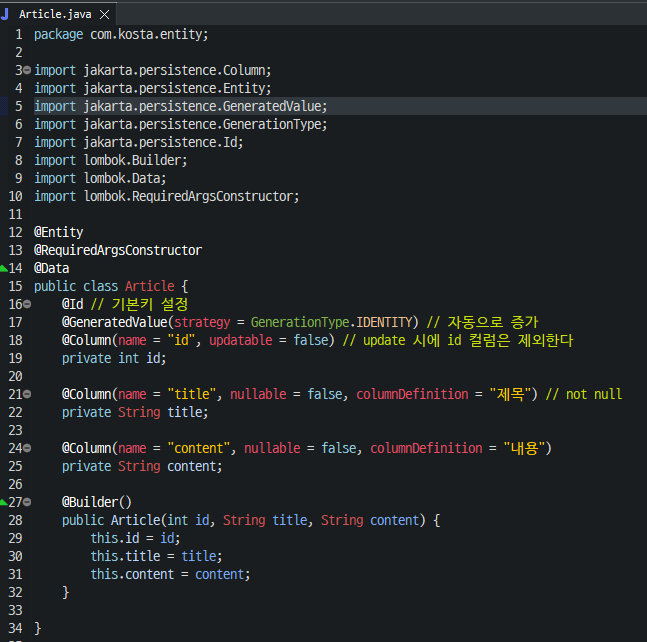
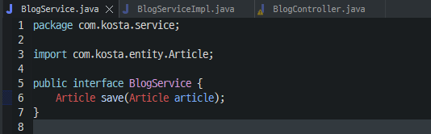
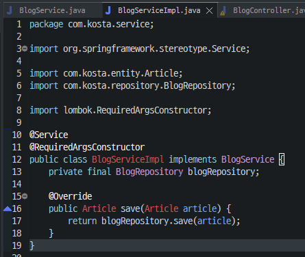

# JPA 블로그 프로젝트
## 구조
- 프리젠테이션 계층: 웹 클라이언트의 요청 및 응답을 처리 (@Controller)
- 서비스 계층: 비즈니스 로직 처리 및 도메인 모델의 적합성을 검증 (@Service)
- 퍼시스턴트 계층: 데이터 처리를 담당(@Repository)
- 도메인 모델: 데이터 베이스의 엔티티, VO, DTO (@entity)

<br/>
<br/>
<br/>

## application.yml 설정
```yml
spring:
  application:
    name: blog_proj
  datasource:
    driver-class-name: com.mysql.cj.jdbc.Driver
    url: jdbc:mysql://localhost:3306/blog_db
    username: root
    password: 1234
  jpa:
    database: mysql
    # 자동으로 테이블 생성과 같은 스크립트 실행 (실제는 false로 변경)
    generate-ddl: true
    show-sql: true
    open-in-view: false
  sql:
    init:
      mode: never
  mvc:
    hiddenmethod:
      filter:
        enabled: true
```

<br/>
<br/>
<br/>

## entity 구성


<br/>
<br/>
<br/>

## repository 생성
```java
package com.kosta.repository;

import org.springframework.data.jpa.repository.JpaRepository;
import org.springframework.stereotype.Repository;

import com.kosta.entity.Article;

@Repository
public interface BlogRepository extends JpaRepository<Article, Integer> {

}
```


<br/>
<br/>
<br/>

## 1. 테스트 코드 작성
```java
package com.kosta.repository;

import static org.assertj.core.api.Assertions.assertThat;

import org.junit.jupiter.api.DisplayName;
import org.junit.jupiter.api.Test;
import org.springframework.beans.factory.annotation.Autowired;
import org.springframework.boot.test.autoconfigure.jdbc.AutoConfigureTestDatabase;
import org.springframework.boot.test.autoconfigure.jdbc.AutoConfigureTestDatabase.Replace;
import org.springframework.boot.test.autoconfigure.orm.jpa.DataJpaTest;

import com.kosta.entity.Article;

@DataJpaTest // JPA 관련 테스트
@AutoConfigureTestDatabase(replace = Replace.NONE) // 실제 DB 사용
public class BlogRepositoryTest {
	@Autowired
	private BlogRepository blogRepository;

	// 테스트 코드 패턴 : Given(주고) - When(테스트) - Then (검증)

	@Test
	@DisplayName("게시글 추가 테스트")
	public void saveArticle() {
		// given
		Article article = Article.builder().title("TEST Title").content("TEST content").build();

		// when
		Article savedArticle = blogRepository.save(article);

		// then
		assertThat(savedArticle).isNotNull();
		assertThat(savedArticle.getId()).isNotNull();
		assertThat(savedArticle.getTitle()).isEqualTo("TEST Title");
		assertThat(savedArticle.getContent()).isEqualTo("TEST content");
	}

}
```

<br/>
<br/>
<br/>

## 2. 서비스 생성



<br/>
<br/>
<br/>

## 3. 컨트롤러 생성


<br/>
<br/>
<br/>

## 1 ~ 3번 과정을 기능 별로 반복