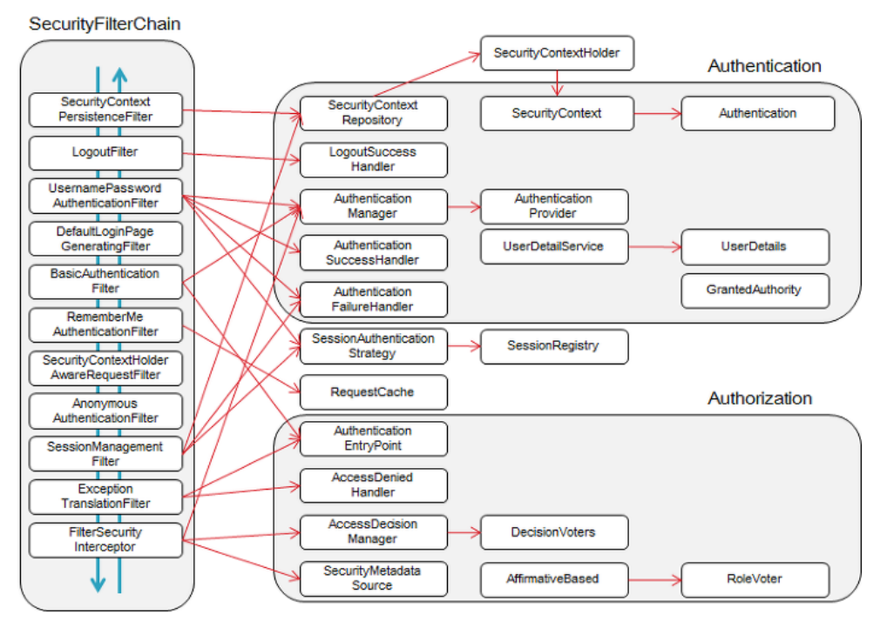

## 목차
- [JPA 블로그 프로젝트 실습](#jpa-블로그-프로젝트-실습)
  - [엔티티에 생성, 수정 시간 추가](#엔티티에-생성-수정-시간-추가)
  - [작성일, 수정일 자동 업데이트 위한 설정](#작성일-수정일-자동-업데이트-위한-설정)
- [Spring Security](#spring-security)
  - [실습](#실습)
    - [`build.gradle` 파일에 의존성 추가](#buildgradle-파일에-의존성-추가)
    - [회원 entity 생성](#회원-entity-생성)
    - [UserRepository 파일 생성](#userrepository-파일-생성)
    - [UserDetailsServiceImpl 파일 생성](#userdetailsserviceimpl-파일-생성)
    - [WebSecurityConfig 파일 작성](#websecurityconfig-파일-작성)

<br/>
<br/>
<br/>
<br/>

# JPA 블로그 프로젝트 실습
## 엔티티에 생성, 수정 시간 추가

## 작성일, 수정일 자동 업데이트 위한 설정


<br/>
<br/>
<br/>
<br/>

# Spring Security
- 스프링 기반의 웹 애플리케이션에서 보안(인증, 인가, 권한 등)을 담당하는 프레임워크이다.
- 인증(Authentication) : 사용자가 누구인지 확인하는 과정
- 인가(Authorization) : 특정 부분에 접근할 수 있는 권한을 확인하는 과정
- 스프링 시큐리티는 필터를 기반으로 동작한다.


<hr/>


1. 유효성 검사 실시 (Authenication Filter)
2. token을 받아온다
3. AuthenticationManager로 token 전달
4. UserDetialsService를 통해 결과를 가져올 수 있다.
## 실습
### `build.gradle` 파일에 의존성 추가
```gradle
// 스프링 시큐리티를 사용
implementation 'org.springframework.boot:spring-boot-starter-security'
// 타임리프에서 스프링 시큐리티를 사용
implementation 'org.thymeleaf.extras:thymeleaf-extras-springsecurity6'
// 스프링 시큐리티 테스트 사용
testImplementation 'org.springframework.security:spring-security-test'
```
### 회원 entity 생성
```java
package com.kosta.entity;

import java.time.LocalDateTime;
import java.util.Collection;
import java.util.List;

import org.springframework.data.annotation.CreatedDate;
import org.springframework.data.annotation.LastModifiedDate;
import org.springframework.data.jpa.domain.support.AuditingEntityListener;
import org.springframework.security.core.GrantedAuthority;
import org.springframework.security.core.authority.SimpleGrantedAuthority;
import org.springframework.security.core.userdetails.UserDetails;

import jakarta.persistence.Column;
import jakarta.persistence.Entity;
import jakarta.persistence.EntityListeners;
import jakarta.persistence.GeneratedValue;
import jakarta.persistence.GenerationType;
import jakarta.persistence.Id;
import lombok.Builder;
import lombok.Data;
import lombok.RequiredArgsConstructor;

@Entity
@EntityListeners(AuditingEntityListener.class)
@RequiredArgsConstructor
@Data
public class User implements UserDetails {
	@Id
	@GeneratedValue(strategy = GenerationType.IDENTITY)
	@Column(updatable = false)
	private Long id;

	@Column(nullable = false, unique = true)
	private String email;

	@Column(nullable = false)
	private String password;

	@CreatedDate
	@Column(name = "created_at")
	private LocalDateTime createdAt;

	@LastModifiedDate
	@Column(name = "updated_at")
	private LocalDateTime updatedAt;

	@Builder // 빌터 패턴으로 객체 생성
	public User(String email, String password) {
		this.email = email;
		this.password = password;
	}

	// 사용자가 가질 수 있는 권한 목록 반환
	// '사용자' 권한만 있기 때문에 '사용자' 권한만 부여
	@Override
	public Collection<? extends GrantedAuthority> getAuthorities() {
		return List.of(new SimpleGrantedAuthority("user"));
	}

	// 사용자 식별값 반환
	// 사용자의 식별 가능한 이름 = email
	@Override
	public String getUsername() {
		return email;
	}

	// 계정 만료 여부
	// true : 만료 아님 | false : 만료
	@Override
	public boolean isAccountNonExpired() {
		return true;
	}

	// 계정 잠금 여부
	// true : 열림 | false : 잠김
	@Override
	public boolean isAccountNonLocked() {
		return UserDetails.super.isAccountNonLocked();
	}

	// 비밀번호 만료 여부
	// true: 만료되지 않음 | false : 만료
	@Override
	public boolean isCredentialsNonExpired() {
		return UserDetails.super.isCredentialsNonExpired();
	}

	// 계정 사용 가능 여부
	@Override
	public boolean isEnabled() {
		return UserDetails.super.isEnabled();
	}

}
```
### UserRepository 파일 생성
- email로 찾기 위한 메소드를 추가로 작성한다
```java
package com.kosta.repository;

import java.util.Optional;

import org.springframework.data.jpa.repository.JpaRepository;

import com.kosta.entity.User;

public interface UserRepository extends JpaRepository<User, Long> {
	Optional<User> findByEmail(String email);
}
```
### UserDetailsServiceImpl 파일 생성
- 로그인을 진행할 때 사용자 정보를 가져오기 위해 파일 생성한다.


### WebSecurityConfig 파일 작성
- 스프링 시큐리티 설정을 위해 `com.kosta.config.WebSecurityConfig` 작성

```java
package com.kosta.common;

import org.springframework.context.annotation.Bean;
import org.springframework.context.annotation.Configuration;
import org.springframework.security.authentication.AuthenticationManager;
import org.springframework.security.authentication.ProviderManager;
import org.springframework.security.authentication.dao.DaoAuthenticationProvider;
import org.springframework.security.config.annotation.web.builders.HttpSecurity;
import org.springframework.security.config.annotation.web.configuration.EnableWebSecurity;
import org.springframework.security.config.annotation.web.configuration.WebSecurityCustomizer;
import org.springframework.security.config.annotation.web.configurers.AbstractHttpConfigurer;
import org.springframework.security.core.userdetails.UserDetailsService;
import org.springframework.security.crypto.bcrypt.BCryptPasswordEncoder;
import org.springframework.security.web.SecurityFilterChain;
import org.springframework.security.web.util.matcher.AntPathRequestMatcher;

import lombok.RequiredArgsConstructor;

@Configuration
@EnableWebSecurity
@RequiredArgsConstructor
public class WebSecurityConfig {
	private final UserDetailsService userDetailsService;

	// 특정 부분에 스프릥 시큐리티 기능 비활성화
	@Bean
	WebSecurityCustomizer configure() {
		return (web) -> web.ignoring().requestMatchers(new AntPathRequestMatcher("/static/**/"));
	}

	// 특정 HTTP 요청에 대한 보안 구성
	@Bean
	SecurityFilterChain filerChain(HttpSecurity http) throws Exception {
		return http.authorizeHttpRequests(auth -> auth.requestMatchers(
				// 인증, 인가 설정 (특정한 URL 엑세스를 설정, 나머지는 인증 필요)
				new AntPathRequestMatcher("/login"), new AntPathRequestMatcher("/join")).permitAll()
				// 나머지 URL은 인증이 필요
				.anyRequest().authenticated())
				// form 기반 로그인 설정 (로그인은 login.html로 이동하고, 성공하면 "/blog/list"로 연결
				.formLogin(form -> form.loginPage("/login").defaultSuccessUrl("/blog/list"))
				// 로그아웃 설정 (로그아웃이 성공하면 "/login"으로 연결, 동시에 session 만료)
				.logout(logout -> logout.logoutSuccessUrl("/login").invalidateHttpSession(true))
				// CORS 비활성화
				.cors(AbstractHttpConfigurer::disable)
				// CSRF 공격 방지 설정
				.csrf(AbstractHttpConfigurer::disable).build();
	}

	// 인증 관리자 관련 설정
	@Bean
	AuthenticationManager authenticationManager(HttpSecurity http, BCryptPasswordEncoder bCrypt, UserDetailsService uds)
			throws Exception {
		DaoAuthenticationProvider authProvider = new DaoAuthenticationProvider();
		authProvider.setUserDetailsService(userDetailsService);
		authProvider.setPasswordEncoder(bCrypt);
		return new ProviderManager(authProvider);
	}

	// 비밀번호 암호화를 위한 설정
	@Bean
	BCryptPasswordEncoder bCryptPasswordEncoder() {
		return new BCryptPasswordEncoder();
	}

}
```