## 목차
- [로그인 유저 기능 추가](#로그인-유저-기능-추가)
- [로그인 여부 조건 추가](#로그인-여부-조건-추가)
- [WebSecurityConfig 수정](#websecurityconfig-수정)
- [로그인 여부에 따른 버튼 수정](#로그인-여부에-따른-버튼-수정)
- [글 작성할 때 사용자 정보 추가](#글-작성할-때-사용자-정보-추가)
  - [테이블 간의 관계 설정](#테이블-간의-관계-설정)
  - [Article Entity에 컬럼 추가](#article-entity에-컬럼-추가)
  - [글 작성할 때 사용자 정보가 추가되도록](#글-작성할-때-사용자-정보가-추가되도록)
  - [글 삭제할 때 작성자만 삭제 가능하도록](#글-삭제할-때-작성자만-삭제-가능하도록)
  - [글 수정할 때 작성자만 수정되도록](#글-수정할-때-작성자만-수정되도록)
  - [html 파일 수정](#html-파일-수정)
- [관리자 페이지 만들기](#관리자-페이지-만들기)
  - [Role enum 생성](#role-enum-생성)
  - [User Entity 수정 (role 추가)](#user-entity-수정-role-추가)
  - [WebSecurityConfig 수정](#websecurityconfig-수정-1)

<br/>
<br/>
<br/>
<br/>

# 로그인 유저 기능 추가
- 로그인하지 않은 사용자 : `/login`, `/join`, `/blog/list` 접근 가능 (글쓰기 제한, 게시글 보기만 가능)
- 로그인 한 사용자 : 모든 경로 접근 가능 (글쓰기 가능, 본인이 작성하지 않은 글에 대해서만 수정, 삭제 제한)

<br/>
<br/>
<br/>
<br/>

# 로그인 여부 조건 추가
- UserController.java
  ```java
  	@GetMapping("/login")
	public String loginPage() {
		return userService.isLogin() ? "redirect:/blog/list" : "login";
	}

	@GetMapping("/join")
	public String joinPage() {
		return userService.isLogin() ? "redirect:/blog/list" : "join";
	}
  ```
- UserServiceImpl.java
  ```java
  	// 로그인 여부 확인
	@Override
	public boolean isLogin() {
		Authentication auth = SecurityContextHolder.getContext().getAuthentication();
		if (auth == null || auth instanceof AnonymousAuthenticationToken)
			return false;
		return false;
	}
    ```

<br/>
<br/>
<br/>
<br/>

# 타임리프 추가 문법
```html
<html
xmlns:th="http://www.thymeleaf.org"
xmlns:sec="http://www.thymeleaf.org/extras/spring-security"
>

        <!-- username 출력 -->
        <p sec:authentication="name"></p>
        <p>[[ ${#authentication.name} ]]</p>
        
        <!-- 역할 출력 -->
        <p sec:authentication="principal.authorities"></p>
        <p>[[ ${#authentication.authorities} ]]</p>
        
        <!-- 로그인 사용자 전체 정보 출력 -->
        <p sec:authentication="principal"></p>
        <p>[[ ${#authentication.principal} ]]
        
        <!--  로그인 여부에 따른 분기 (로그인 사용자만 보임) -->
        <p sec:authorize="isAuthenticated()">로그인 사용자</p>
        <p th:if="${#authentication.authenticated}">로그인 사용자</p>
        
        <!-- 권한에 따른 분기 (ROLE USER만 보임) -->
        <p sec:authorize="hasRole('ROLE_USER')">ROLE_USER만 보여</p>
```

<br/>
<br/>
<br/>
<br/>

# WebSecurityConfig 수정
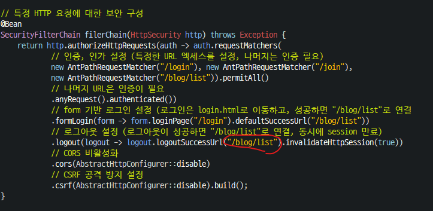

<br/>
<br/>
<br/>
<br/>

# 로그인 여부에 따른 버튼 수정
```java
<button sec:authorize="!isAuthenticated()" class="btn btn-outline-secondary btn-sm"
    onclick="location.href='/login'">
    로그인
 </button>
        
<button sec:authorize="isAuthenticated()" class="btn btn-outline-secondary btn-sm"
    onclick="location.href='/logout'">
    로그아웃
</button>

...

<a sec:authorize="isAuthenticated()" href="/blog/add" class='btn btn-success btn align-self-center'>
    글쓰기
</a>
```
<br/>
<br/>
<br/>
<br/>

# 글 작성할 때 사용자 정보 추가
## 테이블 간의 관계 설정
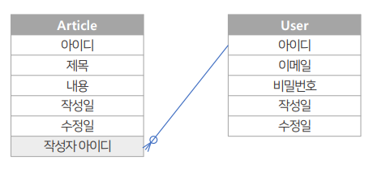
## Article Entity에 컬럼 추가
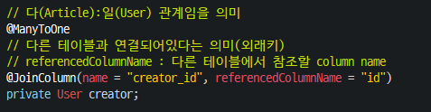
- `@ManyToOne` : 여러 개의 Article이 한 명의 User에 의해 작성될 수 있으므로 ManyToOne 관계를 설정한다.
- `@JoinColumn` : Article 테이블에서  User 테이블과 Join을 진행하기 위한 외래키를 설정한다. (Article의 creator_id는 User의 id를 참조)
## 글 작성할 때 사용자 정보가 추가되도록
- controller 수정
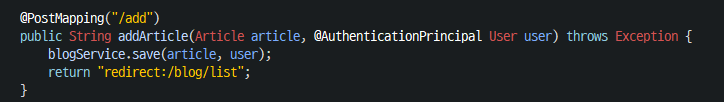
- BlogService 수정
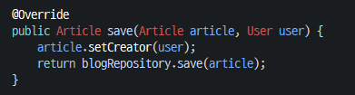
## 글 삭제할 때 작성자만 삭제 가능하도록
- controller 수정

- BlogService 수정
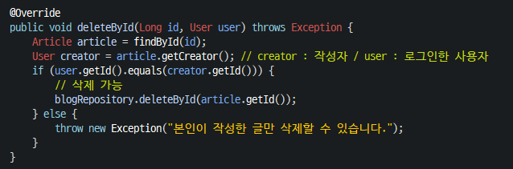
## 글 수정할 때 작성자만 수정되도록
- controller 수정
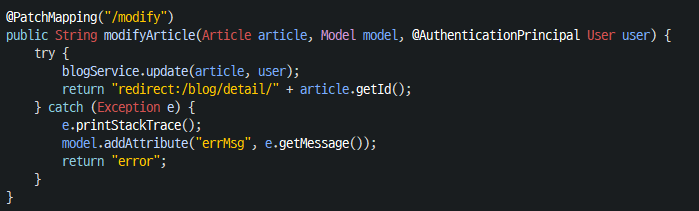
- BlogService 수정
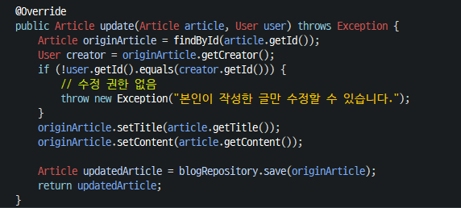
## html 파일 수정
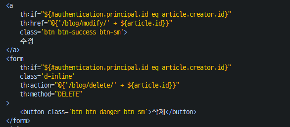

<br/>
<br/>
<br/>
<br/>

# 관리자 페이지 만들기
## Role enum 생성
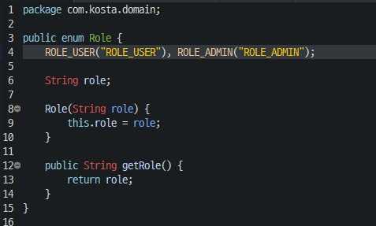
## User Entity 수정 (role 추가)
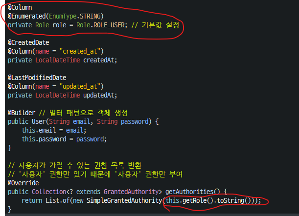
## WebSecurityConfig 수정
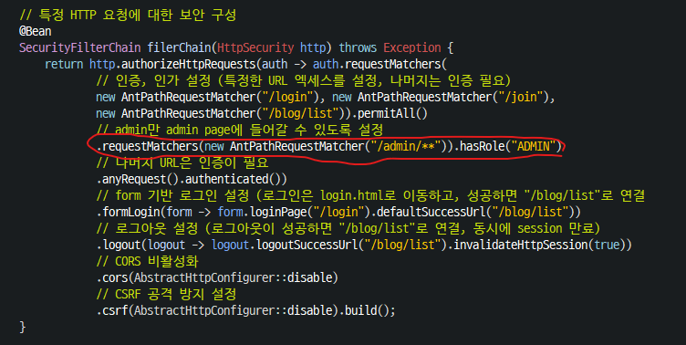