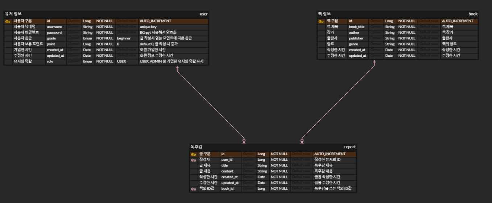
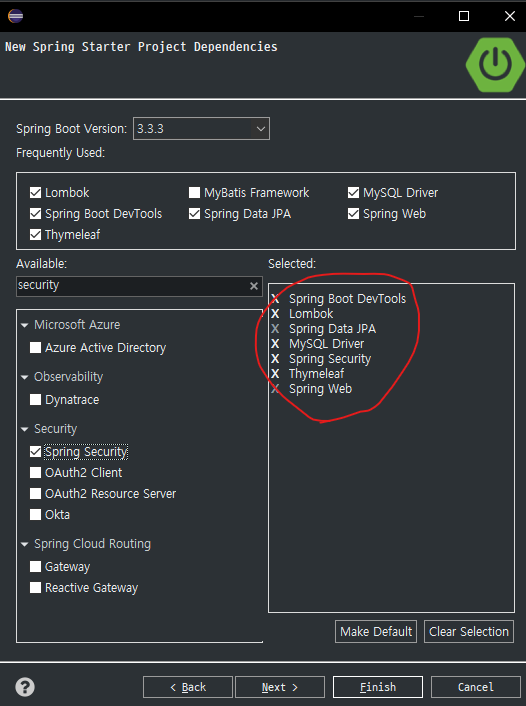

# 객체와 테이블 매핑
## `@Entity` 
- JPA에서 테이블과 매핑할 객체를 생성할 때 사용
- 반드시 기본 생성자가 필요하다
- [name = ?] 속성으로 테이블 이름 지정 가능
## `@Column`
- [name = ?] 속성으로 컬럼명 지정
- [insertable, updatable] 속성으로 등록 또는 수정 가능 여부를 지정 (기본값은 true)
- [unique] 속성으로 고유값 지정
- [nullable] 속성으로 null/not null 지정
- [length] 속성으로 String 문자열 길이 지정
## `@Enumerate(EnumType.String)`
- Enum 타입 사용 시 지정
## `@Id`
- 기본키
## `@GeneratedValue(strategy = GenerationType.IDENTITY)`
- 기본키 자동 생성

<br/>
<br/>

# 테이블 매핑
- 테이블 간의 관계는 외래키를 통해 진행된다. (join은 방향성이 없다)
- 하지만 객체는 참조를 사용해서 연관된 객체를 찾기 대문에 객체 간의 관계는 방향성이 필요하다 (단방향, 양방향)
- 객체는 참조(reference)가 있어야 참조가 가능하다. (방향성이 있다)
- 양방향 설정 : 단방향 설정을 두 번 해줘야 한다. (신경써야 할 것이 많으므로 가급적 사용하지 않음)
- 관계형 데이터베이스에서는 99.9% `다(Mnay)` 쪽에 외래키를 생성한다.
- 그래서 `@ManyToOne` 단방향 설정을 가장 많이 사용한다


<br/>
<br/>
<br/>
<br/>
<br/>
<br/>

# 개인 프로젝트
## 1. DB 생성
### erd cloud에서 테이블 설계

### DBeaver로 Database 생성
```sql
create database report_db;
```

<br/>
<br/>
<br/>
<br/>

## 2. 프로젝트 생성

- `build.gradle`에 타임리프 레이아웃 의존성 추가
  ```
  // 타임리프 레이아웃 사용
	implementation 'nz.net.ultraq.thymeleaf:thymeleaf-layout-dialect'
    ```
### application.yml 파일 생성
```yml
spring:
  application:
    name: book_report
  datasource:
    driver-class-name: com.mysql.cj.jdbc.Driver
    url: jdbc:mysql://localhost:3306/report_db
    username: ropt
    password: 1234
  jpa:
    generate-ddl: true
    show-sql: true
    open-in-view: false
  sql:
    init:
      mode: never
  mvc:
    hiddenmethod:
       filter:
        enabled: true
```

<br/>
<br/>
<br/>
<br/>

## 엔티티 생성
### User
```java
@Entity
@EntityListeners(AuditingEntityListener.class)
@RequiredArgsConstructor
@Data
public class User implements UserDetails {
	@Id
	@GeneratedValue(strategy = GenerationType.IDENTITY)
	@Column(updatable = false)
	private Long id;

	@Column(name = "nickname", nullable = false, unique = true)
	private String nickname;

	@Column(nullable = false)
	private String name;

	@Column(nullable = false)
	private String password;

	@Column(nullable = false)
	@Enumerated(EnumType.STRING)
	private UserGrade grade = UserGrade.EXPLORER; // user의 등급

	@Column(nullable = false)
	private Long point = 0L; // point의 초기값은 무조건 0

	@Column(nullable = false)
	@Enumerated(EnumType.STRING)
	private Role role = Role.USER; // user의 역할 (USER, ADMIN)

	@CreatedDate
	@Column(name = "created_at")
	private LocalDateTime createdAt;

	@LastModifiedDate
	@Column(name = "updated_at")
	private LocalDateTime updatedAt;

	@Override
	public Collection<? extends GrantedAuthority> getAuthorities() {
		// Role을 기반으로 GrantedAuthority 리스트 생성
		List<GrantedAuthority> roleAuthorities = List.of(role).stream()
				.map(r -> new SimpleGrantedAuthority(r.getRole())).collect(Collectors.toList());

		// UserGrade를 기반으로 GrantedAuthority 리스트 생성
		List<GrantedAuthority> gradeAuthorities = List.of(grade).stream()
				.map(g -> new SimpleGrantedAuthority(g.getGrade())).collect(Collectors.toList());

		// Role과 UserGrade 권한 리스트를 합쳐서 반환
		return List.of(roleAuthorities, gradeAuthorities).stream().flatMap(Collection::stream)
				.collect(Collectors.toList());
	}

	@Override
	public String getUsername() {
		return this.nickname;
	}
}
```
### Report
```
@Entity(name = "report")
@EntityListeners(AuditingEntityListener.class)
@RequiredArgsConstructor
@Data
public class Report {
	@Id
	@GeneratedValue(strategy = GenerationType.IDENTITY)
	@Column(updatable = false)
	private Long id;

	@Column(nullable = false)
	private String title;

	@Column(nullable = false)
	private String content;

	@JoinColumn(name = "user_id")
	@ManyToOne
	private User user;

	@JoinColumn(name = "book_id")
	@ManyToOne
	private Book book;

	@CreatedDate
	@Column(name = "created_at")
	private LocalDateTime createdAt;

	@LastModifiedDate
	@Column(name = "updated_at")
	private LocalDateTime updatedAt;
}
```
### Book
```java
@Entity(name = "book")
@EntityListeners(AuditingEntityListener.class)
@RequiredArgsConstructor
@Data
public class Book {
	@Id
	@GeneratedValue(strategy = GenerationType.IDENTITY)
	@Column(updatable = false)
	private Long id;

	@Column(name = "book_title", nullable = false)
	private String bookTitle;

	@Column(nullable = false)
	private String author;

	@Column(nullable = false)
	private String publisher;

	@Column(nullable = false)
	private String genre;

	@CreatedDate
	@Column(name = "created_at")
	private LocalDateTime createdAt;

	@LastModifiedDate
	@Column(name = "updated_at")
	private LocalDateTime updatedAt;
}
```

<br/>
<br/>
<br/>
<br/>

## 기능 명세서 작성