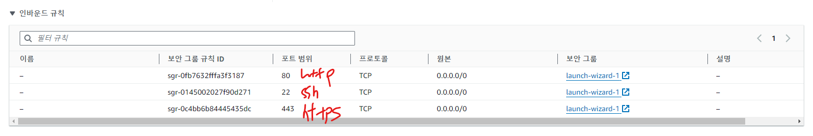
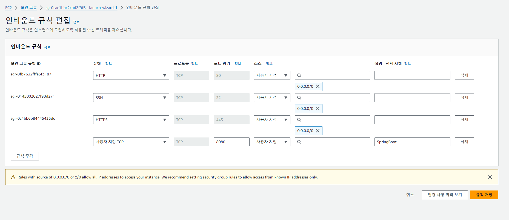

# 기능 명세서


<br/>
<br/>
<br/>
<br/>

# 빌드해보기
## 1. Run As > Run Configuration
 
## 2. jar 파일 설정

- `[파일명]Jar` 형식으로 `add`한다.
- build할 프로젝트를 선택한다.
## 3. Build

## 4. jar 파일 생성

## 5. 실행해보기

- `java -jar [파일명]` 명령어 입력하면 서버가 실행된다.
  
<br/>
<br/>
<br/>
<br/>

# AWS 무료 서버 이용해보기
## IAM 계정
### 1. 사용자 생성

- 자동 생성된 암호 : 자동 생성한 암호를 보여준다
- 사용자 지정 암호 : 사용자가 직접 암호를 지정할 수 있다.
## 2. 권한 설정

- 직접 권한을 설정할 수 있다.


AmazonEC2FullAccess


AmazonVPCFullAccess
## 3. 검토 후 저장
- 저장하면 암호가 나오고 이 암호를 저장해두고 로그인할 때 사용하면 된다.
## 4. 로그인하기

- Account ID : root 사용자의 id
- username, password는 직접 지정한 것이므로 그대로 사용하면 된다.

<br/>
<br/>

## 인스턴스 생성
### 1. 인스턴스 생성 버튼 클릭

### 2, 인스턴스 설정


- 키 페어 설정


- 네트워크 설정


### 3. 시작


## 서버에 접속
### 1. key를 통해 ip 주소 확인
### 2. mobaxterm 다운로드
- [다운로드](https://mobaxterm.mobatek.net/download-home-edition.html)
### 3. mobaxterm에서 session 설정


다운받은 pem 키 추가해야 함


### 4. mobaxterm 사용하기 
#### Java 설치
```
sudo apt install openjdk-17-jdk
```
- 설치 확인


#### mysql 설치
```
sudo apt-get install mysql-server
```
- 설치 확인


- 설정


#### `application.yml` 파일 수정

#### 보안 그룹 인바운드 규칙 추가

- 8080 추가


 
<br/>
<br/>
<br/>
<br/>

# 오늘 배운 내용 정리
## AWS EC2 생성
- EC2명 
- OS : ubuntu
- type : t2.micro(프리티어)
- pem 키
- 보안 그룹 설정(SSH, HTTP, HTTPS)
- 볼륨 크기
- (OS, type, pem키는 수정 불가능)
## SSH 접속 (ModaXterm 사용)
- VSCODE, PuTTY, ModaXterm, TERMINAL 등에서도 접근 가능
### ModaXterm > SESSION 생성
- REMOTE HOST : EC2 IP 주소
- USERNAME : ubuntu
- pemKey : EC2에서 설정한 pem 키 추가
### Java, MySQL 설치 및 설정
```bash
sudo apt-get update
sudo apt-get install openjdk-17-jdk
sudo apt-get install mysql-server

# mysql 설정
sudo mysql -u root -p
> CREATE USER 'root'@'%' IDENTIFIED WITH mysql_native_password BY '비밀번호';
> CREATE DATABASE 'DB명';
> GRANT ALL PRIVILEGES ON *.* TO '계정명'@'%';
> FLUSH PRIVILEGES;
> exit;

# vim을 통해 수정
sudo vim ../../etc/mysql/mysql.conf.d/mysqld.cnf
# i (insert 모드 설정)
# bind-address = 0.0.0.0 수정 후 저장
# ESC > :wq!

# mysql 재부팅
sudo service mysql restart
```
### application.yml 수정
```yml
spring:
  application:
    name: book_report
  datasource:
    driver-class-name: com.mysql.cj.jdbc.Driver
    url: jdbc:mysql://[IP주소]:3306/[DB명]
    username: [계정명]
    password: [비밀번호]
```
### 프로젝트 빌드
gradle -> build -> `build/libs/프로젝트명-0.0.1-SNAPSHOT.jar` 파일 생성
### jar 파일 복사
`java -jar 프로젝트명-0.0.1-SNAPSHOT.jar` 명령 실행