## 목차
- [REST](#rest)
  - [REST 구성 요소](#rest-구성-요소)
  - [REST 특징](#rest-특징)
      - [Server-Client(서버-클라이언트 구조)](#server-client서버-클라이언트-구조)
      - [Stateless(무상태)](#stateless무상태)
      - [Cacheable(캐시 처리 가능)](#cacheable캐시-처리-가능)
      - [Layered System(계층화)](#layered-system계층화)
      - [Uniform Interface(인터페이스 일관성)](#uniform-interface인터페이스-일관성)
  - [REST 장점](#rest-장점)
- [REST 단점](#rest-단점)
- [REST API](#rest-api)
    - [REST API의 규칙](#rest-api의-규칙)
- [REST API 실습](#rest-api-실습)
  - [java project에서 cors 부분 설정](#java-project에서-cors-부분-설정)
  - [java project의 controller 설정](#java-project의-controller-설정)
  - [react project에서 axios를 사용해서 상품 리스트 불러오기](#react-project에서-axios를-사용해서-상품-리스트-불러오기)
  - [구현 화면](#구현-화면)
- [POSTMAN 사용하기](#postman-사용하기)
  - [흐름 분석](#흐름-분석)
  - [base\_url 수정](#base_url-수정)
  - [GET 상품 가져오기](#get-상품-가져오기)
  - [POST 상품 등록하기](#post-상품-등록하기)
    - [controller 추가](#controller-추가)
    - [postman으로 보내보기](#postman으로-보내보기)
    - [input으로 입력 받고 저장하기](#input으로-입력-받고-저장하기)
  - [DELETE 상품 삭제하기](#delete-상품-삭제하기)
    - [controller 추가](#controller-추가-1)
    - [java service 추가](#java-service-추가)
    - [postman에서 확인](#postman에서-확인)
    - [react에서 삭제해보기](#react에서-삭제해보기)
  - [상품 수정하기](#상품-수정하기)
    - [controller 추가](#controller-추가-2)
    - [service 추가](#service-추가)
    - [postman에서 확인](#postman에서-확인-1)
    - [react 프로젝트에서 수정](#react-프로젝트에서-수정)

<br/>
<br/>
<br/>
<br/>

# REST
- Representational State Transfer의 약자
- 자원을 이름으로 구분하여 해당 자원의 상태를 주고받는 모든 것을 의미
- REST는 클라이언트와 서버 사이의 통신 방식 중 하나이고, 웹의 기존 기술과 HTTP 프로토콜을 그대로 사용할 수 있는 아키텍처이다.
- HTTP URI(Uniform Resource Identifier)를 통해 자원(Resource)을 명시하고, HTTP Method(POST, GET, PUT, DELETE, PATCH 등)를 통해 해당 자원(URI)에 대한 CRUD Operation을 적용하는 것을 의미

<br/>
<br/>

## REST 구성 요소
- 자원(Resource) : HTTP URI
- 자원에 대한 행위(Verb): HTTP Method
- 자원에 대한 행위의 내용(Represenstations) : HTTP Message Pay Load(요청에 대한 적절한 응답)
```bash
localhost:8080/user/2 [GET]
> id가 2인 user를 가져오는 행위

localhost:8080/user [POST]
> payload {
    name: 'hello',
    email: 'hello@example.com',
    password: '1234'
}
```

<br/>
<br/>

## REST 특징
#### Server-Client(서버-클라이언트 구조)
  - REST Server와 Client 간의 의존성이 줄어든다.
#### Stateless(무상태) 
  - HTTP 프로토콜이 Stateless Protocol 이므로 REST도 무상태성을 갖는다.
#### Cacheable(캐시 처리 가능)
- HTTP가 가진 캐싱 기능을 적용할 수 있어서 대량의 요청을 효율적으로 처리 가능하다.
#### Layered System(계층화)
- 다중 계층으로 구성하여, 구조 상의 유연성을 줄 수 있다.
#### Uniform Interface(인터페이스 일관성)
- URI로 지정한 Resource에 대한 조작을 통일하고 한정적인 인터페이스로 수행한다.
## REST 장점
- HTTP 프로토콜의 인프라를 그대로 사용하므로 REST API 사용을 위한 별도의 인프라를 구축할 필요가 없다.
- HTTP 프로토콜의 표준을 최대한 활용하여 여러 추가적인 장점을 함께 가져갈 수 있게 해준다.
- HTTP 표준 프로토콜에 따르는 모든 플랫폼에서 사용이 가능하다.
- Hypermedia API의 기본을 충실히 지키면서 범용성을 보장한다.
- REST API 메시지가 의도하는 바를 명확하게 나타내므로 의도하는 바를 쉽게 파악할 수 있다.
- 여러 가지 서비스 디자인에서 생길 수 있는 문제를 최소화한다.
- 서버와 클라이언트의 역할을 명확하게 분리한다.

<br/>
<br/>

# REST 단점
- 표준 자체가 존재하지 않아 정의가 필요하다.
- HTTP Method 형태가 제한적이다.
- 브라우저를 통해 테스트할 일이 많은 서비스라면 쉽게 고칠 수 있는 URL보다 Header 정보의 값을 처리해야 하므로 전문성이요 구된다.


<br/>
<br/>
<br/>
<br/>

# REST API
- REST의 원리를 따르는 API
- REST의 원리를 따르는 시스템을 'RESTful 하다'라고 한다.
### REST API의 규칙
1. URI는 동사보다는 명사를, 대문자보다는 소문자를 사용해야 한다.
2. 마지막에 슬래시(/)를 포함하지 않는다.   
   ex. `localhost:8080/user/` (X)
3. 언더바 대신 하이픈을 사용한다.   
    ex. `localhost:8080/it-product`
4. 파일 확장자는 URII에 포함시키지 않는다.
5. 행위를 포함하지 않는다.

<br/>
<br/>
<br/>
<br/>

# REST API 실습
## java project에서 cors 부분 설정
```java
// WebMvcconfig.java

@Configuration
@EnableWebMvc
public class WebMvcConfig implements WebMvcConfigurer {

	@Override
	public void addCorsMappings(CorsRegistry registry) {
		// 어떤 경로로 들어오든 허락
		registry.addMapping("/**").allowedOrigins("http://localhost:3000").allowedMethods("OPTIONS", "GET", "POST",
				"PUT", "DELETE");
	}
```
## java project의 controller 설정
```java
@Controller
@RequiredArgsConstructor
public class ProductController {
	private final ProductService productService;

	@GetMapping("/")
	@ResponseBody
	public List<ProductResponseDTO> getProducts() {
		List<ProductResponseDTO> productList = productService.getAllProducts();
		return productList;
	}
}
```
## react project에서 axios를 사용해서 상품 리스트 불러오기
```javascript
const Products = () => {
  const [productList, setProductList] = useState([]);

  const getProducts = async () => {
    const res = await axios.get("http://localhost:8080");
    const data = res.data;
    setProductList(data);
  };

  return (
    <main>
      상품 목록
      <button onClick={getProducts}>가져오기</button>
      <div style={{ display: "flex", flexWrap: "wrap" }}>
        {productList.map((product) => (
          <ProductBox key={product.id} product={product} />
        ))}
      </div>
    </main>
  );
};
```
- button을 클릭하면 상품 리스트가 나온다.
- 상품 리스트 : `shopping_db`에 존재하는 상품 리스트
## 구현 화면
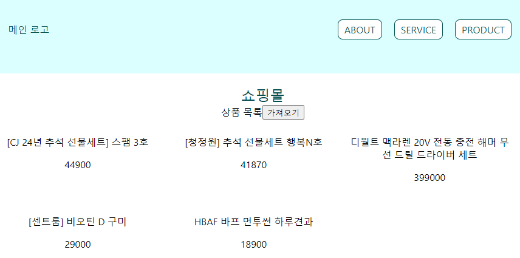
- network 탭 확인

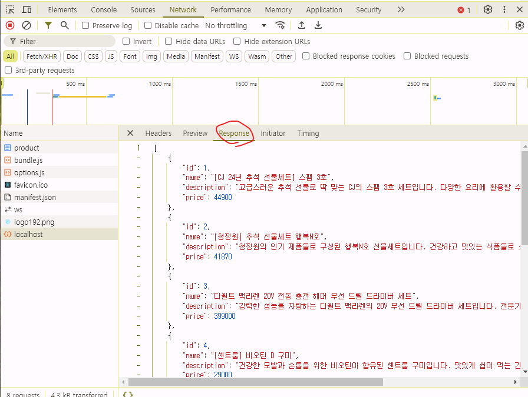

<br/>
<br/>
<br/>
<br/>

# POSTMAN 사용하기
## 흐름 분석
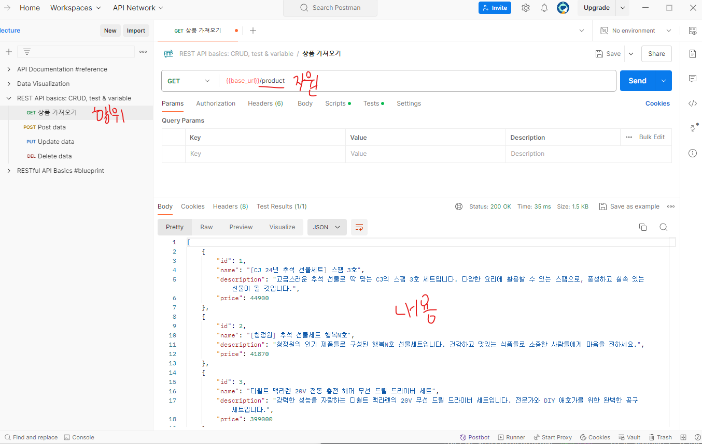
## base_url 수정
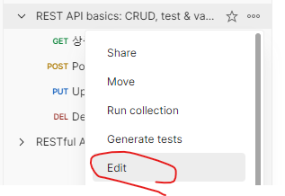   
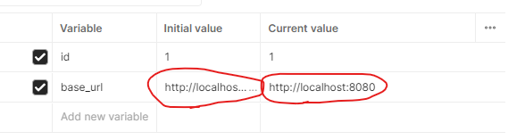
## GET 상품 가져오기
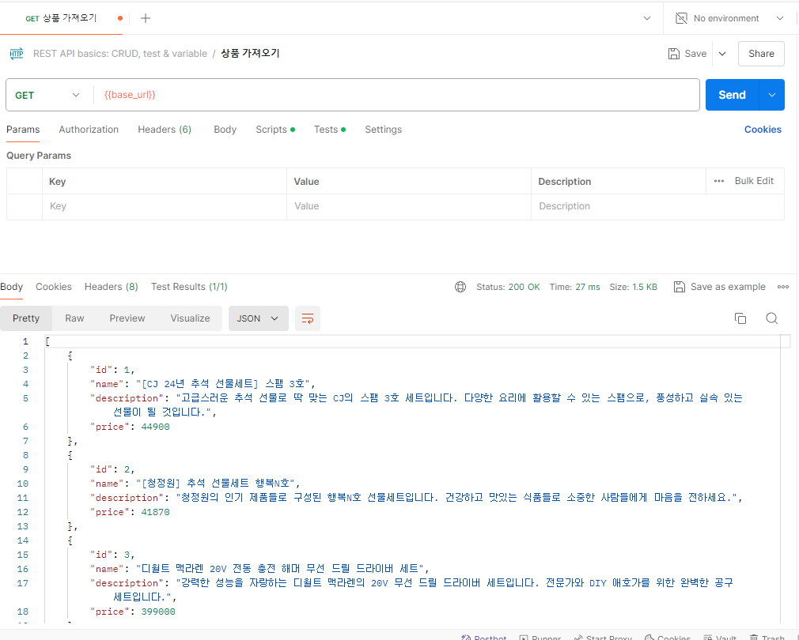
## POST 상품 등록하기
### controller 추가
```java
	@PostMapping("/product")
	@ResponseBody
	public ProductResponseDTO postProduct(@RequestBody ProductRequestDTO productRequestDTO) {
		ProductResponseDTO product = productService.addProduct(productRequestDTO);
		return product;
	}
```
### postman으로 보내보기
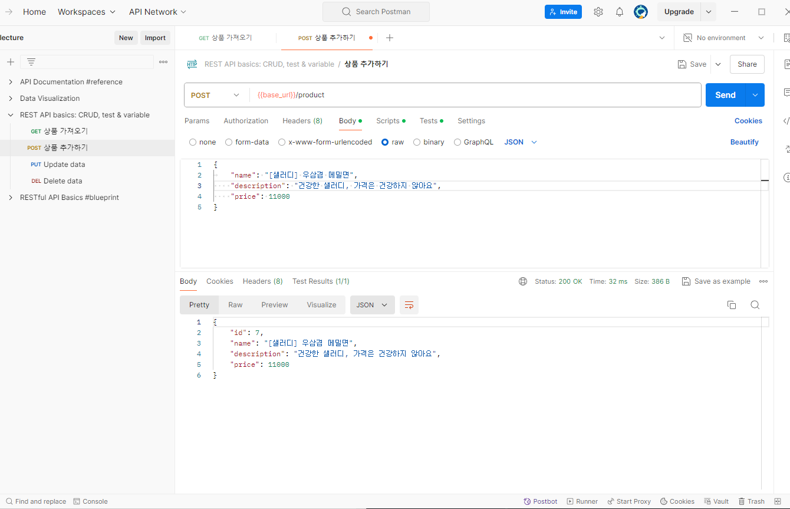
### input으로 입력 받고 저장하기
```javascript
  const handleAddProduct = async () => {
    try {
      const res = await axios.post("http://localhost:8080/product", newProduct);
      const data = res.data;
      setProductList([...productList, data]);
      setNewProduct({
        name: "",
        description: "",
        price: "",
      });
    } catch (err) {
      console.error(err);
    }
  };

  ...

  <div>
        <input
          name="name"
          value={newProduct.name}
          onChange={handleChange}
          exceptProduc={exceptProduct}
        />
        <input
          name="description"
          value={newProduct.description}
          onChange={handleChange}
        />
        <input
          name="price"
          type="number"
          value={newProduct.price}
          onChange={handleChange}
        />
        <button onClick={handleAddProduct}>등록</button>
      </div>
```
## DELETE 상품 삭제하기
### controller 추가
```java
	@DeleteMapping("/product/{id}")
	@ResponseBody
	public ResponseEntity<?> deleteProduct(@PathVariable("id") Long id) {
		boolean isDeleted = productService.deleteProduct(id);
		if (isDeleted) {
			return ResponseEntity.ok().build();
		} else {
			return ResponseEntity.status(500).build();
		}
	}
```
### java service 추가
```java
	@Override
	public boolean deleteProduct(Long id) {
		Optional<Product> optProduct = productRepository.findById(id);
		if (optProduct.isEmpty()) {
			return false;
		}
		productRepository.deleteById(id);
		return true;
	}
```
### postman에서 확인
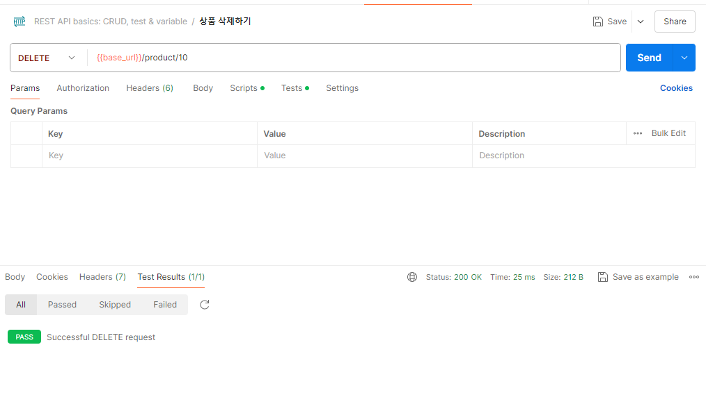

- 두번 삭제를 한 경우

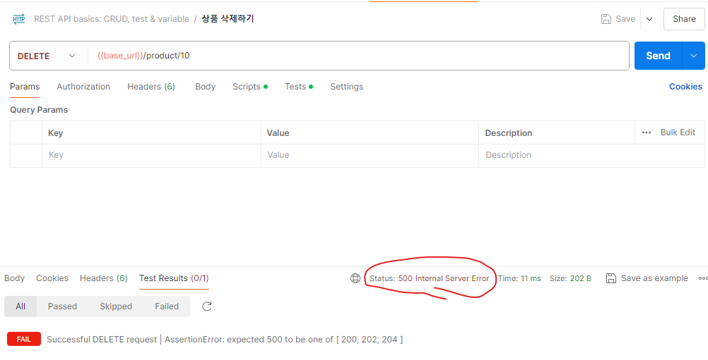
### react에서 삭제해보기
```javascript
// ProductBox.jsx
  const handleDelete = async () => {
    try {
      console.log(product.id + "를 삭제한다.");
      const res = await axios.delete(
        `http://localhost:8080/product/${product.id}`
      );
      console.log(res);
    } catch {
      console.error("이미 삭제된 상품입니다.");
      getProducts();
    }
  };
```
```javascript
// Products.jsx
  // product를 제외시키는 동작
  const exceptProduct = (id) => {
    setProductList(productList.filter((p) => p.id !== id));
  };
```
## 상품 수정하기
- `PATCH` : 부분 수정
- `PUT` : 전체 수정
- 보통 PATCH를 많이 사용한다.
### controller 추가
```java
	@PatchMapping("/product")
	@ResponseBody
	public ProductResponseDTO patchProduct(@RequestBody ProductRequestDTO productRequestDTO) {
		ProductResponseDTO product = productService.patchProduct(productRequestDTO);
		return product;
	}
```
### service 추가
```java
	@Override
	public ProductResponseDTO patchProduct(ProductRequestDTO productRequestDTO) {
		Optional<Product> optProduct = productRepository.findById(productRequestDTO.getId());
		if (optProduct.isEmpty()) {
			return null;
		}
		Product product = optProduct.get();
		product.setName(productRequestDTO.getName());
		product.setPrice(productRequestDTO.getPrice());
		Product updatedProduct = productRepository.save(product); // 수정된 상품

		return ProductResponseDTO.setDTO(updatedProduct);
	}
```
### postman에서 확인
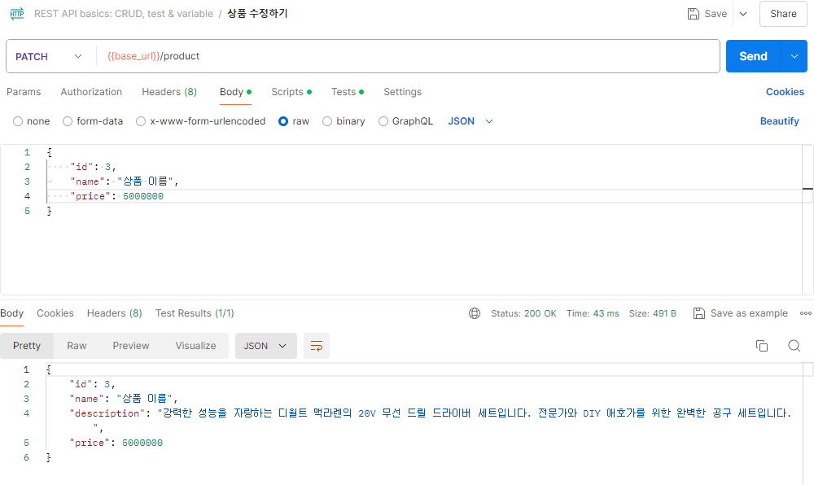   
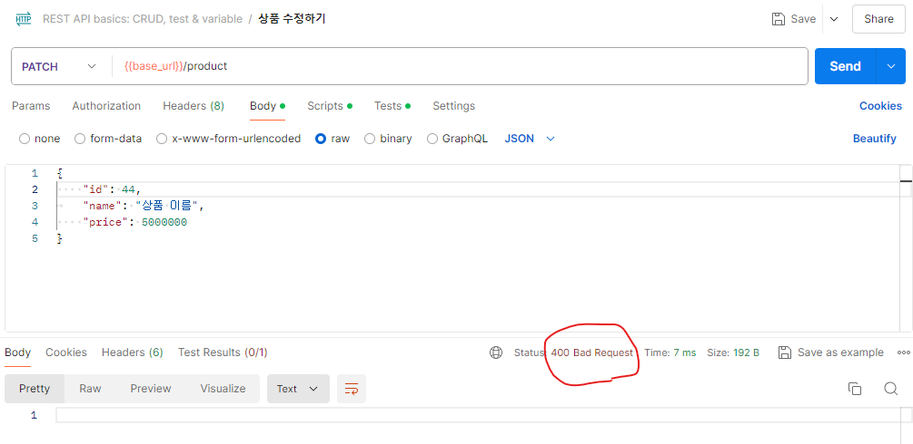
### react 프로젝트에서 수정
```javascript
// ProductBox.jsx
  const handleUpdate = async () => {
    const editedProduct = { ...productInfo, id: product.id };
    const res = await axios.patch(
      "http://localhost:8080/product",
      editedProduct
    );
    const data = res.data;
    //console.log(res.status);
    //console.log(data);
    modifyProduct(data); // 수정 후에 data 넣어주기
    s
```
```javascript
// Products.jsx
  // product 수정 이후 update
  const modifyProduct = (editedProduct) => {
    setProductList(
      productList.map((p) => (p.id === editedProduct.id ? editedProduct : p))
    );
  };
```