## 목차
- [`@ResponseBody`, `@RequestBody`](#responsebody-requestbody)
  - [`@ResponseBody`](#responsebody)
- [@Controller](#controller)
  - [`@Controller`의 데이터 반환](#controller의-데이터-반환)
- [`@RestController`](#restcontroller)
- [`@Controller`와 `@RestController`의 차이점](#controller와-restcontroller의-차이점)
- [블로그 프로젝트 실습 \[백엔드\]](#블로그-프로젝트-실습-백엔드)
  - [글 작성하기](#글-작성하기)
    - [controller 작성](#controller-작성)
    - [PostRequest, PostResponse 클래스 생성](#postrequest-postresponse-클래스-생성)
    - [PostServiceImpl 작성](#postserviceimpl-작성)
    - [Postman으로 확인](#postman으로-확인)
    - [예외 처리](#예외-처리)
  - [전체 게시물 조회하기](#전체-게시물-조회하기)
    - [controller](#controller-1)
    - [ServiceImpl](#serviceimpl)
    - [Postman으로 확인](#postman으로-확인-1)
  - [글 하나 조회하기](#글-하나-조회하기)
    - [controller 추가](#controller-추가)
    - [Postman으로 확인](#postman으로-확인-2)
  - [글 수정하기](#글-수정하기)
    - [controller 추가](#controller-추가-1)
    - [ServiceImpl 추가](#serviceimpl-추가)
    - [Postman으로 확인](#postman으로-확인-3)
  - [글 삭제하기](#글-삭제하기)
    - [controller 추가](#controller-추가-2)
    - [ServiceImpl 추가](#serviceimpl-추가-1)
    - [Postman으로 확인](#postman으로-확인-4)
- [블로그 프로젝트 실습 \[프론트엔드\]](#블로그-프로젝트-실습-프론트엔드)
  - [라이브러리 설치](#라이브러리-설치)
  - [전체 글 리스트 가져오기](#전체-글-리스트-가져오기)

<br/>
<br/>
<br/>
<br/>

# `@ResponseBody`, `@RequestBody`
- 웺에서는 화면 전환(새로고침) 없이 이루어지는 동작들은 대부분 비동기 통신으로 이루어진다.
- 비동기 통신을 위해서는 클라이언트에서 서버로 요청 메세지를 보낼때, 본문에 데이터를 담아서 보내야 하고, 서버에서 클라이언트로 응답을 보낼 때도 본문에 데이터를 담아서 보낸다.
- 이러한 본문을 body라 한다. 요청 본문(RequestBody), 응답 본문(ResponseBody)을 담아서 보내야 한다.
- 비동기식 클라이언트와 서버 통신에서 주고 받는 데이터는 본문은 주로 JSON 형식으로 보낸다.
## `@ResponseBody`
- JAVA 객체를 JSON 기반의 HTTP BODY로 변환하여 응답하게 된다.
- 비동기 통신에서 쓰이는 Body 안의 데이터(JSON객체)를 자바 객체(VO)로 변환해주는 어노테이션이다.
- 만약 컨트로러가 가진 메소드가 전부 `@ResponseBody`를 붙어야 한다면 `@RestController` 어노테이션을 사용할 수 있다.
- REST API를 개발할 때 주로 사용하며 마찬가지로 ResponseEntity로 감싸서 주로 반환한다

<br/>
<br/>
<br/>
<br/>

# @Controller
- 전통적인 Spring MVC의 컨트롤러인 @Controller는 주로 View를 반환하기 위해 사용한다.

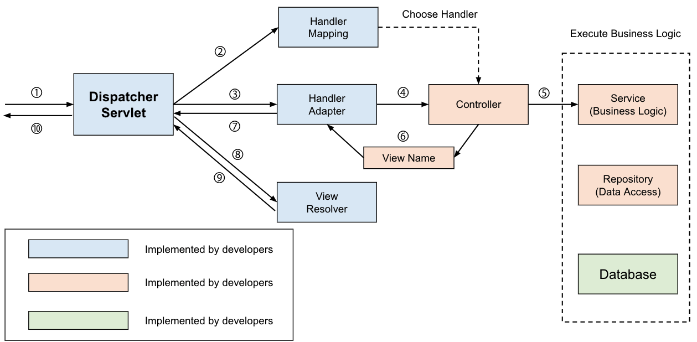
1. Client는 URI 형식으로 웹 서비스에 요청을 보낸다.
2. DispatcherServlet이 요청을 위임할 HandlerMapping을 찾는다.
3. HandlerMapping을 통해 Controller를 위임한다.
4. Controller는 요청을 처리한 후에 ViewName을 반환한다.
5. DispatcherServlet은 ViewResolver를 통해 ViewName에 해당하는 View를 찾아 사용자에게 반환한다.

##  `@Controller`의 데이터 반환
- 데이터 반환을 위해 `@ResponseBody` 어노테이션을 사용해주어야 한다. 이를 통해 Controller가 JSON 형태로 데이터를 반환할 수 있다.
- Controller를 통해 객체를 반환할 때에는 일반적으로 ResponseEntity로 감싸서 반환을 한다.
- 그리고 객체를 반환하기 위해서 ViewResolver 대신에 HttpMessageConverter가 동작한다.

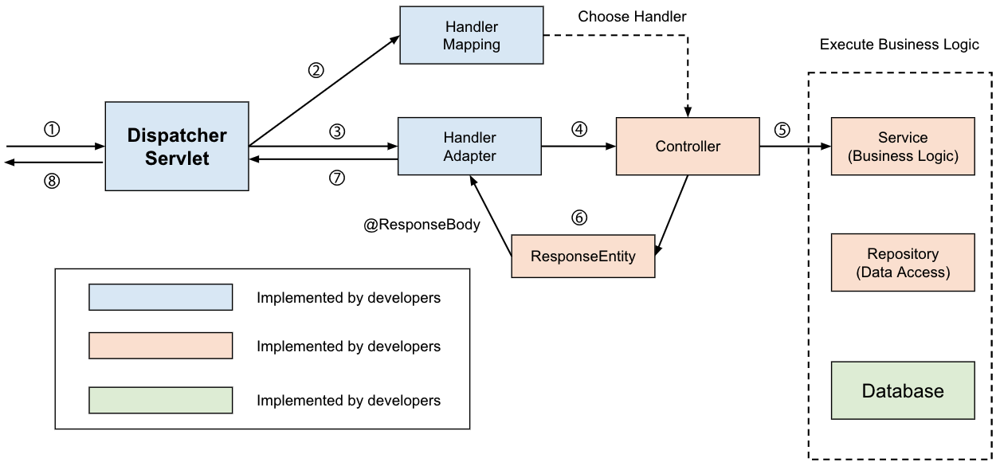
1. Client는 URI 형식으로 웹 서비스에 요청을 보낸다.
2. DispatcherServlet이 요청을 위임할 HandlerMapping을 찾는다.
3. HandlerMapping을 통해 요청을 Controller로 위임한다.
4. Controller는 요청을 처리한 후에 객체를 반환한다.
5. 반환되는 객체는 JSON으로 Serialize되어 사용자에게 반환된다.

<br/>
<br/>
<br/>
<br/>

# `@RestController`
- 동작 과정은 `@Controller`에 `@ResponseBody`를 붙인것과 완벽히 동일하다
- `@Controller`에 `@ResponseBody`가 추가된 것이다. 
- `@RestController`는 JSON 형태로 객체 데이터를 반환 하는 것이 주 목적이다

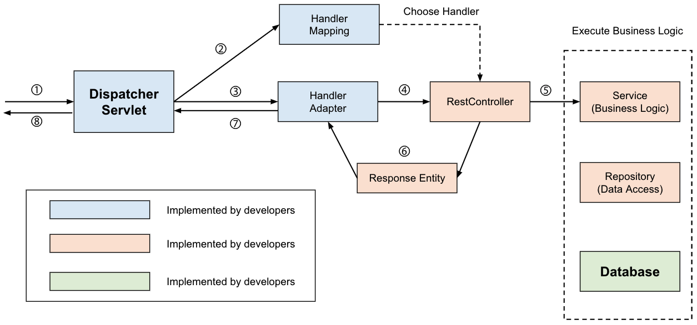
1. Client는 URI 형식으로 웹 서비스에 요청을 보낸다.
2. DispatcherServlet이 요청을 위임할 HandlerMapping을 찾는다.
3. HandlerMapping을 통해 요청을 Controller로 위임한다.
4. Controller는 요청을 처리한 후에 객체를 반환한다.
5. 반환되는 객체는 Json으로 Serialize되어 사용자에게 반환된다.

<br/>
<br/>
<br/>
<br/>

# `@Controller`와 `@RestController`의 차이점
- `@Controller`는 클래스를 Spring MVC 컨트롤러로 표시하는데 사용된다. 반면, `@RestController`는 RESTful 웹 서비스에서 사용되는 특수 컨트롤러이며 `@Controller`+`@ResponseBody`와 동일하다.
- `@RestController`는 Spring 4.0에서 추가되었지만, `@Controller`는 Spring이 주석을 지원하기 시작한 이후에 존재하며 공식적으로 Spring 2.5버전에서 추가되었다.
- `@Controller`는 @Component가 달려있다. 반면, `@RestController`는 `@Controller`와 `@ResponseBody` 주석이 달린 컨트롤러이다.
- `@RestController`를 표시하면 모든 메소드가 뷰 대신 객체로 작성된다. 반면, `@Controller`는 뷰의 이름을 리턴하기도 한다.


<br/>
<br/>
<br/>
<br/>

# 블로그 프로젝트 실습 [백엔드]
## 글 작성하기
### controller 작성
```java
@PostMapping("")
public ResponseEntity<PostResponse> writePost(@RequestBody PostRequest post) {
	PostResponse savedPost = postService.insertPost(post);
	return ResponseEntity.status(HttpStatus.CREATED).body(savedPost);
}
```
### PostRequest, PostResponse 클래스 생성
```java
// PostRequest
// 추가랑 수정할 때 사용하는 DTO
// 각각 나눠서 만들어도 된다
@Data
@Builder
public class PostRequest {
	private Long id;
	private String title, content, password;
	private Long authorId;

	// 기본 생성자 추가
	public PostRequest() {
	}

	public PostRequest(Long id, String title, String content, String password, Long authorId) {
		this.id = id;
		this.title = title;
		this.content = content;
		this.password = password;
		this.authorId = authorId;
	}

	public Post toEntity(User author) {
		return Post.builder().title(title).content(content).password(password).author(author).build();
	}
}
```
```java
// PostResponse
// 화면에 찍힐 것들을 정의
@Data
@Builder
public class PostResponse {
	private Long id;
	private String title, content;
	private UserResponse author;
	private LocalDateTime createdAt, updatedAt;

	public static PostResponse toDTO(Post post) {
		return PostResponse.builder().id(post.getId()).title(post.getTitle()).content(post.getContent())
				.author(UserResponse.toDTO(post.getAuthor())) // toDTO를 통해 자동으로 User type으로 변경
				.createdAt(post.getCreatedAt()).updatedAt(post.getUpdatedAt()).build();
	}
}
```
### PostServiceImpl 작성
```java
@Service
@RequiredArgsConstructor
public class PostServiceImpl implements PostService {
	private final PostRepository postRepository;
	private final UserRepository userRepository;

	@Override
	public PostResponse insertPost(PostRequest postDTO) {
		User user = userRepository.findById(postDTO.getAuthorId())
				.orElseThrow(() -> new IllegalArgumentException("해당 유저를 찾을 수 없음"));
		Post post = postDTO.toEntity(user);
		Post savedPost = postRepository.save(post);
		PostResponse result = PostResponse.toDTO(savedPost);
		return result;
	}
}
```
### Postman으로 확인
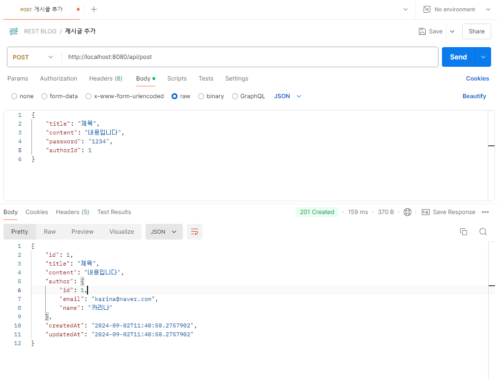
### 예외 처리
```
// PostController
@ExceptionHandler(RuntimeException.class)
public ResponseEntity<ErrorResponse> handlePostException(RuntimeException e, HttpServletRequest req) {
	return ResponseEntity.status(HttpStatus.BAD_REQUEST)
			.body(ErrorResponse.builder().statusCode(HttpStatus.BAD_REQUEST.value()).message("게시물 관련 에러 발생")
					.url(req.getRequestURI()).details(e.getMessage()).build());
}
```
```java
// ErrorResponse
// error message
// 요청은 없고 response만 존재한다

@Data
@Builder
public class ErrorResponse {
	private int statusCode;
	private String message; // '에러 발생' keyword 추가
	private String url;
	private String details; // error message
}
```
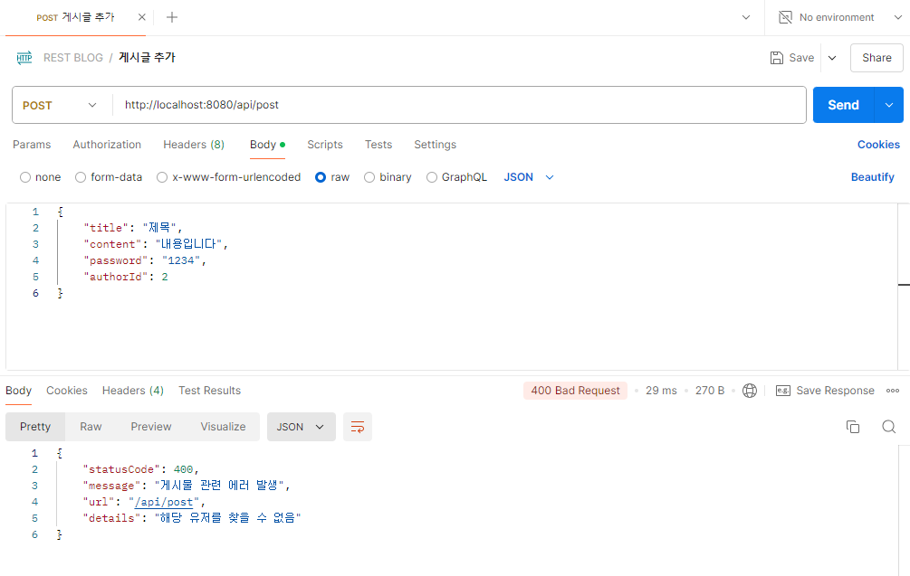

<br/>
<br/>
<br/>

## 전체 게시물 조회하기
### controller
```java
	// 전체 게시물 조회 (localhost:8080/api/post)
	@GetMapping("")
	public ResponseEntity<List<PostResponse>> getAllPost(@RequestParam(name = "id", required = false) Long id) {
		List<PostResponse> result = new ArrayList<>();
		if (id == null) {
			result = postService.getAllPost();
		} else {
			PostResponse postResponse = postService.getPostById(id);
			result.add(postResponse);
		}
		// return ResponseEntity.status(HttpStatus.OK).body(result);
		return ResponseEntity.ok(result);
	}
```
### ServiceImpl
```java
	@Override
	public List<PostResponse> getAllPost() {
		List<Post> postList = postRepository.findAll();
		if (postList.size() > 0) {
			// List<PostResponse> postResponseList = postList.stream().map(post ->
			// PostResponse.toDTO(post)).toList();
			List<PostResponse> postResponseList = postList.stream().map(PostResponse::toDTO).toList();
			return postResponseList;
		} else {
			return new ArrayList<>(); // 없는 경우 빈 list return
		}
	}

	@Override
	public PostResponse getPostById(Long id) {
		Post post = postRepository.findById(id).orElseThrow(() -> new IllegalArgumentException("해당 게시물을 찾을 수 없음"));
		PostResponse postResponse = PostResponse.toDTO(post);
		return postResponse;
	}
```
### Postman으로 확인
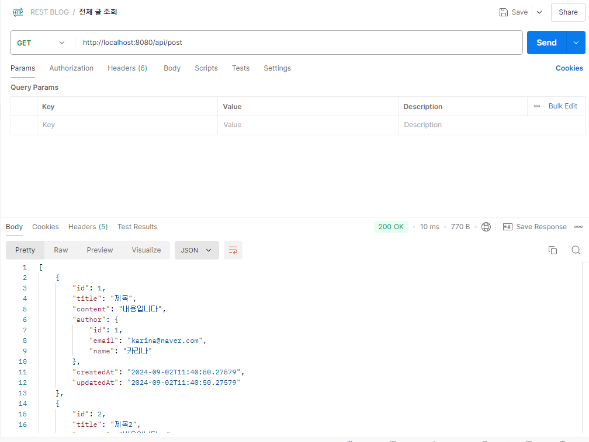

<br/>
<br/>
<br/>

## 글 하나 조회하기
### controller 추가
```java
	// 하나 게시물 조회
	// localhost:8080/api/post?id=1 또는 localhost:8080/api/post/1
	@GetMapping("/{id}")
	public ResponseEntity<PostResponse> getPost(@PathVariable("id") Long id) {
		PostResponse postResponse = postService.getPostById(id);
		return ResponseEntity.ok(postResponse);
	}
```
### Postman으로 확인
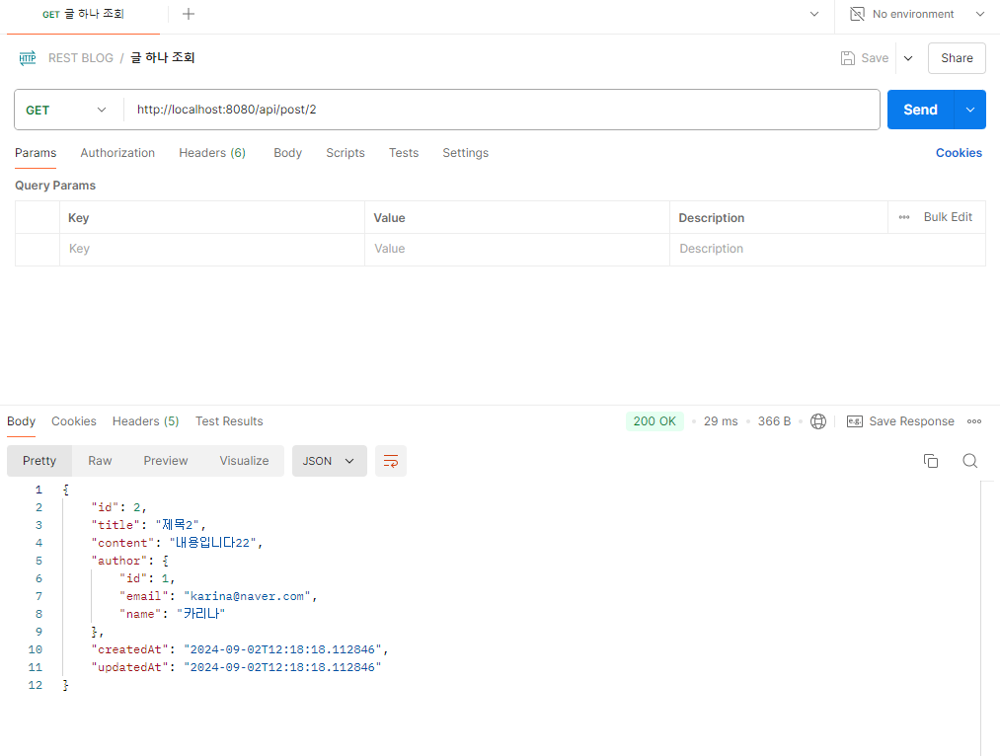

<br/>
<br/>
<br/>

## 글 수정하기
### controller 추가
```java
	@PatchMapping("")
	public ResponseEntity<PostResponse> modifyPost(@RequestBody PostRequest post) {
		PostResponse updatedPost = postService.updatePost(post);
		return ResponseEntity.ok(updatedPost);
	}
```
### ServiceImpl 추가
```java
	@Override
	public PostResponse updatePost(PostRequest postDTO) {
		User user = userRepository.findById(postDTO.getAuthorId())
				.orElseThrow(() -> new IllegalArgumentException("해당 유저를 찾을 수 없음"));
		Post post = postRepository.findById(postDTO.getId())
				.orElseThrow(() -> new IllegalArgumentException("해당 게시물을 찾을 수 없음"));

		if (!post.getAuthor().getId().equals(user.getId())) {
			throw new IllegalArgumentException("본인이 작성한 글만 수정할 수 있음");
		}

		if (!post.getPassword().equals(postDTO.getPassword())) {
			throw new IllegalArgumentException("비밀번호가 일치하지 않음");
		}

		if (postDTO.getTitle() != null) {
			post.setTitle(postDTO.getTitle());
		}
		if (postDTO.getContent() != null) {
			post.setContent(postDTO.getContent());
		}
		post.setUpdatedAt(LocalDateTime.now());

		Post updatedPost = postRepository.save(post);
		PostResponse result = PostResponse.toDTO(updatedPost);

		return result;
	}
```
### Postman으로 확인
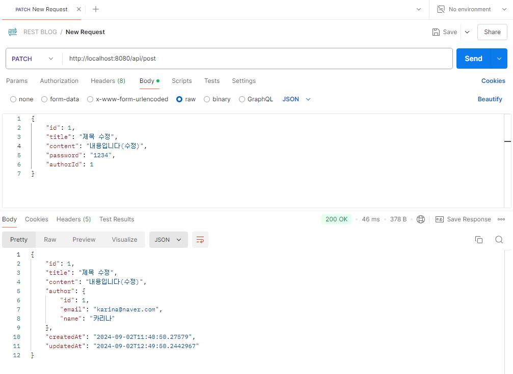

- 비밀번호가 일치하지 않는 경우
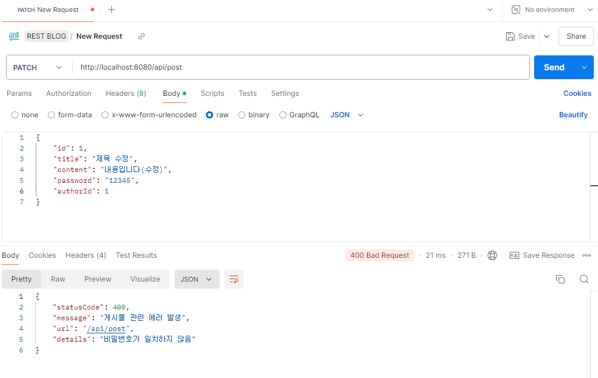

- 작성자와 수정하는 사람이 다른 경우
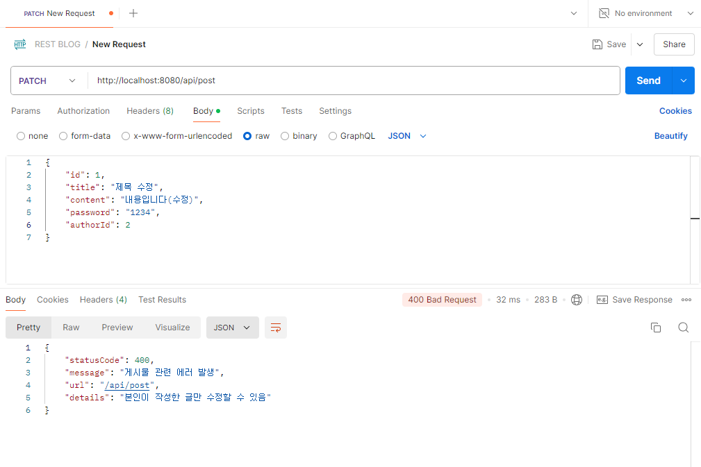


<br/>
<br/>
<br/>

## 글 삭제하기
### controller 추가
```java
	@DeleteMapping("/{id}")
	public ResponseEntity<PostResponse> removePost(@PathVariable("id") Long id, @RequestBody PostRequest post) {
		PostResponse postResponse = postService.deletePost(id, post);
		return ResponseEntity.ok(postResponse);
	}
```
### ServiceImpl 추가
```java
	@Override
	public PostResponse deletePost(Long id, PostRequest postDTO) {
		User user = userRepository.findById(postDTO.getAuthorId())
				.orElseThrow(() -> new IllegalArgumentException("해당 유저를 찾을 수 없음"));
		Post post = postRepository.findById(id).orElseThrow(() -> new IllegalArgumentException("해당 게시물을 찾을 수 없음"));

		if (!post.getAuthor().getId().equals(user.getId())) {
			throw new IllegalArgumentException("본인이 작성한 글만 삭제할 수 있음");
		}

		if (!post.getPassword().equals(postDTO.getPassword())) {
			throw new IllegalArgumentException("비밀번호가 일치하지 않음");
		}

		postRepository.delete(post);
		return PostResponse.toDTO(post);
	}
```

### Postman으로 확인
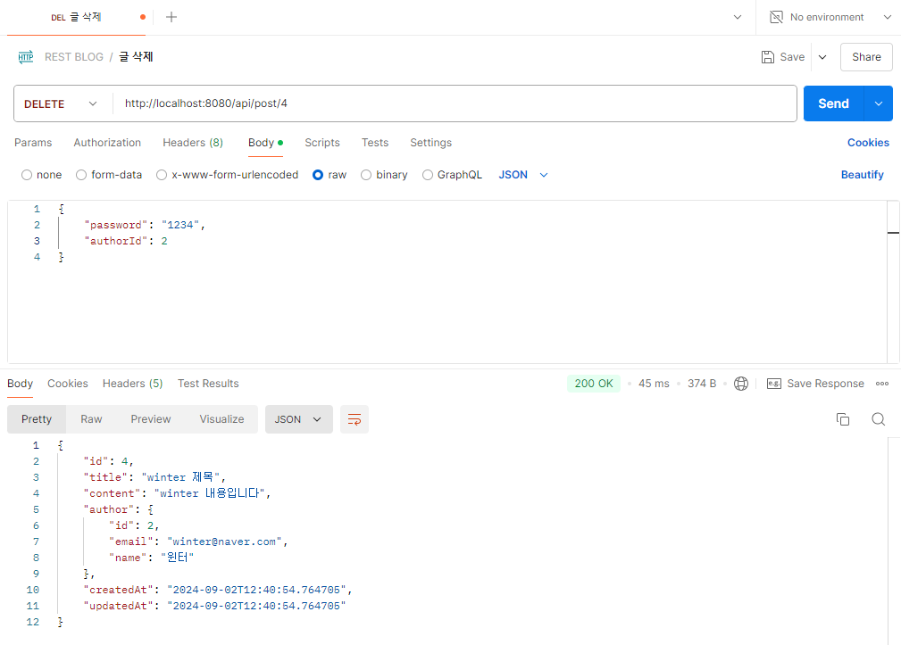

- 비밀번호가 일치하지 않는 경우
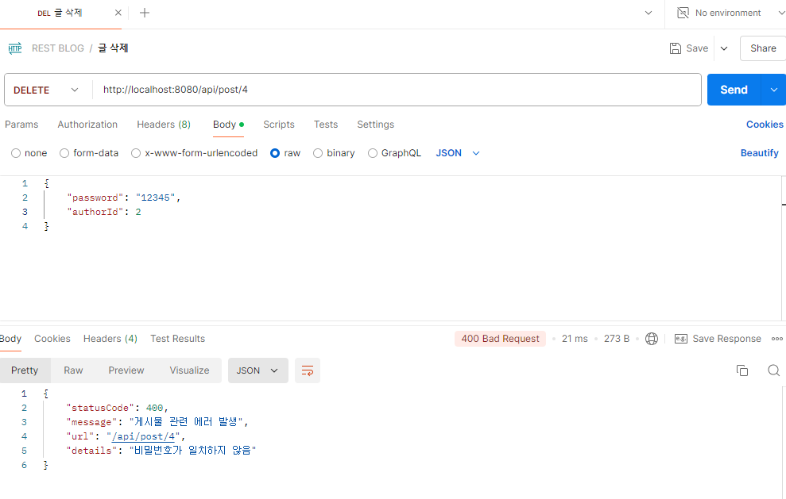

- 작성자와 삭제하려는 사람이 다른 경우
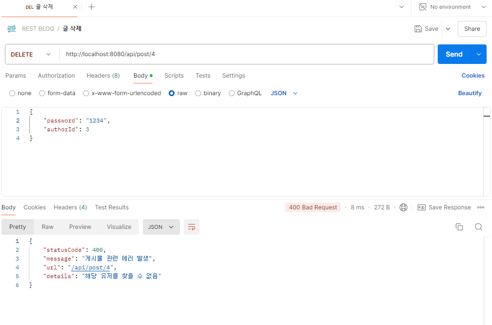

<br/>
<br/>
<br/>
<br/>

# 블로그 프로젝트 실습 [프론트엔드]
## 라이브러리 설치
```bash
# 스타일링 라이브러리 (MUI)
yarn add @mui/material @mui/icons-material react-icons
yarn add @emotion/react @emotion/styled

# 비동기 통신
yarn add axios

# alert custom
yarn add sweetalert2

# react-router-dom
yarn add react-router-dom

# form
yarn add react-hook-form
```
## 전체 글 리스트 가져오기
```javascript
const Post = () => {
  // 1. state 생성
  const [postList, setPostList] = useState([]);

  // 2. axios 사용해서 setting
  const getPostLists = async () => {
    try {
      const res = await axios.get("http://localhost:8080/api/post");
      //console.log(res.data);
      setPostList(res.data);
    } catch (err) {
      console.error(err);
    }
  };

  // 3. useEffect에 함수 적용
  useEffect(() => {
    getPostLists();
  }, []);

  return (
    <>
      <h1>POST LIST</h1>
      {/* 글쓰기 양식 */}
      <Divider />
      {/* 전체 리스트 */}
      <Grid2 container spacing={4}>
        {postList.map((post) => (
          <PostCard post={post} key={post.id} />
        ))}
      </Grid2>
    </>
  );
};
```
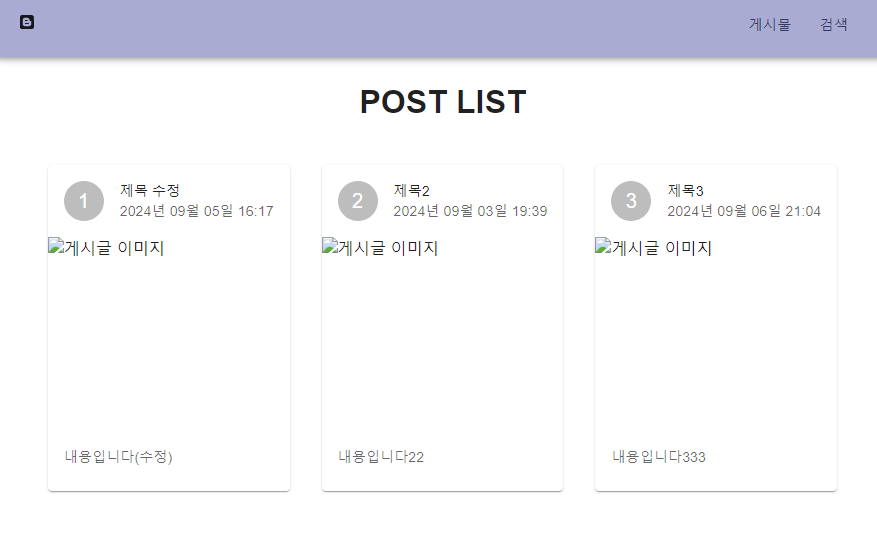