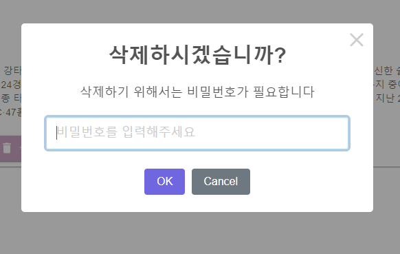
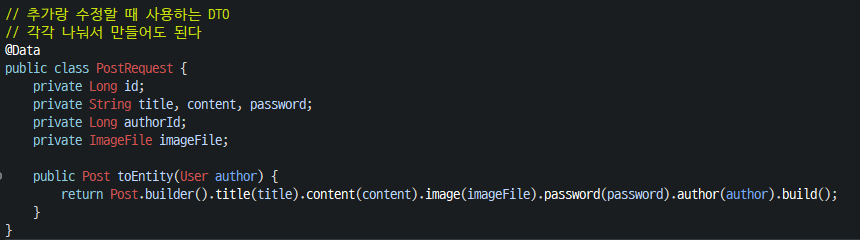
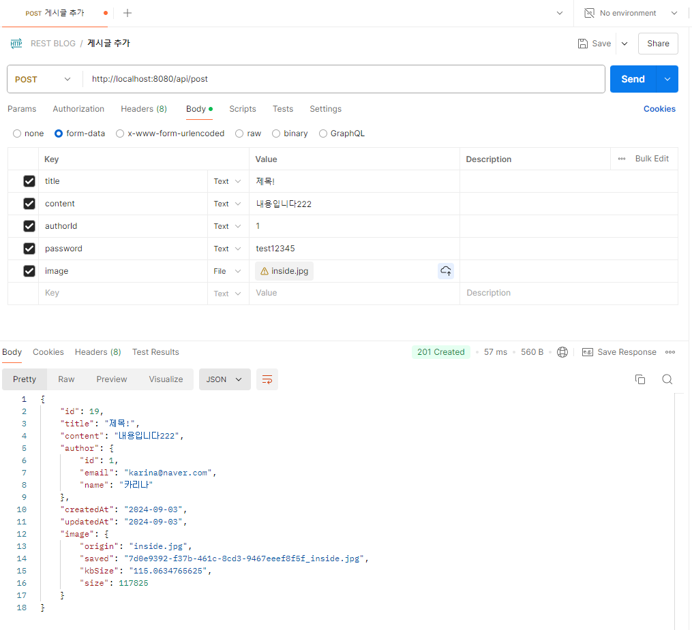
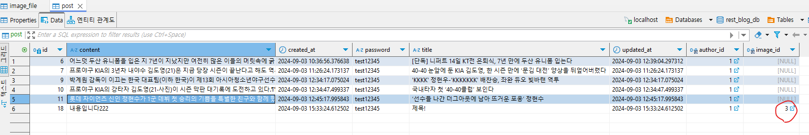
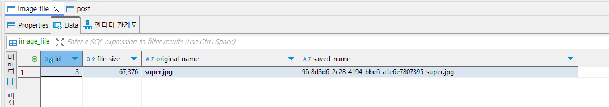
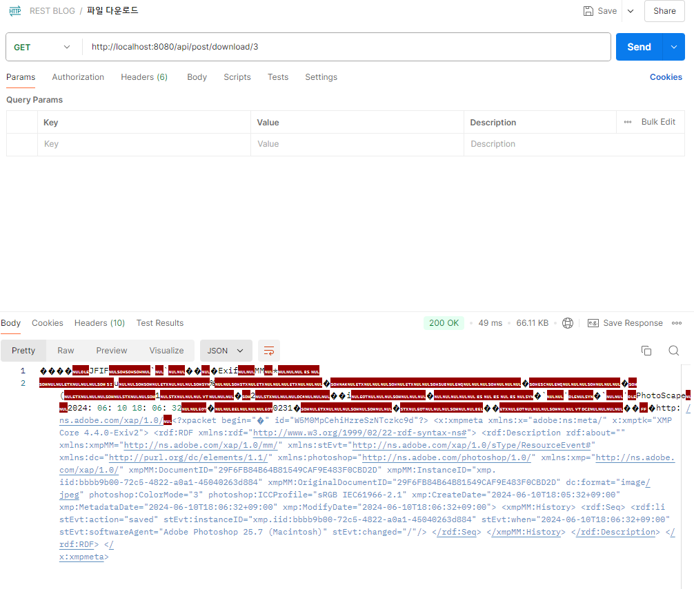
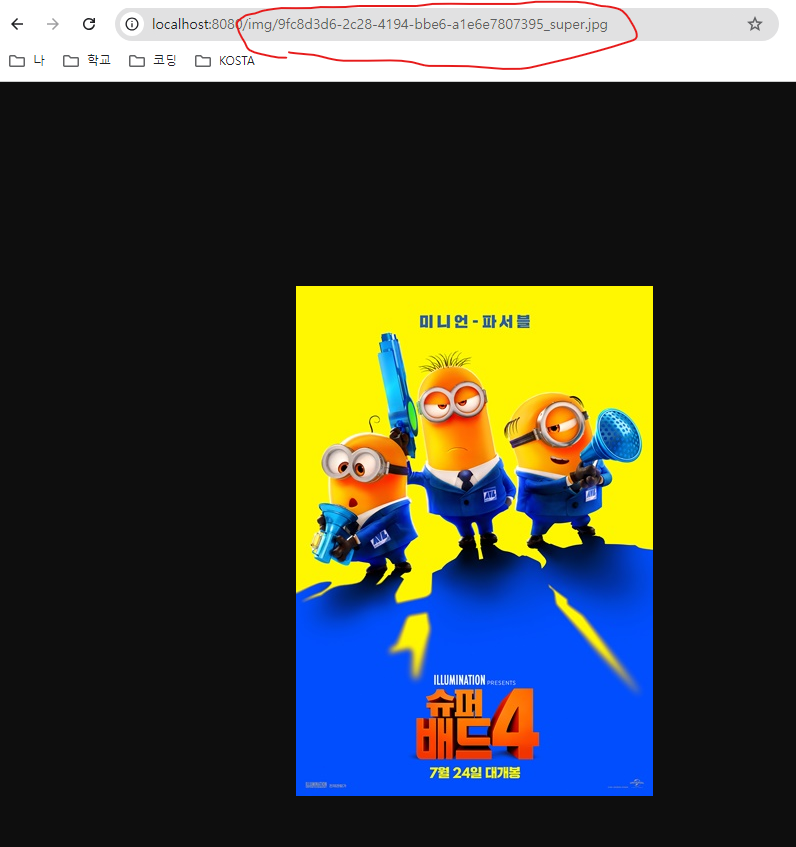

## 목차
- [React-hook-form](#react-hook-form)
- [sweetalert2](#sweetalert2)
- [글 작성 시 이미지 추가 \[백엔드\]](#글-작성-시-이미지-추가-백엔드)
	- [Image entity 생성](#image-entity-생성)
	- [Post entity에 image column 추가](#post-entity에-image-column-추가)
	- [controller 수정](#controller-수정)
	- [application.yml에 경로 추가](#applicationyml에-경로-추가)
	- [ServiceImpl 수정](#serviceimpl-수정)
	- [FileUtils 파일 생성](#fileutils-파일-생성)
	- [PostRequest 수정 (image 추가)](#postrequest-수정-image-추가)
	- [FileDTO 생성](#filedto-생성)
	- [PostResponse 수정](#postresponse-수정)
	- [postman으로 확인](#postman으로-확인)
		- [image가 있는 경우](#image가-있는-경우)
		- [image가 없는 경우](#image가-없는-경우)
- [이미지 다운로드 \[백엔드\]](#이미지-다운로드-백엔드)
	- [controller 추가](#controller-추가)
	- [ServiceImpl 추가](#serviceimpl-추가)
	- [Postman으로 확인](#postman으로-확인-1)
- [웹 브라우저에서 이미지 확인 \[백엔드\]](#웹-브라우저에서-이미지-확인-백엔드)
	- [WebMvcConfig 파일 수정](#webmvcconfig-파일-수정)
	- [브라우저에서 확인](#브라우저에서-확인)
- [글 작성 시 이미지 추가 \[프론트\]](#글-작성-시-이미지-추가-프론트)
	- [`PostForm.jsx` 수정](#postformjsx-수정)
- [글 detail page에 이미지 추가 \[프론트\]](#글-detail-page에-이미지-추가-프론트)
	- [`PostDetail.jsx` 수정](#postdetailjsx-수정)
- [파일 다운로드 \[프론트\]](#파일-다운로드-프론트)
	- [`PostCard.jsx` 수정](#postcardjsx-수정)

<br/>
<br/>
<br/>
<br/>

# React-hook-form
```javascript
const PostForm = () => {
  const {
    register,
    handleSubmit,
    watch,
    formState: { errors },
  } = useForm();

  const onSubmit = (data) => console.log(data);

  return (
    <>
      <Typography variant="h1">글쓰기</Typography>
      {/* hanndleSubmit 함수는 onSubmit 동작 전에 입력값에 대한 유효값 검증(validation)한다. */}
      <form onSubmit={handleSubmit(onSubmit)}>
        {/* ...register("이름") -> 값이 전달된다 */}
        {/* 필수값, 유효성 검증 등을 추가할 수 있다. */}
        <input
          defaultValue="test"
          {...register("name", { required: true, maxLength: 3 })}
        />

        {/* 유효값 검증 실패 시 나타나는 문구 */}
        {errors.name && <span>이름을 세 글자만 입력하세요</span>}

        <input type="submit" />
      </form>
    </>
  );
};
```

<br/>
<br/>
<br/>
<br/>

# sweetalert2

```javascript
    const result = await Swal.fire({
      title: "삭제하시겠습니까?",
      text: "삭제하기 위해서는 비밀번호가 필요합니다",
      input: "password",
      inputPlaceholder: "비밀번호를 입력해주세요",
      inputAttributes: {
        maxlength: "10",
        autocapitalize: "off",
        autocorrect: "off",
      },
      showCancelButton: true,
      showCloseButton: true,
    });
```

<br/>
<br/>
<br/>
<br/>

# 글 작성 시 이미지 추가 [백엔드]
## Image entity 생성
```java
@Entity
@Data
@NoArgsConstructor
public class ImageFile {
	@Id
	@GeneratedValue(strategy = GenerationType.IDENTITY)
	@Column(updatable = false)
	private Long id;

	@Column(nullable = false, name = "original_name")
	private String originalName;

	@Column(nullable = false, name = "saved_name")
	private String savedName;

	@Column(nullable = false, name = "file_size")
	private Long fileSize;

	@Builder
	public ImageFile(String originalName, String savedName, Long fileSize) {
		super();
		this.originalName = originalName;
		this.savedName = savedName;
		this.fileSize = fileSize;
	}

}
```
## Post entity에 image column 추가
```java
@JoinColumn(name = "image_id", nullable = true) // image는 필수가 아니다
@ManyToOne
private Image image;
```
## controller 수정
```java
	@PostMapping("")
	public ResponseEntity<PostResponse> writePost(PostRequest post,
			@RequestParam(name = "image", required = false) MultipartFile file) {
		PostResponse savedPost = postService.insertPost(post, file);
		return ResponseEntity.status(HttpStatus.CREATED).body(savedPost);
	}
```
- file이 추가되므로 formData로 보내줘야 한다.
## application.yml에 경로 추가

## ServiceImpl 수정
```java
	private final ImageFileRepository imageFileRepoistory;
	private final FileUtils fileUtils;

	@Override
	public PostResponse insertPost(PostRequest postDTO, MultipartFile file) {
		// file이 없을 때는 아예 이 동작을 하지 않는다.
		if (file != null) {
			// 이미지 파일 가져오기
			ImageFile imageFile = fileUtils.fileUpload(file);

			if (imageFile != null) {
				// DB에 저장
				ImageFile savedimageFile = imageFileRepoistory.save(imageFile);
				// postDTO (postRequest)에 이미지 파일 추가
				postDTO.setImageFile(savedimageFile);
			}
		}

		// post table에 저장
		User user = userRepository.findById(postDTO.getAuthorId())
				.orElseThrow(() -> new IllegalArgumentException("해당 유저를 찾을 수 없음"));
		Post post = postDTO.toEntity(user);
		Post savedPost = postRepository.save(post);

		// response에 image 추가
		PostResponse result = PostResponse.toDTO(savedPost);
		return result;
	}
```
## FileUtils 파일 생성
```java
@Component
public class FileUtils {
	// application.yml 파일의 location 정보 가져오기
	@Value("${spring.upload.location}")
	private String uploadPath;

	public ImageFile fileUpload(MultipartFile file) {
		try {
			// 원본 파일명 가져오기
			String originalFileName = file.getOriginalFilename();
			// 파일 크기 가져오기
			Long fileSize = file.getSize();
			// 새로운 파일명 만들기
			String savedFileName = UUID.randomUUID() + "_" + originalFileName;

			// 해당 경로(uploadPath)에 파일 업로드
			InputStream inputStream = file.getInputStream();
			Path path = Paths.get(uploadPath).resolve(savedFileName);
			Files.copy(inputStream, path, StandardCopyOption.REPLACE_EXISTING);

			// 저장한 새로운 파일 객체를 return (원래는 dto로 바꿔줘야 한다)
			return ImageFile.builder().originalName(originalFileName).savedName(savedFileName).fileSize(fileSize)
					.build();
		} catch (Exception e) {
			e.printStackTrace();
			// 에러 발생 시 null값 return
			return null;
		}
	}
}
```
- 중복으로 사용되므로 `utils` 패키지를 만들어 `FileUtils` 클래스 생성
## PostRequest 수정 (image 추가)

## FileDTO 생성
```java
@Data
@AllArgsConstructor
@Builder
public class FileDTO {
	private Long id;
	// kbSize : 화면에서 파일 크기를 보여주기 위한 string
	private String origin, saved, kbSize;
	private Long size;

	public static FileDTO toDTO(ImageFile imageFile) {
		if (imageFile == null)
			return null;

		return FileDTO.builder().id(imageFile.getId()).origin(imageFile.getOriginalName())
				.saved(imageFile.getSavedName()).kbSize(((Double) (imageFile.getFileSize() / 1024.0)).toString())
				.build();
	}
}
```
- response할 때 이미지 정보를 받아와서 화면에 뿌려줘야 하므로 `FileDTO` 클래스 생성
## PostResponse 수정
```java
@Data
@Builder
public class PostResponse {
	private Long id;
	private String title, content;
	private UserResponse author;
	private String createdAt, updatedAt;
	private FileDTO image;

	public static PostResponse toDTO(Post post) {
		return PostResponse.builder().id(post.getId()).title(post.getTitle()).content(post.getContent())
				.author(UserResponse.toDTO(post.getAuthor())) // toDTO를 통해 자동으로 User type으로 변경
				.createdAt(post.getCreatedAt().format(DateTimeFormatter.ofPattern("yyyy-MM-dd")))
				.updatedAt(post.getUpdatedAt().format(DateTimeFormatter.ofPattern("yyyy-MM-dd")))
				.image(FileDTO.toDTO(post.getImage())).build();
	}
}
```
## postman으로 확인
### image가 있는 경우
   
   

### image가 없는 경우


<br/>
<br/>
<br/>
<br/>

# 이미지 다운로드 [백엔드]
## controller 추가
```java
	// image id값을 가져와서 파일 다운로드
	@GetMapping("/download/{imageId}")
	public ResponseEntity<Resource> downloadImage(@PathVariable("imageId") Long id) throws MalformedURLException {
		FileDTO fileDTO = postService.getImageById(id); // 실제로 데이터를 가져오는 곳은 ImageFileRepository

		UrlResource resource = new UrlResource("file:" + uploadPath + "\\" + fileDTO.getSaved());
		String fileName = UriUtils.encode(fileDTO.getOrigin(), StandardCharsets.UTF_8);
		String contentDisposition = "attachment; filename=\"" + fileName + "\"";

		return ResponseEntity.ok().header(HttpHeaders.CONTENT_DISPOSITION, contentDisposition).body(resource);
	}
```
## ServiceImpl 추가
```java
	@Override
	public FileDTO getImageById(Long id) {
		ImageFile image = imageFileRepoistory.findById(id)
				.orElseThrow(() -> new IllegalArgumentException("해당 id에 맞는 파일 없음"));
		return FileDTO.toDTO(image);
	}
```
## Postman으로 확인

- 주소를 복사해서 웹 브라우저 주소창에 입력하면 다운로드가 된다.   


<br/>
<br/>
<br/>
<br/>

# 웹 브라우저에서 이미지 확인 [백엔드]
## WebMvcConfig 파일 수정
```java
	@Override
	public void addResourceHandlers(ResourceHandlerRegistry registry) {
		registry.addResourceHandler("/img/**").addResourceLocations("file:" + uploadPath + "\\");
	}
```
## 브라우저에서 확인


<br/>
<br/>
<br/>
<br/>

# 글 작성 시 이미지 추가 [프론트]
## `PostForm.jsx` 수정
- 보내는 data가 `JSON` 형식이 아니라 `formData`이므로 수정이 필요하다.

```javascript
  const onSubmit = async (data) => {
    data.authorId = 1; // 로그인 기능 추가 전까지 임의로 지정

    // data.image는 fileList로 data에 저장된다. >> 필요한 부분은 image[0]
    data.image = data.image[0];

    const formData = new FormData();
    Object.keys(data).forEach((key) => {
      formData.append(key, data[key]);
    });

    try {
      // postId가 존재하면 수정
      if (postId) {
        // 서버에 수정 요청 보내기
        formData.append("id", postId);
        await axios.patch("http://localhost:8080/api/post", data);

        // 기존 게시물 디테일 페이지로 이동
        navigate(`/post/${postId}`);
      } else {
        // 서버에 등록 요청 보내기
        await axios.post("http://localhost:8080/api/post", formData, {
          headers: { "Content-Type": "mulipart/form-data" },
        });

        // 게시물 리스트 페이지로 이동
        navigate("/post");
      }
    } catch (error) {
      // 비정상이면 error page로 이동
      navigate("/error");
    }
  };

  ...

            {/* 이미지 : 필수 아님 */}
          <div>
            <TextField
              type="file"
              {...register("image")}
              fullWidth
              // image만 등록될 수 있도록 막아둠(백엔드에서 한번 더 체크 필요)
              slotProps={{ htmlInput: { accept: "image/*" } }}
            />
          </div>
```

<br/>
<br/>
<br/>
<br/>

# 글 detail page에 이미지 추가 [프론트]
## `PostDetail.jsx` 수정
```javascript
          {post.image && post.image.saved ? (
            <CardMedia
              component="img"
              //height="194"
              image={`http://localhost:8080/img/${post.image.saved}`}
              alt="게시글 이미지"
            />
          ) : null}
```
- 이미지가 null인 경우를 생각해서 조건문으로 추가

<br/>
<br/>
<br/>
<br/>

# 파일 다운로드 [프론트]
## `PostCard.jsx` 수정
```javascript
    const handleDownload = (e) => {
        e.stopPropagation();
        window.location.href = `http://localhost:8080/api/post/download/${post.image.id}`
    }
```