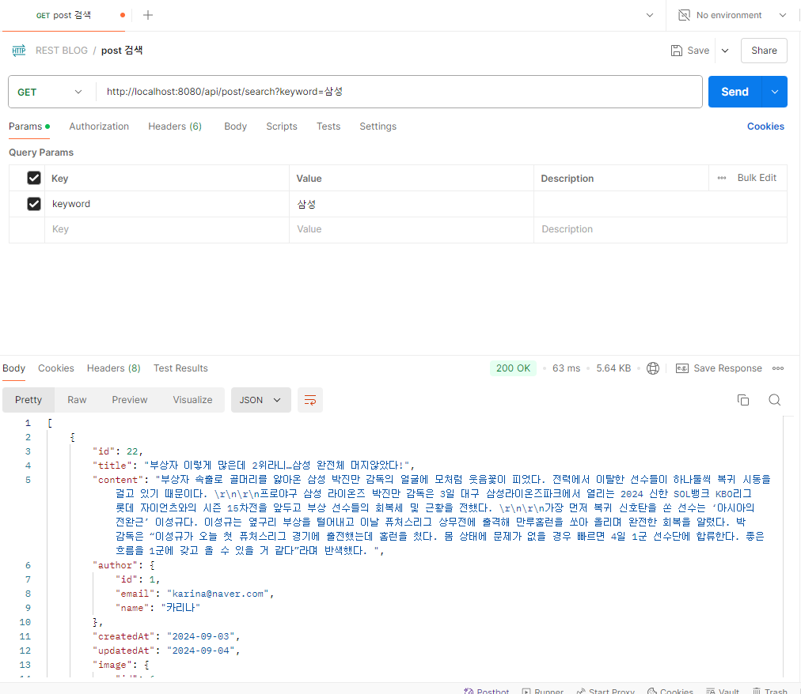

# 검색 기능
## controller 추가
```java
	// 검색
	@GetMapping("/search")
	public ResponseEntity<List<PostResponse>> search(@RequestParam("keyword") String keyword) {
		List<PostResponse> result = postService.search(keyword);
		return ResponseEntity.ok(result);
	}
```
## service 추가
```java
	@Override
	public List<PostResponse> search(String keyword) {
		List<Post> postList = postRepository.findByTitleContainsOrContentContains(keyword, keyword);
		return postList.stream().map(p -> PostResponse.toDTO(p)).toList();
	}
```
## repository 추가
```java
List<Post> findByTitleContainsOrContentContains(String keyword, String keyword2);
```
## Postman으로 확인
