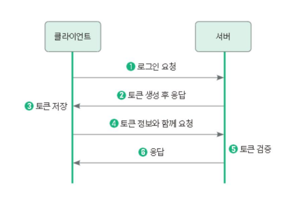
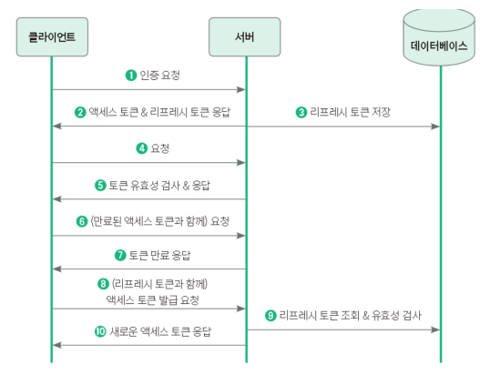
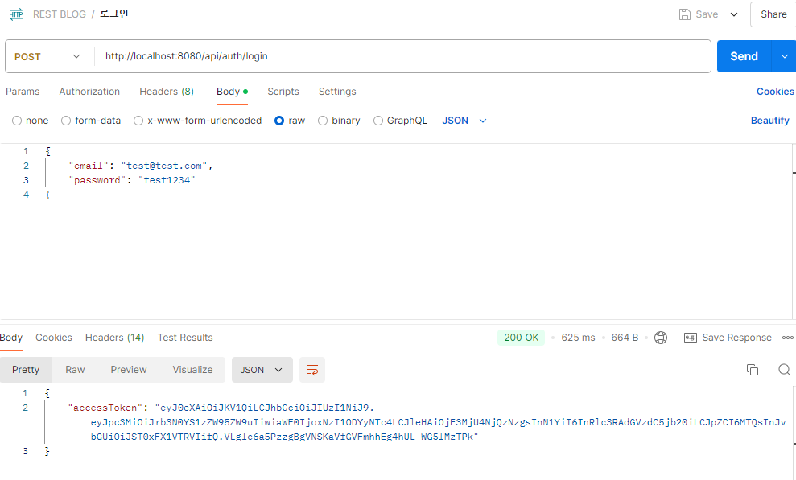
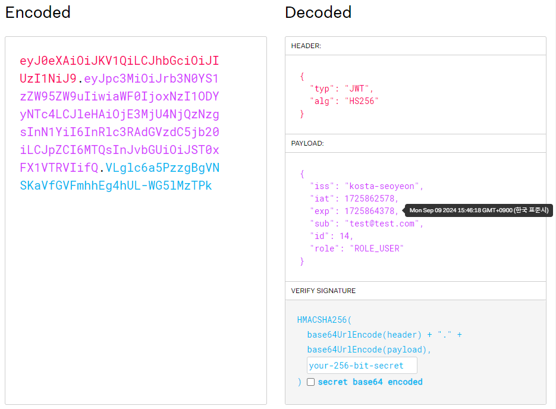
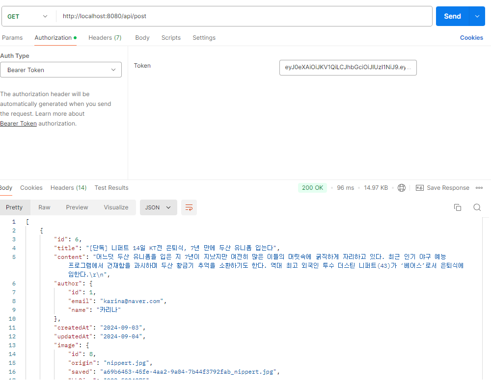
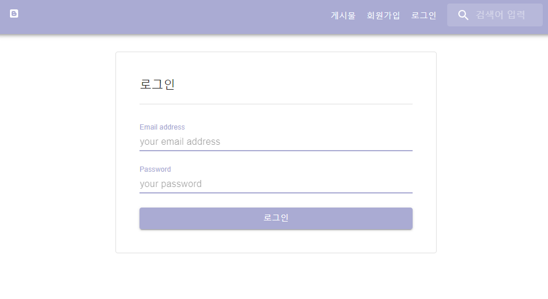
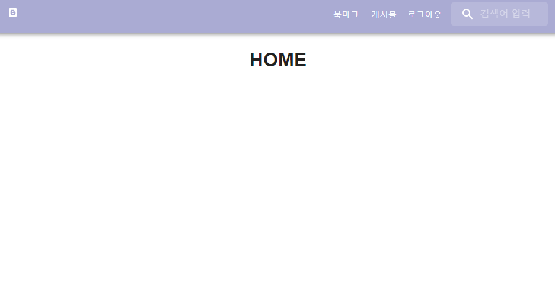

## 목차
- [토큰 기반 인증](#토큰-기반-인증)
  - [토큰 기반 인증의 특징](#토큰-기반-인증의-특징)
    - [무상태성](#무상태성)
    - [확장성](#확장성)
    - [무결성](#무결성)
- [JWT](#jwt)
  - [JWT 구성](#jwt-구성)
  - [토큰의 유효 기간 설정](#토큰의-유효-기간-설정)
- [비밀번호 암호화 실습](#비밀번호-암호화-실습)
  - [스프링 시큐리티 추가](#스프링-시큐리티-추가)
  - [User entity 수정](#user-entity-수정)
  - [RoleEnum 추가](#roleenum-추가)
  - [WebSecurityConfig 생성](#websecurityconfig-생성)
  - [UserServiceImpl 회원가입 로직 수정](#userserviceimpl-회원가입-로직-수정)
- [jwt 적용 실습](#jwt-적용-실습)
  - [application.yml 수정](#applicationyml-수정)
  - [JwtProperties 파일 생성](#jwtproperties-파일-생성)
  - [JwtProviders 파일 생성](#jwtproviders-파일-생성)
  - [controller에 로그인 추가](#controller에-로그인-추가)
  - [ServiceImpl에 로그인 추가](#serviceimpl에-로그인-추가)
  - [postman으로 확인](#postman으로-확인)
  - [jwt.io 에서 확인](#jwtio-에서-확인)
  - [인증 filter 추가](#인증-filter-추가)
  - [Postman에서 확인](#postman에서-확인)
- [jwt 적용 실습 \[프론트엔드\]](#jwt-적용-실습-프론트엔드)
  - [jwt 디코딩 설치](#jwt-디코딩-설치)
  - [`LoginContext.jsx` 파일 생성](#logincontextjsx-파일-생성)
  - [`useProvideAuth`, `useAuth` custom hook 생성](#useprovideauth-useauth-custom-hook-생성)
  - [App.js 수정](#appjs-수정)
  - [header menu 수정](#header-menu-수정)
  - [Login.jsx 파일 생성](#loginjsx-파일-생성)
  - [로그인 동작 확인](#로그인-동작-확인)
    - [로그인 전](#로그인-전)
    - [로그인 후](#로그인-후)

<br/>
<br/>
<br/>
<br/>

# 토큰 기반 인증
- 사용자가 서버에 접근할 때, 해당 사용자가 인증된 사용자인지 확인하는 방법은 다양하다.
- 대표적인 사용자 인증 확인 방법을 두 가지로 나누면, 세션 기반 인증(서버 기반인 증)과 토큰 기반 인증이 있다.
- 스프링 시큐리티에서 기본적으로 세션을 기반으로 한 세션 기반 인증을 사용한다.


- 토큰 기반 인증은 토큰을 사용하는 방법이다.
  - `토큰` : 서버에 요 청을 받을 때, 요청을 보낸 클라이언트를 구분하기 위한 유일한 값
- 서버가 토큰을 생성해서 클라이언트에게 제공하면, 클라이언트는 해당 토큰을 보관하고 있다가 여러 요청을 토큰과 함께 보내게 된다.
- 그러면 서버는 토큰을 보고 해당 클라이언트가 유효한 사용자인지 검증하고, 요청을 처리해주게 된다.
## 토큰 기반 인증의 특징
### 무상태성
- 사용자의 인증 정보가 담겨 있는 토큰이 클라이언트에서 보관되기 때문에, 서버는 저장할 필요가 없다.
- 서버가 모든 데이터를 가지고 있으면 많은 자원을 소비하게 되는데, 토큰 기반 인증은 클라이언트가 토큰을 관리한다.
- 서버는 클라이언트의 인정 정보를 저장하거나 유지하지 않아도 되기 때문에 완전한 무상태로 효율정인 검증이 가능해진다.
### 확장성
- 서버를 확인할 때 상태 관리에 대한 신경을 쓸 필요가 없어지기 때문에 서버 확장에 용이하다.
  - (예) 결제 서버와 주문 서버가 따로 분리되어 있더라도 하나의 토큰으로 결제 서버와 주문 서버에게 요청을 보낼 수 있게 된다.
- 추가로 SNS 로그인과 같은 토큰 기반 인증을 사용하는 다른 시스템에 접근해 로그인 방식을 확장할 수 있다.
### 무결성
- 토큰 방식은 HMAC(Hash-based Message AutehntiCation) 기법이라고도 부르는데, 토 큰을 발급한 이후에는 토큰 정보를 변경할 수 없게 된다.
- 토큰의 무결성이 보장된다.
- 만약 토큰을 누군가 한 글자라도 변경하면 서버에서 유효하지 않은 토큰으로 판단한다.

<br/>
<br/>
<br/>
<br/>

# JWT
- 발급받은 JWT를 이용해 인증을 하려면 HTTP 요청 헤더 중에 Authorization 값에 Bearer + JWT 토큰값을 넣어서 보내야 한다.
- JWT는 `.`을 기준으로 헤더(Header), 내용(Payload), 서명(Signature)으로 구성되어 있다.
## JWT 구성
- 헤더 : 토큰의 타입과 해싱 알고리즘을 지정하는 정보
- 내용 : 토큰과 관련된 정보로 내용의 한 덩어리를 클레임(Claim)이라고 부르며 키와 값의 한 쌍으로 이뤄져 있다.
  - 등록된 클레임은 토큰에 대한 정보를 담는데 사용된다.
- 서명 : 해당 토큰이 조작되었거나 변견되지 않았음을 확인하는 비밀키
## 토큰의 유효 기간 설정
- 토큰을 주고 받는 환경에서 보안 취약점으로 인해 토큰이 노출되게 되면, 탈취가 가능해진다.
- 토큰을 탈취한 사람이 요청을 보내도 서버는 이를 알아차릴 수 없기 때문에 정상적으로 요청을 처리할 것이다.
- 그렇기 때문에 토큰에는 유효기간을 설정하게 된다.
  - 유효기간이 1일이라면, 24시간 동안은 해당 토큰으로 무엇이든 할 수 있을테니 위험하다.
  - 그렇다고 토큰의 유효기간이 1분이라면, 사용자 입장에서 받은 토큰을 활용할 수 있는 시간이 너무 짧아 불편할 것이다.


- 이렇게 불편한 지점을 해결하기 위해서 `일반 토큰(액세스 토큰)`에 `리프레시 토큰`을 추가하여 이용하게 된다.
- `리프레시 토큰`은 엑세스 토큰이 만료되었을 때, 새로운 액세스 토큰을 발급하기 위해 사용한다.
- 따라서 액세스 토큰의 유효기간을 짧게 설정하고, 리프레시 토큰의 유효기간을 길게 설정하면, 공격자가 액세스 토큰을 탈취하더라도 리프레시 토큰을 알지 못하면 사용 불가능한 토큰이 되어버리기 때문에 보다 안전해진다.

<br/>
<br/>
<br/>
<br/>

# 비밀번호 암호화 실습
## 스프링 시큐리티 추가
```gradle
    // 스프링 시큐리티 추가
    implementation 'org.springframework.boot:spring-boot-starter-security'
    testImplementation 'org.springframework.security:spring-security-test'
    // JWT 의존성 추가
    implementation 'io.jsonwebtoken:jjwt-api:0.12.6'
    runtimeOnly 'io.jsonwebtoken:jjwt-impl:0.12.6'
    runtimeOnly 'io.jsonwebtoken:jjwt-jackson:0.12.6'
```
## User entity 수정
```java
@Entity
@EntityListeners(AuditingEntityListener.class) // 생성, 수정 날짜 추적
@Data
@Builder
@AllArgsConstructor
@NoArgsConstructor
public class User implements UserDetails {
	@Id
	@GeneratedValue(strategy = GenerationType.IDENTITY)
	@Column(updatable = false)
	private Long id;

	@Column(nullable = false, unique = true)
	private String email;

	@Column(nullable = false)
	private String name;

	@Column(nullable = false)
	private String password;

	@CreatedDate
	@Column(name = "created_at")
	private LocalDateTime createdAt;

	@LastModifiedDate
	@Column(name = "updated_at")
	private LocalDateTime updatedAt;

	@Column(nullable = false)
	@Enumerated(EnumType.STRING)
	@Builder.Default
	private RoleEnum role = RoleEnum.ROLE_USER;
	// 권한 column 추가 (기본값 ROLE_USER)

	// 나중에 refresh_toekn을 저장하도록 변경 예정

	@Override
	public Collection<? extends GrantedAuthority> getAuthorities() {
		// 권한 목록 반환
		return List.of(new SimpleGrantedAuthority(role.name()));
	}

	@Override
	public String getUsername() {
		// 로그인할 사용자명 지정 (이메일로 지정했음)
		return email;
	}

}
```
## RoleEnum 추가
```java
public enum RoleEnum {
	ROLE_USER("ROLE_USER"), ROLE_ADMIN("ROLE_ADMIN");

	String role;

	RoleEnum(String role) {
		this.role = role;
	}

	public String getRole() {
		return role;
	}
}
```
## WebSecurityConfig 생성
```java
@Configuration
@EnableWebSecurity
@RequiredArgsConstructor
public class WebSecurityConfig {
	private final UserDetailsService userDetailsService;
	private final JwtProperties jwtProperties;

	// JWT PROVIDER bean 생성
	@Bean
	JwtProvider jwtProvider() {
		return new JwtProvider(jwtProperties, userDetailsService);
	};

	// 암호화 빈
	@Bean
	BCryptPasswordEncoder bCryptPasswordEncoder() {
		return new BCryptPasswordEncoder();
	}

	// HTTP 요청에 따른 보안 구현
	@Bean
	SecurityFilterChain filterChain(HttpSecurity http) throws Exception {
		// 경로에 대한 권한 설정
		http.authorizeHttpRequests(auth ->
		// 특정 URL 경로에 대해서는 인증 없이 접근 가능
		auth.requestMatchers(new AntPathRequestMatcher("/api/auth/login"), // 로그인
				new AntPathRequestMatcher("/api/auth/signup"), // 회원가입
				new AntPathRequestMatcher("/api/auth/duplicate") // email 중복 체크
		).permitAll()
				// AuthController 중 나머지는 ADMIN만 접근 가능한 페이지
				.requestMatchers(new AntPathRequestMatcher("/api/auth/**")).hasRole("ADMIN")
				// 그 밖의 다른 요청들은 인증을 통과한 사용자라면(=로그인한 사용자) 접근 가능
				.anyRequest().authenticated());

		// session 관리는 이제 더 이상 하지 않는다
		// 무상태성 세션 관리
		http.sessionManagement(sm -> sm.sessionCreationPolicy(SessionCreationPolicy.STATELESS));

		// (토큰을 통해 검증할 수 있도록) filter 추가
		// http.addFilterBefore(추가할 필터, 다른필터)
		// jwt 인증 필터를 추가
		http.addFilterBefore(new JwtAuthenticationFilter(jwtProvider()), UsernamePasswordAuthenticationFilter.class);

		// HTTP 기본 설정
		http.httpBasic(HttpBasicConfigurer::disable);

		// CSRF 비활성화
		http.csrf(AbstractHttpConfigurer::disable);

		// CORS 비활성화
		http.cors(AbstractHttpConfigurer::disable);

		return http.getOrBuild();
	}
}
```
## UserServiceImpl 회원가입 로직 수정
```java
	@Override
	public UserResponse addUser(SignUpRequest user) {
		// 사용자의 비밀번호 암호화
		String encodedPassword = bCryptPasswordEncoder.encode(user.getPassword());

		User newUser = User.builder().email(user.getEmail()).name(user.getName()).password(encodedPassword).build();
		User joinedUser = userRepository.save(newUser);

		return UserResponse.toDTO(joinedUser);
	}
```

<br/>
<br/>
<br/>
<br/>

# jwt 적용 실습
## application.yml 수정
```yml
jwt:
  issuer: kosta-seoyeon
  secret_key: myscretmyscretmyscretmyscretmyscret
  access_duration: 1800000 # 30분 (30*60*1000)
```
## JwtProperties 파일 생성
```java
@Getter
@Setter
@Component
@ConfigurationProperties("jwt") // applicaton.yml에 설정한 jwt.issuer, jwt.secret_key 등 매핑된다
public class JwtProperties {
	private String issuer;
	private String secretKey;
	private int accessDuration;
}
```
## JwtProviders 파일 생성
```java
@Slf4j
@Service
@RequiredArgsConstructor
public class JwtProvider {
	// jwt 설정 정보 객체 주입
	private final JwtProperties jwtProperties;

	private final UserDetailsService userDetailsService;

	// jwt access token 생성
	public String generateAccessToken(User user) {
		log.info("[generateAccessToekn] 토큰을 생성합니다");
		Date now = new Date(); // 현재 날짜
		Date expiredDate = new Date(now.getTime() + jwtProperties.getAccessDuration()); // 만료일
		return makeToken(user, expiredDate);
	}

	// 토큰 생성 공통 메소드 (실제로 jwt 토큰 생성)
	private String makeToken(User user, Date expiredDate) {
		String token = Jwts.builder().header().add("typ", "JWT") // jwt 타입을 명시
				.and().issuer(jwtProperties.getIssuer()) // 발행자 정보 설정
				.issuedAt(new Date()) // 발행일시 설정
				.expiration(expiredDate) // 만료일 설정
				.subject(user.getEmail()) // 토큰의 주제(subject) 설정 >> 사용자 이메일
				.claim("id", user.getId()) // claim 설정
				.claim("role", user.getRole()) // claim 설정
				.claim("role", user.getRole().name()) // user role의 name claim 설정
				.signWith(getSecretKey(), Jwts.SIG.HS256) // 비밀키와 해시 알고리즘 사용하여 토큰 설명값 설정
				.compact(); // 토큰 정보를 최종적으로 압축해서 문자열로 반환

		log.info("[makeToken] 완성된 토큰: {}", token);
		return token;
	}

	// 비밀키 만들기 메소드
	private SecretKey getSecretKey() {
		return Keys.hmacShaKeyFor(jwtProperties.getSecretKey().getBytes());
	}

	// 토큰이 유효한지 검증하는 메소드
	public boolean validateToken(String token) {
		log.info("[validateToken] 토큰 검증을 시작합니다.");
		try {
			Jwts.parser().verifyWith(getSecretKey()) // 비밀키로 서명 검증
					.build().parseSignedClaims(token); // 서명된 클레임을 파싱
			return true;
		} catch (Exception e) {
			e.printStackTrace();
		}
		log.info("토큰 검증 실패");
		return false;
	}

	// 토큰에서 정보(Claim) 추출 메소드
	private Claims getClaims(String token) {
		return Jwts.parser().verifyWith(getSecretKey()) // 비밀키로 서명 검증
				.build().parseSignedClaims(token) // 새로운 클레임을 파싱
				.getPayload(); // 파싱된 클레임에서 페이로드(실제 클레임)을 반환
	}

	// 토큰에서 인증정보 반환하는 메소드
	public Authentication getAuthenticationByToken(String token) {
		log.info("[getAuthenticationByToken] 토큰 인증 정보 조회");
		String userEmail = getUserEmailByToken(token);
		User user = (User) userDetailsService.loadUserByUsername(userEmail);

		Authentication authentication = new UsernamePasswordAuthenticationToken(user, token, user.getAuthorities());

		return authentication;
	}

	// 토큰에서 사용자 email만 추출하는 메소드
	public String getUserEmailByToken(String token) {
		log.info("[getUserEmailByToken] 토큰 기반 회원 정보 추출");
		Claims claims = getClaims(token);
		String email = claims.get("sub", String.class);
		return email;
	}

}
```
## controller에 로그인 추가
```java
	// 로그인
	@PostMapping("/login")
	public ResponseEntity<LoginResponse> login(@RequestBody LoginRequest loginRequest, HttpServletRequest response) {
		log.info("[login] 로그인 시도, user: {}", loginRequest);
		LoginResponse loginResponse = userService.login(loginRequest.getEmail(), loginRequest.getPassword());
		return ResponseEntity.ok(loginResponse);
	}
```
## ServiceImpl에 로그인 추가
```java
	private final JwtProvider jwtProvider;

    	@Override
	public LoginResponse login(String email, String password) {
		User user = userRepository.findByEmail(email).orElseThrow(() -> new IllegalArgumentException("없는 이메일"));
		// password 일치 여부 비교 (평문, 암호문) >> false이면 일치하지 않음
		boolean matchedPassword = bCryptPasswordEncoder.matches(password, user.getPassword());
		if (!matchedPassword)
			throw new RuntimeException("비밀번호 불일치");

		String accessToken = jwtProvider.generateAccessToken(user);
		return LoginResponse.builder().accessToken(accessToken).build();
	}
```
## postman으로 확인

## [jwt.io](https://jwt.io/) 에서 확인

## 인증 filter 추가
```java
@Slf4j
@RequiredArgsConstructor
public class JwtAuthenticationFilter extends OncePerRequestFilter {
	private final JwtProvider jwtProvider;
	private final static String HEADER_AHORIZATION = "Authorization";
	private final static String TOKEN_PREFIX = "Bearer ";

	// HTTP 요청이 들어올 때마다 실행되는 필터
	@Override
	protected void doFilterInternal(HttpServletRequest request, HttpServletResponse response, FilterChain filterChain)
			throws ServletException, IOException {
		String header = request.getHeader(HEADER_AHORIZATION);
		// header에서 token값 가져오기
		String token = getAccessToken(header);
		if (jwtProvider.validateToken(token)) {
			// 유효한 토큰인 경우
			Authentication authentication = jwtProvider.getAuthenticationByToken(token);
			SecurityContextHolder.getContext().setAuthentication(authentication);
		}
		// 그 다음 요청 처리 체인을 이어서 진행
		filterChain.doFilter(request, response);

	}

	private String getAccessToken(String header) {
		log.info("[getAccessToken] token값 추출, {}", header);
		if (header != null && header.startsWith(TOKEN_PREFIX)) {
			return header.substring(TOKEN_PREFIX.length());
		}
		return null;
	}

}
```
## Postman에서 확인


<br/>
<br/>
<br/>
<br/>

# jwt 적용 실습 [프론트엔드]
## jwt 디코딩 설치
```
yarn add jwt-decode
```
## `LoginContext.jsx` 파일 생성
```javascript
import { createContext } from "react";

export const LonginContext = createContext(null);
```
## `useProvideAuth`, `useAuth` custom hook 생성
```javascript
// useAuth.js

import { useContext } from "react";
import { LonginContext } from "../contexts/LoginContext";

// login 인증을 사용하는 custom hook
export const useAuth = () => {
  return useContext(LonginContext);
};

```
```javascript
// useProvideAuth.js
import { useState } from "react";
import { userAPI } from "../api/services/user";
import { jwtDecode } from "jwt-decode";

const useProvideAuth = () => {
  const [accessToken, setAccessToken] = useState(localStorage.getItem("token"));

  const login = async (data, successCallBack, failCallBack) => {
    try {
      const res = await userAPI.login(data);

      if (res.status === 200) {
        const token = res.data.accessToken;
        localStorage.setItem("token", token); // localstorage에 token 저장
        setAccessToken(token);
        successCallBack();
      }
    } catch (error) {
      console.error(error);
      failCallBack();
    }
  };

  const logout = (callBack) => {
    localStorage.removeItem("token"); // token값 삭제
    setAccessToken(null);
    callBack();
  };

  const tokenCheck = () => {
    if (accessToken !== null && accessToken === localStorage.getItem("token")) {
      const jwtPayload = jwtDecode(accessToken);
      if (jwtPayload.exp > Date.now() / 1000) {
        return true;
      }
    }
    return false;
  };

  return { accessToken, login, logout, tokenCheck };
};

export default useProvideAuth;
```
## App.js 수정
```javascript
function App() {
  const auth = useProvideAuth();

  return (
    <LonginContext.Provider value={auth}>
      <Layout>
      </Layout>
    </LonginContext.Provider>
  );
}
```
## header menu 수정
```javascript
const Header = () => {
  const navigate = useNavigate();

  // access token 가져오기
  const { accessToken, logout, tokenCheck } = useAuth();

  let allMenu = [
    { path: "/user", name: "회원 관리", auth: ["ROLE_ADMIN"] },
    { path: "/favorite", name: "북마크", auth: ["ROLE_ADMIN", "ROLE_USER"] },
    {
      path: "/post",
      name: "게시물",
      auth: ["ROLE_ADMIN", "ROLE_USER", "none"],
    },
    { path: "/signup", name: "회원가입", auth: ["none"] },
    { path: "/login", name: "로그인", auth: ["none"] },
    { path: "/logout", name: "로그아웃", auth: ["ROLE_ADMIN", "ROLE_USER"] },
    {
      path: "/search",
      name: "검색",
      auth: ["ROLE_ADMIN", "ROLE_USER", "none"],
    },
  ];

  const [menu, setMenu] = useState([]);

  useEffect(() => {
    // 만약 브라우저 토큰이 유효하면
    if (tokenCheck()) {
      // 권한에 맞는 메뉴 설정
      const claims = jwtDecode(accessToken);
      console.log(claims);
      const role = claims.role; // role의 권한 가져오기
      setMenu(allMenu.filter((m) => m.auth.includes(role)));
    }
    // 그렇지 않으면
    else {
      // 로그아웃 처리
      logout(() => navigate("/login"));
      // none 메뉴 설정
      setMenu(allMenu.filter((m) => m.auth.includes("none")));
    }
  }, [accessToken]);

  const [menuOpen, setMenuOpen] = useState(false); // menu open 여부

  const toggleDrawer = () => {
    setMenuOpen((prev) => !prev);
  };

  return (
    <>
      <AppBar position="static" color="main">
        <Toolbar sx={{ justifyContent: "space-between" }}>
          <IconButton
            color="font"
            sx={{ display: { sm: "none" } }}
            onClick={toggleDrawer}
          >
            <MenuIcon />
          </IconButton>

          <Box
            color="font"
            sx={{ display: { xs: "none", sm: "block" }, cursor: "pointer" }}
          >
            <FaBlogger onClick={() => navigate("/")} />
          </Box>

          <Box sx={{ display: { xs: "none", sm: "block" }, cursor: "pointer" }}>
            {menu.map((m, idx) => {
              if (m.path === "/search") {
                return <MySearch key={idx} />;
              }
              return (
                <Button key={idx} color="bg2" onClick={() => navigate(m.path)}>
                  {m.name}
                </Button>
              );
            })}
          </Box>
        </Toolbar>
      </AppBar>

      {/* Drawer 추가 */}
      <Drawer menuOpen={menuOpen} toggleDrawer={toggleDrawer}>
        <List>
          {menu.map((m, idx) => (
            <ListItem key={idx}>
              <ListItemButton
                onClick={() => {
                  navigate(m.path);
                  toggleDrawer();
                }}
              >
                <ListItemText primary={m.name} />
              </ListItemButton>
            </ListItem>
          ))}
        </List>
      </Drawer>
    </>
  );
};
```
## Login.jsx 파일 생성
```javascript
const Login = () => {
  const {
    register,
    handleSubmit,
    formState: { errors },
    setError,
    //clearErrors,
  } = useForm();
  const navigate = useNavigate();
  const { login } = useAuth();

  const onSubmit = (data) => {
    try {
      login(
        data,
        () => navigate("/"),
        () => alert("로그인 실패")
      );
    } catch (error) {
      setError("email", { type: "manual", message: "아이디를 확인해주세요" });
      setError("password", {
        type: "manual",
        message: "비밀번호를 확인해주세요",
      });
    }
  };

  return (
    <Paper variant="outlined" sx={{ marginTop: "30px" }}>
      <Box
        component="form"
        noValidate
        sx={{ p: 5 }}
        onSubmit={handleSubmit(onSubmit)}
      >
        <Typography component="h1" variant="h6" gutterBottom>
          로그인
        </Typography>
        <Divider sx={{ my: 2 }} />
        <TextField
          label="Email address"
          id="email"
          name="email"
          placeholder="your email address"
          variant="standard"
          fullWidth
          margin="normal"
          type="email"
          focused
          color="main"
          autoComplete="email"
          {...register("email", { required: "이메일은 필수 입력값입니다." })}
          error={errors.email ? true : false}
          helperText={errors.email && errors.email.message}
        />
        <TextField
          label="Password"
          id="password"
          name="password"
          placeholder="your password"
          variant="standard"
          fullWidth
          margin="normal"
          type="password"
          focused
          color="main"
          autoComplete="password"
          sx={{ mb: 3 }}
          {...register("password", {
            required: "비밀번호를 입력해주세요",
            pattern: {
              value: /^(?=.*[a-zA-Z0-9]).{6,20}$/,
              message:
                "비밀번호는 문자와 숫자를 포함해 최소 6자 이상 20자 이내로 작성해주세요.",
            },
          })}
          error={errors.password ? true : false}
          helperText={errors.password && errors.password.message}
        />
        <Button type="submit" variant="contained" color="main" fullWidth>
          로그인
        </Button>
      </Box>
    </Paper>
  );
};
```
## 로그인 동작 확인
### 로그인 전

### 로그인 후
