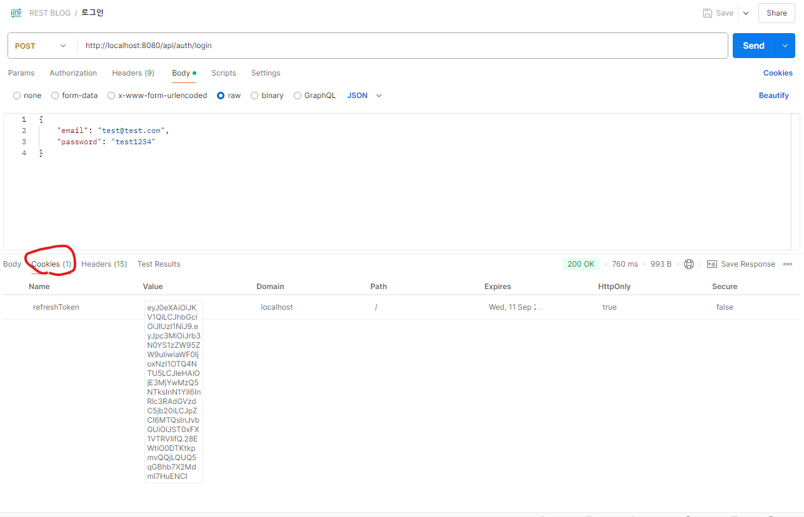
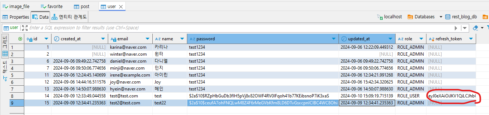
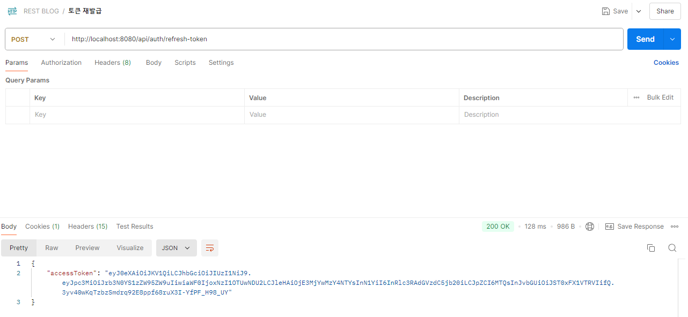

## 목차
- [로그인 로직 수정](#로그인-로직-수정)
  - [`LoginCustomAuthenticationFilter` 파일 생성](#logincustomauthenticationfilter-파일-생성)
  - [로그인 로직 삭제](#로그인-로직-삭제)
  - [JwtAuthenticationService 파일 생성](#jwtauthenticationservice-파일-생성)
  - [`TokenUtils` 생성](#tokenutils-생성)
  - [`WebSecurityConfig` 파일 수정](#websecurityconfig-파일-수정)
  - [로그 확인](#로그-확인)
  - [Postman으로 로그인 확인](#postman으로-로그인-확인)
  - [리액트 연동을 위해 `WebSecurityConfig` 파일 수정](#리액트-연동을-위해-websecurityconfig-파일-수정)
- [토큰 저장하기 \[프론트\]](#토큰-저장하기-프론트)
  - [`api.js` 수정](#apijs-수정)
- [Refresh Token 생성 \[백엔드\]](#refresh-token-생성-백엔드)
  - [`TokenUtils` 수정](#tokenutils-수정)
  - [`JwtProvider`에 refresh token 생성 메서드 추가](#jwtprovider에-refresh-token-생성-메서드-추가)
  - [`User` entity에 refresh token column 추가](#user-entity에-refresh-token-column-추가)
  - [`JwtAuthenticationService` 코드 수정](#jwtauthenticationservice-코드-수정)
  - [`AuthController`에 토큰 재발급 메서드 추가](#authcontroller에-토큰-재발급-메서드-추가)
  - [`UserServiceImpl`에 refreshToken 메서드 추가](#userserviceimpl에-refreshtoken-메서드-추가)
  - [`WebSecurityConfig` 파일에 토큰 재발급 url 추가](#websecurityconfig-파일에-토큰-재발급-url-추가)
  - [postman으로 로그인 확인](#postman으로-로그인-확인-1)

<br/>
<br/>
<br/>
<br/>

# 로그인 로직 수정
## `LoginCustomAuthenticationFilter` 파일 생성
```java
@Slf4j
public class LoginCustomAuthenticationFilter extends AbstractAuthenticationProcessingFilter {
	private JwtAuthenticationService jwtAuthenticationService;
	private static final AntPathRequestMatcher LOGIN_PATH = new AntPathRequestMatcher("/api/auth/login", "POST");

	protected LoginCustomAuthenticationFilter(AuthenticationManager authenticationManager,
			JwtAuthenticationService jwtAuthenticationService) {
		super(LOGIN_PATH);
		setAuthenticationManager(authenticationManager);
		this.jwtAuthenticationService = jwtAuthenticationService;
	}

	@Override
	public Authentication attemptAuthentication(HttpServletRequest request, HttpServletResponse response)
			throws AuthenticationException, IOException, ServletException {
		// POST '/api/auth/login'에 요청이 들어오면 진행되는 곳

		// 1. Body에 있는 로그인 정보 { email: "", password: "" } 가져오기
		LoginRequest loginRequest = null;
		try {
			log.info("[attemptAuthentication] 로그인 정보 가져오기");
			ObjectMapper objectMapper = new ObjectMapper();
			loginRequest = objectMapper.readValue(request.getInputStream(), LoginRequest.class);
		} catch (IOException e) {
			throw new RuntimeException("로그인 요청 파라미터 이름 확인 필요 (로그인 불가)");
		}

		// 2. email, password를 기반으로 AuthenticationToken 생성
		log.info("[attemptAuthentication] Authentication 생성");
		UsernamePasswordAuthenticationToken uPAToken = new UsernamePasswordAuthenticationToken(loginRequest.getEmail(),
				loginRequest.getPassword());

		// 3. 인증 시작
		// (AuthenticationManager이 authentication 메소드가 동작할 때 >> loadUserByUsername 실행)
		log.info("[attemptAuthentication] 인증 시작");
		Authentication authenticate = getAuthenticationManager().authenticate(uPAToken);

		return authenticate;
	}

	@Override
	protected void successfulAuthentication(HttpServletRequest request, HttpServletResponse response, FilterChain chain,
			Authentication authResult) throws IOException, ServletException {
		log.info("[successfulAuthentication] 로그인 성공 > 토큰 생성");
		jwtAuthenticationService.successAuthentication(response, authResult);
	}

}
```
## 로그인 로직 삭제
- `AuthController`에서 로그인 로직 삭제
- `UserService`, `UserServiceImpl`에서 로그인 로직 삭제
## JwtAuthenticationService 파일 생성
```java
// 인증 관련 서비스 진행
@Service
@RequiredArgsConstructor
public class JwtAuthenticationService {
	private final TokenUtils tokenUtils;

	void successAuthentication(HttpServletResponse response, Authentication authResult) throws IOException {
		User user = (User) authResult.getPrincipal(); // authResult의 유저 정보 가져오기

		// tokenUtils에 user 넣어서 토큰 생성
		Map<String, String> tokenMap = tokenUtils.generateToken(user);
		String accessToken = tokenMap.get("accessToken");

		// loginRespnse에 token 담아서 응답
		LoginResponse loginResponse = LoginResponse.builder().accessToken(accessToken).build();

		tokenUtils.writeResponse(response, loginResponse);

	}

}
```
## `TokenUtils` 생성
```java
// token과 관련
@Component
@RequiredArgsConstructor
public class TokenUtils {
	private final JwtProvider jwtProvider;

	// token 생성
	public Map<String, String> generateToken(User user) {
		String accessToken = jwtProvider.generateAccessToken(user);

		Map<String, String> tokenMap = new HashMap<String, String>();
		tokenMap.put("accessToken", accessToken);
		return tokenMap;
	}

	// JSON 응답 전송
	public void writeResponse(HttpServletResponse response, LoginResponse loginResponse) throws IOException {
		ObjectMapper objectMapper = new ObjectMapper();
		String jsonResponse = objectMapper.writeValueAsString(loginResponse);

		response.setContentType("application/json");
		response.setCharacterEncoding("UTF-8");
		response.getWriter().write(jsonResponse);
	}
}
```
## `WebSecurityConfig` 파일 수정
```java
@Configuration
@EnableWebSecurity
@RequiredArgsConstructor
public class WebSecurityConfig {
	private final UserDetailsService userDetailsService;
	private final JwtProperties jwtProperties;

	// JWT PROVIDER bean 생성
	@Bean
	JwtProvider jwtProvider() {
		return new JwtProvider(jwtProperties, userDetailsService);
	};

	private TokenUtils tokenUtils() {
		return new TokenUtils(jwtProvider());
	}

	private JwtAuthenticationService jwtAuthenticationService() {
		return new JwtAuthenticationService(tokenUtils());
	}

	// 인증 관리자 (Authenticaiton Manager) 설정
	@Bean
	AuthenticationManager authenticationManager() {
		DaoAuthenticationProvider authProvider = new DaoAuthenticationProvider();
		authProvider.setUserDetailsService(userDetailsService);
		authProvider.setPasswordEncoder(bCryptPasswordEncoder());

		return new ProviderManager(authProvider);
	}

	// 암호화 빈
	@Bean
	BCryptPasswordEncoder bCryptPasswordEncoder() {
		return new BCryptPasswordEncoder();
	}

	// HTTP 요청에 따른 보안 구현
	@Bean
	SecurityFilterChain filterChain(HttpSecurity http) throws Exception {
		// 경로에 대한 권한 설정
		http.authorizeHttpRequests(auth ->
		// 특정 URL 경로에 대해서는 인증 없이 접근 가능
		auth.requestMatchers(
				// 로그인 관련 로직은 LoginCustomAuthenticationFilter에 존재
				new AntPathRequestMatcher("/api/auth/signup"), // 회원가입
				new AntPathRequestMatcher("/api/auth/duplicate") // email 중복 체크
		).permitAll()
				// AuthController 중 나머지는 ADMIN만 접근 가능한 페이지
				.requestMatchers(new AntPathRequestMatcher("/api/auth")).hasRole("ADMIN")
				// 그 밖의 다른 요청들은 인증을 통과한 사용자라면(=로그인한 사용자) 접근 가능
				.anyRequest().authenticated());

		// session 관리는 이제 더 이상 하지 않는다
		// 무상태성 세션 관리
		http.sessionManagement(sm -> sm.sessionCreationPolicy(SessionCreationPolicy.STATELESS));

		// 특정 경로(로그인)에 대한 필터 추가
		http.addFilterBefore(new LoginCustomAuthenticationFilter(authenticationManager(), jwtAuthenticationService()),
				UsernamePasswordAuthenticationFilter.class);

		// (토큰을 통해 검증할 수 있도록) filter 추가
		// http.addFilterBefore(추가할 필터, 다른필터)
		// jwt 인증 필터를 추가
		http.addFilterBefore(new JwtAuthenticationFilter(jwtProvider()), UsernamePasswordAuthenticationFilter.class);

		// HTTP 기본 설정
		http.httpBasic(HttpBasicConfigurer::disable);

		// CSRF 비활성화
		http.csrf(AbstractHttpConfigurer::disable);

		// CORS 비활성화
		http.cors(AbstractHttpConfigurer::disable);

		return http.getOrBuild();
	}
}
```
## 로그 확인

## Postman으로 로그인 확인


- 전체 글 조회도 확인

## 리액트 연동을 위해 `WebSecurityConfig` 파일 수정
```java
...
		// CORS 비활성화
		http.cors(corsConfig -> corsConfig.configurationSource(corsConfigurationSource()));

		return http.getOrBuild();
	}

	@Bean
	CorsConfigurationSource corsConfigurationSource() {
		return request -> {
			CorsConfiguration config = new CorsConfiguration();
			config.setAllowedHeaders(Collections.singletonList("*"));
			config.setAllowedMethods(Collections.singletonList("*"));
			config.setAllowedOriginPatterns(Collections.singletonList("http://localhost:3000"));
			config.setAllowCredentials(true);
			return config;
		};
	}
}
```

<br/>
<br/>
<br/>
<br/>

# 토큰 저장하기 [프론트]
## `api.js` 수정
```javascript
api.interceptors.request.use(
  (config) => {
    const token = localStorage.getItem("token");
    if (token) {
      config.headers.Authorization = `Bearer ${token}`;
    } else {
      delete config.headers.Authorization;
    }
    return config;
  },
  (err) => {
    return Promise.reject(err);
  }
);
```


<br/>
<br/>
<br/>
<br/>

# Refresh Token 생성 [백엔드]
## `TokenUtils` 수정
```java
// token과 관련
@Component
@RequiredArgsConstructor
public class TokenUtils {
	private final JwtProvider jwtProvider;

	// token 생성
	public Map<String, String> generateToken(User user) {
		String accessToken = jwtProvider.generateAccessToken(user);
		String refreshToken = jwtProvider.generateRefreshToken(user);

		Map<String, String> tokenMap = new HashMap<String, String>();
		tokenMap.put("accessToken", accessToken);
		tokenMap.put("refreshToken", refreshToken);
		return tokenMap;
	}

	// JSON 응답 전송
	public void writeResponse(HttpServletResponse response, LoginResponse loginResponse) throws IOException {
		ObjectMapper objectMapper = new ObjectMapper();
		String jsonResponse = objectMapper.writeValueAsString(loginResponse);

		response.setContentType("application/json");
		response.setCharacterEncoding("UTF-8");
		response.getWriter().write(jsonResponse);
	}

	public void setRefreshTokenCookie(HttpServletResponse response, String refreshToken) {
		// cookie > http only 설정 (다른 사람이 변경 불가능)
		// cookie에 담아두는 것이 안전하다
		Cookie refreshTokenCookie = new Cookie("refreshToken", refreshToken);
		refreshTokenCookie.setHttpOnly(true); // javascript에서 변경 못하도록 설정
		refreshTokenCookie.setSecure(false); // http가 아니어도 사용 가능 (지금은)
		refreshTokenCookie.setPath("/"); // cookie 사용 경로 (전체에 다 쓰인다)
		refreshTokenCookie.setMaxAge(1 * 24 * 60 * 60); // token 유효기간 1일
		response.addCookie(refreshTokenCookie);
	}

}
```
## `JwtProvider`에 refresh token 생성 메서드 추가
```java
	// refresh token 생성
	public String generateRefreshToken(User user) {
		log.info("[generateRefreshToken] refresh 토큰을 생성합니다");
		Date now = new Date(); // 현재 날짜
		Date expiredDate = new Date(now.getTime() + jwtProperties.getRefreshDuration()); // 만료일
		return makeToken(user, expiredDate);
	}
```
## `User` entity에 refresh token column 추가
```java
	// refresh token 저장
	@Column(nullable = true, name = "refresh_token")
	private String refreshToken;
```
## `JwtAuthenticationService` 코드 수정
```java
@Service
@RequiredArgsConstructor
public class JwtAuthenticationService {
	private final TokenUtils tokenUtils;
	private final UserRepository userRepository;

	void successAuthentication(HttpServletResponse response, Authentication authResult) throws IOException {
		User user = (User) authResult.getPrincipal(); // authResult의 유저 정보 가져오기

		// tokenUtils에 user 넣어서 토큰 생성
		Map<String, String> tokenMap = tokenUtils.generateToken(user);
		String accessToken = tokenMap.get("accessToken");
		String refreshToken = tokenMap.get("refreshToken");

		// refresh token을 DB에 저장
		user.setRefreshToken(refreshToken);
		userRepository.save(user);

		// 생성된 refresh token을 cookie에 담아 저장
		tokenUtils.setRefreshTokenCookie(response, refreshToken);

		// loginRespnse에 token 담아서 응답
		LoginResponse loginResponse = LoginResponse.builder().accessToken(accessToken).build();

		tokenUtils.writeResponse(response, loginResponse);

	}

}
```
## `AuthController`에 토큰 재발급 메서드 추가
```java
	private final UserService userService;
	private final TokenUtils tokenUtils;

	// token 재발급 요청
	@PostMapping("/refresh-token")
	public ResponseEntity<LoginResponse> refreshToken(HttpServletRequest req, HttpServletResponse res) {
		// token 요청
		Map<String, String> tokenMap = userService.refreshToken(req);

		// token 재발급 불가인 경우 401 에러 반환
		if (tokenMap == null) {
			return ResponseEntity.status(HttpStatus.UNAUTHORIZED).body(null);
		}

		// header Cookie로 refresh token 재발급
		tokenUtils.setRefreshTokenCookie(res, tokenMap.get("refreshToken"));

		// 응답 Body로 access 토큰 재발급
		return ResponseEntity.ok(LoginResponse.builder().accessToken(tokenMap.get("refreshToken")).build());
	}
```
## `UserServiceImpl`에 refreshToken 메서드 추가
```javascript
	// refresh token 추출 메서드
	private String extractRefreshTokenFromCookie(HttpServletRequest req) {
		Cookie[] cookies = req.getCookies();
		if (cookies != null) {
			for (Cookie c : cookies) {
				if (c.getName().equals("refreshToken")) {
					return c.getValue();
				}
			}
		}
		return null;
	}

	@Override
	public Map<String, String> refreshToken(HttpServletRequest req) {
		// refresh token 추출
		String refreshToken = extractRefreshTokenFromCookie(req);

		// 만약 토큰이 유효하지 않으면 null
		if (refreshToken == null || !jwtProvider.validateToken(refreshToken)) {
			return null;
		}

		// 유효한 token에서 이메일 추출
		String userEmail = jwtProvider.getUserEmailByToken(refreshToken);
		// 이메일을 통한 사용자 조회
		User user = userRepository.findByEmail(userEmail).orElse(null);
		// refreshtoken 비교
		if (user == null || !user.getRefreshToken().equals(refreshToken)) {
			return null;
		}

		// 새로운 token 생성 후 DB에 refreshToken 저장
		Map<String, String> tokenMap = tokenUtils.generateToken(user);
		user.setRefreshToken(tokenMap.get("refreshToken"));
		userRepository.save(user);

		return tokenMap;
	}
```
## `WebSecurityConfig` 파일에 토큰 재발급 url 추가
```java
// 특정 URL 경로에 대해서는 인증 없이 접근 가능
		auth.requestMatchers(
				// 로그인 관련 로직은 LoginCustomAuthenticationFilter에 존재
				new AntPathRequestMatcher("/img/**"), // image는 전부 다 보이도록 설정
				new AntPathRequestMatcher("/api/auth/signup"), // 회원가입
				new AntPathRequestMatcher("/api/auth/duplicate"), // email 중복 체크
				new AntPathRequestMatcher("/api/auth/refresh-token"), // 토큰 재발급
				new AntPathRequestMatcher("/api/post/**", "GET") // 전체 게시글 리스트는 전부 보이도록
		).permitAll()
```
## postman으로 로그인 확인
    
   
