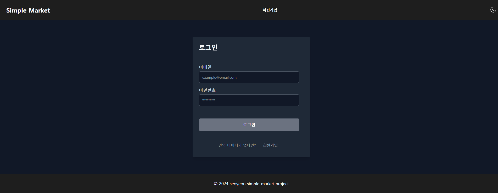

# simple-market 프로젝트
## 다크모드 만들기
### `useDarkMode` 파일 생성
```javascript
import { useState } from "react";

export const useDarkMode = () => {
  const [isDarkMode, setIsDarkMode] = useState(() => {
    const savedMode = localStorage.getItem("darkMode");
    return savedMode === "true";
  });

  const toggleDarkMode = () => {
    setIsDarkMode((prevMode) => {
      const newMode = !prevMode;
      localStorage.setItem("darkMode", newMode);
      return newMode;
    });
  };

  return { isDarkMode, toggleDarkMode };
};

```
### `tailwind.config.js` 수정
```javascript
module.exports = {
  content: ["./src/**/*.{js,jsx,ts,tsx}"],
  theme: {
    extend: {
      colors: {
        cyan: {
          50: "#e0f7fa",
          100: "#b2ebf2",
          200: "#80deea",
          300: "#4dd0e1",
          400: "#26c6da",
          500: "#00bcd4",
          600: "#00acc1",
          700: "#0097a7",
          800: "#00838f",
          900: "#006064",
        },
        dark: {
          background: "#121212",
          paper: "#1e1e1e",
          text: "#ffffff",
        },
        light: {
          background: "#ffffff",
          paper: "#f5f5f5",
          text: "#000000",
        },
      },
    },
  },
  darkMode: "class",
  plugins: [],
};
```
- 다크모드에서 적용할 색상 설정
- darkMode를 클래스로 지정
### `Layout`에 다크모드 추가
  
```javascript
const Layout = ({ children }) => {
  const { isDarkMode, toggleDarkMode } = useDarkMode();

  useEffect(() => {
    document.documentElement.classList.toggle("dark", isDarkMode);
  }, [isDarkMode]);

  return (
    <BrowserRouter>
      <Header toggleDarkMode={toggleDarkMode} isDarkMode={isDarkMode} />
      <main>{children}</main>
      <Footer isDarkMode={isDarkMode} />
    </BrowserRouter>
  );
};
```
- true/false 형식으로 localstorage에 다크모드 여부를 저장
- 브라우저를 껐다 다시 켜도 다크모드/라이트모드를 유지할 수 있도록
### 각 코드에 dark 추가
```javascript
<Button
          type="submit"
          className="mt-6 bg-cyan-600 text-white hover:bg-cyan-400 focus:outline-none focus:ring-2 focus:ring-cyan-300 rounded-md dark:bg-gray-500 dark:hover:bg-gray-400 dark:focus:ring-gray-400"
          fullWidth
        >
          상품 추가
        </Button>
```
