## 목차
- [Rest Template](#rest-template)
  - [특징](#특징)
    - [GET 방식](#get-방식)
    - [POST 방식](#post-방식)
  - [실습](#실습)
- [Google 로그인](#google-로그인)
  - [google cloud에서 앱 생성하기](#google-cloud에서-앱-생성하기)
    - [OAuth 동의 화면에서 앱 등록](#oauth-동의-화면에서-앱-등록)
    - [범위 설정](#범위-설정)
    - [OAuth Client ID 만들기](#oauth-client-id-만들기)
  - [React 코드 수정](#react-코드-수정)
  - [Java 코드 수정](#java-코드-수정)
    - [User Entity 수정](#user-entity-수정)
    - [`OAuthController` 생성](#oauthcontroller-생성)
    - [`OAuthServiceImpl`](#oauthserviceimpl)
  - [구글 로그인 확인](#구글-로그인-확인)
- [Kakao 로그인](#kakao-로그인)
  - [kakao develop에 앱 추가](#kakao-develop에-앱-추가)
    - [redirect URI 추가](#redirect-uri-추가)
    - [REST API key, 보안 키 설정](#rest-api-key-보안-키-설정)
  - [React 코드 수정](#react-코드-수정-1)
    - [`Login.jsx`에 카카오 추가](#loginjsx에-카카오-추가)
    - [`App.js`에 카카오 추가](#appjs에-카카오-추가)
- [소셜 로그인 리팩토링](#소셜-로그인-리팩토링)
  - [Java 코드 리팩토링](#java-코드-리팩토링)
    - [`application.yml` 파일에 oauth 관련 코드 추가](#applicationyml-파일에-oauth-관련-코드-추가)
    - [`OAuth2Properties` 파일 생성](#oauth2properties-파일-생성)
    - [`OAuthController` 수정](#oauthcontroller-수정)
    - [`OAuthServiceImpl` 수정](#oauthserviceimpl-수정)
  - [React 코드 리팩토링](#react-코드-리팩토링)
    - [`App.js` router 수정](#appjs-router-수정)
    - [`OAuthLogin.jsx` 파일 생성](#oauthloginjsx-파일-생성)


<br/>
<br/>
<br/>
<br/>

# Rest Template
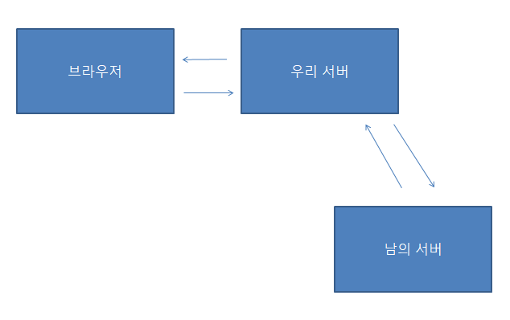
- Spring Framework에서 HTTP 요청을 보내는 클래스
- GET, POSt, PUT, PATCH, DELETE 모두 호출 가능하다.
- JSON, XML 등의 데이터로 쉽게 응답 받는다.
## 특징
### GET 방식
- `getForEntity` : GET 요청 후, 응답을 `ResponseEntity`로 반환
- `getForObject` : GET 요청 후, 응답을 원하는 객체로 반환
### POST 방식
- `postForEntity` : POST 요청 후, 응답을 `ResponseEntity`로 반환
- `postForObject` : POST 요청 후, 응답을 원하는 객체로 반환
## 실습
```java
	@GetMapping("/news/{id}")
	public ResponseEntity<String> getNewsById(@PathVariable("id") String id) {
		// RestTemplate 인스턴스 하나 생성
		RestTemplate rt = new RestTemplate();

		// header 인스턴스 생성
		HttpHeaders headers = new HttpHeaders();
		headers.add("Content-Type", "application/json; charset=utf-8");
		HttpEntity<String> httpEntity = new HttpEntity<String>(headers);

		// URL 주소 만들기
		String url = "https://jsonplaceholder.typicode.com/posts/" + id;

		try {
			// ResponseEntity<String> result = rt.getForEntity(url, String.class);
			ResponseEntity<String> result = rt.exchange(url, HttpMethod.GET, httpEntity, String.class);
			return result;
		} catch (Exception e) {
			return ResponseEntity.status(HttpStatus.INTERNAL_SERVER_ERROR).headers(headers).body("ERROR");
		}
	}
```
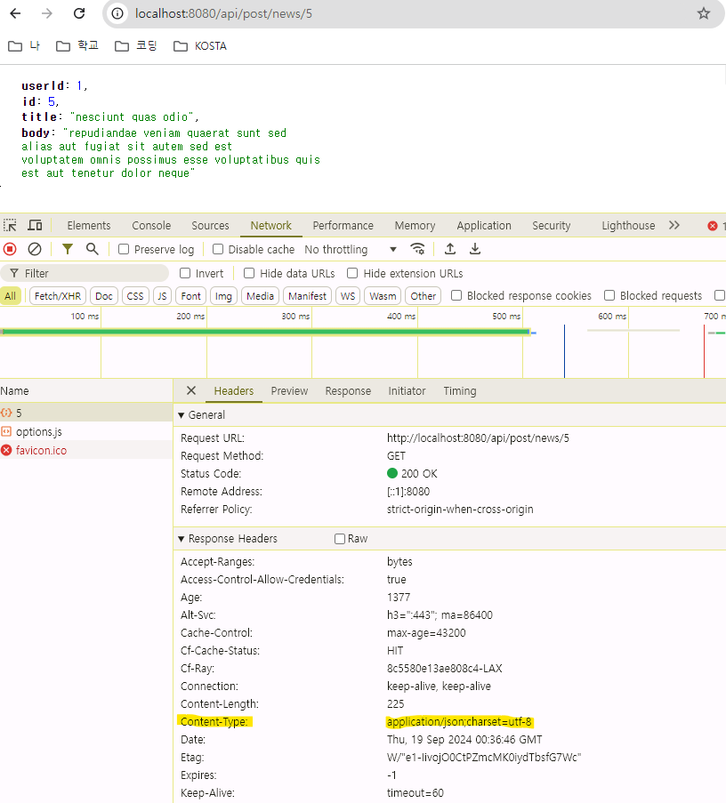

<br/>
<br/>
<br/>
<br/>

# Google 로그인
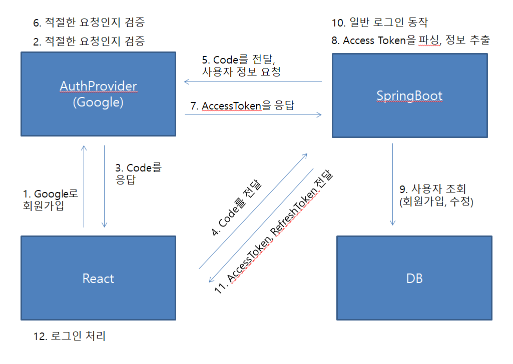
## google cloud에서 앱 생성하기
### OAuth 동의 화면에서 앱 등록
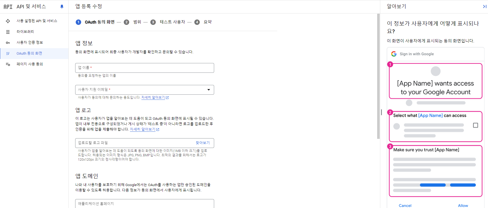
### 범위 설정
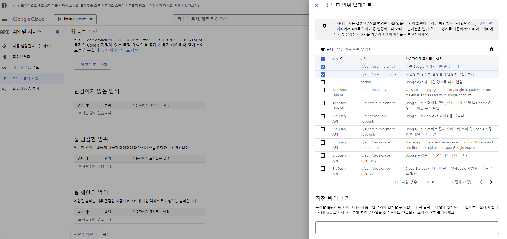
### OAuth Client ID 만들기
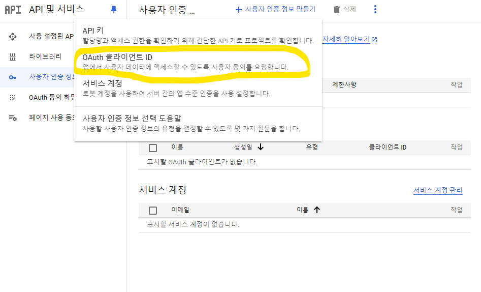
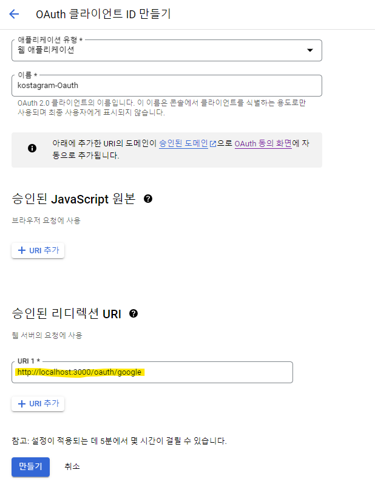
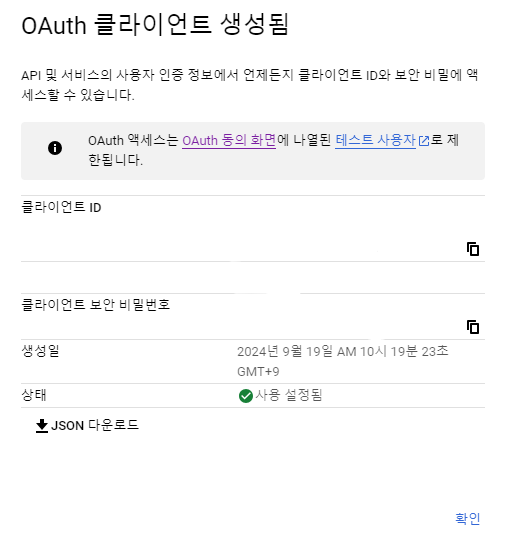

<br/>
<br/>

## React 코드 수정
```javascript
// Login.jsx

  const handleGoogleLogin = () => {
    // 구글 로그인 버튼 클릭 시 이동하는 경로 지정
    const params = new URLSearchParams({
      scope: "email profile",
      response_type: "code",
      redirect_uri: "http://localhost:3000/oauth/google",
      client_id:
        "690190545613-ad3vmju6rrpvcuu17dd929ck4ednkfcr.apps.googleusercontent.com",
    });
    const GOOGLE_URL = `https://accounts.google.com/o/oauth2/v2/auth?${params.toString()}`;

    // 지정한 경로로 이동
    window.location.href = GOOGLE_URL;
  };

  ...

          <Button fullWidth onClick={() => handleGoogleLogin()}>
          
        </Button>
```
```javascript
// App.js
<Route path="/oauth/google" element={<GoogleLogin />} />

...

const GoogleLogin = () => {
  const code = new URLSearchParams(window.location.search).get("code");
  //console.log(code);

  const login = async () => {
    try {
      const response = await oauthAPI.googleLogin(code);
      if (response.status !== 200) {
        throw new Error("로그인 실패");
      } else {
        setCookie("accessToken", response.data.accessToken, { path: "/" });
        window.location.href = "/";
      }
    } catch (error) {
      console.log(error);
    }
  };

  useEffect(() => {
    login();
  }, [code]);

  return <div>로그인 처리 중...</div>;
};
```

<br/>
<br/>

## Java 코드 수정
### User Entity 수정
```java
	// google login이 추가되면서 password가 필수가 아님
	@Column(nullable = true)
	private String password;

	@Column
	@Builder.Default
	private boolean oAuth = false;
```
### `OAuthController` 생성
```java
@RestController
@Slf4j
@RequestMapping("/api/oauth")
@RequiredArgsConstructor
public class OAuthController {
	private final OAuthService oAuthService;

	@GetMapping("/google")
	public ResponseEntity<?> googleSignIn(@RequestParam("code") final String code, HttpServletResponse res) {
		log.info("들어온 코드 값: {}", code);
		String accessToken = oAuthService.googleSignIn(code, res);
		// code를 통해 사용자 정보를 받아서
		// 사용자 정보 조회
		// 만약 기존에 있는 사람이라면 (oauth 값을 true로 변경)
		// 만약 기존에 없는 사람이라면 (새로 가입 >> DB 추가)
		// 사용자에 대한 정보로 accessToken, refreshToken 만들어서 반환

		if (accessToken == null) {
			return ResponseEntity.status(HttpStatus.UNAUTHORIZED).body(null);
		}

		LoginResponse loginResponse = LoginResponse.builder().accessToken(accessToken).build();
		return ResponseEntity.ok(loginResponse);
	}
}
```
### `OAuthServiceImpl`
```java
@Service
@RequiredArgsConstructor
public class OAuthServiceImpl implements OAuthService {
	private final UserRepository userRepository;
	private final TokenUtils tokenUtils;

	@Override
	public String googleSignIn(String code, HttpServletResponse res) {
		// 1. code를 통해 google에서 제공하는 accessToken 가져온다
		String providedAccessToken = getAccessToken(code);
		// 2. google에서 제공하는 accessToken으로 사용자 정보 추출
		User user = generateOAuthUser(providedAccessToken);

		// 3. DB에서 사용자 정보 조회
		user = userRepository.findByEmail(user.getEmail()).orElse(user);
		// 만약 기존에 있는 사람이라면 (OAuth 인증 여부에 따라 oauth 값을 true로 변경)
		// 만약 기존에 없는 사람이라면 (새로 가입 >> DB 추가)
		if (!user.isOAuth()) {
			user.setOAuth(true);
		}

		// 4. 자동 로그인 (사용자에 대한 정보로 accessToken, refreshToken 만들어서 반환)
		Map<String, String> tokenMap = tokenUtils.generateToken(user);
		user.setRefreshToken(tokenMap.get("refreshToken"));

		// DB에 저장
		userRepository.save(user);
		// HEADER에 refresh token 추가
		tokenUtils.setRefreshTokenCookie(res, tokenMap.get("refreshToken"));

		// BODY에 access token 추가
		return tokenMap.get("accessToken");
	}

	private String getAccessToken(String code) {
		// google에서 제공하는 accessToken 가져온다
		String decodedCode = URLDecoder.decode(code, StandardCharsets.UTF_8);

		// google에 사용자 정보 요청 (헤더에 넣어주기)
		HttpHeaders headers = new HttpHeaders();
		headers.setContentType(MediaType.APPLICATION_FORM_URLENCODED);
		String clientId = "690190545613-ad3vmju6rrpvcuu17dd929ck4ednkfcr.apps.googleusercontent.com";
		String clientSecret = "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";
		String redirectURI = "http://localhost:3000/oauth/google";
		headers.setBasicAuth(clientId, clientSecret);

		MultiValueMap<String, String> params = new LinkedMultiValueMap<String, String>();
		params.add("client_id", clientId);
		params.add("client_secret", clientSecret);
		params.add("code", decodedCode);
		params.add("grant_type", "authorization_code");
		params.add("redirect_uri", redirectURI);

		String tokenURI = "https://oauth2.googleapis.com/token";

		RestTemplate rt = new RestTemplate();
		HttpEntity<MultiValueMap<String, String>> requestEntity = new HttpEntity<>(params, headers);
		ResponseEntity<Map> responseEntity = rt.postForEntity(tokenURI, requestEntity, Map.class);

		// 조회 실패하거나 body가 null인 경우
		if (!responseEntity.getStatusCode().is2xxSuccessful() || responseEntity.getBody() == null) {
			throw new ResponseStatusException(HttpStatus.NOT_FOUND, "사용자 정보를 가져올 수 없음");
		}

		return (String) responseEntity.getBody().get("access_token");
	}

	private User generateOAuthUser(String accessToken) {
		String userInfoURI = "https://www.googleapis.com/oauth2/v3/userinfo";
		HttpHeaders headers = new HttpHeaders();
		headers.add("Authorization", "Bearer " + accessToken);

		RestTemplate rt = new RestTemplate();
		ResponseEntity<JsonNode> responseEntity = rt.exchange(userInfoURI, HttpMethod.GET, new HttpEntity<>(headers),
				JsonNode.class);

		// 조회 실패하거나 body가 null인 경우
		if (!responseEntity.getStatusCode().is2xxSuccessful() || responseEntity.getBody() == null) {
			throw new ResponseStatusException(HttpStatus.NOT_FOUND, "사용자 정보를 가져올 수 없음");
		}

		JsonNode jsonNode = responseEntity.getBody();
		String email = null;
		String name = null;

		User user = null;
		try {
			if (jsonNode.has("email") && jsonNode.has("name")) {
				email = jsonNode.get("email").asText();
				name = jsonNode.get("name").asText();
				user = User.builder().email(email).name(name).build();
			}
		} catch (RuntimeException e) {
			throw new RuntimeException("해당 사용자를 찾을 수 없습니다");
		}

		return user;
	}

}
```
## 구글 로그인 확인
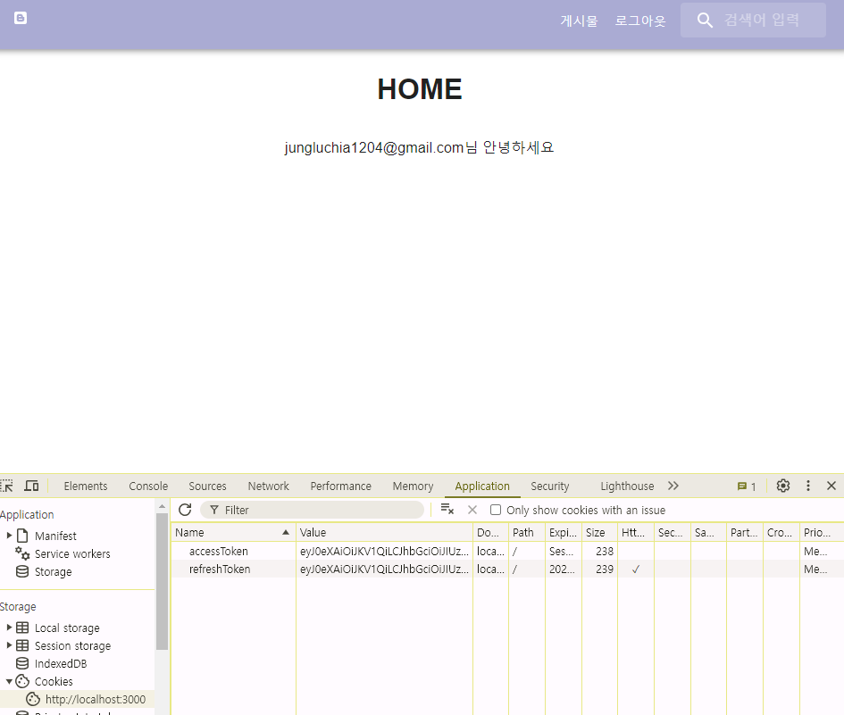

<br/>
<br/>
<br/>
<br/>

# Kakao 로그인
## kakao develop에 앱 추가
### redirect URI 추가
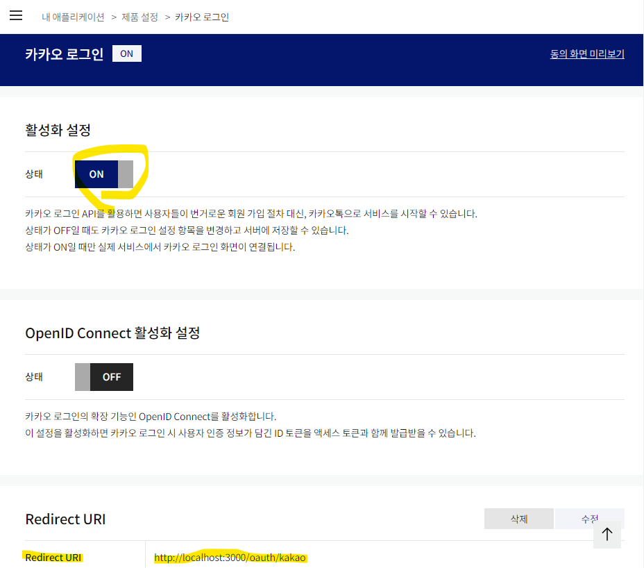
### REST API key, 보안 키 설정
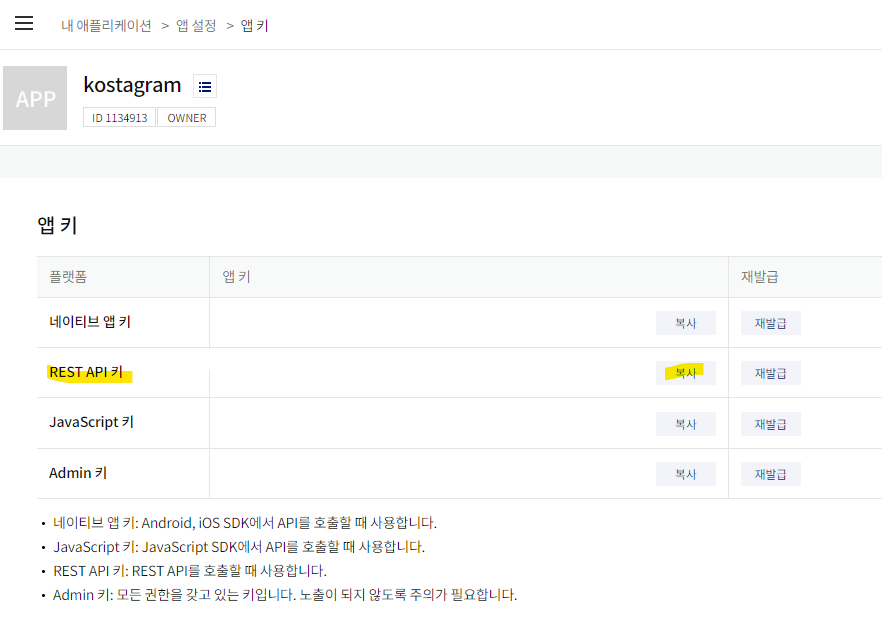
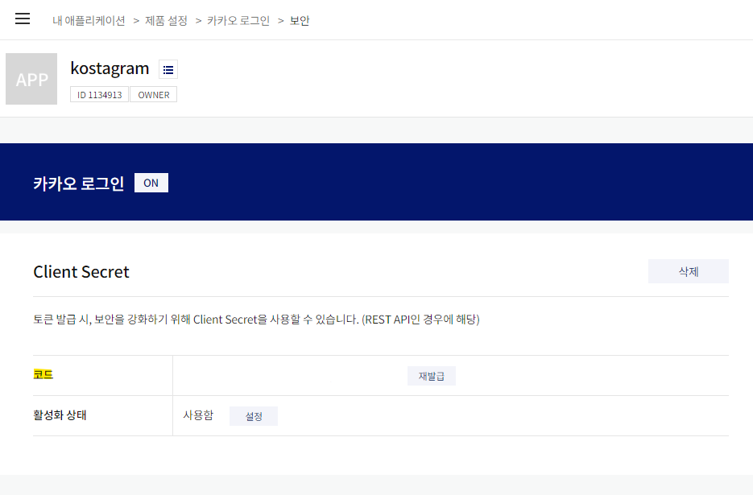
## React 코드 수정
### `Login.jsx`에 카카오 추가
```javascript
  const handleKakaoLogin = () => {
    const params = new URLSearchParams({
      response_type: "code",
      redirect_uri: process.env.REACT_APP_KAKAO_REDIRECT_URI,
      client_id: process.env.REACT_APP_KAKAO_ID,
    });

    const KAKAO_URL = `https://kauth.kakao.com/oauth/authorize?${params.toString()}`;

    // 지정한 경로로 이동
    window.location.href = KAKAO_URL;
  };

  ...

          <Button fullWidth onClick={() => handleKakaoLogin()}>
          
        </Button>
```
### `App.js`에 카카오 추가
```javascript
          <Route path="/oauth/kakao" element={<KakaoLogin />} />
          ...
          
const KakaoLogin = () => {
  const code = new URLSearchParams(window.location.search).get("code");

  const login = async () => {
    try {
      const response = await oauthAPI.kakaoLogin(code);
      if (response.status !== 200) {
        throw new Error("로그인 실패");
      } else {
        setCookie("accessToken", response.data.accessToken, { path: "/" });
        window.location.href = "/";
      }
    } catch (error) {
      console.log(error);
    }
  };

  useEffect(() => {
    login();
  }, [code]);

  return <div>로그인 처리 중...</div>;
};
```

<br/>
<br/>
<br/>
<br/>

# 소셜 로그인 리팩토링
## Java 코드 리팩토링
### `application.yml` 파일에 oauth 관련 코드 추가
```java
oauth2:
  clients:
    google:
        client-id: 
        client-secret: 
        redirect-uri: http://localhost:3000/oauth/google
        token-uri: https://oauth2.googleapis.com/token
        user-info-request-uri: https://www.googleapis.com/oauth2/v3/userinfo
    kakao:
        client-id:
        client-secret: 
        redirect-uri: http://localhost:3000/oauth/kakao
        token-uri: https://kauth.kakao.com/oauth/token
        user-info-request-uri: https://kapi.kakao.com/v2/user/me
```
### `OAuth2Properties` 파일 생성
```java
@Data
@Component
@ConfigurationProperties(prefix = "oauth2")
public class OAuth2Properties {
	private Map<String, Client> clients;

	@Data
	public static class Client {
		private String clientId;
		private String clientSecret;
		private String redirectUri;
		private String tokenUri;
		private String userInfoRequestUri;
	}

}
```
### `OAuthController` 수정
```java
@RestController
@Slf4j
@RequestMapping("/api/oauth")
@RequiredArgsConstructor
public class OAuthController {
	private final OAuthService oAuthService;

	@GetMapping("/{provider}")
	public ResponseEntity<?> googleSignIn(@RequestParam("code") final String code,
			@PathVariable("provider") final String provider, HttpServletResponse res) {
		log.info("들어온 코드 값: {}", code);
		log.info("provider: {}", provider);
		String accessToken = oAuthService.oAuthSingIn(code, provider, res);

		if (accessToken == null) {
			return ResponseEntity.status(HttpStatus.UNAUTHORIZED).body(null);
		}

		LoginResponse loginResponse = LoginResponse.builder().accessToken(accessToken).build();
		return ResponseEntity.ok(loginResponse);
	}
}
```
- 중복된 코드를 방지하기 위해 Path를 수정
- provider를 통해 `google`, `kakao` 등 다양한 OAuth Login을 할 수 있다.
### `OAuthServiceImpl` 수정
```java
@Service
@RequiredArgsConstructor
public class OAuthServiceImpl implements OAuthService {
	private final OAuth2Properties oAuth2Properties;
	private final UserRepository userRepository;
	private final TokenUtils tokenUtils;

	@Override
	public String oAuthSingIn(String code, String provider, HttpServletResponse res) {
		// 1. code를 통해 provider에서 제공하는 accessToken 가져온다
		String providedAccessToken = getAccessToken(code, provider);
		// 2. provider에서 제공하는 accessToken으로 사용자 정보 추출
		User user = generateOAuthUser(providedAccessToken, provider);

		// 3. DB에서 사용자 정보 조회
		user = userRepository.findByEmail(user.getEmail()).orElse(user);
		// 만약 기존에 있는 사람이라면 (OAuth 인증 여부에 따라 oauth 값을 true로 변경)
		// 만약 기존에 없는 사람이라면 (새로 가입 >> DB 추가)
		if (!user.isOAuth()) {
			user.setOAuth(true);
		}

		// 4. 자동 로그인 (사용자에 대한 정보로 accessToken, refreshToken 만들어서 반환)
		Map<String, String> tokenMap = tokenUtils.generateToken(user);
		user.setRefreshToken(tokenMap.get("refreshToken"));

		// DB에 저장
		userRepository.save(user);
		// HEADER에 refresh token 추가
		tokenUtils.setRefreshTokenCookie(res, tokenMap.get("refreshToken"));

		// BODY에 access token 추가
		return tokenMap.get("accessToken");
	}

	private String getAccessToken(String code, String provider) {
		// 설정 가져오기
		Map<String, Client> clients = oAuth2Properties.getClients();
		System.out.println(clients);
		OAuth2Properties.Client client = clients.get(provider);

		// provider에서 제공하는 accessToken 가져온다
		String decodedCode = URLDecoder.decode(code, StandardCharsets.UTF_8);

		// provider에 사용자 정보 요청 (헤더에 넣어주기)
		HttpHeaders headers = new HttpHeaders();
		headers.setContentType(MediaType.APPLICATION_FORM_URLENCODED);
		headers.setBasicAuth(client.getClientId(), client.getClientSecret());

		MultiValueMap<String, String> params = new LinkedMultiValueMap<String, String>();
		params.add("client_id", client.getClientId());
		params.add("client_secret", client.getClientSecret());
		params.add("code", decodedCode);
		params.add("grant_type", "authorization_code");
		params.add("redirect_uri", client.getRedirectUri());

		RestTemplate rt = new RestTemplate();
		HttpEntity<MultiValueMap<String, String>> requestEntity = new HttpEntity<>(params, headers);
		ResponseEntity<Map> responseEntity = rt.postForEntity(client.getTokenUri(), requestEntity, Map.class);

		// 조회 실패하거나 body가 null인 경우
		if (!responseEntity.getStatusCode().is2xxSuccessful() || responseEntity.getBody() == null) {
			throw new ResponseStatusException(HttpStatus.NOT_FOUND, "사용자 정보를 가져올 수 없음");
		}

		return (String) responseEntity.getBody().get("access_token");
	}

	private User generateOAuthUser(String accessToken, String provider) {
		// 설정 가져오기
		OAuth2Properties.Client client = oAuth2Properties.getClients().get(provider);

		HttpHeaders headers = new HttpHeaders();
		headers.add("Authorization", "Bearer " + accessToken);

		RestTemplate rt = new RestTemplate();
		ResponseEntity<JsonNode> responseEntity = rt.exchange(client.getUserInfoRequestUri(), HttpMethod.GET,
				new HttpEntity<>(headers), JsonNode.class);

		// 조회 실패하거나 body가 null인 경우
		if (!responseEntity.getStatusCode().is2xxSuccessful() || responseEntity.getBody() == null) {
			throw new ResponseStatusException(HttpStatus.NOT_FOUND, "사용자 정보를 가져올 수 없음");
		}

		JsonNode jsonNode = responseEntity.getBody();
		System.out.println(jsonNode);

		String email = null;
		String name = null;
		User user = null;

		try {
			if (jsonNode.has("email") && jsonNode.has("name")) {
				email = jsonNode.get("email").asText();
				name = jsonNode.get("name").asText();
				user = User.builder().email(email).name(name).build();
			} else if (jsonNode.has("id") && jsonNode.has("properties")) {
				// kakao login에서는 email을 제공하지 않는다
				email = jsonNode.get("id").asText() + "@kakao.com"; // 임의로 email 지정
				name = jsonNode.get("properties").get("nickname").asText();
			}
			user = User.builder().email(email).name(name).build();
		} catch (RuntimeException e) {
			throw new RuntimeException("해당 사용자를 찾을 수 없습니다");
		}

		return user;
	}

}
```

<br/>
<br/>

## React 코드 리팩토링
### `App.js` router 수정
```javascript
<Route path="/oauth/:provider" element={<OAuthLogin />} />
```
### `OAuthLogin.jsx` 파일 생성
```javascript
const OAuthLogin = () => {
  const { provider } = useParams();
  const code = new URLSearchParams(window.location.search).get("code");
  console.log("서버에 전달해야 하는 코드 값 : ", code);

  const oAuthAPI = {
    kakao: (code) => oauthAPI.kakaoLogin(code),
    google: (code) => oauthAPI.googleLogin(code),
  };

  const login = async () => {
    try {
      const response = await oAuthAPI[provider](code);
      if (response.status !== 200) {
        throw new Error("로그인 실패");
      } else {
        setCookie("accessToken", response.data.accessToken, { path: "/" });
        window.location.href = "/";
      }
    } catch (error) {
      console.error(error);
    }
  };

  useEffect(() => {
    login();
  }, [code]);

  return <div>login loading...</div>;
};

export default OAuthLogin;
```