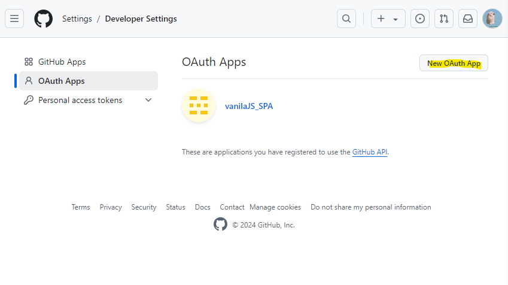
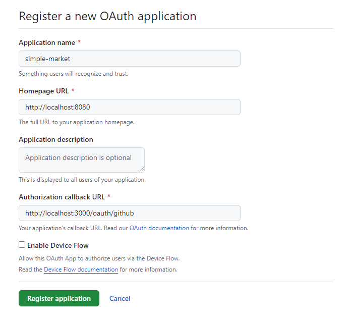
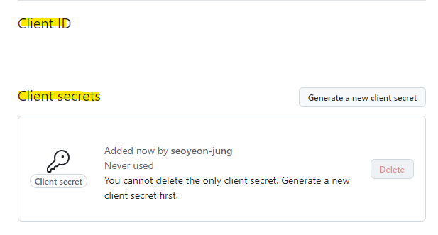

## 목차
- [Github 로그인 추가](#github-로그인-추가)
  - [Github Apps 추가](#github-apps-추가)
  - [React 코드 수정](#react-코드-수정)
    - [SocialLogin.jsx](#socialloginjsx)
    - [oauthApi.js](#oauthapijs)
    - [OAuthLongin.jsx](#oauthlonginjsx)
- [soft delete 구현해보기](#soft-delete-구현해보기)
  - [product entity 수정](#product-entity-수정)
  - [repository 수정](#repository-수정)
  - [service 수정](#service-수정)

<br/>
<br/>
<br/>
<br/>

# Github 로그인 추가
## Github Apps 추가
- Settings > Developer Settings > OAuth Apps







## React 코드 수정
### SocialLogin.jsx
```javascript
  const handleGithubLogin = () => {
    const params = new URLSearchParams({
      client_id: process.env.REACT_APP_GITHUB_ID,
      redirect_uri: process.env.REACT_APP_GITHUB_REDIRECT_URI,
      scope: "read:user user:email",
      response_type: "code",
    });

    const GITHUB_URL = `https://github.com/login/oauth/authorize?${params.toString()}`;
    window.location.href = GITHUB_URL;
  };

        <Button
        type="button"
        className="flex items-center justify-center bg-gray-400 text-white rounded-md shadow hover:bg-gray-500"
        onClick={handleGithubLogin}
        fullWidth
      >
        <div className="flex items-center">
          
          <span>깃허브로 로그인</span>
        </div>
      </Button>
```
### oauthApi.js
```javascript
export const oauthAPI = {
  googleLogin: (code) => api.get(`/oauth/google?code=${code}`),
  kakaoLogin: (code) => api.get(`/oauth/kakao?code=${code}`),
  githubLogin: (code) => api.get(`/oauth/github?code=${code}`),
};
```
### OAuthLongin.jsx
```javascript
  const oAuthAPI = {
    kakao: (code) => oauthAPI.kakaoLogin(code),
    google: (code) => oauthAPI.googleLogin(code),
    github: (code) => oauthAPI.githubLogin(code),
  };
```

<br/>
<br/>
<br/>
<br/>

# soft delete 구현해보기
## product entity 수정
- delete 여부를 알기 위해 boolean 타입으로 column 추가
```java
	@Column(name = "is_delete", nullable = false)
	@Builder.Default
	private boolean isDeleted = Boolean.FALSE; // 삭제 여부 기본값 false
```
## repository 수정
- delete가 true인 경우를 제외하고 조회하기 위해 `findAllActiveProducts` 추가
- delete가 true인 경우를 제외하고 product를 찾기 위해 `findActiveProductById` 메서드 추가
```java
@Repository
public interface ProductRepository extends JpaRepository<Product, Long> {

	@Query("SELECT p FROM Product p WHERE p.isDeleted = false")
	List<Product> findAllActiveProducts();

	default Optional<Product> findActiveProductById(Long id) {
		return findById(id).filter(p -> !p.isDeleted());
	}
}
```
## service 수정
- 상품 조회할 때 `findAllActiveProducts`를 통해 조회하도록 수정
- 상품 삭제할 때 delete 여부를 true로 변경해서 저장하도록 수정
```java
@Service
@RequiredArgsConstructor
public class ProductServiceImpl implements ProductService {
	private final ProductRepository productRepository;

	// 상품 등록
	@Override
	public ProductResponse uploadProduct(ProductRequest productRequest) {
		Product product = productRequest.toEntity();
		Product savedProduct = productRepository.save(product);

		ProductResponse result = ProductResponse.toDTO(savedProduct);
		return result;
	}

	// 상품 전체 조회
	@Override
	public List<ProductResponse> getAllProduct() throws Exception {
		return productRepository.findAllActiveProducts().stream().map(ProductResponse::toDTO)
				.collect(Collectors.toList());
	}

	// 상품 조회
	@Override
	public ProductResponse getProductById(Long id) throws Exception {
		Product product = productRepository.findActiveProductById(id)
				.orElseThrow(() -> new Exception("해당 상품을 찾을 수 없음"));

		return ProductResponse.toDTO(product);
	}

	// 상품 삭제
	@Override
	public ProductResponse deleteProduct(Long id) throws Exception {
		Product product = productRepository.findActiveProductById(id)
				.orElseThrow(() -> new Exception("해당 상품을 찾을 수 없음"));

		product.setDeleted(true);
		Product updatedProduct = productRepository.save(product);

		return ProductResponse.toDTO(updatedProduct);
	}

	// 상품 수정
	@Override
	public ProductResponse updateProduct(ProductEdit productEdit) throws Exception {
		Product product = productRepository.findActiveProductById(productEdit.getId())
				.orElseThrow(() -> new Exception("해당 상품을 찾을 수 없음"));

		if (!product.getName().equals(productEdit.getName())) {
			product.setName(productEdit.getName());
		}
		if (product.getPrice() != (productEdit.getPrice())) {
			product.setPrice(productEdit.getPrice());
		}

		Product updatedProduct = productRepository.save(product);

		return ProductResponse.toDTO(updatedProduct);
	}
}
```