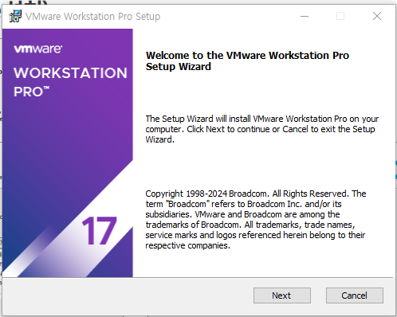
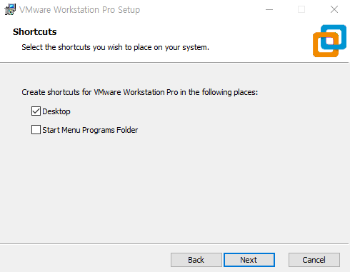
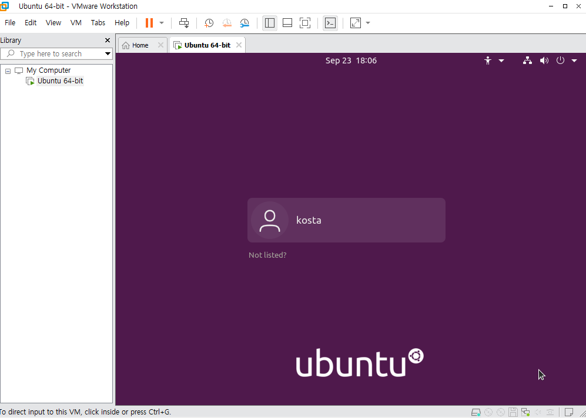
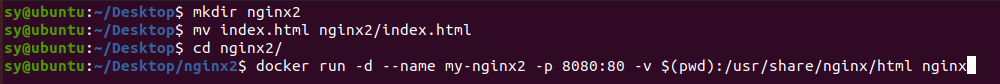
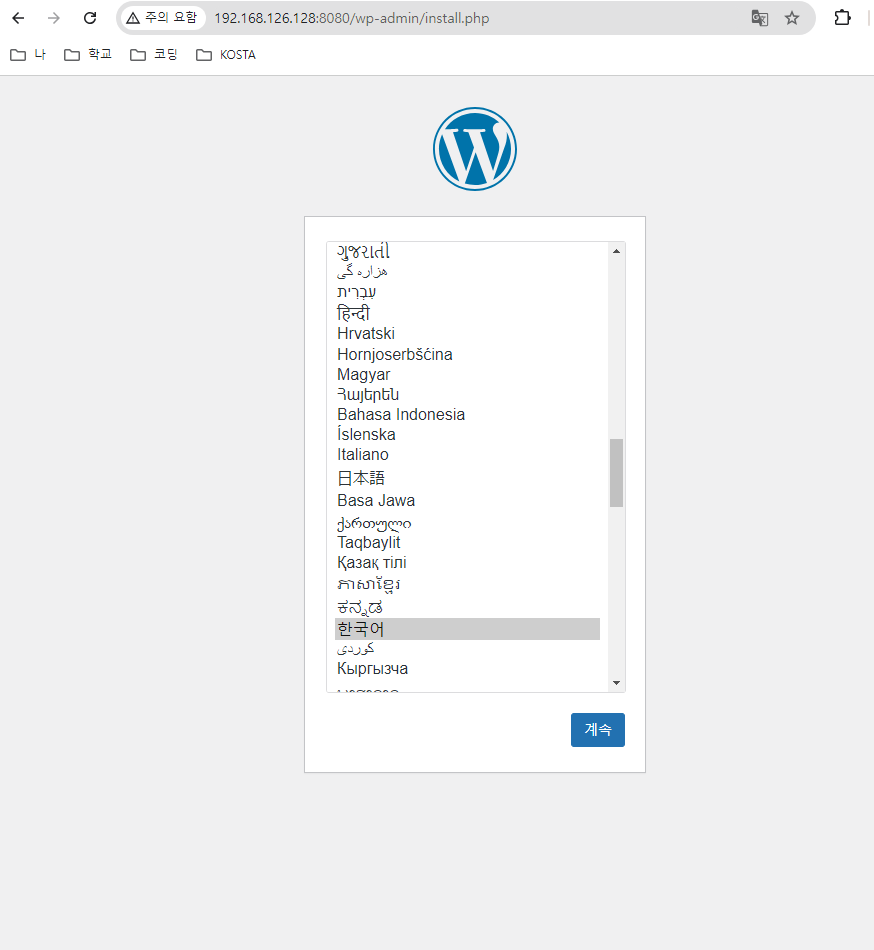
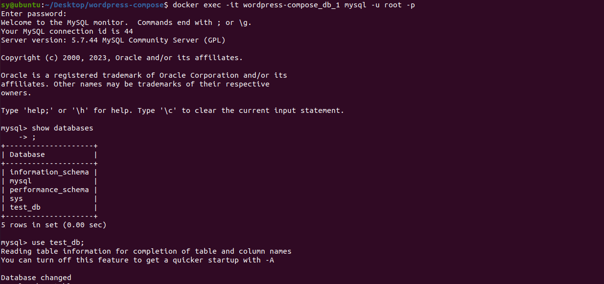
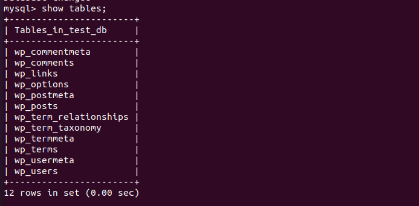
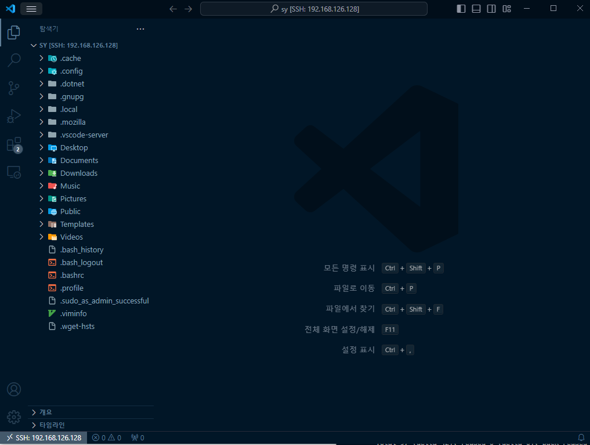

## 목차
- [컨테이너](#컨테이너)
- [실습 환경 구성](#실습-환경-구성)
  - [가상화 사용 설정](#가상화-사용-설정)
  - [VM Ware 다운로드](#vm-ware-다운로드)
  - [VM Ware 설치](#vm-ware-설치)
  - [VM Ware 실행](#vm-ware-실행)
  - [운영체제 다운로드](#운영체제-다운로드)
  - [가상머신 생성](#가상머신-생성)
- [운영체제 최초 설정](#운영체제-최초-설정)
  - [날짜, 시간 설정](#날짜-시간-설정)
  - [가상머신 사용 단축키](#가상머신-사용-단축키)
- [도커 및 필요 소프트웨어 설치](#도커-및-필요-소프트웨어-설치)
  - [Docker's official GPG key 설정](#dockers-official-gpg-key-설정)
    - [update](#update)
    - [vim 설치](#vim-설치)
    - [CURL 설치](#curl-설치)
    - [필요한 것들 설치](#필요한-것들-설치)
    - [`/etc/apt/keyrings` 폴더 생성](#etcaptkeyrings-폴더-생성)
    - [key 다운로드](#key-다운로드)
    - [파일 권한 설정](#파일-권한-설정)
    - [Add the repository to Apt sources](#add-the-repository-to-apt-sources)
  - [Docker compose 설치](#docker-compose-설치)
  - [도커 세팅](#도커-세팅)
- [Docker 기초 실습](#docker-기초-실습)
  - [컨테이너 실행](#컨테이너-실행)
- [Docker 이미지 검색 및 다운로드](#docker-이미지-검색-및-다운로드)
  - [이미지 검색](#이미지-검색)
  - [이미지 다운로드](#이미지-다운로드)
  - [이미지 확인](#이미지-확인)
- [컨테이너 실행 및 기본 조작](#컨테이너-실행-및-기본-조작)
  - [Nginx 컨테이너 실행](#nginx-컨테이너-실행)
  - [docker 정지 및 시작](#docker-정지-및-시작)
    - [컨테이너 정지](#컨테이너-정지)
    - [컨테이너 시작](#컨테이너-시작)
- [외부에서 컨테이너 접속하기](#외부에서-컨테이너-접속하기)
- [Nginx 컨테이너에 HTML 파일 넣어 실행하기](#nginx-컨테이너에-html-파일-넣어-실행하기)
  - [index.html 파일 생성](#indexhtml-파일-생성)
  - [nginx 컨테이너 실행](#nginx-컨테이너-실행-1)
  - [명령어 정리](#명령어-정리)
- [Dockerfile을 사용한 이미지 생성](#dockerfile을-사용한-이미지-생성)
  - [프로젝트 폴더 생성 후 index.html, Dockerfile 준비](#프로젝트-폴더-생성-후-indexhtml-dockerfile-준비)
    - [Dockerfile 생성](#dockerfile-생성)
    - [image 가져오기](#image-가져오기)
  - [Docker 실행](#docker-실행)
  - [Docker 삭제](#docker-삭제)
- [Docker Compose 실습](#docker-compose-실습)
  - [폴더 생성](#폴더-생성)
  - [docker-compose.yml 생성](#docker-composeyml-생성)
  - [실행](#실행)
  - [워드 프레스 설치](#워드-프레스-설치)
  - [mysql 확인](#mysql-확인)
- [가상머신에서 리액트 프로젝트 띄워보기](#가상머신에서-리액트-프로젝트-띄워보기)
  - [openssh-server 설치](#openssh-server-설치)
  - [vscode에서 ssh로 원격 연결](#vscode에서-ssh로-원격-연결)
    - [원격 연결된 vscode 확인](#원격-연결된-vscode-확인)
  - [기존에 있던 react 프로젝트 복사](#기존에-있던-react-프로젝트-복사)
  - [nginx.conf 파일 생성](#nginxconf-파일-생성)
  - [Dockerfile 생성](#dockerfile-생성-1)
  - [build 하기](#build-하기)
  - [컨테이너 실행](#컨테이너-실행-1)
  - [프로젝트 확인](#프로젝트-확인)

<br/>
<br/>
<br/>
<br/>

# 컨테이너
- 소프트웨어는 운영체제와 라이브러리에 의존성을 띈다.
- 따라서 하나의 컴퓨터에서 성격(운영체제,  라이브러리 버전)이 다른 소프트웨어를 실행할 때 어려움이 있을 수 있고, 관련된 구성도 어렵다.
- 컨테이너는 개별 소프트웨어가 실행되기 위한 환경을 독립적으로 운용할 수 있도록 해주는 운영체계 수준의 격리 기술을 의미한다.
- 즉, 소프트웨어의 컨테이너는 애플리케이션을 동작시키기 위해 필요한 환경을 제공하여,
  - 의존성 충돌의 문제를 해소하고,
  - 개발 환경과 배포 환경의 괴리를 없애며,
  - 수평적 확장을 용이하게 해주는 장점이 있는 기술이다.

---
- 컨테이너는 리눅서 커널의 기능을 바탕으로 만들어졌다.
- Windows 기반에서 컨테이너를 동작시키기 위해서는 Hypervisor를 활성화시켜 리눅스 커널의 기능을 지원할 수 있어야 한다.
- 따라서 VMware(Virtual Machine) 을 설치해서 실습할 예정이다.

<br/>
<br/>
<br/>
<br/>

# 실습 환경 구성
## 가상화 사용 설정

## VM Ware 다운로드
- [Braodcom 홈페이지](https://profile.broadcom.com/web/registration)에서 가입
- [`Vmware Workstation Pro`](https://support.broadcom.com/group/ecx/productdownloads?subfamily=VMware+Workstation+Pro) 다운로드 (Personal User 선택하기)


## VM Ware 설치






## VM Ware 실행


## 운영체제 다운로드
- Ubuntu 20.04.6 LTS (Focal Fossa)
- https://releases.ubuntu.com/focal/


## 가상머신 생성


- 컴퓨터 이름, user name 설정





<br/>
<br/>
<br/>
<br/>

# 운영체제 최초 설정
## 날짜, 시간 설정


## 가상머신 사용 단축키
- `Ctrl + Alt` : 화면 전환
- `Ctrl + Alt + F2` : GUI 모드
- `Ctrl + Alt + F3` : CLI 모드
- `Ctrl + Alt + Enter` : 전체 화면 모드 전환
  
<br/>
<br/>
<br/>
<br/>

# 도커 및 필요 소프트웨어 설치
- 참고: https://docs.docker.com/engine/install/ubuntu/

## Docker's official GPG key 설정

### update
```
sudo apt-get update
```


### vim 설치
```
sudo apt-get vim
```


### CURL 설치
- curl : command line 용 data transfer tool
- download / upload 모두 가능하다
- HTTP / HTTPS / FTP / LDAP / SCP / TELNET / SMTP / POP3 등 주요 프로토콜을 지원한다.
- LINUX / UNIX 계열 및 Windows 등 주요한 OS에서 구동되므로 여러 플랫폼과 OS에서 유용하게 사용할 수 있다.
- libcurl 이라는 C 기반의 library가 제공되므로 C / C++ 프로 그램 개발시 위의 protocol과 연계가 필요하다면 libcurl을 손쉽게 연계할 수 있다.
- libcurl은 PHP, RUBY, PERL 및 여러 언어에 바인딩 되어 있으므로 사용하는 언어나 개발 환경에 맞게 libcurl을 사용할 수 있다.

```
sudo apt-get install -y curl
```

### 필요한 것들 설치
- ca-certificates : 인증서 관리 패키지
- git
- openjdk-17-jre-headless
```
sudo apt-get install -y ca-certificates git openjdk-17-jre-headless
```
### `/etc/apt/keyrings` 폴더 생성
```
sudo install -m 0755 -d /etc/apt/keyrings
```
- `/etc/apt/keyrings` 폴더 생성 후 `0755` 권한 설정
- 0755 : 접근 권한 설정
  - 7 : rwx (소유자 접근 권한)
  - 5 : r-x (그룹 소유자 접근 권한)
  - 5 : r-x (기타 사용자 접근 권한)


### key 다운로드
```
sudo curl -fsSL https://download.docker.com/linux/ubuntu/gpg -o /etc/apt/keyrings/docker.asc
```
- 도커 패키지의 출처를 인증하는데 사용되는 key를 다운로드 받는 것
- 다운로드 후 `/etc/apt/keyrings`에 추가


### 파일 권한 설정
```
sudo chmod a+r /etc/apt/keyrings/docker.asc
```
- `a` : 모든 사용자
- `+` : 기존 권한에 권한 추가
- `r` : 읽기 권한


### Add the repository to Apt sources
```
echo \
  "deb [arch=$(dpkg --print-architecture) signed-by=/etc/apt/keyrings/docker.asc] https://download.docker.com/linux/ubuntu \
  $(. /etc/os-release && echo "$VERSION_CODENAME") stable" | \
  sudo tee /etc/apt/sources.list.d/docker.list > /dev/null
```
- Docker의 APT 저장소 정보를 포함한 문자열 출력
- `deb [...] https://download.docker.com/linux/ubuntu [...] stable`
  - `deb` : APT 패키지 형식을 나타냅니다.
  - `[arch=$(dpkg --print-architecture) signed-by=/etc/apt/keyrings/docker.asc]`: 현재 시스템의 아키텍처를 가져오고, Docker의 서명키가 저장된 위치를 지정합니다.
  - `https://download.docker.com/linux/ubuntu`: Docker의 Ubuntu용 패키지 저장소 URL입니다.
  - `$(. /etc/os-release && echo "$VERSION_CODENAME")`: 현재 Ubuntu 버전의 코드네임(예: focal, jammy)을 가져옵니다.
  - `stable`: 안정된 버전의 패키지를 설치하도록 설정합니다.
- `| sudo tee /etc/apt/sources.list.d/docker.list > /dev/null`:
  - `|`: 파이프 연산자로, 앞의 출력 결과를 뒤의 명령어로 전달합니다.
  - `sudo tee /etc/apt/sources.list.d/docker.list`: 위에서 생성한 저장소 정보를 /etc/apt/sources.list.d/docker.list 파일에 기록합니다. sudo는 관리자 권한으로 실행합니다.
  - `> /dev/null`: 출력 결과를 화면에 보이지 않게 합니다.


- 패키지 목록 다시 업데이트
```
sudo apt-get update
```


## Docker compose 설치
```
 sudo apt-get install docker-compose
 ```
 - 도커 컴포즈 : 단일 서버에서 여러 개의 컨테이너를 하나의 서비스로 정의해 컨테이너의 묶음으로 관리할 수 있는 작업 환경을 제공하는 관리 도구
## 도커 세팅
```
sudo usermod -aG docker $USER
```
- root 권한 없이도 docker를 사용할 수 있도록 권한 수정
- `-aG` : 사용자를 그룹에 추가하되 기존 그룹은 제거하지 않도록 설정
- `$USER` : 현재 사용자의 이름을 자동으로 가져오기
```
newgrp docker
```
- 현재 셸 세션의 그룹을 'docker'로 변경
- 재로그인 하지 않고도 명령어 사용할 수 있도록 설정


<br/>
<br/>
<br/>
<br/>

# Docker 기초 실습
- docker version 확인

- docker info : Docker의 상세 정보 확인

- docker -help : 사용할 수 있는 명령어 목록 확인


## 컨테이너 실행
```
docker run hello-world
```
- `hello-world` 이미지를 통해 Docker가 제대로 작동하는지 확인
  -`hello-world`: Docker 테스트 이미지
- 해당 이미지를 다운로드 받고, 컨테이너에서 해당 이미지를 실행시킨다.
- 컨테이너가 실행이 되면, 확인 메세지가 출력되고 컨테이너가 종료된다.


- `docker ps`는 항상 실행되는 컨테이너만 보여준다
- 컨테이너가 실행되고 종료되었기에 나오지 않는다.


- `docker ps -a`를 실행하면 컨테이너를 확인할 수 있다.


- `docker rm [컨테이너 ID]` : 컨테이너를 삭제할 수 있다
- ID는 다 쓰지 않고 네 자리만 적어도 삭제가 가능하다.
- 컨테이너명으로 삭제해도 된다.


- `docker rmi` : 이미지를 삭제한다
- 이미지명이나 ID로 삭제 가능하다.


<br/>
<br/>
<br/>
<br/>

# Docker 이미지 검색 및 다운로드
- Docker Hub는 다양한 Docker 이미지를 제공하는 중앙 저장소로 원하는 이미지를 검색해서 Docker Hub에 해당 이미지가 있는지 확인할 수 있다.

## 이미지 검색
```
docker search nginx
```


- [Docker Hub](https://hub.docker.com/search?q=nginx)에서 nginx를 검색한 결과와 동일하다

## 이미지 다운로드
```
docker pull nginx
```

- 로컬 시스템에 자동으로 다운로드하는 명령어
## 이미지 확인
```
docker images
```


<br/>
<br/>
<br/>
<br/>

# 컨테이너 실행 및 기본 조작
## Nginx 컨테이너 실행
```
docker run -d --name my-nginx -p 8080:80 nginx
```
- `docker run`: 새로운 컨테이너를 생성하고 실행하는 명령어
- `-d`: 
  - 컨테이너를 백그라운드(detached) 모드로 실행
  - 터미널을 계속 사용할 수 있다.
- `--name my-nginx`
  - 컨테이너 이름을 my-nginx로 지정. 
  - 이 이름으로 컨테이너를 관리할 수 있다.
- `-p 8080:80`
  - 호스트의 8080 포트를 컨테이너의 80 포트로 매핑. 
  - localhost:8080으로 Nginx 서버에 접근할 수 있게 된다.
- `nginx`: 사용할 이미지를 지정.

<br/>


- `docker ps`: 현재 실행중인 컨테이너 목록 확인

<br/>


- `localhost:8080` 접속 시 연결 확인 가능
## docker 정지 및 시작
### 컨테이너 정지
```
docker stop my-nginx
```


### 컨테이너 시작
```
docker start my-nginx
```

<br/>
<br/>
<br/>
<br/>

# 외부에서 컨테이너 접속하기

- `ip addr` 명령어를 통해 IP 주소를 확인한 다음 외부에서도 접속 가능하다.

<br/>
<br/>
<br/>
<br/>

# Nginx 컨테이너에 HTML 파일 넣어 실행하기
## index.html 파일 생성
- `vim index.html` 명령어 입력 후 html 코드 붙여넣기


## nginx 컨테이너 실행

- nginx 컨테이너를 실행
- `-v` 옵션으로 호스트의 디렉토리를 컨테이너의 Nginx 기본 웹 서버 디렉토리(/usr/share/nginx/html)에 마운트


- 호스트 시스템에서 index.html 파일을 수정하면, 컨테이너 내부에서도 즉시 반영되니, 웹페이지를 새로고침해서 변경된 내용을 확인 가능
## 명령어 정리
- `docker ps` : 실행 중인 컨테이너 목록 확인
- `docker stop my-nginx2` : 컨테이너 정지
- `docker ps` : 현재 실행 중인 컨테이너 목록 확인
- `docker ps-a` : 모든 컨테이너 목록 확인
- `docker start my-nginx` : 컨테이너 다시 시작
- `docker logs my-nginx` : 컨테이너의 로그를 확인

  - `docker logs -f` : 실시간으로 로그 확인 가능
  - `docker logs --tail 10 my-nginx2` : 로그 끝의 10줄 확인 가능
- `docker exec -it my-nginx /bin/bash` : 컨테이너 내부로 접속해서 파일 시스템을 탐색
- `docker stop my-nginx` : 컨테이너를 정지
- `docker rm my-nginx` : 컨테이너 삭제

<br/>
<br/>
<br/>
<br/>

# Dockerfile을 사용한 이미지 생성
## 프로젝트 폴더 생성 후 index.html, Dockerfile 준비
```
mkdir docker-nginx
cd docker-nginx
echo "<h1>HELLO DOCKERFILE</h1>" > index.html
```
### Dockerfile 생성
```
vim Dockerfile
```


### image 가져오기
```
docker build -t my-image .
```
- `-t` : docker 이미지를 식별할 이름을 부여


## Docker 실행
```
docker run -d --name my-custom-nginx -p 8080:80 my-image
```

## Docker 삭제
```
docker stop my-custom-nginx [컨테이너를정지하고]
docker rm my-custom-nginx [컨테이너삭제]
docker rmimy-nginx-image [이미지삭제]
```

<br/>
<br/>
<br/>
<br/>

# Docker Compose 실습
## 폴더 생성
```
mkdir wordpress-compose
cd wordpress-compose/
```
## docker-compose.yml 생성
- 여러 파일을 한 번에 관리하기 위해 파일 생성
```
vim docker-compose.yml
```

## 실행
```
docker-compose up -d
```
- 모든 서비스를 백그라운드 모드로 실행



## 워드 프레스 설치


## mysql 확인





<br/>
<br/>
<br/>
<br/>

# 가상머신에서 리액트 프로젝트 띄워보기
## openssh-server 설치
```
sudo apt install -y openssh-server
```
```
sudo systemctl status ssh
``` 
리눅스 시스템에서 SSH (Secure Shell) 서비스의 현재 상태를 확인하는 데 사용

## vscode에서 ssh로 원격 연결


### 원격 연결된 vscode 확인


## 기존에 있던 react 프로젝트 복사

- `music_react` 폴더가 가상머신에 설치된 걸 확인할 수 있다.
## nginx.conf 파일 생성
```
vim nginx.conf
```

- 하나의 서버 설정을 정의
- `listen 80;` : 서버가 HTTP 요청을 받을 포트를 지정
- `server_name localhost;` : 로컬에서 접속할 도메인 이름을 localhost로 지정
- `root /usr/share/nginx/html;` : 웹 서버가 파일을 제공할 기본 디렉토리를 지정
- `index index.html` : 클라이언트가 디렉토리를 요청할 때 기본적으로 제공할 파일 지정
- `location / { ... }` : 루트 URL (/)에 대한 요청을 처리하는 블록. 이 설정은 모든 요청에 대해 적용된다.
- `try_files $uri $uri/ /index.html;`
  - 클라이언트가 요청한 URI를 기준으로 파일을 찾습니다.
  - `$uri`: 요청된 경로와 일치하는 파일이 있는지 확인합니다.
  - `$uri/`: 요청된 경로에 디렉토리가 있는지 확인합니다.
  - `/index.html`: 위의 두 가지가 모두 실패할 경우, 기본적으로 index.html 파일을 반환
- HTTP 포트 80에서 localhost 도메인으로 들어오는 요청을 처리하고, 기본 웹 페이지로 index.html 파일을 제공하도록 구성

## Dockerfile 생성
```
vim Dockerfile
```


1.  Node.js 이미지 사용 : `build`라는 이름으로 정의
2.  작업 디렉토리를 `/app`으로 설정 (이후 모든 명령은 이 디렉토리에서 실행)
3.  패키지 파일 복사
4.  `npm update`로 패키지를 최신 상태로 업데이트 한 후, `npm install`로 프로젝트에 필요한 모든 의존성 설치
5.  소스 코드를 컨테이너의 작업 디렉토리(`/app`)으로 복사
6. `npm run build` 명령어를 실행하여 애플리케이션을 빌드
7. nginx의 Alpine 기반 경량 이미지를 사용하여 새로운 레이어 정의
8. 로컬의 `nginx.conf` 파일을 NGINX의 설정 디렉토리로 복사
9. 기본 제공 HTML 파일 삭제 후 이전 단계에서 빌드한 정적 파일들을 /app/build에서 NGINX의 HTML 디렉토리(/usr/share/nginx/html)로 복사
10. 컨테이너가 80번 포트를 통해 요청을 받을 수 있도록 설정 
11. `daemon off;`는 NGINX가 백그라운드에서 실행되지 않도록 하여 Docker가 컨테이너를 지속적으로 실행할 수 있게 한다.
## build 하기
```
docker build -t music .
```
## 컨테이너 실행
```
docker run -d --name react-app -p 80:80 music
```


## 프로젝트 확인


