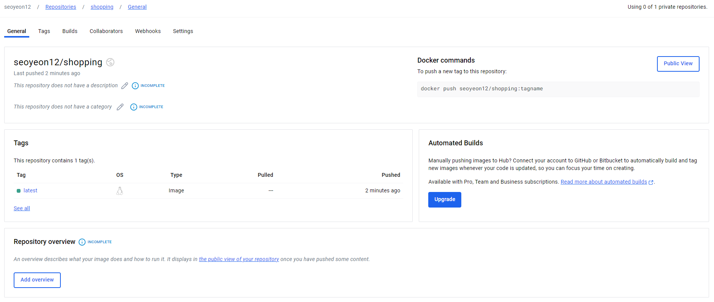

## 목차
- [react 프로젝트 띄워보기](#react-프로젝트-띄워보기)
  - [Dockerfile 파일 생성](#dockerfile-파일-생성)
  - [nginx.conf 파일 생성](#nginxconf-파일-생성)
  - [가상머신에서 pull 받아오기](#가상머신에서-pull-받아오기)
  - [dockerhub 회원가입](#dockerhub-회원가입)
    - [personal access token 생성](#personal-access-token-생성)
  - [가상머신에서 docker build](#가상머신에서-docker-build)
    - [docker에 로그인 하기](#docker에-로그인-하기)
    - [build](#build)
  - [가상머신에서 이미지 띄워주기](#가상머신에서-이미지-띄워주기)
    - [images 확인](#images-확인)
    - [실행](#실행)
- [가상머신에서 깃허브 세팅](#가상머신에서-깃허브-세팅)
- [Docker `<none>` 이미지 삭제](#docker-none-이미지-삭제)
  - [`<none>` 이미지 검색](#none-이미지-검색)
  - [이미지 삭제](#이미지-삭제)
- [java 프로젝트 띄워보기](#java-프로젝트-띄워보기)
  - [jar 파일 생성](#jar-파일-생성)
  - [Dockerfile 생성](#dockerfile-생성)
  - [build](#build-1)
  - [실행](#실행-1)
  - [mysql 설정](#mysql-설정)
  - [Docker network 생성](#docker-network-생성)
  - [다시 mysql-container, jpa-container 생성](#다시-mysql-container-jpa-container-생성)
- [docker compose 활용하기](#docker-compose-활용하기)
  - [`docker-compose.yml` 파일 생성](#docker-composeyml-파일-생성)
  - [빌드해보기](#빌드해보기)
- [rest 프로젝트 실습](#rest-프로젝트-실습)
  - [vscode에서 docker 관련 setting](#vscode에서-docker-관련-setting)
  - [빌드해보기](#빌드해보기-1)
  - [포스트맨으로 확인해보기](#포스트맨으로-확인해보기)
- [Docker 이미지 저장](#docker-이미지-저장)
  - [이미지명 변경](#이미지명-변경)
  - [Docker hub에 push](#docker-hub에-push)
  - [Docker hub 페이지에서 확인](#docker-hub-페이지에서-확인)
  - [다시 pull 받아와보기](#다시-pull-받아와보기)
- [도커 명령어를 통해서 제한할 수 있는 리소스](#도커-명령어를-통해서-제한할-수-있는-리소스)
  - [메모리 제한](#메모리-제한)
    - [예시](#예시)
    - [예시2](#예시2)
  - [파일의 읽기, 쓰기 속도 제한](#파일의-읽기-쓰기-속도-제한)
    - [읽기 작업 확인](#읽기-작업-확인)

<br/>
<br/>
<br/>
<br/>

# react 프로젝트 띄워보기
## Dockerfile 파일 생성
```
# Node 이미지
FROM node:20 AS build

# 컨테이너 내 작업 디렉토리 설정
WORKDIR /app

# package.json, package-lock.json 파일 복사
COPY package*.json ./

# 의존성 설치
RUN npm update
RUN npm install

# 모든 소스 코드를 컨테이너로 복사
COPY . .

# REACT 앱 빌드
RUN npm run build

# Nginx 이미지
FROM nginx:alpine

# Nginx 설정 파일 복사
COPY nginx.conf /etc/nginx/conf.d/default.conf

# Nginx 기본 파일 삭제
RUN rm -rf /usr/share/nginx/html/*

# 빌드 결과물을 Nginx 디렉토리로 복사
COPY --from=build /app/build /usr/share/nginx/html

# 포트를 외부로 노출
EXPOSE 80

# nginx 서버 실행
CMD [ "nginx", "-g", "daemon off;" ]
```
## nginx.conf 파일 생성
```
server {
    listen 80;
    server_name localhost;

    root /usr/share/nginx/html;
    index index.html;

    location / {
        try_files $uri $uri/ /index.html;
    }
}
```
## 가상머신에서 pull 받아오기
- 이미 깃허브에 repository를 만들었으므로 Dockerfile, ngix.conf 파일을 pull 받아오기
## dockerhub 회원가입
- 반복적으로 실습하는 경우, 오류가 생기면서 로그인이 되지 않으므로 dockerhub에 회원가입을 해야 한다.
### personal access token 생성


## 가상머신에서 docker build
### docker에 로그인 하기
```
docker login -u seoyeon12
```
### build
```
docker build -t music-image .
```
## 가상머신에서 이미지 띄워주기
### images 확인

### 실행
```
docker run -d --name music-container -p 80:80 music-image
```


<br/>
<br/>
<br/>
<br/>

# 가상머신에서 깃허브 세팅


<br/>
<br/>
<br/>
<br/>

# Docker `<none>` 이미지 삭제
## `<none>` 이미지 검색
```
docker images -q -f "dangling=true"
```
## 이미지 삭제
```
docker rmi $(docker images -f "dangling=true" -q)
```

<br/>
<br/>
<br/>
<br/>

# java 프로젝트 띄워보기
## jar 파일 생성
```
$ ./gradlew clean build -x test
```
```
./gradlew jar
```
## Dockerfile 생성
```
# gradle 이미지
FROM gradle:7.5.1-jdk17-alpine AS build

# 작업 디렉토리 설정
WORKDIR /app

# Gradle 파일만 복사
COPY build.gradle settings.gradle gradlew ./

# 프로젝트 파일 전체 복사
COPY . .

# gradlew 파일 실행 권한 부여
RUN chmod +x gradlew

# 빌드 실행 (테스트 제외)
RUN ./gradlew clean build -x test

# 런타임 oepnjdk 이미지
FROM openjdk:17-jdk-alpine

# 작업 디렉토리 설정
WORKDIR /app

# 빌드 단계에서 생성된 jar 파일을 복사
COPY --from=build /app/buld/libs/jpa_proj-0.0.1-SNAPSHOT.jar /app/app.jar

# 포트 노출
EXPOSE 8080

# 애플리케이션 실행
ENTRYPOINT [ "java", "-jar", "/app/app.jar" ]
```
## build
```
docker build -t jpa-image .
```

## 실행
```
docker run --name jpa-container -p 8080:8080 jpa-image
```

- mysql이 존재하지 않으므로 오류가 난다.
## mysql 설정
   

## Docker network 생성
```
docker network create jpa-network
```
- 두 컨테이너를 연결해주기 위한 네트워크 생성
- 컨테이너가 동일한 네트워크에 속해 있다면 서로의 이름으로 접근할 수 있다.
- 네트워크를 사용하면 애플리케이션의 각 구성 요소(예: 데이터베이스, 웹 서버 등)를 분리하고 관리하기 용이해진다.
## 다시 mysql-container, jpa-container 생성
```
docker run -d --name mysql-container -e MYSQL_ROOT_PASSWORD=1234 -e MYSQL_DATABASE=jpa_db -e MYSQL_USER=sy -p 3306:3306 -e TZ=Asia/Seoul --network jpa-network mysql
```
```
docker run -p 8080:8080 --name jpa-container -e SPRING_DATASOURCE_URL=jdbc:mysql://mysql-container:3306/jpa_db -e SPRING_DATASOURCE_USERNAME=root -e SPRING_DATASOURCE_PASSWORD=1234 --network jpa-network jpa-image
```


=> 제대로 실행된다.

<br/>
<br/>
<br/>
<br/>

# docker compose 활용하기
- Docker compose : 다수의 컨테이너를 일괄적으로 정의하고 실행하는 도구
- Docker-compose는 YAML 형태로 작성해서 Docker 명령으로 해석된다.
- 버전에 따라 문법이 다르다.
- mysql과 jpa 프로젝트를 동시에 생성하고 띄워보기 위해 docker-compose를 활용할 예정이다.
## `docker-compose.yml` 파일 생성
```
# Docker-compose : 다수의 컨테이너를 일괄적으로 정의하고 실행하는 도구
# Docker-compose는 YAML 형태로 작성해서 Docker 명령으로 해석된다.
# 버전에 따라 문법이 다르다. (불편한 점)

version: '3'
services:
  mysql:
    image: mysql:latest
    container_name: mysql-container
    environment:
      - MYSQL_ROOT_PASSWORD=1234
      - MYSQL_DATABASE=jpa_db
      - MYSQL_USER=sy
      - MYSQL_PASSWORD=1234
      - TZ=Asia/Seoul
    ports:
      - "3306:3306"
    networks:
      - jpa-network
  jpa-app:
    image: jpa-image
    container_name: jpa-container
    build:
      context: .
    ports:
      - "8080:8080"
    environment:
      - SPRING_DATASOURCE_URL=jdbc:mysql://mysql-container:3306/jpa_db
      - SPRING_DATASOURCE_USERNAME=root
      - SPRING_DATASOURCE_PASSWORD=1234
    networks:
      - jpa-network
    restart: always
networks:
  jpa-network:
    driver: bridge
```
## 빌드해보기
```
docker-compose up -d
```


<br/>
<br/>
<br/>
<br/>

# rest 프로젝트 실습
## vscode에서 docker 관련 setting
1. 프로젝트 필드
2. Dockerfile 생성
3. docker-compose.yml 생성
## 빌드해보기
```
docker-compose up -d
```
## 포스트맨으로 확인해보기
   


<br/>
<br/>
<br/>
<br/>

# Docker 이미지 저장
## 이미지명 변경
```
docker tag shopping-image:latest seoyeon12/shopping
```


## Docker hub에 push
```
docker push seoyeon12/shopping
```

## Docker hub 페이지에서 확인

## 다시 pull 받아와보기

- Docker hub는 이미지를 저장하는 창고 역할을 한다.
- 삭제해도 다시 pull 받아와서 사용할 수 있다.

<br/>
<br/>
<br/>
<br/>

# 도커 명령어를 통해서 제한할 수 있는 리소스
  - CPU
  - Memory
  - DISK
  - I/O
## 메모리 제한
- `-m` 또는 `--memory` 옵션 : 최대 메모리 지정
### 예시
```
docker run -d -m 512m ngix
```
- 512m로 메모리 제한

- 로그로 확인
  ```
  docker exec -it stress /bin/bash
  ```
- 스트레스 설치
  ```
  apt update
  apt install stress
  ```
- 메모리 부여해서 확인해보기
  ```
  stress --vm 1 --vm-bytes 512M --timeout 60
  ```
- 메모리 확인
  ```
  docker stats happy_dwan
  ```


- 메모리를 그 이상으로 쓰게 하면 사용할 수 없다.
### 예시2
```
docker run -d --cpus=".5" --name stress nginx
```


<br/>
<br/>

## 파일의 읽기, 쓰기 속도 제한
```
docker run -it --rm --device-write-bps /dev/sda:10mb --device-read-bps /dev/sda:10mb nginx /bin/bash
```
- 10mb 제한해두기
### 읽기 작업 확인
