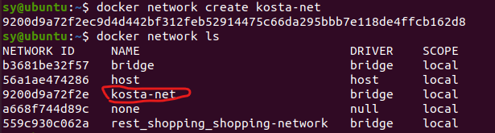
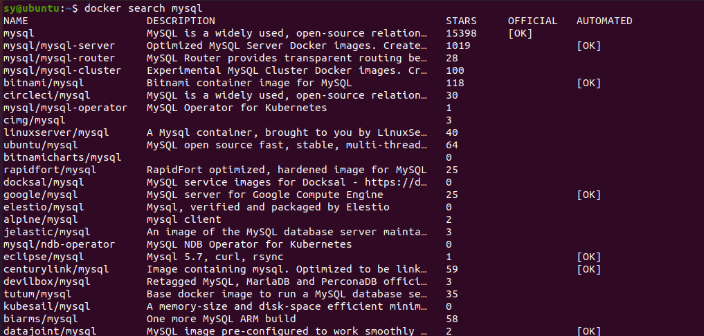
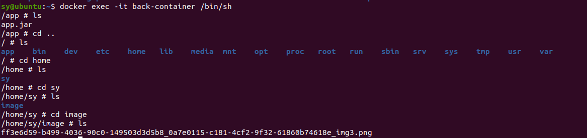
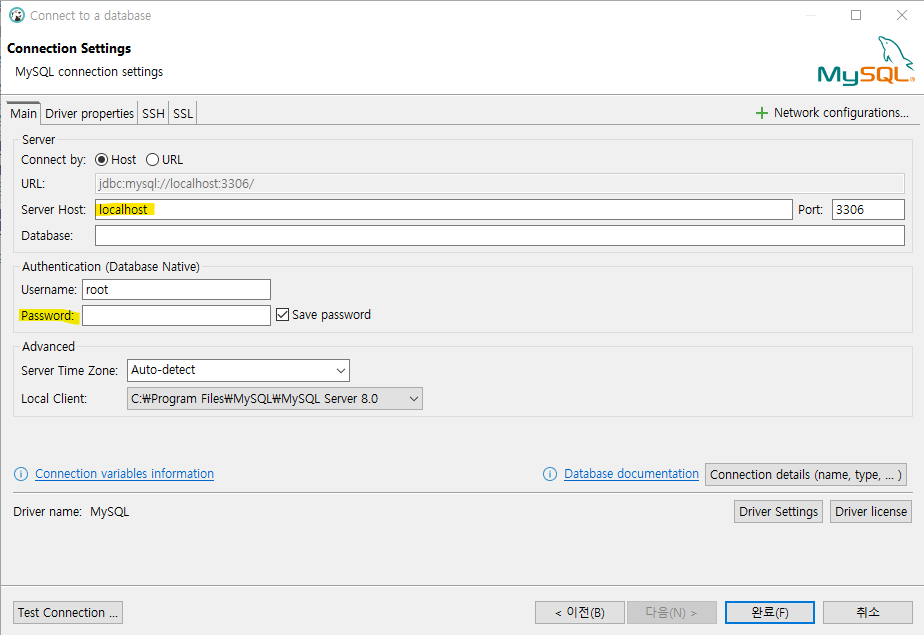
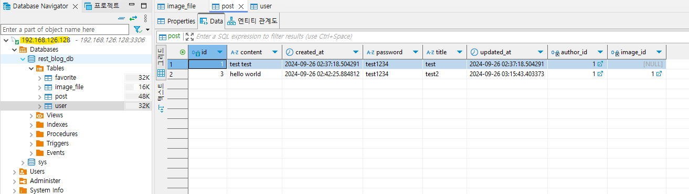
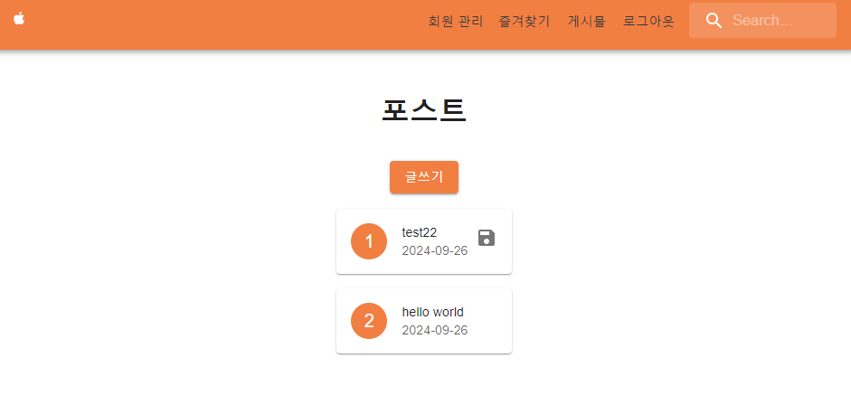

## 목차
- [프론트엔드 `Dockerfile`에 필요한 요소](#프론트엔드-dockerfile에-필요한-요소)
  - [빌드 작업](#빌드-작업)
  - [배포](#배포)
  - [실제 적용 파일](#실제-적용-파일)
- [프론트엔드 `ngix.conf`](#프론트엔드-ngixconf)
- [프론트 띄우기](#프론트-띄우기)
  - [이미지 띄우기](#이미지-띄우기)
  - [front-container 실행](#front-container-실행)
    - [로그 확인](#로그-확인)
- [`buildgradle` 수정](#buildgradle-수정)
- [백엔드 `Dockerfile` 에 필요한 요소](#백엔드-dockerfile-에-필요한-요소)
  - [빌드](#빌드)
  - [실행](#실행)
  - [실제 구현 파일](#실제-구현-파일)
- [백엔드 띄우기](#백엔드-띄우기)
  - [이미지 빌드](#이미지-빌드)
  - [network 생성](#network-생성)
  - [mysql 설정](#mysql-설정)
    - [mysql 검색](#mysql-검색)
    - [mysql 설치](#mysql-설치)
    - [mysql 빌드](#mysql-빌드)
    - [mysql 확인](#mysql-확인)
  - [컨테이너 띄우기](#컨테이너-띄우기)
  - [이미지 경로 수정](#이미지-경로-수정)
    - [FileUtils.java 확인](#fileutilsjava-확인)
    - [이미지 폴더 확인](#이미지-폴더-확인)
- [DBeaver에서 가상머신의 DB 확인하기](#dbeaver에서-가상머신의-db-확인하기)
- [도커 이미지 전체 삭제](#도커-이미지-전체-삭제)
- [docker-compose 사용해서 다같이 띄우기](#docker-compose-사용해서-다같이-띄우기)
  - [프론트엔드 `docker-compose.yml` 파일 생성](#프론트엔드-docker-composeyml-파일-생성)
  - [프론트엔드 빌드](#프론트엔드-빌드)
    - [프로젝트를 수정하는 경우](#프로젝트를-수정하는-경우)
  - [백엔드 `docker-compose.yml` 파일 생성](#백엔드-docker-composeyml-파일-생성)
  - [백엔드 빌드](#백엔드-빌드)
  - [프로젝트 확인](#프로젝트-확인)

<br/>
<br/>
<br/>
<br/>

# 프론트엔드 `Dockerfile`에 필요한 요소
## 빌드 작업
1. Node 이미지 [20]
2. 컨테이너에 작업 디렉토리 설정
3. package.json, package-lock.json을 작업 디렉토리에 복사
4. 의존성 업데이트 및 설치
5. 소스 코드를 컨테이너에 복사
6. React 애플리케이션 빌드

## 배포
1. Nginx 이미지
2. Nginx 이미지 설정 파일을 교체
3. Nignx 기본 html 삭제
4. 빌드된 React 애플리케이션을 Nginx 디렉토리로 복사
5. Nginx 포트 노출
6. Nginx 서버 실행

## 실제 적용 파일
```
FROM node:20 AS build
WORKDIR /app
COPY package*.json ./
RUN npm update
RUN npm install
COPY . .
RUN npm run build

FROM nginx:alpine
COPY nginx.conf /etc/nginx/conf.d/default.conf
RUN rm -rf /usr/share/nginx/html/*
COPY --from=build /app/build /usr/share/nginx/html
EXPOSE 80
CMD [ "nginx", "-g", "daemon off;" ]
```

<br/>
<br/>
<br/>
<br/>

# 프론트엔드 `ngix.conf`
```
server {
    listen 80;
    server_name localhost;

    root /usr/share/nginx/html;
    index index.html;

    location / {
        try_files $uri $uri/ /index.html;
    }
}
```

<br/>
<br/>
<br/>
<br/>

# 프론트 띄우기
## 이미지 띄우기
```
docker build -t front-image .
```
- 위치가 중요하다
- `.`인 이유는 해당 폴더에서 이미지를 빌드했기 때문이다.
## front-container 실행
```
docker run -d --name front-container -p 80:80 front-image
```
- `-d` : background에서 실행한다는 의미이다
### 로그 확인
```
docker log front-continaer
```
- background에서 실행되서 로그를 확인할 수 없을 때 해당 명령어를 입력하면 로그를 확인할 수 있다.
```
docker logs --tail 1 -f front-container
```
- 가장 최근 1줄부터 로그를 볼 수 있다.
```
docker exec -t front-container /bin/sh
```
- 컨테이너의 shell에 접속하여 명령어를 입력할 수 있다.

<br/>
<br/>
<br/>
<br/>

# `buildgradle` 수정
- 실행 가능한 jar 파일만 생성되도록 수정
- executable jar 파일만 생성
```java
jar {
	enabled = false
}
```

<br/>
<br/>
<br/>
<br/>

# 백엔드 `Dockerfile` 에 필요한 요소
## 빌드
1. 빌드 이미지 (gradle)
2. 컨테이너 작업 디렉토리 설정
3. Gradle 파일만 복사
4. 프로젝트 파일 전체 복사
5. gradlew 파일에 권한 부여 (gradlew는 빌드를 진행하기 위한 파일)
   -  r : 읽기 권한
   -  w : 쓰기 권한
   -  x : 실행 권한 
6. 빌드 실행

## 실행
1. openjdk 이미지 
2. 컨테이너 작업 디렉토리 설정
3. 빌드 단계에서 생성된 jar 파일 복사
   - (build.gradle jar {enable:false} 설정 해주었기 때문에 * 사용 가능)
4. 포트 노출
5. 애플리케이션 실행

## 실제 구현 파일
```
FROM gradle:8-jdk17-alpine AS build
WORKDIR /app
COPY build.gradle setting.gradle gradlew ./
COPY gradle ./gradle
COPY . .
RUN chmod +x gradlew
RUN ./gradlew clean build -x test

FROM openjdk:17-jdk-alpine
WORKDIR /app
COPY --from=build /app/build/libs/*.jar /app/app.jar
EXPOSE 8080
ENTRYPOINT [ "java", "-jar", "/app/app.jar" ]
```

<br/>
<br/>
<br/>
<br/>

# 백엔드 띄우기
## 이미지 빌드
```
docker build -t back-image .
```

<br/>
<br/>

## network 생성
- mysql과 backend가 연동되어야 하는데 그러지 않아 오류가 나므로 network를 만들어야 한다.
```
docker network create kosta-net
```
- `kosta-net` 이라는 network 생성




<br/>
<br/>

##  mysql 설정
### mysql 검색
```
docker search mysql
```

- 외부에 있는 mysql을 찾아본다.
### mysql 설치
```
docker pull mysql
```
### mysql 빌드
```
docker run -d \
--name mysql-container \
-p 3306:3306 \
-e MYSQL_ROOT_PASSWORD=1234 \
-e MYSQL_USER=sy \
-e MYSQL_PASSWORD=1234 \
-e MYSQL_DATABASE=rest_blog_db \
-e TZ=Asia/Seoul \
--network kosta-net \
mysql:8
```
### mysql 확인
```
docker exec -it mysql-container mysql -u root -p
```

<br/>
<br/>

##  컨테이너 띄우기
```
docker run -d \
--name back-container \
-p 8080:8080 \
-e SPRING_DATASOURCE_URL=jdbc:mysql://mysql-container:3306/rest_blog_db \
-e SPRING_DATASOURCE_USERNAME=root \
-e SPRING_DATASOURCE_PASSWORD=1234 \
--network kosta-net \
back-image
```

<br/>
<br/>

## 이미지 경로 수정
### FileUtils.java 확인
```java
@Slf4j
@Component
public class FileUtils {

	// application.yml 파일의 location 정보 가져오기
	@Value("${spring.upload.location}")
	private String uploadPath;

	public ImageFile fileUpload(MultipartFile file) {
		try {
			// 원본 파일명 가져오기
			String originalFileName = file.getOriginalFilename();
			// 파일 크기 가져오기
			Long fileSize = file.getSize();
			// 새로운 파일명 만들어주기
			String savedFileName = UUID.randomUUID() + "_" + originalFileName;

			log.info("업로드 경로 : {}", uploadPath);

			// 업로드 경로 미존재 시 디렉토리 생성
			Path directoryPath = Paths.get(uploadPath);
			if (!Files.exists(directoryPath)) {
				Files.createDirectories(directoryPath);
			}

			// 해당 경로에 파일 이미지 업로드
			InputStream inputStream = file.getInputStream();
			Path path = directoryPath.resolve(savedFileName);
			Files.copy(inputStream, path, StandardCopyOption.REPLACE_EXISTING);

			// 이상 없으면 새로운 ImageFile 객체 반환
			return ImageFile.builder()
					.originalName(originalFileName)
					.savedName(savedFileName)
					.fileSize(fileSize)
					.build();
		} catch (Exception e) {
			e.printStackTrace();
			// 이상 있으면 null 반환
			return null;
		}
	}
}
```
### 이미지 폴더 확인

- `/home/sy/image` 폴더 안에 이미지가 저장된다.

<br/>
<br/>
<br/>
<br/>

# DBeaver에서 가상머신의 DB 확인하기

- 가상머신의 ip 주소를 입력
- password 입력


- DB 연동된 걸 확인할 수 있다.

<br/>
<br/>
<br/>
<br/>

# 도커 이미지 전체 삭제
```
docker rmi $(docker images -q)
```

<br/>
<br/>
<br/>
<br/>

# docker-compose 사용해서 다같이 띄우기
## 프론트엔드 `docker-compose.yml` 파일 생성
```
version: '3'
services:
  front-image:
    build:
      context: .
    container_name: front-container
    ports:
      - "80:80"
```
## 프론트엔드 빌드
```
docker-compose up -d
```
- `-d` 옵션을 추가하여 백그라운드에서 빌드되도록 한다.
### 프로젝트를 수정하는 경우
```
docker-compose up --build -d
```
- 삭제하고 다시 빌드하는 일 없이 그냥 위 명령어를 입력하면 된다.

<br/>
<br/>

## 백엔드 `docker-compose.yml` 파일 생성
```
version: '3'
services:
  mysql:
    image: mysql:8
    container_name: mysql-container
    environment:
      - MYSQL_ROOT_PASSWORD=1234
      - MYSQL_USER=sy
      - MYSQL_PASSWORD=1234
      - MYSQL_DATABASE=rest_blog_db
      - TZ=Asia/Seoul
    ports:
      - "3306:3306"
    networks:
      - kosta-net
  back-image:
    build:
      context: .
    container_name: back-container
    ports:
      - "8080:8080"
    environment:
      - SPRING_DATASOURCE_URL=jdbc:mysql://mysql-container:3306/rest_blog_db
      - SPRING_DATASOURCE_USERNAME=root
      - SPRING_DATASOURCE_PASSWORD=1234
    networks:
      - kosta-net
    depends_on:
      - mysql
    restart: always
networks:
  kosta-net:
    driver: bridge
```
- mysql보다 백엔드 서버가 먼저 실행되는 경우 오류가 발생할 수 있다.
- 이를 방지하기 위해 `depends_on`을 추가해주고, `restart: always`도 추가한다.
## 백엔드 빌드
```
docker-compose up -d
```
## 프로젝트 확인
