## 목차
- [simple-market 프로젝트 Docker에 띄워보기](#simple-market-프로젝트-docker에-띄워보기)
  - [React 프로젝트](#react-프로젝트)
    - [env 파일 수정](#env-파일-수정)
    - [nginx.conf 생성](#nginxconf-생성)
    - [Dockerfile 생성](#dockerfile-생성)
    - [docker-compose.yml 생성](#docker-composeyml-생성)
    - [빌드](#빌드)
    - [삭제](#삭제)
    - [프로젝트 확인](#프로젝트-확인)
  - [Java 프로젝트](#java-프로젝트)
    - [application.yml 파일 수정](#applicationyml-파일-수정)
    - [build.gradle 수정](#buildgradle-수정)
    - [Dockerfile 생성](#dockerfile-생성-1)
    - [docker-compose.yml 생성](#docker-composeyml-생성-1)
    - [빌드](#빌드-1)
    - [프로젝트 확인](#프로젝트-확인-1)
- [GitHub Actions](#github-actions)
  - [Github Actions의 구성](#github-actions의-구성)
    - [Workflow](#workflow)
    - [Event](#event)
    - [Job](#job)
    - [Step](#step)
  - [yml 파일 작성](#yml-파일-작성)
  - [workflow 확인](#workflow-확인)
- [CI/CD](#cicd)
  - [CI (Continuous Integration)](#ci-continuous-integration)
    - [CI의 두 가지 유형](#ci의-두-가지-유형)
      - [1. 코드 변경사항을 주기적으로 빈번하게 merge](#1-코드-변경사항을-주기적으로-빈번하게-merge)
      - [2. 통합 단계의 자동화](#2-통합-단계의-자동화)
    - [CI의 장점](#ci의-장점)
  - [CD (Continuous Delivery/Deployment)](#cd-continuous-deliverydeployment)
  - [가상 머신 사용할 때](#가상-머신-사용할-때)
  - [AWS 사용할 때](#aws-사용할-때)
- [AWS로 CI/CD](#aws로-cicd)
  - [인스턴스 생성](#인스턴스-생성)
  - [Vscode에서 ssh 접속](#vscode에서-ssh-접속)
  - [ubuntu 터미널에 docker 설치](#ubuntu-터미널에-docker-설치)
    - [1. Docker's apt repository setting](#1-dockers-apt-repository-setting)
    - [2. Docker packages 설치](#2-docker-packages-설치)
    - [도커 권한 수정](#도커-권한-수정)
  - [깃허브 repository 생성](#깃허브-repository-생성)
    - [`.gitignore` 파일 생성](#gitignore-파일-생성)
  - [ubuntu에 repository 추가](#ubuntu에-repository-추가)
    - [프론트 Docker 설정](#프론트-docker-설정)
    - [깃허브 액션 secret 키 생성](#깃허브-액션-secret-키-생성)
    - [workflow.yml 파일 작성](#workflowyml-파일-작성)

<br/>
<br/>
<br/>
<br/>

# simple-market 프로젝트 Docker에 띄워보기
## React 프로젝트
### env 파일 수정
- 가상 머신에서 사용하므로 가상 머신의 ip 주소로 변경해야 한다.
- 소셜 로그인 시 필요한 redirect uri도 수정해야 한다.
### nginx.conf 생성
```
server {
    listen 80;
    server_name localhost;

    root /usr/share/nginx/html;
    index index.html;

    location / {
        try_files $uri $uri/ /index.html;
    }
}
```
### Dockerfile 생성
```
# 빌드 작업
# 1. Node 이미지 [20]
FROM node:20 AS build
# 2. 컨테이너에 작업 디렉토리 설정
WORKDIR /app
# 3. package.json, package-lock.json을 작업 디렉토리에 복사
COPY package*.json yarn.lock ./
# 4. 의존성 업데이트 및 설치
# RUN npm update
RUN yarn install
# 5. 소스 코드를 컨테이너에 복사
COPY . .
# 6. React 애플리케이션 빌드
RUN yarn run build

# 배포
# 1. Nginx 이미지
FROM nginx:alpine
# 2. Nginx 이미지 설정 파일을 교체
COPY nginx.conf /etc/nginx/conf.d/default.conf
# 3. Nignx 기본 html 삭제
RUN rm -rf /usr/share/nginx/html/*
# 4. 빌드된 React 애플리케이션을 Nginx 디렉토리로 복사
COPY --from=build /app/build /usr/share/nginx/html
# 5. Nginx 포트 노출
EXPOSE 80
# 6. Nginx 서버 실행
CMD [ "nginx", "-g", "daemon off;" ]
```
### docker-compose.yml 생성
```
version: '3'
services:
  front-image:
    build:
      context: .
    container_name: front-container
    ports:
      - "80:80"
```
### 빌드
```
docker-compose up -d
```
### 삭제
```
docker-compose down
```
### 프로젝트 확인
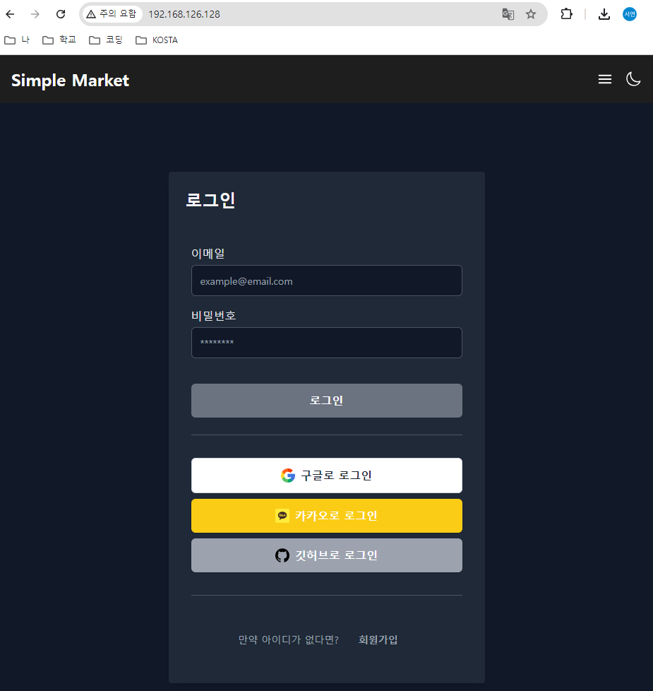

<br/>
<br/>

## Java 프로젝트
### application.yml 파일 수정
- mysql의 url을 수정해야 한다.
- 소셜 로그인 시 필요한 redirect uri를 수정해야 한다.
### build.gradle 수정
```java
jar {
	enabled = false
}
```
- 실행 가능한 jar 파일만 생성되도록 수정
- executable jar 파일만 생성
### Dockerfile 생성
```
# build
# 빌드 이미지 (gradle)
FROM gradle:8-jdk-17-alphine AS build
# 컨테이너 작업 디렉토리 설정
WORKDIR /app
# gradle 파일만 복사
COPY build.gradle setting.gradle gradlew ./
COPY gradle ./gradle
# 프로젝트 전체 파일 복사
COPY . .
# gradlew 파일에 권한 부여
RUN chmod +x gradlew
# 빌드 실행
RUN ./gradlew clean build -x test

# 실행
# openjdk 이미지
FROM openjdk:17-jdk-alpine
# 컨테이너 작업 디렉토리 설정
WORKDIR /app
# 빌드 단계에서 생성된 jar 파일 복사
COPY --from=build /app/build/libs/*.jar /app/app.jar
# port 노출
EXPOSE 8080
# 애플리케이션 실행
ENTRYPOINT [ "java", "-jar", "/app/app.jar" ]
```
### docker-compose.yml 생성
```
version: '3'
services:
  mysql:
    image: mysql:8
    container_name: mysql-container
    environment:
      - MYSQL_ROOT_PASSWORD=1234
      - MYSQL_USER=sy
      - MYSQL_PASSWORD=1234
      - MYSQL_DATABASE=market_db
      - TZ=Asia/Seoul
    ports:
      - "3306:3306"
    networks:
      - market-net
  back-image:
    build:
      context: .
    container_name: back-container
    ports:
      - "8080:8080"
    environment:
      - SPRING_DATASOURCE_URL=jdbc:mysql://mysql-container:3306/market_db
      - SPRING_DATASOURCE_USERNAME=root
      - SPRING_DATASOURCE_PASSWORD=1234
    networks:
      - market-net
    depends_on:
      - mysql
    restart: always
networks:
  market-net:
    driver: bridge
```
### 빌드
```
docker-compose up -d
```
### 프로젝트 확인
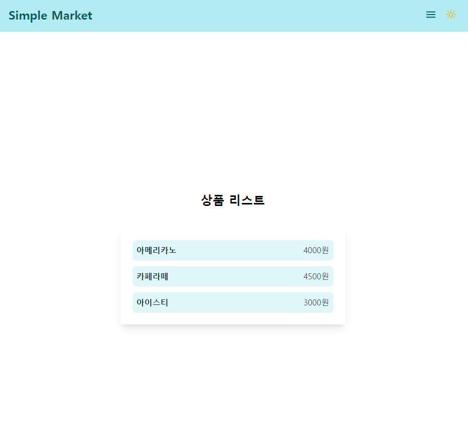
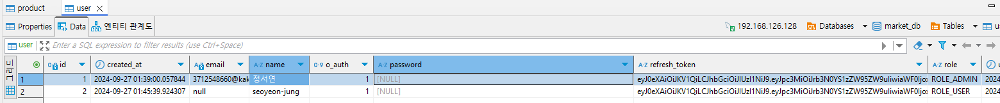
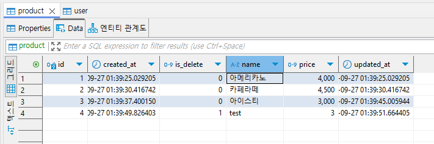

<br/>
<br/>
<br/>
<br/>

# GitHub Actions
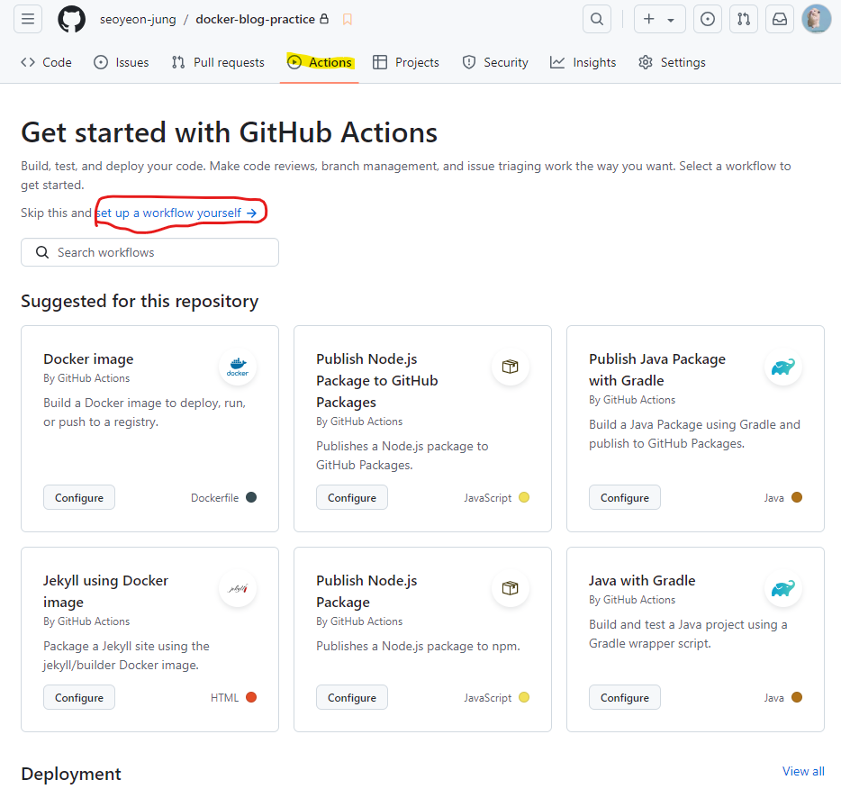
- github에서 제공하는 CI/CD 도구
- repository에서 어떤 이벤트가 발생하면, 특정 작업이 일어나게 만든다.
## Github Actions의 구성
### Workflow 
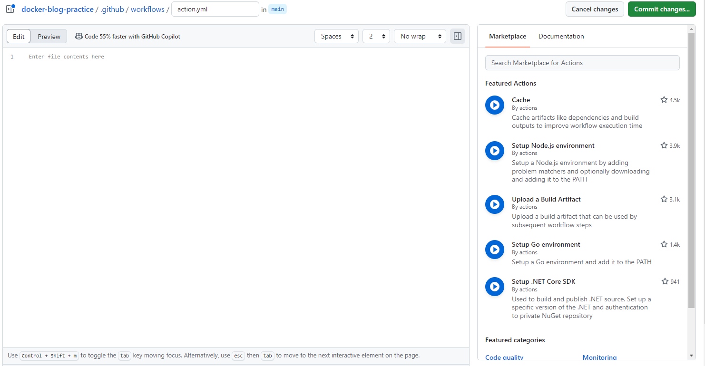
- Github Actions의 상위 개념
- YAML 파일로 작성
- Repisotry > ./github/worflows/[파일명].yml
### Event
- Workflow를 실행하게 하는 규칙이나 조건 (trigger)
- `on` 속성을 통해 정의
- `push`라는 동작이 일어나면 동작되도록 지정
### Job
- 독립된 가상머신 or 컨테이너에서 동작하는 하나의 처리 단위
- Job들은 병렬적으로 실행된다
- Job은 여러 개의 Step으로 구성
### Step
- 여러 단계를 순차적으로 실행하는 작업 순서
- 직접 작성하거나 github에서 가져와 사용도 가능하다.
## yml 파일 작성
```yml
# Workflow의 이름 지정
name: my-first-workflow

# event 지정
on: push

# job 정의
jobs:
  # job 이름 지정
  my-first-job:
    # RUNNER 정의
    runs-on: ubuntu-latest
    # STEP 정의
    steps:
      # USE : ACTION을 사용
      # git에 있는 코드 받아오는 ACTION
      - name: my-git-step
        uses: actions/checkout@v3
      # RUN : 커맨드 명령어 실행
      - name: my-cmd-step1
        run: ls
      - name: my-cmd-step2
        run: echo "hello world"
```
## workflow 확인
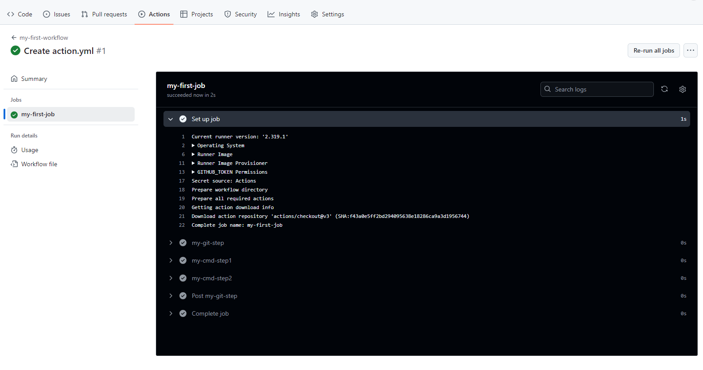   
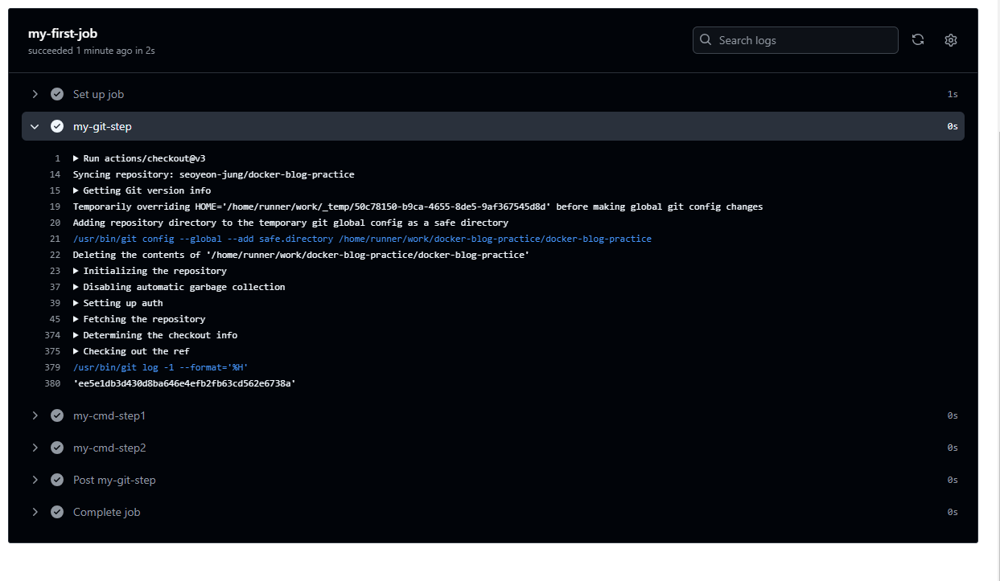   
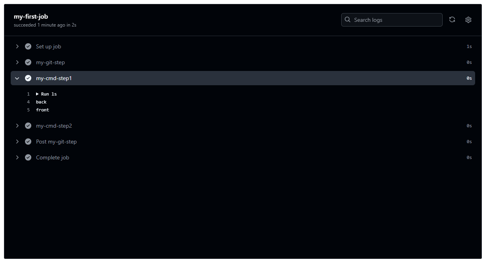   
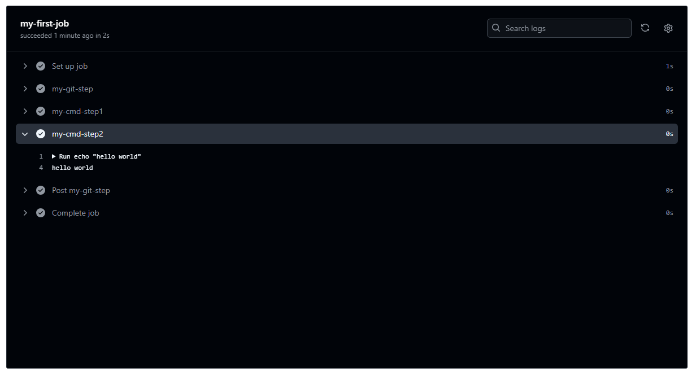

<br/>
<br/>
<br/>
<br/>

# CI/CD
## CI (Continuous Integration)
- 지속적인 통합
- 애플리케이션의 버그 수정이나 새로운 코드 변경이 주기적으로 빌드 및 테스트되면서 공유되는 레파지토리에 통합(merge)되는 것을 의미
### CI의 두 가지 유형
#### 1. 코드 변경사항을 주기적으로 빈번하게 merge
- 가능한 작은 단위로 나누어서 주기적으로 빈번히 개발하고 계속해서 통합하여 나가는 것이 중요
- 개발자들이 계속해서 github 등의 관리 시스템에 통합해야 한다.
- 통합한 코드가 제대로 동작하는지 빌드 및 테스트를 진행해야 한다.
- 버그가 발생하면 다음에 해야 할 목록에 정리하고 다음날에 버그를 해결한다.
#### 2. 통합 단계의 자동화
- github에 올리면 빌드 및 테스트는 자동으로 진행된다.
- 버그가 생기면 다음날 온 버그를 확인해서 버그를 해결한다.
### CI의 장점
- 코드의 검증에 들어가는 시간이 줄어드낟.
- 개발 편의성이 증가한다.
- 항상 테스트 코드를 통과한 코드만 올라가기 때문에 좋은 코드 퀄리티를 유지할 수 있다.
## CD (Continuous Delivery/Deployment)
- 지속적인 제공
- CI에서 build되고 test된 후에 개발자가 검증하고 배포를 수동적으로 진행하는 것이 `Continuous Delivery(지속적인 제공)`이다.
- 배포할 준비를 마지차마자 **자동화**를 통하여 배포를 진행하는 것이 `Continuous Deployment(지속적인 배포)`이다.
## 가상 머신 사용할 때
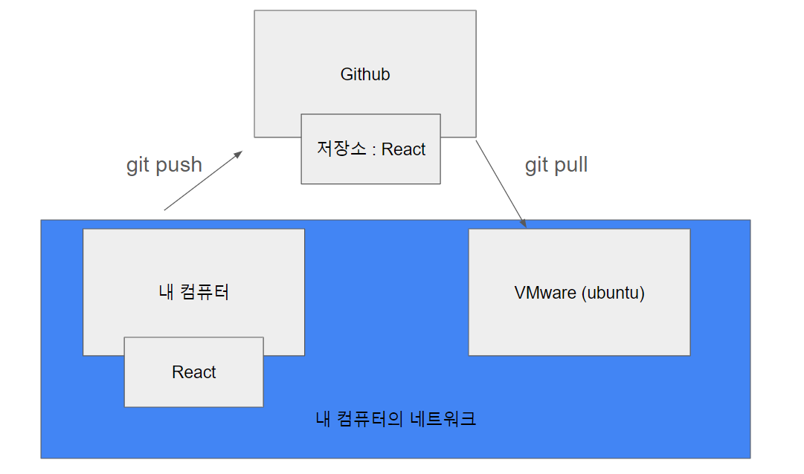
- 가상머신과 내 컴퓨터는 같은 네트워크이다.
- 내 컴퓨터에서 수정하고 push하면 깃허브에서 자동으로 업데이트되고 가상머신에서 pull 받아와 업데이트된다.
## AWS 사용할 때
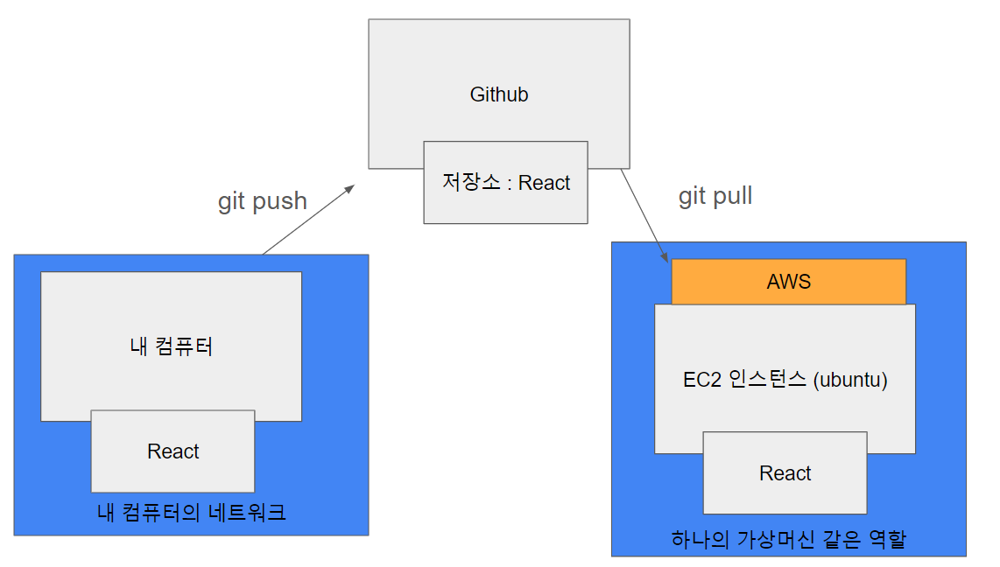

<br/>
<br/>
<br/>
<br/>

# AWS로 CI/CD
## 인스턴스 생성
- 이름 설정
- ubuntu로 설정
  - 프리티어로 하는 경우 가능한 가장 좋은 버전 선택
- 인스턴스 유형 설정 (프리티어) 
- 키 페어 설정 (RSA / pem)
  - 자동으로 다운로드 되는 걸 확인
- 보안그룹 생성
  - ssh는 무조건 허용
  - 나머지는 선택
- 스토리지 설정
  - 프리티어인 경우에만 최대로 올리기

<br/>
<br/>

## Vscode에서 ssh 접속
1.  `Remote Developmer` 확장 프로그램 설치
2.  ssh 추가
    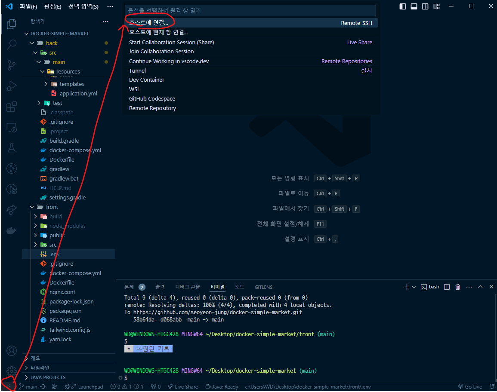
    - ssh 접속 명령어 작성
    ```
    ssh [접속 아이디]@[서버 주소] // 포맷 

    ssh -p 1022 kk21@yellow.kku.ac.kr //예시 포트 지정 가능
    ```
3. ssh 구성 파일 수정
    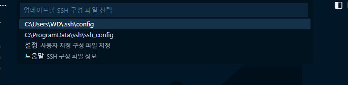
    - `/User/[사용자명]/.ssh/config` 선택
4. host 수정
    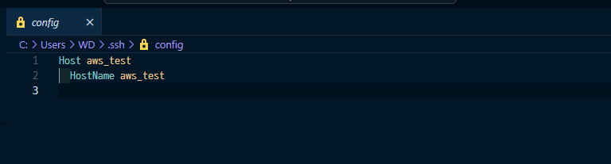
   - HostName은 설정한 인스턴스에서 복사해와서 사용
   - `IdentfyFile` : 다운로드했던 pem키의 경로를 복사해서 붙여넣기
     - (예) c:\Users\WD\Downloads\kosta.pem
    - 여러 개인 경우 하나의 파일로 묶어서 저장
5. ssh 접속
   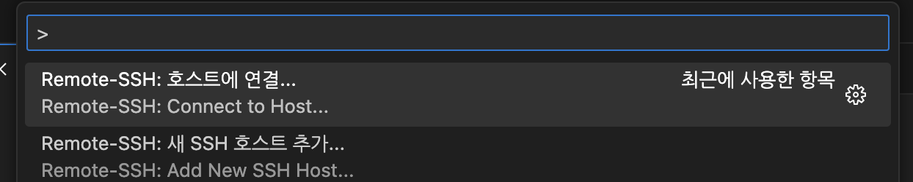
   - 접속할 서버 선택 후 비밀번호 입력하면 접속 완료

<br/>
<br/>

## ubuntu 터미널에 docker 설치
- [공식 문서 참고하기](https://docs.docker.com/desktop/install/linux/ubuntu/)
### 1. Docker's apt repository setting 
```
# Add Docker's official GPG key:
sudo apt-get update
sudo apt-get install ca-certificates curl
sudo install -m 0755 -d /etc/apt/keyrings
sudo curl -fsSL https://download.docker.com/linux/ubuntu/gpg -o /etc/apt/keyrings/docker.asc
sudo chmod a+r /etc/apt/keyrings/docker.asc

# Add the repository to Apt sources:
echo \
  "deb [arch=$(dpkg --print-architecture) signed-by=/etc/apt/keyrings/docker.asc] https://download.docker.com/linux/ubuntu \
  $(. /etc/os-release && echo "$VERSION_CODENAME") stable" | \
  sudo tee /etc/apt/sources.list.d/docker.list > /dev/null
sudo apt-get update
```
### 2. Docker packages 설치
```
sudo apt-get install docker-ce docker-ce-cli containerd.io docker-buildx-plugin docker-compose-plugin
```
### 도커 권한 수정
```
sudo usermod -aG docker $USER
```
- root 권한 없이도 docker를 사용할 수 있도록 권한 수정
- aG : 사용자를 그룹에 추가하되 기존 그룹은 제거하지 않도록 설정
- $USER : 현재 사용자의 이름을 자동으로 가져오기

<br/>
<br/>

## 깃허브 repository 생성
- public으로 생성하기
- private이면 github actions가 일부 제한된다.
- 필요한 프로젝트 repistory에 복사
### `.gitignore` 파일 생성
```
**/.env
**/application.yml
```
- `.env` 파일, `application.yml` 파일 등 보안이 필요한 파일을 public 폴더에 얼릴 수는 없으므로 생성

<br/>
<br/>

## ubuntu에 repository 추가
### 프론트 Docker 설정
```
docker compose up -d
```
### 깃허브 액션 secret 키 생성
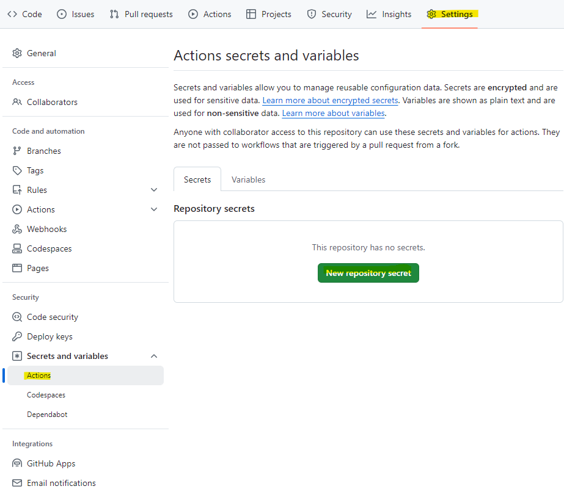
- 보안키를 여기에 작성하면 된다.
### workflow.yml 파일 작성
```
name: FRONT-WORKFLOW
on:
  push:
    branches: [ "main" ]
jobs:
  front-job:
    runs-on: ubuntu:latest
    steps:
      - name: SSH
        uses: appleboy/ssh-action@master
        with:
          host: ${{ secrets.HOST }}
          username: ${{ secrets.USERNAME }}
          key: ${{ secrets.KEY }}
          script: |
            # 오류 발생 시 스크립트 중단
            set -e
            
            # SSH 접속 후 작업 디렉토리로 이동
            echo "SSH 접속"
            cd 2024-aws-kostagram/front
            # 환경 설정 파일 생성
            echo "환경 설정 파일 생성"
            echo -e "REACT_APP_REST_SERVER=${{ secrets.REACT_APP_REST_SERVER }}" >> .env
            echo -e "REACT_APP_SERVER=${{ secrets.REACT_APP_SERVER }}" >> .env
            echo -e "REACT_APP_GOOGLE_ID=${{ secrets.REACT_APP_GOOGLE_ID }}" >> .env
            echo -e "REACT_APP_GOOGLE_REDIRECT_URI=${{ secrets.REACT_APP_GOOGLE_REDIRECT_URI }}" >> .env
            echo -e "REACT_APP_KAKAO_ID=${{ secrets.REACT_APP_KAKAO_ID }}" >> .env
            echo -e "REACT_APP_KAKAO_REDIRECT_URI=${{ secrets.REACT_APP_KAKAO_REDIRECT_URI }}" >> .env
            
            # GIT 최신 코드 가져오기
            echo "GIT PULL 작업"
            git_output=$(sudo git pull origin main 2>&1)
            echo "$git_output"
            # Docker 빌드
            echo "Docker build"
            docker compose up -d --build front-image
```
- 깃허브 내부에 지정한 key를 사용 가능