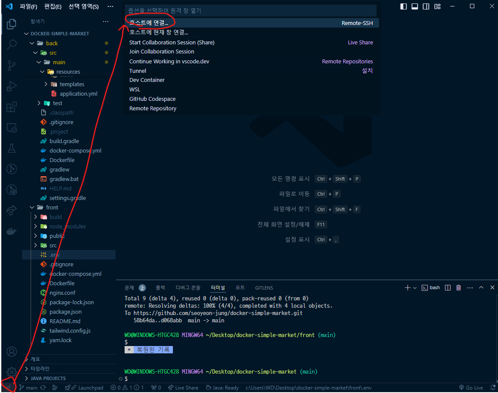
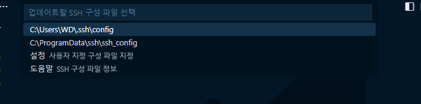
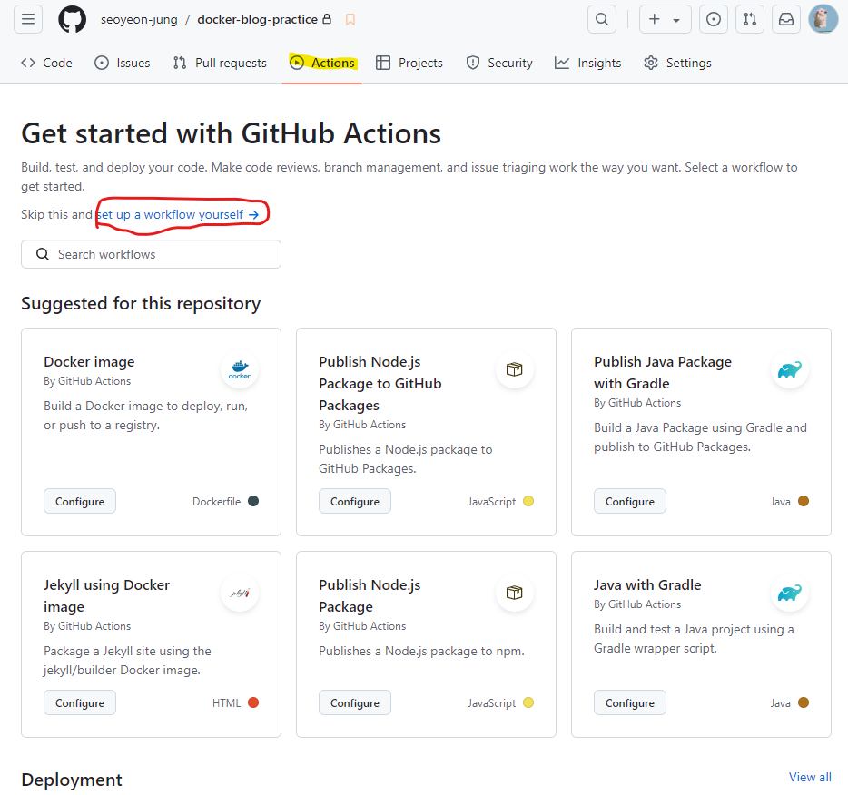

## 목차
- [깃허브 orgnaization aws 배포하기](#깃허브-orgnaization-aws-배포하기)
  - [깃허브 setting](#깃허브-setting)
    - [`.gitignore` 파일 생성](#gitignore-파일-생성)
- [프론트 프로젝트 aws 배포하기](#프론트-프로젝트-aws-배포하기)
  - [react api url 변경](#react-api-url-변경)
  - [깃허브 secret key 생성](#깃허브-secret-key-생성)
  - [aws 인스턴스 생성](#aws-인스턴스-생성)
    - [1. 인스턴스 선택](#1-인스턴스-선택)
    - [2. ip 주소 확인](#2-ip-주소-확인)
  - [vscode에서 aws 연결](#vscode에서-aws-연결)
  - [ubuntu 터미널에 docker 설치](#ubuntu-터미널에-docker-설치)
    - [1. Docker's apt repository setting](#1-dockers-apt-repository-setting)
    - [2. Docker packages 설치](#2-docker-packages-설치)
    - [도커 권한 수정](#도커-권한-수정)
  - [깃허브 레파지토리 클론](#깃허브-레파지토리-클론)
  - [Docker 설정](#docker-설정)
    - [nginx.conf 파일 생성](#nginxconf-파일-생성)
    - [Dockerfile 생성](#dockerfile-생성)
    - [docker-compose.yml 파일 생성](#docker-composeyml-파일-생성)
  - [깃허브 worklow yml 파일 생성](#깃허브-worklow-yml-파일-생성)
  - [수정하고 push했을 때](#수정하고-push했을-때)
  - [aws에 결제한 도메인 연동](#aws에-결제한-도메인-연동)
    - [route 53 대시보드로 이동](#route-53-대시보드로-이동)
    - [가비아 도메인 관리](#가비아-도메인-관리)
    - [route 53에서 레코드 생성](#route-53에서-레코드-생성)
- [백엔드 프로젝트 aws 배포하기](#백엔드-프로젝트-aws-배포하기)
  - [깃허브에 올리기](#깃허브에-올리기)
  - [java 코드 변경](#java-코드-변경)
  - [Docker 설정](#docker-설정-1)
    - [Dockerfile 파일 생성](#dockerfile-파일-생성)
    - [`.env` 파일 생성](#env-파일-생성)
    - [docker-compose.yml 파일 생성](#docker-composeyml-파일-생성-1)
  - [깃허브 Secret key 생성](#깃허브-secret-key-생성-1)
  - [깃허브 worklow yml 파일 생성](#깃허브-worklow-yml-파일-생성-1)

<br/>
<br/>
<br/>
<br/>


# 깃허브 orgnaization aws 배포하기
## 깃허브 setting
1. organization 생성
2. 팀원들 초대
3. 프로젝트 올리기
   1. front / back 폴더 생성
   2. 각 프로젝트 해당 폴더에 push
### `.gitignore` 파일 생성
```
**/.env
**/application.yml
```
- `.env` 파일, `application.yml` 파일 등 보안이 필요한 파일을 public 폴더에 얼릴 수는 없으므로 생성

<br/>
<br/>
<br/>
<br/>


# 프론트 프로젝트 aws 배포하기
## react api url 변경
기존에 있던 url 대신 aws로 배포한 주소로 변경
## 깃허브 secret key 생성


- HOST : 인스턴스 ip 주소
- USERNAME : Ubuntu
- KEY : 다운로드 폴더의 pem.key 넣기
- JWT_KEY : jwt token 키
- SERVER : 인스턴스 ip 주소
- GOOGLE_ID : 구글 OAuth 클라이언트 ID
- GOOGLE_KEY : 구글 OAuth 클라이언트 보안 비밀번호
- GOOGLE_REDIRECT_URI : 구글 로그인 시 리디릭션 URI
- KAKAO_ID : REST API 키
- KAKAO_KEY : client secret key 
- KAKAO_REDIRECT_URI : 카카오 로그인 시 리디렉션 URI

## aws 인스턴스 생성
### 1. 인스턴스 선택


- 이름 설정
- ubuntu로 설정
  - 프리티어로 하는 경우 가능한 가장 좋은 버전 선택
- 인스턴스 유형 설정 (프리티어) 
- 키 페어 설정 (RSA / pem)
  - 자동으로 다운로드 되는 걸 확인
- 보안그룹 생성
  - ssh는 무조건 허용
  - 나머지는 선택
  - ssh 허용 시 22번 포트 열림
  - https 허용하면 443 포트 열림
  - http 허용하면 80 포트 열림
- 스토리지 설정
  - 프리티어인 경우에만 최대로 올리기
### 2. ip 주소 확인
- ip 주소를 깃허브 secret key 중 HOST에 추가
## vscode에서 aws 연결
1.  `Remote Developmer` 확장 프로그램 설치
2.  ssh 추가
    
    - ssh 접속 명령어 작성
    ```
    ssh [접속 아이디]@[서버 주소] // 포맷 

    ssh -p 1022 kk21@yellow.kku.ac.kr //예시 포트 지정 가능
    ```
3. ssh 구성 파일 수정
    
    - `/User/[사용자명]/.ssh/config` 선택
4. host 수정
    
   - HostName은 설정한 인스턴스에서 복사해와서 사용
   - `IdentfyFile` : 다운로드했던 pem키의 경로를 복사해서 붙여넣기
     - (예) c:\Users\WD\Downloads\kosta.pem
    - 여러 개인 경우 하나의 파일로 묶어서 저장
5. ssh 접속
   
   - 접속할 서버 선택 후 비밀번호 입력하면 접속 완료
## ubuntu 터미널에 docker 설치
- [공식 문서 참고하기](https://docs.docker.com/desktop/install/linux/ubuntu/)
### 1. Docker's apt repository setting 
```
# Add Docker's official GPG key:
sudo apt-get update
sudo apt-get install ca-certificates curl
sudo install -m 0755 -d /etc/apt/keyrings
sudo curl -fsSL https://download.docker.com/linux/ubuntu/gpg -o /etc/apt/keyrings/docker.asc
sudo chmod a+r /etc/apt/keyrings/docker.asc

# Add the repository to Apt sources:
echo \
  "deb [arch=$(dpkg --print-architecture) signed-by=/etc/apt/keyrings/docker.asc] https://download.docker.com/linux/ubuntu \
  $(. /etc/os-release && echo "$VERSION_CODENAME") stable" | \
  sudo tee /etc/apt/sources.list.d/docker.list > /dev/null
sudo apt-get update
```
### 2. Docker packages 설치
```
sudo apt-get install docker-ce docker-ce-cli containerd.io docker-buildx-plugin docker-compose-plugin
```
### 도커 권한 수정
```
sudo usermod -aG docker $USER
```
- root 권한 없이도 docker를 사용할 수 있도록 권한 수정
- aG : 사용자를 그룹에 추가하되 기존 그룹은 제거하지 않도록 설정
- $USER : 현재 사용자의 이름을 자동으로 가져오기
```
newgrp docker
```
- 현재 셸 세션의 그룹을 'docker'로 변경
- 재로그인 하지 않고도 명령어 사용할 수 있도록 설정

## 깃허브 레파지토리 클론
```
git clone [프로젝트명]
```
## Docker 설정
### nginx.conf 파일 생성
```
server {
    listen 80;
    server_name localhost;

    root /usr/share/nginx/html;
    index index.html;

    location / {
        try_files $uri $uri/ /index.html;
    }
}
```
### Dockerfile 생성
```Dockerfile
FROM node:20 AS build
WORKDIR /app
COPY pakcage.json yarn.lock ./
RUN yarn install
COPY . .
RUN yarn run build

FROM nginx:alpine
COPY nginx.conf /etc/nginx/conf.d/default.conf
RUN rm -rf /usr/share/nginx/html/*
COPY --from=build /app/build /usr/share/nginx/html
EXPOSE 80

CMD [ "nginx", "-g", "daemon off;" ]
```
### docker-compose.yml 파일 생성
```yml
version: '3'
services:
    front:
        build:
            context: .
        container_name: front-container
        ports:
            - "80:80"
```
## 깃허브 worklow yml 파일 생성
   

- `./github/worflows/[파일명].yml`
```yml
name: FRONT-WORKFLOW
on:
    push:
        branches: ["main"]
    jobs:
        front-jobs:
            runs-on: ubuntu:latest
            steps:
                - name: SSH
                  uses: appleboy/ssh-action@master
                  with:
                    host: ${{ secrets.HOSTS }}
                    username: ${{ secrets.USERANME}}
                    key: ${{ secrets.KEY }}
                    script: |
                        set -e
                        cd front

                        echo -e "REACT_APP_SERVER=${{ secrets.REST_USERVER }}" >> .env
                        echo -e "REACT_APP_GOOGLE_ID=${{ secrets.GOOGLE_ID }}" >> .env
                        echo -e "REACT_APP_GOOGLE_REDIRECT_URI=${{ secrets.GOOGLE_REDIRECT_URI }}" >> .env
                        echo -e "REACT_APP_KAKAO_ID=${{ secrets.KAKAO_ID }}" >> .env
                        echo -e "REACT_APP_KAKAO_REDIRECT_URI=${{ secrets.KAKAO_REDIRECT_URI }}" >> .env

                        git_output=${sudo git pull origin main 2>&1}

                        docer compose up -d --build
```
- `uses: appleboy/ssh-action@master` : 레포지토리 Settings -> Secrets 설정 페이지로 들어가서 호스트, 유저명, SSH Private Key, 포트번호를 세팅해준다.
- `set -e` : 에러 발생 시 중지
- `cd front` : front 프로젝트로 이동
- `echo -e "" >> .env` : `.env` 파일 생성
- `git_output=${sudo git pull origin main 2>&1}` : git pull 받아오기
- `docker compose up -d --build` : background에서 build해서 실행하기
## 수정하고 push했을 때

- 자동으로 빌드가 진행된다.

## aws에 결제한 도메인 연동
### route 53 대시보드로 이동


- 구매한 도메인을 입력
- 레코드에서 ns로 시작되는 값/트래픽 라우팅 대상 복사
### 가비아 도메인 관리
- 네임서버 설정으로 이동
- 복사한 것들을 붙여넣기 (총 4개)
### route 53에서 레코드 생성
- 인스턴스 ip 주소로 레코드 생성

<br/>
<br/>
<br/>
<br/>


# 백엔드 프로젝트 aws 배포하기
## 깃허브에 올리기
1. back 폴더에 프로젝트 복사
2. git pull
## java 코드 변경
1. `WebMvcConfig.java` 파일의 주소 수정
2. `WebSecurity.java` 파일 수정
3. `build.gradle` 코드 추가
   ```gradle
   jar {
    enabled = false
   }
   ```
## Docker 설정
### Dockerfile 파일 생성
```Dockerfile
FROM gradle:8-jdk-alpine AS build
WORKDIR /app
COPY build.gradle settings.gradle  gradlew ./
COPY gradle ./gradle
COPY . .
RUN chmod +x gradlew
RUN ./gradlew clean build -x test

FROM openjdk:17-jdk-alpine
WORKDIR /app
COPY --from=build /app/build/lib/*.jar /app/app.jar
EXPOSE 8080
ENTRYPOINT [ "java", "-jar", "/app/app.jar" ]
```
### `.env` 파일 생성
- `docker-compose.yml`에 존재하는 password, user 등을 보호하기 위해 `.env` 파일을 생성한다.
- `.gitignore`에 `.env` 파일을 추가해 push되지 않도록 한다.

```
MYSQL_ROOT_PASSWORD=
MYSQL_USER=
MYSQL_PASSWORD=
MYSQL_DATABASE=
TZ=Asia/Seoul
SPRING_DATASOURCE_URL=jdbc:mysql://mysql-container:3306/[db명]
SPRING_DATASOURCE_USERNAME=
SPRING_DATASOURCE_PASSWORD=
```
- ROOT_PASSWORD와 PASSWORD가 동일하면 하나로 통일해도 된다.
### docker-compose.yml 파일 생성
```yml
version: '3'
services:
    mysql:
        image: mysql:8
        container_name: mysql-container
        envrionment:
            - MYSQL_ROOT_PASSWORD=${MYSQL_PASSWORD}
            - MYSQL_USER=${MYSQL_USER}
            - MYSQL_PASSWORD=${MYSQL_PASSWORD}
            - MYSQL_DATABASE=${MYSQL_DATABASE}
            - TZ=${TZ}
        ports:
            - "3306:3306"
        networks:
            - server-net
        volumes:
            - mysql-data:/var/lib/mysql
    back:
        build:
            context:
                .
        container_name: back-container
        ports:
            -"8080:8080"
        envrionment:
            - SPRING_DATASOURCE_URL=${SPRING_DATASOURCE_URL}
            - SPRING_DATASOURCE_USERNAME=${SPRING_DATASOURCE_USERNAME}
            - SPRING_DATASOURCE_PASSWORD=${SPRING_DATASOURCE_PASSWORD}
        networks:
            - server-net
        depends-on:
            - mysql
        restart: always
networks:
    server-net:
        driver: bridge
volumes:
    mysql-data
```
## 깃허브 Secret key 생성
- HOST : 인스턴스 ip 주소
- USERNAME : Ubuntu
- KEY : 다운로드 폴더의 pem.key 넣기
- MYSQL_ROOT_PASSWORD
- MYSQL_USER
- MYSQL_PASSWORD
- MYSQL_DATABASE
- TZ
- SPRING_DATASOURCE_URL
- SPRING_DATASOURCE_USERNAME
- SPRING_DATASOURCE_PASSWORD
- JWT_KEY : jwt token 키
- SERVER : 인스턴스 ip 주소
- GOOGLE_ID : 구글 OAuth 클라이언트 ID
- GOOGLE_KEY : 구글 OAuth 클라이언트 보안 비밀번호
- GOOGLE_REDIRECT_URI : 구글 로그인 시 리디릭션 URI
- KAKAO_ID : REST API 키
- KAKAO_KEY : client secret key 
- KAKAO_REDIRECT_URI : 카카오 로그인 시 리디렉션 URI
## 깃허브 worklow yml 파일 생성
```yml
name: BACK-WORKFLOW
on:
    push:
        branches: [ "main" ]
jobs:
    back-job:
        runs-on: ubuntu:latest
        steps:
            - name: SSH
              uses: appleboy/ssh-action@master
              with:
                host: ${{ secrets.HOST }}
                username: ${{ secrets.USERNAME }}
                key: ${{ secrets.KEY }}
                script: |
                    set -e
                    cd back
                    mkdir -p src/main/resources
                    cat <<EOF > src/main/resources/application.yml
                    spring:
                        applicaton:
                            name: [프로젝트명]
                        jpa:
                            generate-ddl: true
                            show-sql: true
                            open-in-view: false
                        sql:
                            init:
                                mode: never
                        upload:
                            location: /home/image
                        servlet:
                            mutlipart:
                                max-file-size: 100MB
                        jwt:
                            issuer: ${{ secrets.MYSQL_USER  }}
                            secret_key: ${{}}
                            access_duration: 5000
                            refresh_duration: 86400000
                        oauth2:
                            clients:
                                google:
                                    client-id: ${{}}
                                    client-secret: ${{}}
                                    redirect-uri: ${{}}
                                    token-uri: https://oauth2.googleapis.com/token
                                    user-info-reqeust-uri: https://www.googleapis.com/oauth2/v3/userinfo
                                kakao:
                                    client-id: ${{ secrets.}}client-secret: ${{}}
                                    redirect-uri: ${{}}
                                    token-uri: https://kauth.kakao.com/oauth/token
                                    user-info-request-uri: https://kapi.kakao.com/v2/user/me

```
- `cat <<EOF > src/main/resources/application.yml` 
  -  EOF : 입력의 끝을 나타낸다
  - 애플리케이션의 설정을 저장하는데 사용
- ```
    servlet:
            mutlipart:
                max-file-size: 100MB
    ```
    - 파일의 최대 크기를 지정