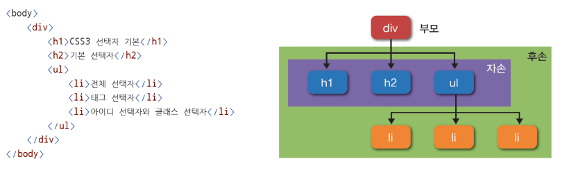

## 목차
1. [HTML5 기본 태그](#html5-기본-태그)  
2. [HTML5 입력 양식 태그](#html5-입력-양식-태그)   
3. [CSS3 선택자](#css3-선택자)   

<br/>
<br/>


# HTML5 기본 태그
### 이미지 태그
```html


```
- `scr` : 이미지의 경로 지정
- `alt` : 이미지가 없을 때 나오는 글자 지정
- `width`, `height` : 이미지의 너비, 높이 지정
- 웹에 존재하는 이미지의 경로 사용도 가능   
### 공간 분할 태그
```html
    <h1>공간 분할 태그</h1>
    <div>div 1</div>
    <span>span tag</span>
```
- `div` : 공간을 블록 형식으로 분할
    - 부모 태그의 100%의 폭과 지정된 높이 사이즈를 가짐
- `span` : 공간을 인라인 형식으로 분할
  - 콘텐츠 텍스트의 사이즈 만큼의 공간을 가짐
### 블록 형식과 인라인 형식의 태그
|블록 형식 태그|인라인 형식 태그|
|------|---|
|div 태그|span 태그|
|h1 ~ h6 태그|a 태그|
|p 태그|input 태그|
|목록 태그|글자 형식 태그|
|테이블 태그||
|입력 양식 태그||

- 이미지 태그는 인라인-블록 형식
### 시맨틱 태그
- `시맨틱(semantic) 웹` : 컴퓨터 프로그램(검색 엔진)이 코드를 읽고 의미를 인식할 수 있는 지능형 웹
- 플러그인을 사용하면 모든 웹 브라우저에서 사용 가능
- 시맨틱 태그도 `div`와 같은 블록 태그

|태그 이름|설명|
|---|----|
|header|헤더|
|nav|내비게이션|
|aside|사이드에 위치하는 공간|
|section|여러 중심 내용을 감싸는 공간|
|article|글자가 많이 들어가는 부분|
|footer|푸터|

<br/>
<br/>

# HTML5 입력 양식 태그
### form 태그의 속성
|속성 이름|설명|
|-----|--------|
|action|전송 위치(데이터를 전달할 목적지)|
|method|전송 방식|
- action 생략하면 자기 자신으로 돌아가게 된다
### GET 방식과 POST 방식
- `GET` : 주소에 데이터를 직접 입력해 전달
- `POST` : 별도의 방법을 사용해 데이터를 해당 주소로 전달
### 입력 양식 태그
<table>
    <tr>
        <td>태그 이름</td>
        <td>속성</td>
        <td>설명</td>
    </tr>
    <tr>
        <td rowspan="10">input</td>
        <td>text</td>
        <td>글자 입력 양식 생성</td>
    </tr>
    <tr>
        <td>button</td>
        <td>버튼 생성</td>
    </tr>
    <tr>
        <td>checkbox</td>
        <td>체크 박스 생성</td>
    </tr>
    <tr>
        <td>file</td>
        <td>파일 입력 양식 생성</td>
    </tr>
    <tr>
        <td>hidden</td>
        <td>해당 내용 표시 안 함</td>
    </tr>
    <tr>
        <td>image</td>
        <td>이미지 형태 생성</td>
    </tr>
    <tr>
        <td>password</td>
        <td>비밀번호 입력 양식 생성</td>
    </tr>
    <tr>
        <td>radio</td>
        <td>라디오 버튼 생성</td>
    </tr>
    <tr>
        <td>reset</td>
        <td>초기화 버튼 생성</td>
    </tr>
    <tr>
        <td>submit</td>
        <td>제출 버튼 생성</td>
    </tr>
    <tr>
        <td rowspan="2">textarea</td>
        <td>cols</td>
        <td>여러 행의 글자 입력 양식 생성</td>
    </tr>
    <tr>
        <td>rows</td>
        <td>cols는 너비, rows는 높이 지정</td>
    </tr>
    <tr>
        <td>select</td>
        <td></td>
        <td>선택 양식 생성</td>
    </tr>
    <tr>
        <td>optgroup</td>
        <td></td>
        <td>옵션 그룹화</td>
    </tr>
    <tr>
        <td>option</td>
        <td></td>
        <td>옵션 생성</td>
    </tr>
    <tr>
        <td>fieldset</td>
        <td></td>
        <td>입력 양식의 그룹 지정</td>
    </tr>
    <tr>
        <td>legend</td>
        <td></td>
        <td>입력 양식 그룹의 이름 지정</td>
    </tr>
</table>

<br/>
<br/>

# CSS3 선택자
- 특정한 HTML 태그를 선택할 때 사용하는 기능
- 선택한 태그에 원하는 스타일이나 스크립트 적용 가능
- CSS 블록
    - `style` 태그 내부에 입력
    ```html
    <style>
        h1 {
            color: red;
        }
    </style>
    ```
- 스타일시트
    - `style` 태그 내부에 입력하는 코드
    ```html
    <link rel="stylesheet" href="default.css"></link>
    ```
### 기본 선택자
1. 전체 선택자
    ```html
    * {
        background-color: black;
    }
    ```
2. 태그 선택자
    - 여러 태그 선택 시 `쉼표(,)` 사용해서 적용
    ```html
    h1 {
        background-color: black;
    }
    ```
3. 아이디 선택자
    - id 속성이 중복되면 해당 id 속성을 표시한 모든 태그에 스타일이 적용된다.
    ```html
    #header {
        text-size: 20px;
    }
    ```
4. 클래스 선택자
    - class 속성은 공백으로 구분하여 클래스를 여러 개 사용 가능
    - id 속성은 중복되지 않아야 하지만 class 속성은 중복 가능
    - class 속성이 서로 다른 태그에 적용되는 경우
선택자와 클래스 선택자를 함께 사용해서
더 정확하게 태그 선택 가능
    ```html
    .select {
        color: red;
    }
    ```
### 속성 선택자
- 특정 속성과 값을 가지는 태그를 선택할 때 사용
- 속성과 같은 [ ] 괄호를 이용
```html
input[type=text] {
    background: red;
}

input[type=password] {
    background: blue;
}
```
### 후손 선택자와 자손 선택자

- 자손
    - div 태그를 기준으로 h1, h2, ul 태그 (바로 아래)
- 후손
    - div 태그 아래 모든 태그
#### 후손 선택자
- 특정한 태그의 후손을 선택할 때 사용
```html
<style>
    /* id 속성값으로 header를 가지는 태그의 후
    손 위치에 있는 h1 태그의 color 속성에 red 키워드를 적
    용합니다.*/
    #header h1 {
    color: red;
    }
    /* id 속성값으로 section을 가지는 태그의 후
    손 위치에 있는 h1 태그의 color 속성에 orange 키워드
    를 적용합니다.*/
    #section h1 {
    color: orange;
    }
</style>

...

<body>
    <div id="header">
        <h1 class="title">Lorem ipsum</h1>
        <div id="nav">
            <h1>Navigation</h1>
        </div>
    </div>
    <div id="section">
        <h1 class="title">Lorem ipsum</h1>
        <p>Lorem ipsum dolor sit amet, conse
        ctetur adipiscing elit.</p>
    </div>
</body>

```
#### 자손 선택자
- 특정한 태그의 자손을 선택할 때 사용
```html
<style>
    /*
    id 속성값으로 header를 가지는 태그의 자손 위치에 있
    는 h1 태그의 color 속성에 red 키워드를 적용합니다. */
    #header>h1 {
    color: red;
    }
    /*
    id 속성값으로 section을 가지는 태그의 자손 위치에 있
    는 h1 태그의 color 속성에 orange 키워드를 적용합니
    다. */
    #section>h1 {
    color: orange;
    }
</style>

...

<body>
    <div id="header">
        <h1 class="title">Lorem ipsum</h1>
        <div id="nav">
            <h1>Navigation</h1>
        </div>
    </div>
    <div id="section">
        <h1 class="title">Lorem ipsum</h1>
        <p>Lorem ipsum dolor sit amet, conse
        ctetur adipiscing elit.</p>
    </div>
</body>
```
#### 동위 선택자
```html
<style>
    /* h1 태그의 바로 뒤에 위치하는 h2 태그
    의 color 속성에 red 키워드를 적용합니다. */
    h1+h2 {
    color: red;
    }
    /* h1 태그의 뒤에 위치하는 h2 태그
    의 background-color 속성에 orange 키워드를 적용합니
    다. */
    h1~h2 {
    background-color: orange;
    }
</style>

<body>
    <h1>Header - 1</h1>
    <h2>Header - 2</h2>
    <h2>Header - 2</h2>
    <h2>Header - 2</h2>
    <h2>Header - 2</h2>
</body>
```