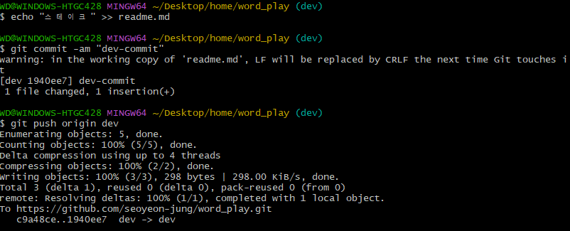
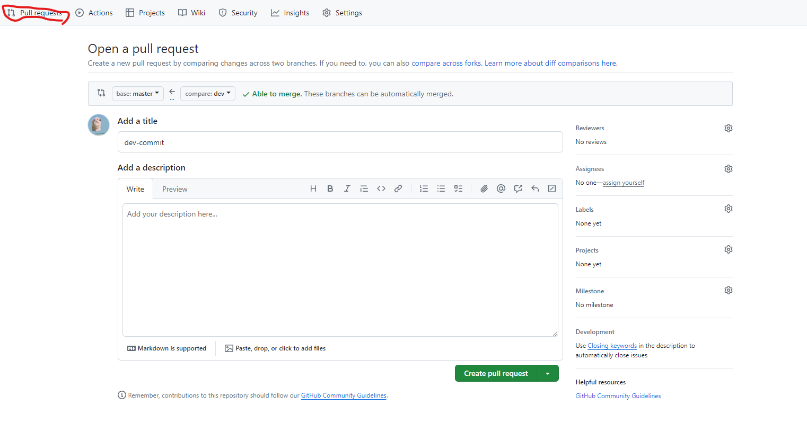
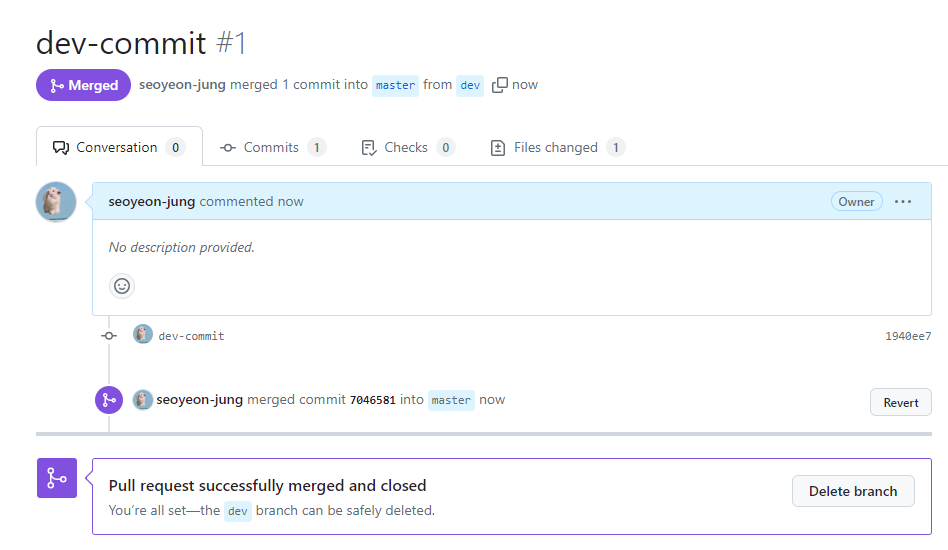

## 목차

1. [Git과 버전 관리](#git과-버전-관리)
2. [Shell의 기초 명령어](#shell의-기초-명령어)
3. [Git&Github 기초](#git--github-기초-cli)
4. [Git & Github 실습](#git--github-실습)
5. [Git & Github 실습 - pull request](#git--github-실습---pull-request)

<br/>
<br/>
<br/>

# Git과 버전 관리

- 버전 관리 시스템을 이용하면 버전관리는 물론 변경점 관리, 백업 및 복구, 협업에 큰 이점이 잇다
- 특정 시점으로 돌아갈 수 있다
- 특정 변경 지점에서부터 다양한 버전으로 개발할 수 잇다
- 수정된 내용을 쉽게 공유할 수 있다
- 버전 관리 : 협업하는 과정에서 코드를 쉽게 나누고 합치며 개발할 수 있도록 도와주는 것

### Git

- 컴퓨터 파일의 변경사항을 추적하고 여러 명의 사용자들 간에 해당 파일들의 작업을 조율하기 위한 분산 버전 관리 시스템

<br/>
<br/>
<br/>

# shell의 기초 명령어

- 자동완성 : `tab` 사용
- 현재 작업중인 경로 확인: `pwd` (print working directory)
- 현재 디렉토리 내부 리스트 출력: `ls` (List)
  - `-l`: 자세히 보기
  - `-a`: 숨김 파일 포함 보기
- 파일 내용 확인 : `cat 파일명.확장자`
- 작업 경로 변경 : `cd 경로` (change directory)
  - `..` : 상위 폴더
  - `.`: 현재 위치
  - `~` : 홈 경로
- 폴더 생성: `mkdir 폴더명`
- 삭제: `rm`(remove)
  - 파일 삭제: `rm 파일명`
  - 강제 삭제: `rm -f 파일명`
  - 폴더 삭제: `rm -r 폴더명`  
     [-r 옵션을 사용해 재귀적으로 하위 파일까지 복사]
- 파일 생성: `touch 파일명`
- 파일에 문구 입력: `echo [문구] >> [파일명]`
- 복사: `cp` (copy)
  - 파일 복사: `cp 파일명 복사할위치경로`
  - 폴더 복사: `cp -r 폴더명 복사할위치경로`  
     [-r 옵션을 사용해 재귀적으로 하위 파일까지 복사]
- 이동: `mv` (move)
  - `mv 파일명 이동할위치경로`
  - `mv 폴더명 이동할위치경로`
- 이름 바꾸기: `mv 현재파일이름 바꿀파일이름`

<br/>
<br/>
<br/>

# Git & Github 기초 (CLI)

### `git init`

- git repository 생성( 초기화)
  - 다음 명령부터는기본 브랜치 이름이 나타난다
- git은 로컬 저장소(내가 만든 버전의 정보, 원격 저장소의 주소 등)를 저장한다.
- git이 있는 경로 아래에는 새로운 git이 있어서는 안된다

### `git status`

- 현재 git repository의 상태를 확인
- `No commits yet`: 아직 어떠한 커밋(저장)도 없는 상태

### `git add`

- 특정 파일을 스테이징 영역(staging area)에 추가한다
  - staging area : 변경된 내용이 저장소에 기록되기 전에 대기하는 장소
- `git add .` : 현재 폴더에 존재하는 모든 파일들을 한번에 스테이징 영역에 추가
- `git rm --cached [file]` : 스테이징 영역에 추가한 파일에 대해서 스테이징 취소

### `git commit -m "커밋 메세지"`
- git에 변경사항 기록
- nothing to commit, working tree clean : 변경사항 없음

### `git reset`

- 이전 commit으로 되돌린다.
- 다른 사람과 코드 공유가 되어 있지 않은 상태에서 사용

### `git log`

- commit 기록을 볼 수 있다
- `git log --oneline` : 커밋한 메세지도 볼수 있다


### `git checkout`


- `git checkout <커밋ID>` : main 브랜치는 그대로 유지하면서 해당 커밋 ID로 돌아갈 수 있다

### `git switch`

- `git switch -c [브랜치명]` : [브랜치명]으로 브랜치를 변경할 수 있다
- `git branch`: 로컬 저장소가 가진 브랜치를 볼 수 있다

### `git clone`

- 원격 저장소의 주소를 복사해 로컬 저장소에 복사하는 명령어

<br/>
<br/>
<br/>

# Git & Github 실습

### 1. 원격 저장소 연결

```bash
git init
git remote add origin [repository 주소]
```

### 2. 원격 저장소에 push

```bash
git add .
git commit -m "first commit"
git push -u origin master
```

### 3. 원격 저장소 가져오기

```bash
git clone [repository 주소]
```

### 4. 원격 저장소에서 변경된 부분 로컬 저장소로 가져오기

```bash
git remote update
git pull
```

<br/>
<br/>
<br/>

# Git & Github 실습 - pull request

### 1. 새로운 브랜치 생성

```bash
git switch -c [브랜치명]
git checkout -b [브랜치명]
```

### 2. 새로운 브랜치에서 기능 구현


### 3. pul request 생성



### 4. 기본 브랜치에 merge


<br/>
<br/>
<br/>

# github-pages 만들기 실습
[바로가기](https://github.com/seoyeon-jung/seoyeon-jung.github.io)