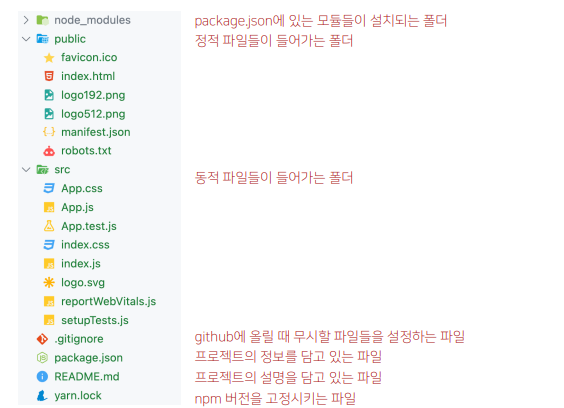
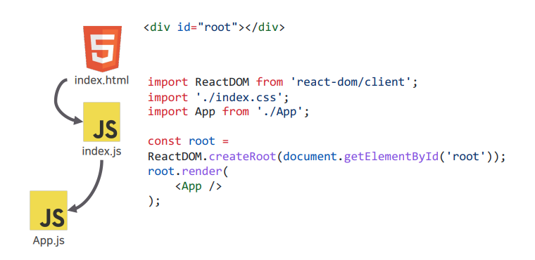

## 목차
- [SPA (Single Page Application)](#spa-single-page-application)
    - [장점](#장점)
    - [단점](#단점)
- [React](#react)
    - [컴포넌트](#컴포넌트)
    - [리액트의 동작 방식](#리액트의-동작-방식)
- [JavaScript](#javascript)
      - [`javascript` 폴더 참조](#javascript-폴더-참조)
- [React 시작하기](#react-시작하기)
    - [프로젝트 구조](#프로젝트-구조)
    - [JSX 문법](#jsx-문법)
    - [컴포넌트](#컴포넌트-1)
    - [props](#props)
      - [defaultProps](#defaultprops)
      - [props children](#props-children)
      - [props drilling](#props-drilling)
    - [state](#state)

<br/>
<br/>
<br/>

# SPA (Single Page Application)
- 한개의 페이지로 이루어진 앱
- MPA(Multi Page Application)과 상반된 개념
### 장점
- 딱 한 개의 페이지로 구성된 애플리케이션 (Augular,Vue와 비슷한 기술)
- 서버에 1회 리소스를 요청
- 필요한 데이터만 받아와 새로고침 없이 데이터 수정이 가능
- 자연스러운 UX구현이 가능
- React를 이용하면 안드로이드/iOS모바일 앱까지 제작 가능 (Expo)
### 단점
- 싱글 페이지이기 때문에 SEO에 취약
- 이를 보안하기 위해 `NextJS`가 등장

<br/>
<br/>
<br/>

# React
- 2013년에 페이스북에서 발표한 오픈소스 자바스크립트 프레임워크
- 가상 DOM(Documentobjectmodel)과 JSX(JavaScriptXML)방식으로 동작하는 프레임워크
- SPA(SinglePageApplication)개발을 위한 프레임워크
- 가상 DOM(VirtualDOM) 개념에 의해 동작하는 프론트엔드 프레임워크
- 가상 DOM개념은 Angular,Vue.js와 같은 프론트엔드 프레임워크에서도 볼 수 있음
- 가상 DOM을 이해하려면 리액트 프로제트의 동작 방식에 대한 이해가 필요
### 컴포넌트
- 재사용이 가능한 블럭
- Header/Body/Footer안에도 많은 컴포넌트들이 존재
- MPA기반 애플리케이션은 하나의 변경사항을 위해 전체 페이지를 리로딩해야 하지만, SPA기반 애플리케이션은 컴포넌트를 단위로 변경사항을 반영한다.
### 리액트의 동작 방식
- ReactJS:어플리케이션이 아주 interactive하도록 만들어주는 library.
- ReactDOM:모든 Reactelement들을 HTMLbody에 둘 수 있도록 해준다.
- render:Reactelement를 가지고 HTML로 만들어 배치한다.(사용자에게 보여준다)
- ReactJS는 우리가 해왔던 방식을 거꾸로 한다.
  - 바닐라 JS:HTML- JavaScript- HTML
  - ReactJS:JavaScript- HTML
- JavaScript를 이용해 element를 생성했고 ReactJS가 그걸 HTML로 번역!

<br/>
<br/>
<br/>

# JavaScript
#### `javascript` 폴더 참조
1. [00_obj_copy.js](./javascript/00_obj_copy.js)   
2. [01_spread_op.js](./javascript/01_spread_op.js)   
3. [02_arrow_func.js](./javascript/02_arrow_func.js)   
4. [03_map.js](./javascript/03_map.js)   
5. [04_filter.js](./javascript/04_filter.js)   
6. [05_forEach.js](./javascript/05_forEach.js)   
7. [06_reduce.js](./javascript/06_reduce.js)   


<br/>
<br/>
<br/>

# React 시작하기
### 프로젝트 구조


### JSX 문법
- ReactJS를 위해 확장된 문법
- 중괄호 { }를 사용하면 JavaScript표현식 삽입이 가능
- 일반적인 HTML태그와 속성 사용이 가능
- 컴포넌트 렌더링 가능
- 태그 속성을 통한 이벤트 핸들링
- 단일 태그도 태그를 닫아야 한다.
- `className=""`, `htmlFor=""`로 작성해야 한다.
- 인라인 스타일은 객체 형태로 사용하며 `-`을 사용할 수 없다.
- if문 대신 삼항 조건 연산자를 사용한다.
- 주석: `{/* */}`
### 컴포넌트
  - UI 요소를 표현하는 최소한의 단위이며 화면 특정 부분이 어떻게 생길지 정하는 선언체
  - 컴포넌트는 반드시 첫 글자는 대문자 (파스칼케이스)
  - 폴더는 소문자로 시작하는 카멜케이스
### props
- 부모 컴포넌트가 자식 컴포넌트에게 물려준 데이터
- 컴포넌트 간의 정보 교환 방식으로 데이터를 교환하는 한 가지 방법
- props는 반드시 위에서 아래 방향 즉,[부모] ➜ [자식] 방향 (단반향)으로 흐른다.
- props는 반드시 읽기 전용으로 취급하며,변경하지 않아야 한다.
#### defaultProps
- props를 적지 않아도 기본값으로 나오는 props
```javascript
const MyComponent = props => {
    return <div>안녕하세요. 제 이름은 {props.name}입니다.</div>;
};

MyComponent.defaultProps = {
    name: '기본 이름'
};

export default MyComponent;
```
#### props children
- 태그 사이의 내용을 보여 주는 children
- 비구조화 할당 문법을 통해 props 내부 값 추출 가능
- props children은 Layout 컴포넌트를 만들 때 자주 사용한다

<br/>

```javascript
const MyComponent = ({ name, children }) => {
    return (
        <div>
            안녕하세요. 제 이름은 {name}입니다. <br />
            children 값은 {children}입니다.
        </div>
    );
};

MyComponent.defaultProps = {
name: '기본 이름'
};

export default MyComponent
```
#### props drilling
- [부모] → [자식] → [그 자식] → [그 자식의 자식]에서 부모 데이터를 이용하기 위해서는
무려 3번이나 데이터를 내려줘야 한다.
- 문제점
  - 부모의 `props`를 전달 받는 과정을 보면,불필요한 중간다리 역할들이 존재한다.
  - 이렇게 깊이가 너무 깊어지면 이 prop이 어떤 컴포넌트로부터 왔는지 파악이 어렵다.
  - 어떤 컴포넌트에서 오류가 발생할 경우 추적이 힘들어지니 대처가 늦게 된다.
  - 그래서 등장한 것이 reactcontextAPI이다.
  이를 useContext hook을 이용하면 쉽게 `전역 데이터를 관리`할 수 있다.

<br/>

### state
- 앱 또는 컴포넌트의 ‘상태’
- 데이터가 가진 값,모달이 열려 있는지 여부,어떤 값이 선택되었는지 등... 모든 것들이 '상태'이다.
- 그리고 모든 ‘상태’에 따라 특정 값을 ‘render’한다
- state는 컴포넌트 내부에서 바뀔 수 있는 값으로,렌더링을 일으키는 동적인 값(변수)
- state는 컴포넌트 내부에서 선언되어,컴포넌트의 렌더링 결과에 영향을 준다.