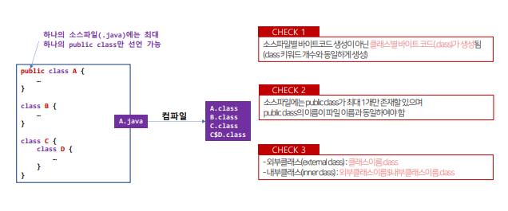
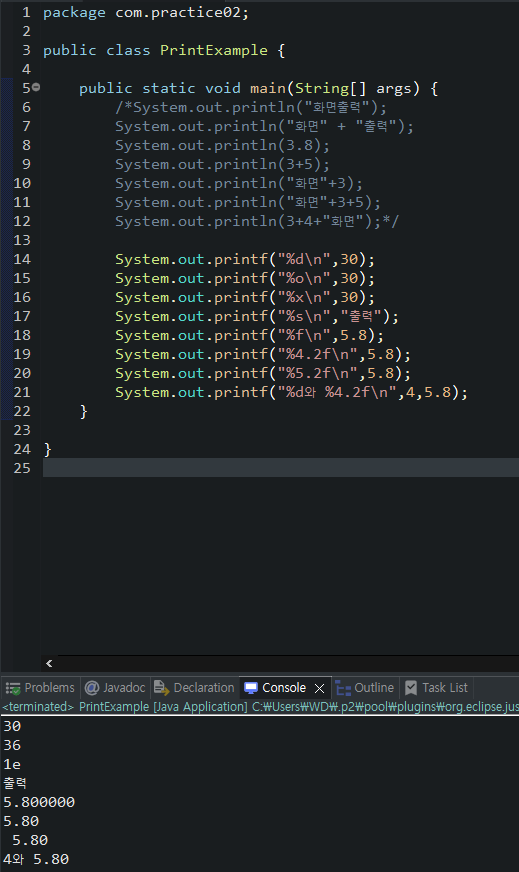
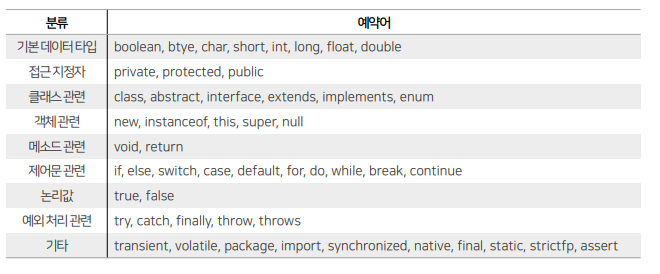
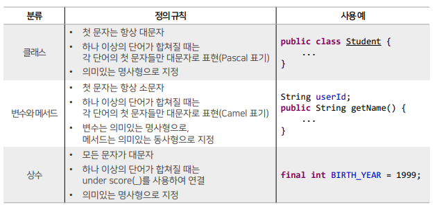
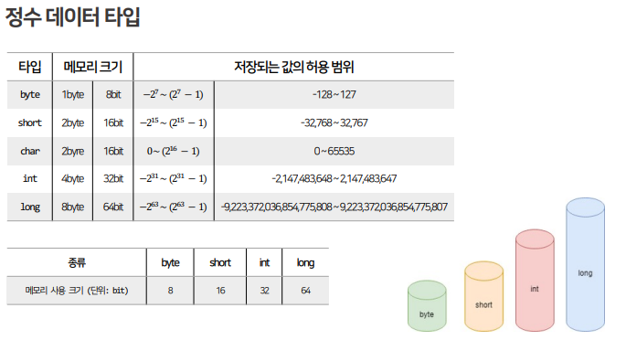
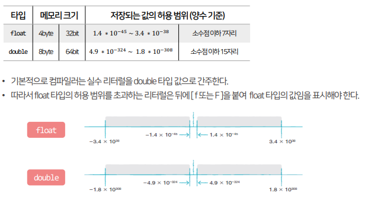

## 목차
1. [소스코드의 기본 분석](#소스코드의-기본-분석)
2. [식별자](#식별자)
3. [데이터 타입](#데이터-타입)

<br/>
<br/>
<br/>


# Java
## 소스코드의 기본 분석
```java
/* 패키지 선언 */
package com.mypackage.util;
/* 패키지 가져오기 */
import java.lang.*; // 해당 패키지 내 모든 클래스를 불러옴
/* 클래스 블록 */
public class Main {
    /* 메소드 블록 */
    public static void main(String[] args) {
        /* 명령문(statement) */
        int result = add(1, 2);
        System.out.println(result);
    }
    /* 메소드 블록 */
    public static int add(int a, int b) {
        return a + b;
    }
}
```
###  주석
   - `/*주석 내용 */`:여러 줄 주석
   - `//주석 내용` :한 줄 주석
### 클래스
```Java
public class Test{
    …
}
```
- public : 접근지정자 키워드 (파일 당 최대 1개)
- class : 클래스 선언 키워드
- public클래스 이름은 소스 파일 이름과 동일하게 작성
### 메소드
```java
public static void main(String[] args){
    …
}
```
- public:접근지정자 키워드
- static:정적 메소드 키워드
- void:반환 타입 지정
- 메소드 이름
- (매개변수)
### 기본 구조 분석
1. 컴파일 (이클립스 저장 시 자동 컴파일)   
`소스 파일 생성 -> 바이트코드 생성`
2. 실행   
`-> JVM(메모리 할당)`
3. 메서드 영역에 클래스 로딩   
`-> main 메소드 실행`
### 컴파일과 바이트 코드 생성

#### `bin` 폴더
  - 실행 가능한 바이너리 파일들이나 스크립트를 저장하는 디렉토리
  - 보통 컴파일된 `.class` 파일들을 저장하는 디렉토리
  - `.class` 파일: 자바 소스 코드(.java 파일)를 컴파일한 결과물로, 자바 가상 머신(JVM)이 이 파일들을 실행할 수 있는 형태
### 콘솔 출력 메서드와 문자열 출력
- `println` : 줄바꿈하면서 출력
- 문자열은 쌍따옴표("")안에만 표기 가능
- String 자료형의 '+' 연산
  - String + String = String
  - String + 기본자료형 = String
  - 기본자료형 + String = String
- `print()` 메서드: 괄호한의 내용 출력
- `printf()` 메서드 : 자료형 포맷에 따라 출력
- 문자열 실습 예시


<br/>
<br/>
<br/>

## 식별자
- Java 코드 내에서 사용되는 각각의 단어
#### 식별자 지정 규칙
- Java는 대소문자를 구분한다.
- 첫문자는 반드시 영문자 또는 `_,$`여야한다.
- 그 다음 문자부터는 숫자와 문자를 혼합하여 사용 가능하다.
#### 식별자의 종류
1. 시스템 정의 식별자 
   - Java 시스템이 필요에 의해 먼저 정의해 둔 식별자
   - "예약어", "키워드"라고 부른다.

2. 사용자 정의 식별자 
- 개발자가 필요에 의해 정의한 식별자
-  "클래스명, 변수명, 메서드명"을 지정할 때 사용한다.
  

<br/>
<br/>
<br/>

## 데이터 타입
1. 기본 데이터 타입 (PrimitiveDataType,PDT) : 정수형, 실수형, 논리형, 문자형
2. 참조 데이터 타입 (ReferenceDataType,RDT) : 기본 데이터 타입을 제외한 모든 데이터 타입
## 리터럴
#### Java 언어가 처리하는 실제 값을 의미한다.
1. 문자
   - 하나의 문자를 의미하며, 반드시 작은 따옴표로 표현한다.
2. 문자열
   - 하나 이상의 문자나 열을 의미하며, 반드시 큰 따옴표로 표현한다.
3. 정수
   - 음수, 양수, 0으로 구성된 정수 데이터이다.
   - 10진수, 2진수, 8진수, 16진수로 표현 가능하다.
4. 실수
   - 소수점을 가진 실수 데이터이다.
5. 논리
   - 참/거짓을 표현할 때 사용하는 논리데이터이다
## 변수
- 컴퓨터의 메모리(RAM)는 수많은 주소들로 구성되어 있는 데이터 저장공간이다.
- 프로그램은 데이터를 메모리에 저장하고 읽는 작업이 반복되는데, 데이터를 어디에 어떤 방식으로 저장할지 결정하기 위해서는 변수를 사용해야 한다.
- 변수(Variable)는 하나의 값을 저장할 수 있는 메모리 주소에 붙여진 이름이다.
-  변수를 통해 프로그램은 메모리 주소에 값을 저장하고 읽을 수 있다
- Java의 변수는 다양한 타입의 값을 저장할 수 없다.
- 즉, 정수형 변수에는 정수값만 저장할 수 있고, 실수형 변수에는 실수값만 저장 가능하다.
### 변수 선언
`데이터타입 변수명;`
- 어떤 타입의 데이터를 어떤 이름으로 저장할지를 결정하는 것
### 변수의 선언과 대입
- 변수의 선언은 저장할 데이터의 형식(Type)과 이름만을 결정한 것이지, 메모리에 저장된 것은 아니다.
- 변수에 최초로 값이 대입될 때 메모리에 할당되고, 해당 메모리에 값이 저장된다.
 
<br/ >

```java
package com.practice03;

public class VariableExample {

	public static void main(String[] args) {
		int score; // 변수 선언
		score = 95; // 변수 초기화(할당)
		score = 90; // 변수 값 변경
		
		int myScore = 100; // 변수 선언과 초기화 동시에
		
		int age, height, weight; // 같은 타입의 여러 변수 한번에 선언
		//System.out.println(age); // 초기화 하지 않고 사용해서 error 발생

	}

}
```
### 변수의 사용 범위
- 블록({}) 내부에서 선언되고 사용된다. (블록 scope)
<hr/>

- 지역 변수(local variable) : 메소드 블록 내부에서 선언되어, 메소드 블록 내부에서 사용되는 변수
- 멤버 변수(member variable) : 클래스 블록 내부에서 선언되어, 클래스 블록 내부에서 사용되는 변수(필드, 속성)
  - 인스턴스 변수(instance variable) : static이 붙지 않은 변수로 외부에서 사용할 때 반드시 `new` 연산자로 객체를 생성해서 사용
  - 클래스 변수(static variable) : 객체를 생성하지 않고도 접근이 가능한 변수
- 지역은 메소드, 멤버는 클래스
### 상수
- 값이 변경될 수 없는 것
- `final` 키워드를 사용하여 변수를 상수로 만들 수 있다
- 일반적으로 상수명은 대문자로 설정한다.
  ```java
  final int BIRTH_YEAR = 1999;
  ```

### 정수 데이터 타입

```java
package com.practice05;

public class IntExample {
	public static void main(String[] args) {
		long var1 = 10;
		long var2 = 20L;
		long var3 = 2_147_483_647;
		long var4 = 2147483648L;
		
		// int var5 = 2147483648;
		
		System.out.println(var1); // 10
		System.out.println(var2); // 10
		System.out.println(var3); // 2147483647
		System.out.println(var4); // 2147483648
		//System.out.println(var5); // Type mismatch: cannot convert from long to int
		//System.out.println(var5); // The literal 2147483648 of type int is out of range
	}
}
```
### 문자 데이터 타입
- 하나의 문자는 작은 따옴표로 감싸 표시하며, 이를 문자 리터럴이라 한다.
- 문자 리터럴은 유니코드로 변환되어 저장된다.
```java
char var1 = 'A'; // 65로 대입
char var2 = '가'; // 44032로 대입
```
- 유니코드가 정수이므로 char 타입도 정수 타입에 속한다
- 유니코드 숫자를 직접 대입할 수도 있다.
- 빈 문자열은 컴파일 에러가 발생한다.
- 공백 문자는 유니코드:32 또는 공백 하나를 포함한 문자(`' '`)를 사용해야 한다.
### 실수 데이터 타입

### 논리 데이터 타입
- 참과 거짓을 의미하는 논리 리터럴은 true와 false이다.
- 논리 리터럴은 boolean 타입 변수에 대입 가능하다.
- boolean 타입 변수는 주로 두 가지 상태값을 저장할 필요가 있을 때 사용하며,
 상태값에 따라 조건문과 제어문의 실행흐름을 변경하는데 사용된다.
- 비교 및 논리 연산의 결과값은 true 또는 false를 가지므로, boolean 타입 변수에 대입할 수 있다.
### 문자열 데이터 타입
- `String` 타입이다.
- 문자열 내부의 [\]는 이스케이프 문자를 뜻함
- 이스케이프 문자를 사용하면 특정 문자를 포함시키거나, 문자열의 출력을 제어할 수 있다.
- `\n`: 줄바꿈
- `\"`: 문자열 내부에 "문자 포함
- `\t`: tap
- `\r`: 캐리지 리턴 (맨 앞으로 커서가 이동)
```java
package com.practice07;

public class StringExample {
	public static void main(String[] args) {
		String name = "홍길동";
		String job = "프로그래머";
		System.out.println(name); // 홍길동
		System.out.println(job); // 프로그래머
		
		String str = "나는 \"자바\"를 배웁니다.";
		System.out.println(str); // 나는 "자바"를 배웁니다.
		
		str = "번호\t이름\t직업";
		System.out.println(str); // 번호	이름	직업
		
		System.out.print("나는\n");
		System.out.print("자바를\n");
		System.out.print("배웁니다");
	}
}
```

<br/>
<br/>
<br/>

## 타입 변환
### 자동 타입 변환 (Promotion)
- 자동으로 데이터 타입의 변환이 일어나는 것
- 값의 허용 범위가 작은 타입이 허용 범위가 큰 타입으로 대입될 때 발생한다.
- `byte < short, char < int < long < float < double`
- int 타입이 byte 타입보다 허용 범위가 더 크기 때문에 자동 타입 변환이 된다.
- 정수 타입이 실수 타입으로 대입될 경우에는
 실수 타입이 정수 타입보다 허용 범위가 더 크기 때문에 무조건 자동 타입 변환이 된다.
- [예외] char 타입보다 허용 범위가 작은 byte 타입은 char 타입으로 자동 변환될 수 없다. 
  - (char의 허용범위에는 음수를 포함하지 않는데, byte 타입은 음수를 포함하기 때문)
### 강제 타입 변환 (Casting)
- 큰 허용 범위 타입을 작은 허용 범위 타입으로 쪼개어 저장하는 것
- 캐스팅 연산자인 괄호를 사용하는데, 괄호 안에 작은 허용 범위 타입을 기재한다.
- 데이터의 누수가 생길 수 있다.
- 작은 허용 범위 타입에 저장될 수 있는 값을 가지고 강제 타입 변환을 해야 한다.
```java
		int var1 = 10;
		byte var2 = (byte) var1;
		System.out.println(var2); // 10

		long var3 = 300;
		int var4 = (int) var3;
		System.out.println(var4); // 300

		int var5 = 65;
		char var6 = (char) var5;
		System.out.println(var6); // A

		double var7 = 3.14;
		int var8 = (int) var7;
		System.out.println(var8); // 3 (데이터 누락 발생)
```