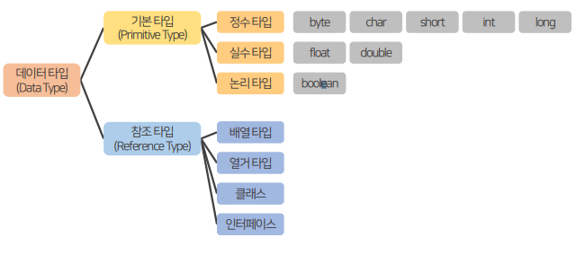
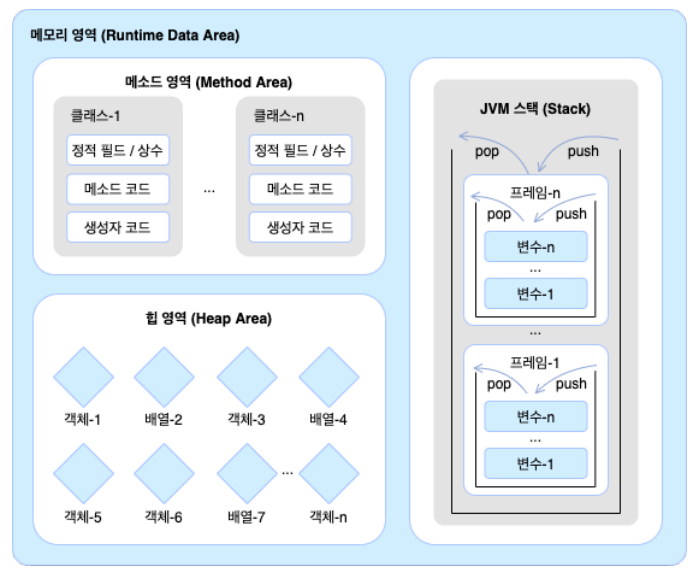

## 목차
1. [Statement](#statement)
2. [참조 타입](#참조-타입)
3. [문자열 타입](#문자열string-타입)

<br/>
<br/>
<br/>

# Statement

- statement : Java 프로그래밍에서 소스 코드에 입력시키는 문장
- 순차문 : 메서드 내의 문장 중에서 순차적으로 실행되는 문장은 반드시 `세미콜론(;)`으로 끝난다
- 제어문 : 프로그램의 흐름에 영향을 주고, 때에 따라 제어가 가능하다. 모든 제어문은 중첩이 가능하다.
- 주석문 : 실제 프로그램에 영향을 주지 않으며 단지 소스코드의 기능이나 동작을 설명하기 위해 사용되는 문장이다.
## 제어문

- 자바 프로그램은 main() 메서드의 시작부터 끝가지 위에서부터 아래로 실행하는 흐름을 가지고 잇다.
- 이러한 실행 흐름을 개발자가 원하는 방향으로 바꿀 수 있도록 해주는 것이 제어문이다.
- 조건식과 중괄호 블록으로 구성되는데, 조건식의 연산 결과에 따라 블록 내부의 실행 여부가 결정된다.
- 제어문 블록 내에 또 다른 제어문 사용이 가능하다.
### 제어문의 종류
- 조건문 (if문, switch문)
  - 제어문 블록을 마친 후, 정상 흐름으로 돌아온다
- 반복문 (for문, while문, do-while문)
  - 제어문 블록을 마친 후, 다시 제어문으로 되돌아가 반복 실행(looping)된다.
- break문 : 반복문을 빠져나갈 때 또는 switch문을 빠져나갈 때 쓰인다
- continue문 : 반복문에서 현재 진행되는 회차를 포기하고 다음 회차로 이동한다
### If문
- 조건식에는 true, false 값을 산출할 수 있는 연산식이나 boolean 변수가 올 수 있다.
- 조건식이 true이면 블록을 실행하고, false이면 블록을 실행하지 않는다.
### If-else문
- If 문의 조건식이 true이면 if문 블록이 실행되고, false이면 else 블록이 실행된다.
```java
Scanner sc = new Scanner(System.in);
System.out.print("점수 입력 : ");
int score = sc.nextInt();

if (score >= 60) {
    System.out.println("축하합니다.");
    System.out.println("합격입니다.");
} else {
    System.out.println("불합격입니다.");
}
```
### If-else If 문
- 조건문이 여러 개인 if 문
- 범위를 높은 곳부터 적어야 한다.
- else if문은 상위 조건식이 false일 경우 평가되고, else if가 true이면 해당 블록이 실행된다
- 마지막에는 else 블록을 추가하여, 모든 조건식이 false인 경우 실행되도록 할 수 있다.
### Switch문
- 변수의 값에 따라 실행문에 결정되기 때문에 if문보다 코드가 간결해진다
- 괄호 안의 변수값에 따라 해당 case로 가서 실행문을 실행시킨다.
- `break`는 다음 case를 실행시키지 않고 switch 문을 빠져나가기 위해 필요하다.
- switch문의 괄호에는 정수 타입(byte,char,short,int)과 문자열 타입(String) 변수, enum타입 변수를 사용할 수 있다.
- 변수값과 동일한 값을 갖는 case가 없으면, default로 가서 실행시킨다. default는 생략 가능하다.
```java
    String id = "990101-1234567";
	int genderNum = id.charAt(7) - '0';

	switch (genderNum % 2) {
		case 0:
			System.out.println("여성입니다.");
			break;
		case 1:
			System.out.println("남성입니다.");
			break;
	}
```
### 개선된 switch문 (switch expressions)
- Java12 이후부터 switch문에서 표현식을 사용할 수 있다.
- break문을 없애는 대신 화살표와 중괄호를 사용해 가독성이 개선되었다.
- 실행문이 하나만 있을 경우에는 중괄호를 생략할 수 있다.
```java
    Scanner sc = new Scanner(System.in);
	System.out.print("등급을 입력하세요: ");
	char grade = sc.nextLine().charAt(0);

	sc.close();

	System.out.println("등급: " + grade);

	int score = switch (grade) {
		case 'A', 'a' -> 100;
		case 'B', 'b' -> 90;
		case 'C', 'c' -> 80;
		case 'D', 'd' -> 70;
		case 'E', 'e' -> {
			yield 60;
		}
		case 'F', 'f' -> 0;
		default -> {
			yield 0;
		}
	};
	System.out.println("score: " + score);
```
### for 문
- 반복되는 코드의 양을 for문을 통해 획기적으로 줄일 수 있다.
- `for (변수초기화; 조건식; 증감식) { 실행문 }`
- for문 괄호 내부에서 선언된 변수는 for문 안에서만 사용되는 지역(local) 변수이다.
- 변수는 하나일 수도 있고, 둘 이상이 될 수도 있다. 이런 경우에는 쉼표로 구분해서 작성한다.
```java
    int sum = 0;

	// 45~99까지 더하기
	for (int i = 45; i < 100; i++) {
		sum += i;
	}
	System.out.println("합: " + sum);
```
- 중첩 for문
  - 바깥 for문이 한 번 실행될 때마다, 중첩된 for문은 지정횟수만큼 반복하고 다시 바깥 for문으로 돌아간다.
  ```java
    int rows = 5;
    for (int i = 1; i <= rows; i++) {
        for (int j = 1; j <= i; j++) {
            System.out.print("* ");
        }
        System.out.println();
    }

    //바깥 for문은 5바퀴
    // 1. 안쪽 for문 1바퀴 "* "
    // 2. 안쪽 for문 2바퀴 "* * "
    // 3. 안쪽 for문 3바퀴 "* * * "
    // 4. 안쪽 for문 4바퀴 "* * * * "
    // 5. 안쪽 for문 5바퀴 "* * * * * "
  ```
### while문
- 조건식이 true일 경우에 계속해서 반복하고 false가 되면 반복을 멈춘다.
- `while (조건식) { 실행문 }`
- while문의 조건식에 true를 사용하면 실행문이 무한 반복하게 되고, 언젠가 while문을 빠져나가기 위한 코드가 필요하다.
- 무한 반복하는 while문을 빠져나가는 또 하나의 반복은 break를 이용하는 것이다.
### do-while문
- 실행문을 먼저 실행시키고 조건식을 평가하여 반복 실행 여부를 결정한다.
- `do { 실행문 } while(조건식);`
### break문
- break는 `for문`, `while문`, `do-while문`의 실행을 중지하거나 조건문의 `switch문`을 종료할 때 사용한다.
- break는 대부분 if문과 같이 사용되어 조건식에 따라 반복문을 종료한다.
- 중첩되어있는 경우 가장 가까운 반복문만 종료하고, 바깥족 반복문까지 종료시키지 않는다.
- 만약 중첩된 반복문에서 바깥쪽까지 종료시키기 위해서는
 바깥쪽 반복문에 이름(Label)을 붙이고, `[break이름;]`을 사용하면 된다.
```java
Outter: for (char upper = 'A'; upper <= 'Z'; upper++) {
	for (char lower = 'a'; lower <= 'z'; lower++) {
		System.out.println(upper + " - " + lower);

		if (lower == 'c') {
			break Outter;
		}
	}
}
```
### continue문
- 반복문인 for문, while문, do-while문에서만 사용된다.
- continue문이 실행되면 for 문의 증감식 또는 while, do-while문의 조건식으로 바로 이동하게 된다.
- break문은 반복문을 종료하지만, continue문은 해당 반복을 건너뛰고 다음 반복을 계속해서 수행한다는 점에서 다르다.

<br/>
<br/>
<br/>

# 참조 타입

- 객체의 메모리 주소를 참조하는 타입
- 배열, 열거, 클래스, 인터페이스 타입
- 기본 타입으로 선언된 변수는 값 자체를 저장하고 있지만, 참조 타입으로 선언된 변수는 **객체가 생성된 메모리 주소** 를 저장한다.   


- 변수들은 모두 **스택(Stack)** 이라는 메모리 영역에 생성된다.
- 기본 타입 변수는 스택 영역에 직접 값을 저장하는 반면, 참조 타입 변수는 스택 영역에 **힙 메모리 영역의 주소를 저장**한다.
<hr/>

## JVM 구동 시 운영 체제에서 할당받은 메모리 영역

#### 메소드 영역
- 바이트코드 파일 내용이 저장되는 영역 (이클립스의 bin폴더)
- 클래스 별로 상수, 정적 필드, 생성자 코드 등이 저장된다.
#### 힙 영역
- 객체가 생성되는 영역
- 객체의 메모리 주소는 메소드 영역과 스택 영역에서 참조된다.
#### 스택 영역
- 메소드를 호출할 때마다 생성되는 프레임이 저장되는 영역
- 프레임 내부의 변수 스택에 변수가 생성되고 제거된다.

<br/>
<br/>

## 참조 타입 변수의 동등 비교
- 참조 타입 변수의 ==, != 연산자는 값을 비교하는 것이 아니라 메모리 주소를 비교하는 것
- 번지가 같다면 동일한 객체를 참조하는 것이고, 다르다면 다른 객체를 참조하는 것이다.

<br/>
<br/>

## null과 NullPointException
- 참조 타입 변수는 아직 메모리 주소를 저장하고 있지 않다는 의미로 null 값을 가질 수 있다.
- null 값으로 초기화된 변수는 스택 영역에 생성되기 때문에 ==, != 연산자로 null 값 비교가 가능하다.

```java
    String name = "정서연";
	String noName = null;

	System.out.println(name == noName); // false
	// null 값이지만 비교 가능

	// 참조 데이터 타입에서 가장 많ㄹ이 발생하는 Exception 은 NullPointerException
	// null 인 상태에서 접근할 때 발생한다.
	// System.out.println(noName.charAt(0));
```
- 프로그램 실행 도중에 발생하는 오류를 예외(Exception)라고 부른다.
- 참조타입 변수 사용 시, 가장 많이 발생하는 예외 중 하나는 `NullPointerException`이다.
- `NullPointerException`은 변수가 null인 상태에서 객체의 데이터나 메소드를 사용하려 할 때 발생
```java
    String[] names = { "A", "B", "C" };
	//String[] names = { "A", "B", "C", null };

	for (int i = 0; i < 4; i++) {
		String name = names[i];
		System.out.println(name.charAt(0));
		// A, B, C 출력 이후 에러 발생
		// Exception in thread "main" java.lang.ArrayIndexOutOfBoundsException: Index 3
		// out of bounds for length 3
		// at com.reference.basic.ReferenceExample3.main(ReferenceExample3.java:19)
	}
```
- 경우에 따라서는 참조 타입 변수에 일부러 null을 대입하기도 한다.
- 변수에 null을 대입하면 메모리 주소를 잃게 되므로 더 이상 객체를 사용할 수 없게 된다.
- 즉, 힙(heap) 메모리에는 있지만, 위치 정보를 알 수 없게 되었기 때문에 사용이 불가능해진다.
- Java는 이런 객체를 쓰레기(Garbage)로 취급하고, 가비지콜렉터(GarbageCollector)를 실행시켜 자동으로 제거한다.

<br/>
<br/>
<br/>
<br/>

# 문자열(String) 타입
- String 변수에 문자열 리터럴을 대입하는 것이 일반적이지만, new 연산자로 직접 String 객체를 생성하고 대입할 수도 있다.
- 이 경우 서로 다른 메모리 주소를 가지게 된다.
- 내부 문자열만을 비교하기 위해서는 `equals()` 메소드를 사용 해야 한다.
```java
String name1 = "정서연";
String name2 = "정서연";

if (name1 == name2) {
	System.out.println("name1과 name2는 참조가 같음");
} else {
	System.out.println("name1과 name2는 참조가 다름");
}

String name3 = new String("정서연");
String name4 = new String("정서연");

if (name3 == name4) {
	System.out.println("name3과 name4는 참조가 같음");
} else {
	System.out.println("name3과 name4는 참조가 다름");
}

if (name1.equals(name4)) {
	System.out.println("name1과 name4는 문자열이 같음");
}

// name1과 name2는 참조가 같음
// name3과 name4는 참조가 다름
// name3과 name4는 참조가 다름
```
- String 변수에 빈 문자열("")을 대입할 수도 있다.
- 빈 문자열도 String 객체로 생성되기 때문에 equals() 메소드를 사용해야 한다.
- 특정 위치의 문자를 얻고자 한다면 `charAt()` 메소드를 이용할 수 있다.
  - 인덱스란 0번째부터 문자열 길이 -`가지의 문자열 내부 위치 번호를 의미한다.
- 문자의 개수를 알고 싶다면 `length()` 메소드를 사용한다.
```java
        String subject = "자바 프로그래밍";
		char var = subject.charAt(3);
		int len = subject.length();

		System.out.println(var); // 프
		System.out.println(len); // 8
```
- 특정 문자열을 다른 문자열로 대체하고 싶다면 `replace()` 메소드를 사용한다.
- `replace()` 메소드는 기존 문자열은 그대로 두고, 대체할 새로운 문자열을 반환한다.
- String 문자열은 변경이 불가능한 특성을 갖고 있다.
```java
    String subject = "자바 프로그래밍";
	String subject2 = subject.replace("자바", "java");

	System.out.println(subject); // 자바 프로그래밍
	System.out.println(subject2); // java 프로그래밍
```
- 특정한 문자열을 잘라내어 가져오고 싶다면 `substring()` 메소드를 사용한다.
```java
    String address = "cik@java.co.kr";
	String userId = address.substring(0, 3);
	String companyName = address.substring(4, 8);
	String domainAddr = address.substring(4);

	System.out.println("userId: " + userId); // cik
	System.out.println("companyName: " + companyName); // java
	System.out.println("domainADdr: " + domainAddr); // java.co.kr
```
- 특정 문자열의 위치를 찾고자 할 때는 `indexOf()` 메소드를 사용한다.
- `indexOf()` 메소드는 주어진 문자열이 시작되는 인덱스를 반환한다.
- 존재하지 않으면 -1을 반환한다.
- 혹은 `index < 0` 으로 조건을 제시하면 없을 때의 조건을 만들 수 있다.
```java
		String lyrics = "떳다 떳다 비행기 날아라 날아라";

		int flyIndex = lyrics.indexOf("날아라");
		System.out.println(flyIndex + "번째 글자: " + lyrics.charAt(flyIndex));
		// 10번째 글자: 날

		int highIndex = lyrics.indexOf("높이");
		if (highIndex == -1) {
			System.out.println("없는 글자입니다.");
		}
		// 없는 글자입니다.
```
- 특정 문자열의 위치가 아닌, 단순히 포함되어 있는지 여부를 확인하기 위해서는 `contains()` 메소드를 사용한다.
- `contain()` 메소드는 원하는 문자열이 포함되어 있으면 true, 그렇지 않으면 false를 반환한다.
```java
		Scanner sc = new Scanner(System.in);
		System.out.print("책 제목을 입력하세요: ");
		String title = sc.nextLine();

		sc.close();

		if (title.contains("자바") || title.contains("Java") || title.contains("java")) {
			System.out.println("Java와 관련된 책이군요.");
		} else {
			System.out.println("Java와 관련없는 책이군요.");
		}
```
- 특정 문자로 분리하기 위해서는 `split()` 메서드를 사용한다.
- `split()` 메소드는 문자열로 구성된 배열을 반환한다.
```java
		String rainbow = "빨,주,노,초,파,남,보";
		String[] rainbowArr = rainbow.split(",");

		for (int i = 0; i < rainbowArr.length; i++) {
			String color = rainbowArr[i];
			System.out.println(color);
		}
```