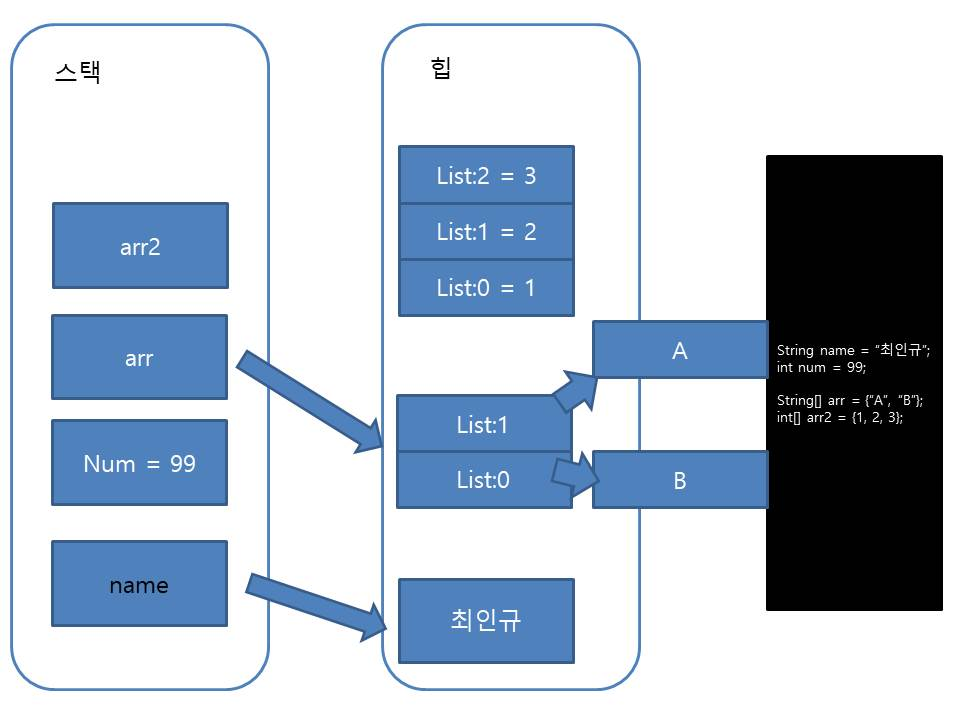

## 목차
- [배열 타입](#배열-타입)
    - [배열 변수 선언](#배열-변수-선언)
    - [배열 특징](#배열-특징)
    - [배열 복사](#배열-복사)
    - [향상된 for문](#향상된-for문)
    - [main() 메서드의 String\[\] args](#main-메서드의-string-args)
  - [배열 메서드 \[import java.util.Arrays;\]](#배열-메서드-import-javautilarrays)
    - [배열 정렬](#배열-정렬)
    - [배열 출력](#배열-출력)
- [스택과 힙](#스택과-힙)

<br/>
<br/>
<br/>
<br/>

# 배열 타입
- 배열은 연속된 공간에 값을 나열시키고, 각 값에 인덱스(index)라는 위치번호를 부여해 놓은 자료구조이다.
- 인덱스는 대괄호([])와 함께 사용하여 각 항목의 값을 읽거나 저장하는 데 사용된다.
- 배열은 같은 타입의 값만 관리한다.
- 배열의 길이는 늘리거나 줄일 수 없다.
- 배열의 인덱스는 0부터 시작한다.
- int 배열은 int 타입의 값만 관리하고, String 배열은 문자열만 관리한다.
- 배열은 생성과 동시에 길이가 결정되기 때문에 한번 결정된 배열의 길이는 늘리거나 줄일 수 없다.
```java
int[] score = { 100, 70, 75, 43, 96 };
int sum = 0;

for (int i = 0; i < score.length; i++) {
	sum += score[i];
}

System.out.println("총합: " + sum);
```
### 배열 변수 선언
```java
int[] intArr;
String[] strArr;

int intArr1[];
String strArr1[];
```
- 두 가지 방법 중 주로 첫 번째 방식을 사용한다.
- 참조 변수이기 때문에 힙 영역에 생성되고 해당 메모리 주소를 저장한다.
- 참조할 배열이 없다면 배열 변수도 null로 초기화할 수 있다.
- 중괄호({}) 내부에 값을 나열하면 배열 변수에 선언과 동시에 값을 할당할 수도 있다.
- 값을 변경하고 싶다면 인덱스와 대입 연산자를 사용하면 된다.
```java
// int 배열 선언 및 초기화
int[] intArr1 = { 1, 2, 3 };
// string 배열 선언 및 초기화
String[] strArr1 = { "유재석", "김종국", "지석진" };

int intArr2[] = { 4, 5, 6 };
String strArr2[] = { "하하", "개리", "이광수" };

// 개리 -> 양세찬
strArr2[1] = "양세찬";
// 이광수 -> 송지효
strArr2[2] = "송지효";

for (int i = 0; i < strArr2.length; i++) {
	String name = strArr2[i];
	System.out.println(name);
    // 하하, 양세찬, 송지효 출력
}
```
<hr/>

### 배열 특징
- 배열 변수를 선언한 시점과 값 목록을 대입하는 시점이 다른 경우에는 `new 타입[]`을 중괄호 앞에 붙여주면 된다.
```java
String[] season;
// season = { "봄", "여름", "가을", "겨울" }; // 컴파일 에러
season = new String[] { "봄", "여름", "가을", "겨울" };

for (int i = 0; i < season.length; i++) {
	System.out.println(season[i]);
}

// 배열의 길이가 변경된 것이 아니라, 다른 배열ㅇ르 여견해주어서 변경된 것처럼 보이는 것
season = new String[] { "Spring", "Summer", "Autumn" };
// 값은 변경된 게 아니라 새로운 주소와 연결만 시켜둔 것(연결은 끊겼기 때문에 쓰레기 객체로 남아있음)
// 길이는 절대 변경 불가이므로 Winter 를 제거해도 에러가 발생하지 않는다.

for (int i = 0; i < season.length; i++) {
	System.out.println(season[i]);
}
```
- 메소드의 매개변수가 배열 타입인 경우에도 
매개값으로 중괄호로 감싼 값 목록만을 주면 안되고, `new 타입[]`을 중괄호 앞에 붙여서 전달해야 한다.
- 메소드의 매개변수가 배열 타입인 경우에도 
매개값으로 중괄호로 감싼 값 목록만을 주면 안되고, `new 타입[]`을 중괄호 앞에 붙여서 전달해야 한다.
```java
	public static void main(String[] args) {
		String[] menus = { "햄버거", "떡볶이", "불백", "김치찜" };
		printItems("점심메뉴", menus);

		menus = new String[] { "제육볶음", "스파게티", "치킨", "순대국밥" };
		printItems("새로 바뀐 점심메뉴", menus);
	}

	public static void printItems(String name, String[] strArr) {
		System.out.println(name + "을 출력합니다.");

		for (int i = 0; i < strArr.length; i++) {
			System.out.println("\t" + strArr[i]);
		}
	}
```
<hr/>

- 값의 목록은 존재하지 않지만, 나중에 값들을 저장할 목적으로 특정 길이의 배열을 미리 생성할 수도 있다.
  ```java
  타입[] 변수명 = new 타입[길이];

  int[] numArr = new int[10];
  boolean[] boolARr = new boolean[3];
  String[] nameArr = new String[5];
  ```
- new 연산자로 특정 길이의 배열을 처음 생성하면, 배열 항목은 기본값으로 초기화 된다.

<hr/>

- 다차원 배열(N차원 배열)
- 배열 안에 또 다른 배열 대입 가능
```java
// 다차원 배열(뱅려 안에 또 다른 배열이 대입되는 것)
int[] arr1 = { 0, 0, 0 };
int[] arr2 = { 1, 2, 3 };
int[] arr3 = { 4, 5, 6 };

// 2차원 배열(차원의 수만금 [] 붙는다)
int[][] arr4 = { arr1, arr2, arr3 };
System.out.println(arr4[2][2]); // 6

int[][] arr5 = { { 0, 0, 0 }, { 1, 2, 3 }, { 4, 5, 6 } };
System.out.println(arr5[2][2]); // 6

// {{0,0},{0,0},{0.0},{0,0}}
int[][] arr6 = new int[4][2]; // 길이만 설정하고 초기값은 0인 배열
System.out.println(arr6[2][1]); // 0

// {{0,0,0}, {0,0}, {0,0,0}}
int[][] arr7 = new int[3][];
arr7[0] = new int[3];
arr7[1] = new int[2];
arr7[2] = new int[3];
```
<hr/>

### 배열 복사
- 기본 타입 배열은 각 항목에 값을 저장하지만, 참조 타입 배열은 각 항목에 객체의 번지를 저장한다.
```java
int[] numbers = new int[3];
numbers[0] = 10;
numbers[1] = 20;
numbers[2] = 30;
// 메모리 상의 연속된 공간을 차지, 인덱스 위치에 직접 정수값 저장

String[] words = new String[3];
words[0] = "Hello";
words[1] = "World";
words[2] = "Java";
// 각 인덱스 위치에 문자열 객체의 메모리 주소 저장
```
- 배열은 한 번 생성하면 길이를 변경할 수 없다.
- 더 많은 저장공간이 필요하다면 더 큰 길이의 배열을 새로 만들고 이전 배열로부터 항목들을 복사해야 한다.
```java
// 배열의 길이를 늘리는 방법1
int[] oldArr = { 1, 2, 3 };

// 길이 세개인 old 배열을 다섯개로 늘리자
int[] newArr = new int[5]; // {0, 0, 0, 0, 0}
for (int i = 0; i < oldArr.length; i++) {
	newArr[i] = oldArr[i];
}

// 배열의 길이를 늘리는 방법2 = array copy
// System.arraycopy(원본 배열, 복사를 시작할 위치, 새배열, 붙여넣기 시작할 위치, 복사할 개수);
int[] oldArr2 = { 1, 2, 3 };
it[] newArr2 = new int[5];

System.arraycopy(oldArr2, 0, newArr2, 0, 0);
```
<hr/>

### 향상된 for문
- 카운터 변수와 증감식을 사용하지 않고도 항목의 개수만큼 반복한 후 자동으로 for문을 빠져나가는 향상된 for문이 있다.
- `for (타입 변수 : 배열) { 실행문; }`
```java
String[] subjects = { "HTML", "CSS", "JavaScript", "Java", "CS" };

// 향상된 for 문
// 반복하면서 Java 라는 글자가 있으면 출력하고 없으면 넘어가자
for (String subject : subjects) {
	if (subject.contains("Java")) {
		System.out.println(subject);
	}
}
```
<hr/>

### main() 메서드의 String[] args
- `String[] args`는 main() 메서드가 호출될 때 전달하는 값이다
- 윈도우의 명령 프롬포트나 맥OS의 터미널에서 프로그램을 실행하게 되는 경우 요구하는 값이 필요한 경우에 사용된다.
```java
package com.reference.list;

public class ListBasic9 {

	public static void main(String[] args) {
		for (String word : args) {
			System.out.println(word);
		}
	}
}
```
- show in > Terminal
   
- Run > RunConfiguration > Arguments > Programarguments(값입력) > Apply > Run
  
<hr/>

## 배열 메서드 [import java.util.Arrays;]
### 배열 정렬
- Arrays를 활용할 정렬 (오름차순으로 정렬)
```java
package com.reference.list;

import java.util.Arrays;

public class ListBasic10 {

	public static void main(String[] args) {
		int[] arr = { 1, 9, 8, 4, 2, 3, 5, 7, 6 };
		Arrays.sort(arr);

		for (int i : arr) {
			System.out.print(i + ", ");
			// 1, 2, 3, 4, 5, 6, 7, 8, 9,
		}

		System.out.println();

		String[] arr2 = { "carrot", "apple", "dragon", "banana" };
		Arrays.sort(arr2);

		for (String str : arr2) {
			System.out.print(str + " ");
			// apple banana carrot dragon
		}
	}
}
```
### 배열 출력
- `Arrays.toString()`
```java
int[] arr = { 1, 9, 8, 4, 2, 3, 5, 7, 6 };
Arrays.sort(arr);

System.out.println(Arrays.toString(arr));
// [1, 2, 3, 4, 5, 6, 7, 8, 9]
```

<br/>
<br/>
<br/>

# 스택과 힙
