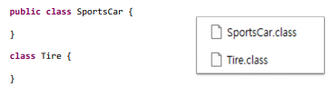
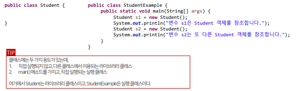
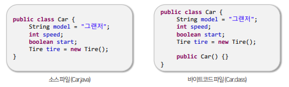
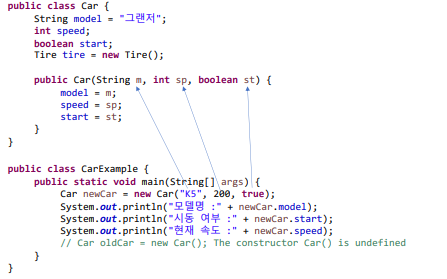

## 목차
- [객체지향 프로그래밍 (Object Oriented Programming)](#객체지향-프로그래밍-object-oriented-programming)
  - [객체지향 프로그래밍의 특징](#객체지향-프로그래밍의-특징)
    - [캡슐화](#캡슐화)
    - [상속](#상속)
    - [다향성](#다향성)
- [클래스](#클래스)
  - [클래스 구성 멤버](#클래스-구성-멤버)
  - [필드](#필드)
  - [생성자](#생성자)
  - [메소드](#메소드)
- [인스턴스 멤버 \& 정적 멤버](#인스턴스-멤버--정적-멤버)
  - [인스턴스 멤버](#인스턴스-멤버)

<br/>
<br/>
<br/>
<br/>

# 객체지향 프로그래밍 (Object Oriented Programming)
- 소프트웨어를 개발할 때 부품에 해당하는 객체를 먼저 만들고, 이 객체들을 하나씩 조립해서 완성하는 기법
- 객체(Object) : 물리적으로 존재하거나 개념적인 것 중에서 다른 것과 식별 가능한 것
  - 객체의 속성 = 필드(Field)
  - 객체의 동작 = 메서드(Method)
- 객체 모델링(Object Modeling) : 현실 세계 객체의 대표 속성과 동작을 추려내어 소프트웨어 객체의 필드와 메소드로 정의하는 과정

<hr/>

- 객체들의 상호작용 수단은 메소드(method)다.
- 메소드 호출 : `메소드명(매개값1, 매개값2, ...);`
  - 매개값: 메소드가 실행할 때 필요한 값
  - 메소드이 리턴값은 호출한 곳에서 변수로 대입받아 사용할 수 있다.
- `타입 변수명 = 메소드명(매개값1, 매개값2, ...);`
- 리턴값 : 메소드를 실행한 결과로 반환된 값(호출한 곳으로 돌려주는 값)
<hr/>

- 객체의 관계
  

## 객체지향 프로그래밍의 특징
### 캡슐화
- 객체의 필드, 메소드를 하나로 묶고 실제 구현 내용을 외부에 감추는 것.
- 외부에서는 객체 내부의 구조를 알지 못하고 객체가 노출해서 제공하는 필드와 메소드만을 사용할 수 있다.
- 외부의 잘못된 사용으로 객체가 손상되는 것을 방지
- Java에서는 캡슐화를 위해 `접근 제한자(Access modifier)`를 사용한다.
### 상속
- 부모 객체는 자식 객체에게 필드와 메소드를 물려주어 자식 객체가 사용할 수 있도록 할 수 있다.
- 상속을 하면 코드의 재사용성을 높일 수 있다.
- 부모 객체에서 필드와 메소드를 수정하면, 자식 객체들은 수정된 필드와 메소드를 사용할 수 있기 대문에 유지보수 시간을 단축할 수 있다.
### 다향성
- 동일한 사용 방법이나 다양한 결과가 나타나는 성질을 의미
- 프로그램을 구성하는 객체를 바꾸면 프로그램의 실행 성능이 달라질 수 있다.
- 다양성을 구현하기 위해서는 `자동 타입 변환`과 `재정의(Overriding) 기술`이 필요하다.

<br/>
<br/>

# 클래스
- Java에서는 클래스(Class)가 객체를 생성하기 위한 설계도 역할을 한다.
- 클래스로부터 객체가 생성되는 과정을 인스턴스화라고 하며, 생성된 객체는 `인스턴스(Instance)`라고 부른다.
- 클래스 선언은 객체 생성을 위한 설계도를 작성하는 작업이기 때문에 
  - `어떻게 객체를 생성하고(생성자)`,
  -  `객체가 가져야 할 데이터가 무엇이고(필드)`,
  -   `객체의 동작은 무엇인지(메소드)`   
  를 포함한다.
  
<br/>

```java
public class 클래스명 {
}
// 공개 클래스는 어느 위치에 있던 패키지와 상관없이 사용할 수 있는 클래스를 의미
// 하나의 소스 파일에는 소스 파일명과 동일한 하나의 클래스만 공개 클래스로 선언할 수 있다.
```

<br/>

- 하나의 소스 파일에는 여러 클래스를 선언할 수 있다.
- 여러 클래스 선언이 포함된 소스 파일을 컴파일 하면 바이트 코드 파일(.class)는 클래스 선언 수만큼 생겨난다.

- 특별한 이유가 없다면 파일 하나당 클래스 하나를 선언하는 것이 좋다.

<hr/>

- 선언된 클래스로부터 객체를 생성하기 위해서는 객체 생성 연산자인 `new`가 필요하다.
- new 연산자는 객체를 생성시킨 후 객체의 주소를 반환한다. (힙 메모리 영역에 저장)
- new 연산자 뒤에 생성자 호출 코드가 있다.
- `클래스명 변수명 = new 클래스명();`



## 클래스 구성 멤버
```java
public class ClassName{
    // 필드 선언
    int filedName;

    // 생성자 선언
    ClassName() {
    }

    // 메소드 선언
    int methodName() {
    }
}
```

<br/>

1. `생성자`
   - 객체 생성 시 초기화 역할 담당
   - new 연산자로 객체 생성
   - 메소드와 유사한 선언 ㅎ여태를 가지나, 반환 타입이 없다
   - 생성자 이름은 반드시 클래스 이름과 동일 해야 한다.
2. `필드`
   - 객체의 데이터가 저장되는 곳
   - 객체의 데이터를 저장하는 역할
   - 선언 형태는 변수 선언과 동일하지만 쓰임새는 다르다.
3. `메소드`
   - 객체의 동작으로 호출 시에 실행되는 블록
   - 객체 간의 상호작용을 위해 호출된다
   - 객체 내부의 함수를 메소드라 한다.

<br/>
<br/>

## 필드
- 필드는 객체의 속성 데이터를 저장하는 용도로 사용되며, 선언하는 방법은 변수선언과동 일하다.
- 단, 반드시 클래스 블록 내부에서 선언되어야 필드 선언이 된다.
- 필드는 객체 내부에 존재하고, 객체 내부와 외부에서 모두 사용 가능하다.
- 클래스를 통해 객체가 생성될때 생성되며, 객체가 제거될 때 삭제된다.
- 초기화를 하지 않을 경우에는 자동으로 기본값으로 초기화된다.
- 필드를 사용한다는 것은 필드값을 읽고 변경하는 것을 의미한다.
- 필드는 객체의 데이터이므로, 클래스로부터 객체가 생성된 후에 필드를 사용할 수 있다.
- 필드는 객체 내부의 생성자와 메소드 내부에서 사용할 수 있으며, 객체 외부에서도 접근해서 사용할 수 잇다.
- 객체 외부에서는 참조 변수와 객체 접근 연산자(.)를 이용해 필드를 읽고 변경할 수 있다.

```java
// Car.java
public class Car {
	String model = "람보르기니";
	// String model; => null 출력
	int speed = 300;
	// int speed; => 0 출력 (초기값)
	boolean start = true;
	// booelan start; => false 출력 (초기값)
	Tire tire = new Tire();
}

```
```java
public class CarExmaple {

	public static void main(String[] args) {
		Car myCar = new Car();

		System.out.println("내 자동자 모델은? " + myCar.model);
		System.out.println("내 자동차는 지금 시동이 걸려있나? " + myCar.start);
		System.out.println("내 자동차의 속도는? " + myCar.speed + "km/h");
		System.out.println("내 자동차 휠의 브랜드는? " + myCar.tire.brand);
		System.out.println(myCar);

		myCar.start = false;
		myCar.speed = 200;
		System.out.println("내 자동차는 지금 시동이 걸려있나? " + myCar.start);
		System.out.println("내 자동차의 속도는? " + myCar.speed + "km/h");

		System.out.println();

		Car fatherCar = new Car();

		fatherCar.model = "포르쉐 911";
		System.out.println("내 자동자 모델은? " + fatherCar.model);
		System.out.println("내 자동차는 지금 시동이 걸려있나? " + fatherCar.start);
		System.out.println("내 자동차의 속도는? " + fatherCar.speed + "km/h");
		System.out.println("내 자동차 휠의 브랜드는? " + fatherCar.tire.brand);
		System.out.println(fatherCar);

		System.out.println(fatherCar == myCar); // false (메모리 주소가 다름)

	}

}
```

<br/>

## 생성자
- 객체를 생성할 때 사용하는 new 연산자는 객체를 생성한 후 곧바로 생성자를 호출해 객체를 초기화한다.
  - 객체 초기화 : 필드를 초기화하거나 메소드를 호출해서 객체를 사용할 준비를 하는 것 
- 모든 클래스에는 하나 이상의 생성자가 존재한다.
- 하지만 클래스에 생성자 선언이 없어도 객체 생성은 가능하다.   
   -> 클래스에 생성자 선언이 없으면, 컴파일러는 기본 생성자를 자동을 추가시키기 때문
   
- 개발자가 명시적으로 선언한 생성자가 있다면 컴파일러는 기본 생성자를 추가하지 않는다.
  
- 객체마다 동일한 값을 가져야 한다면, 필드 선언 시 초기값을 대입하는 것이 좋고, 
- 객체마다 다른 값을 가져야 한다면, 생성자에서 필드를 초기화하는 것이 좋다.

<hr/>

- 필드명과 동일한 매개변수 이름을 사용하기 위해서 `this` 키워드를 필드명 앞에 붙여야 한다.
  - `this`는 현재 객체를 의미한다.   
```java
public class Korean {
	String nation = "대한민국";
	String name, ssn;

	public Korean(String name, String ssn) {
		this.name = name;
		this.ssn = ssn;
	}
}
```

<hr/>

- 오버로딩(Overloading) : 매개변수가 다른 생성자를 여러 개 선언하는 것
- 다양하게 초기화를 하기 위해서는 생성자 오버로딩이 필요하다.
- 생성자 오버로딩 시에 주의할 점은 매개변수의 타입, 개수, 순서가 다르게 선언되어야 한다는 것이다.
- 생성자 오버로딩 시 중복된 코드가 발생할 수 있다.
- 공통 코드를 한 생성자에만 집중적으로 작성하고, 나머지는 `this`를 사용하여 공통 코드를 가지고 있는 생성자를 호출하는 방법으로 개선할 수 있다.

```java
public class Car {
	String model = "그랜저";
	String color = "검정";
	int speed;
	boolean start;

	Car() {
		System.out.println("기본 생성자 호출");
	}

	Car(String model) {
		System.out.println("모델명 생성자 호출");
		this.model = model;
	}

	Car(String model, String color) {
		System.out.println("모델명, 색상명 생성자 호출");
		this.model = model;
		this.color = color;
	}

	Car(String model, String color, int speed) {
		System.out.println("모델명, 색상명, 스피드 생성자 호출");
		this.model = model;
		this.color = color;
		this.speed = speed;
	}

	Car(String model, String color, int speed, boolean start) {
		System.out.println("모델명, 색상명, 스피드, 시동여부 생성자 호출");
		this.model = model;
		this.color = color;
		this.speed = speed;
		this.start = start;
	}

}
```
```java
public class CarExample {

	public static void main(String[] args) {
		Car c1 = new Car();
		System.out.println(c1.model + ", " + c1.color + ", " + c1.speed + ", " + c1.start);
		// 기본 생성자 호출
		// 그랜저, 검정, 0, false

		System.out.println();

		Car c2 = new Car("소나타");
		System.out.println(c2.model + ", " + c2.color + ", " + c2.speed + ", " + c2.start);
		// 모델명 생성자 호출
		// 소나타, 검정, 0, false

		System.out.println();

		Car c3 = new Car("니로", "빨강");
		System.out.println(c3.model + ", " + c3.color + ", " + c3.speed + ", " + c3.start);
		// 모델명, 색상명 생성자 호출
		// 니로, 빨강, false

		System.out.println();

		Car c4 = new Car("폭스바겐", "파랑", 10);
		System.out.println(c4.model + ", " + c4.color + ", " + c4.speed + ", " + c4.start);
		// 모델명, 색상명, 스피드 생성자 호출
		// 폭스바겐, 파랑, 10, false

		System.out.println();

		Car c5 = new Car("테슬라", "분홍", 300, true);
		System.out.println(c5.model + ", " + c5.color + ", " + c5.speed + ", " + c5.start);
		// 모델명, 색상명, 스피드 생성자 호출
		// 테슬라, 분홍, 300, true

	}

}
```

<br/>
<br/>

## 메소드
- 메소드 선언 : 객체의 실행 동작을 실행 블록에 정의하는 것을 의미
- 메소드 호출 : 실행 블록을 실제로 실행하는 것
- `반환타입 메소드명(타입 매개변수) {
    실행할 코드
  }`
<hr/>

- 리턴 타입(Return Type)
  - 메소드가 실행된 후 호출한 곳으로 전달하는 결과값의 데이터 타입
  - 만약 반환되는 값이 없다면 리턴 타입을 void로 작성해야 한다.
- 메소드명
  - 소문자로 시작하는 Camel Case로 작성한다
- 매개변수
  - 메소드를 호출할 때 전달한 매개값을 받기 위해 사용
  - 전달할 매개값이 없다면 생략 가능
<hr/>

- 메소드를 호출한다는 것은 메소드 블록을 실행하는 것이다.
- 메서드는 객체의 동작이므로 객체가 존재하지 않으면 메소드를 호출할 수 없다.(필드와 마찬가지)
- 클래스로부터 객체가 생성된 후에는 생성자와 또다른 메소드 내부에서 호출할 수 있으며, 객체 외부에서도 호출할 수 있다.
- 객체 내부에서는 메소드명으로 호출하면 되지만, 객체 외부에서는 참조변수와 객체 접근 연산자(.)를 이용해 메소드를 호출할 수 있다.

```java
public class Calculator {
	boolean power; // 전원 field (기본값 false)

	// 전원 끄기
	void poweroff() {
		System.out.println("전원을 끕니당~");
		this.power = false;
	}

	// 전원 키기
	void powerOn() {
		System.out.println("전원을 킵니당~");
		this.power = true;
	}

	// 사칙연산
	int plus(int x, int y) {
		return power ? x + y : null;
	}

	double divided(int x, int y) {
		return power ? (double) x / y : null;
	}
}
```

```java
public class CalculatorExample {

	public static void main(String[] args) {
		Calculator calc = new Calculator();
		calc.powerOn(); // 전원 키기

		int plusResult = calc.plus(5, 6);
		System.out.println("result1: " + plusResult); // result1: 11

		int x = 10;
		int y = 4;
		double divideResult = calc.divided(x, y);
		System.out.println("result2: " + divideResult); // result2: 2.5

		calc.poweroff();

	}

}
```

<br/>

<hr/>

- 메소드를 호출할 때는 매개변수의 개수에 맞게 매개값을 제공해야 한다.
- 매개값의 개수가 때에 따라 달라지는 경우에는 `가변 길이 매개변수`를 사용할 수 있도록 메소드를 선언해야 한다.
- `반환타입 메소드명(타입 ... 매개변수) { 실행할 코드 };`
- 메소드 선언에 리턴 타입이 void가 아니라면 반드시 return문 뒤에 반환값을 저장해야 한다.
- return 문 뒤의 실행문은 절대 실행되지 않는다.
```java
	int sum(int... values) {
		if (power) {
			int result = 0;
			for (int i : values) {
				result += i;
			}
			return result;
		}

		return 0;
	}
```
```java
		int sumResult = calc.sum(new int[] { 1, 2, 3, 4, 5, 6 });
		System.out.println("result5: " + sumResult); // result5: 21
```
<hr/>

- 메소드도 오버로딩이 가능하다.
- 같은 클래스 내부에 메소드의 이름은 같지만 매개변수의 타입, 개수, 순서가 다른 메소드를 선언하는 것을 의미한다.
- 메소드 오버로딩의 가장 큰 목적은 다양한 매개값을 처리하기 위함이다.
- 메소드 오버로딩의 가장 대표적인 예는 콘솔에 출력하는 `System.out.println()` 메소드이다.
```java
	int sum(int... values) {
		if (power) {
			int result = 0;
			for (int i : values) {
				result += i;
			}
			return result;
		}

		return 0;
	}

	double sum(double... values) {
		double result = 0;
		if (power) {
			for (double i : values) {
				result += i;
			}
			return result;
		}
		return 0;
	}
```
```java
		int sumResult = calc.sum(new int[] { 1, 2, 3, 4, 5, 6 });
		System.out.println("result5: " + sumResult); // result5: 21

		double sumResult2 = calc.sum(new double[] { 1.0, 2.5, 3.45 });
		System.out.println("result6: " + sumResult2); // result6: 6.95
```

<br/>
<br/>
<br/>

# 인스턴스 멤버 & 정적 멤버
- 필드와 메소드는 선언 방법에 따라 인스턴스 멤버와 정적 멤버로 분류할 수 있다.
- 인스턴스 멤버(Instance Member)
  - 객체에 소속된 멤버
  - 객체를 생성해야만 사용할 수 있는 멤버
- 정적 멤버(Static Member)
  - 클래스에 고정된 멤버
  - 객체 없어도 사용할 수 있는 멤버

<br/>

## 인스턴스 멤버