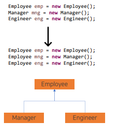
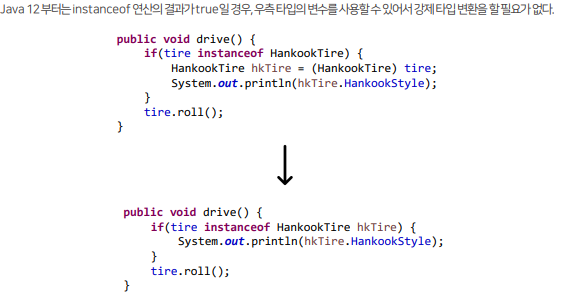
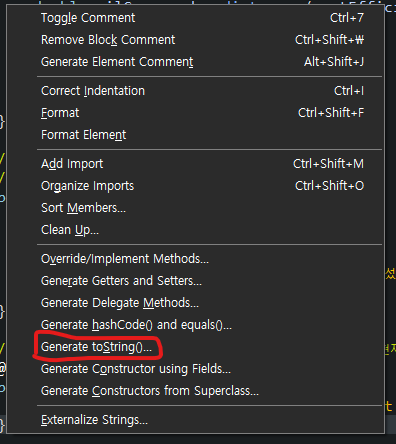
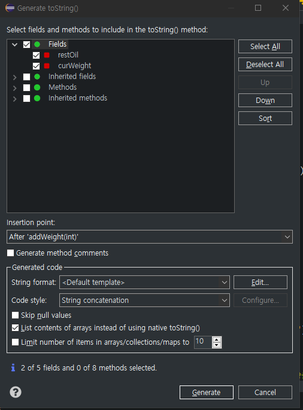

## 목차
- [오버라이딩](#오버라이딩)
- [final](#final)
    - [final 클래스](#final-클래스)
    - [final 메소드](#final-메소드)
- [protected](#protected)
- [타입 변환](#타입-변환)
  - [자동 타입 변환(Promotion)](#자동-타입-변환promotion)
  - [강제 타입 변환(Casting)](#강제-타입-변환casting)
- [다향성](#다향성)
- [instanceof](#instanceof)
- [Object 클래스](#object-클래스)
    - [toString() 메소드 재정의](#tostring-메소드-재정의)
- [](#)

<br/>
<br/>
<br/>
<br/>

# 오버라이딩
- 메소드 오버라이딩을 사용하면, 부모 메소드 대신 자식 메소드가 사용된다.
- 따라서 부모 메소드에서 약간의 코드를 추가하여 재정의를 하려는 경우, 부모 메소드와 중복된 내용을 자식 메소드에 작성해야 한다.
- 이러한 문제는 자식 메소드 내에서 부모 메소드를 호출하는 것으로 해결할 수 있다.
- 자식 메소드 내에서 super 키워드와 객체 접근 연산자(.)를 활용하면 숨겨진 부모 메소드를 호출할 수 있다.

<br/>
<br/>
<br/>
<br/>

# final
- 필드 선언 시에 final을 붙이면 초기값 설정 후 값을 변경할 수 없는 상수가 되었다.
### final 클래스
  - 클래스에 final을 붙이면 상속할 수 없는 클래스가 된다.
  - 즉, 부모 클래스가 될 수 없다.
### final 메소드
  - 메소드에 final을 붙이면 오버라이딩할 수 없는 메소드가 된다.
  - 즉, 자식 클래스에서 물려받은 그대로 쓸 수 밖에 없는 메소드가 된다

<br/>
<br/>
<br/>
<br/>

# protected 
- 접근 제한자를 통해 클래스에 접근할 수 있는 범위를 결정하거나 객체 외부에서 필드, 생성자, 메소드의 접근 여부를 결정했다.
- `protected` 접근 제한자는 필드, 생성자, 메소드에서 쓰이는 접근 제한자로 상속과 관련이 있다.
- `public`은 패키지와 관계없이 어디서든 사용가능하고, `(default)`는 다른 패키지에서의 접근을 제한한다.
- `protected`는 그 중간에 해당하며, 같은 패키지이거나 다른 패키지라면 자식클래스만 접근할 수 있도록 허용한다.

<br/>
<br/>
<br/>
<br/>

# 타입 변환
- 클래스의 타입 변환은 상속 관계에 있는 클래스 사이에 발생한다.
```java
int intValue = 10;
long longValue = intValue; // 범위가 더 크므로 타입 변환 가능

Manager mng = new Manager();
Employee emp = mng;
```


<br/>

## 자동 타입 변환(Promotion)   
- `Parents p = new Child();`
- 자식은 부모의 특징과 기능을 상속받기 때문에 부모와 동일하게 취급될 수 있다.
- 부모 타입으로 변환한 경우에는 부모 클래스에 선언된 필드와 메소드만 접근할 수 있게 된다.
- 그러나 자식 클래스에서 오버라이딩된 메소드가 있다면, 오버라이딩된 메소드가 호출된다.
- 즉, 인스턴스 변수 p는 아래의 필드와 메소드를 갖는다.
  - 부모 클래스의 필드
  - 부모 클래스의 메소드, 자식 클래스가 오버라이딩한 메소드
```java
public class Parents {
	private String eyeColor = "갈색";

	public String getEyeColor() {
		return eyeColor;
	}

	public void setEyeColor(String eyeColor) {
		this.eyeColor = eyeColor;
	}

	void walk() {
		System.out.println("뒤뚱뒤뚱");
	}

	void eat() {
		System.out.println("냠냠");
	}
}
```
```java
public class Child extends Parents {
	private String job = "개발자";

	public String getJob() {
		return job;
	}

	public void setJob(String job) {
		this.job = job;
	}

	void hello() {
		System.out.println("안녕하세요");
	}

	@Override
	void walk() {
		System.out.println("뚜벅뚜벅");
	}
}
```
```java
public class InheritanceExample {

	public static void main(String[] args) {
		Parents p = new Parents();
		System.out.println(p.getEyeColor());
		p.eat();// 냠냠
		p.walk(); // 뒤뚱뒤뚱

		System.out.println();

		Child c = new Child();
		System.out.println(c.getEyeColor());
		System.out.println(c.getJob());
		c.eat(); // 냠냠
		c.walk(); // 뚜벅뚜벅
		c.hello(); // 안녕하세요

		System.out.println();

		Parents pc = c;
		System.out.println(pc.getEyeColor());
		pc.eat();
		pc.walk(); // 뚜벅뚜벅
		// 오버라이딩 된 걸 쓰기 때문에 자식에서 가져온 부모는 '뚜벅뚜벅'

	}

}
```
## 강제 타입 변환(Casting)
```java
Parents p = new Child();
Child c = (Child) p;
```
- 자식 타입은 부모 타입으로 자동 변환되지만, 반대로 부모 타입은 자식 타입으로 자동 변환되지 않는다.
- 부모 타입 객체를 자식 타입으로 무조건 강제 변환할 수는 없다.
- 자식 객체가 부모 타입으로 자동변환된 경우에만 강제 타입 변환을 사용할 수 있다.
- 자식 타입에 선언된 필드와 메소드를 사용해야 한다면, 강제 타입 변환을 해서 이용해야 한다.
```java
public class InheritanceExample {

	public static void main(String[] args) {
		Parents p1 = new Parents();
		System.out.println(p1.getEyeColor());
		p1.eat();
		p1.walk(); // 뒤뚱뒤뚱
		
		System.out.println();
		
		Parents p2 = new Child();
		System.out.println(p2.getEyeColor());
		p2.eat();
		p2.walk(); // 뚜벅뚜벅
		Child c = (Child) p2; 
		// 자식 객체가 부모 타입으로 자동 변환된 상태 => 여기서 다시 자식 타입으로 강제 타입 변환
		System.out.println(c.getJob()); // 개발자
		c.hello(); // 안녕하세요

	}

}
```

<br/>

- 다른 예제
```java
public class Animal {
	public void makeSound() {
		System.out.println("일반적인 동물의 소리입니다.");
	}
}
```
```java
public class Dog extends Animal {
	@Override
	public void makeSound() {
		System.out.println("멍멍");
	}

	public void bite() {
		System.out.println("앙!");
	}
}
```
```java
public class AnimalExample {

	public static void main(String[] args) {
		Animal animal = new Animal();
		animal.makeSound();

		// Dog dog = (Dog) animal;
		// dog.makeSound();

		Animal animalD = new Dog();
		animalD.makeSound(); // 멍멍
		// 일반 동물 타입이므로 makeSound만 출력 가능
		// bite()는 불러오지 못한다.

		Dog dog = (Dog) animalD;
		dog.makeSound();
		dog.bite(); // 앙!

		// ==============
		Animal animalC = new Cat();
		animalC.makeSound();

		Cat cat = (Cat) animalC;
		cat.makeSound();
		cat.scratch(); // 벅벅

	}

}
```

<br/>
<br/>
<br/>
<br/>

# 다향성
- 상속(타입변환)을 전제로, 하나의 객체 타입이 여러 타입을 참조할 수 있는 능력을 의미한다.
- 동일한 사용방법이지만 다양한 실행 결과를 나타나게 하는 성질을 가지고 있다.
- 배열에 다형성 적용하기
- 일반적으로 배열은 같은 타입을 저장할 수 있지만, 다향성을 이용하면 또 다른 타입도 저장할 수 있게 된다.
```java
public class Tire {
	public void roll() {
		System.out.println("굴러갑니다");
	}
}
```
```java
public class KumhoTire extends Tire {
	@Override
	public void roll() {
		System.out.println("금호타이어가 굴러갑니다");
	}
}
```
```java
public class HankookTire extends Tire {
	@Override
	public void roll() {
		System.err.println("금호타이어가 굴러갑니다.");
	}

}
```
```java
public class Car {
	private Tire tire;

	public Tire getTire() {
		return tire;
	}

	public void settire(Tire tire) {
		this.tire = tire;
	}

	public void drive() {
		tire.roll();
	}
}
```
```java
public class CarExample {

	public static void main(String[] args) {
		Car c = new Car();
		// 굴러갑니다
		c.settire(new Tire());
		c.drive();

		System.out.println();

		// 금호타이어가 굴러갑니다.
		c.settire(new HankookTire());
		c.drive();

		System.out.println();

		// 금호타이어가 굴러갑니다
		c.settire(new KumhoTire());
		c.drive();

	}

}
```

<br/>
<br/>
<br/>
<br/>

# instanceof
- 변수가 참조하는 객체의 타입을 확인하고자 할 때, instanceof 연산자를 이용할 수 있다.
- instanceof 연산자의 좌측에는 객체, 우측에는 타입을 기술하면 해당 객체와 타입이 일치하는지 여부를 boolean으로 반환한다.
```java
public class InheritanceExample {

	public static void main(String[] args) {
		Parents p = new Parents();
		System.out.println(p.getEyeColor());
		p.eat();// 냠냠
		p.walk(); // 뒤뚱뒤뚱

		System.out.println("Parents p는 Parents의 객체이다? " + (p instanceof Parents)); // true
		System.out.println("Parents p는 Parents의 객체이다? " + (p instanceof Child)); // false
		System.out.println();

		Child c = new Child();
		System.out.println(c.getEyeColor());
		System.out.println(c.getJob());
		c.eat(); // 냠냠
		c.walk(); // 뚜벅뚜벅
		c.hello(); // 안녕하세요

		System.out.println("Child c는 Chld의 객체이다? " + (c instanceof Child)); // true
		System.out.println("Child c는 Parents의 객체이다? " + (c instanceof Parents)); // true
		System.out.println();

		Parents pc = c;
		System.out.println(pc.getEyeColor());
		pc.eat();
		pc.walk(); // 뚜벅뚜벅
		// 오버라이딩 된 걸 쓰기 때문에 자식에서 가져온 부모는 '뚜벅뚜벅'
		System.out.println("Parents pc는 Chld의 객체이다? " + (pc instanceof Child)); // true
		System.out.println("Parents pc는 Parents의 객체이다? " + (pc instanceof Parents)); // true
		System.out.println();

		Child cc = (Child) pc;
		cc.hello();
		System.out.println("Child cc는 Chld의 객체이다? " + (c instanceof Child)); // true
		System.out.println("Child cc는 Parents의 객체이다? " + (c instanceof Parents)); // true

	}

}
```
[예시2]
   


<br/>
<br/>
<br/>
<br/>

# Object 클래스
- Object 클래스는 Java에서 최상위 클래스이다.
- Java의 모든 클래스는 Object의 자식이거나 자손 클래스가 된다.
- 클래스를 생성할 때 extend를 작성하지 않는 경우, 자동으로 Object를 상속받게 된다.
- Object 클래스는 다양한 메소드들로 구성되어 있고,해당 메소드들은 모든 클래스에서 이용할 수 있다.
  - equals() 메소드, hashCode() 메소드, toString() 메소드 등
### toString() 메소드 재정의
- toString() 메소드 : 객체가 가지고 있는 정보나 값들을 문자열로 만들어 리턴하는 메소드
- toString() 메소드를 통해 클래스의 이름과 해시코드 값을 출력하는 게 아니라, 객체가 가지고 있는 내용을 출력하고 싶을 대 재정의할 수 있다.

<details>
    <summary>eclipse tip</summary>
    <div>
    - eclipse에서는 [Alt+Shift+s] 클릭하면
    
    - 쉽게 toString() 메소드를 재사용할 수 있다.
    
    </div>
</detials>


- 예시
```java
	// toString() : 부모의 toString()에 잔여오일량과 현재적재중량을 추가하여 리턴
	@Override
	public String toString() {
		return super.toString() + restOil + " \t " + curWeight;
	}
```

  
<br/>
<br/>
<br/>
<br/>

#