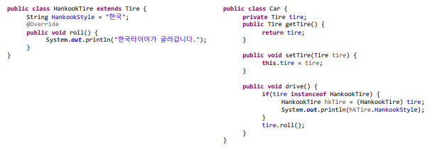
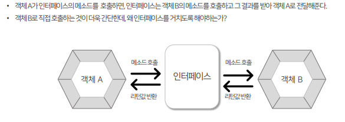
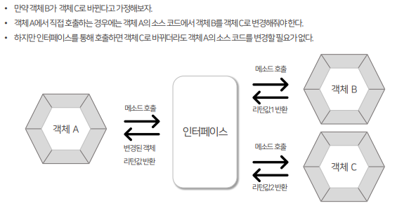
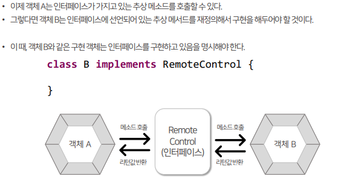

## 목차
- [오버라이딩](#오버라이딩)
- [final](#final)
		- [final 클래스](#final-클래스)
		- [final 메소드](#final-메소드)
- [protected](#protected)
- [타입 변환](#타입-변환)
	- [자동 타입 변환(Promotion)](#자동-타입-변환promotion)
	- [강제 타입 변환(Casting)](#강제-타입-변환casting)
- [다향성](#다향성)
- [instanceof](#instanceof)
- [Object 클래스](#object-클래스)
		- [toString() 메소드 재정의](#tostring-메소드-재정의)
- [추상 클래스](#추상-클래스)
- [추상 메소드](#추상-메소드)
- [인터페이스](#인터페이스)

<br/>
<br/>
<br/>
<br/>

# 오버라이딩
- 메소드 오버라이딩을 사용하면, 부모 메소드 대신 자식 메소드가 사용된다.
- 따라서 부모 메소드에서 약간의 코드를 추가하여 재정의를 하려는 경우, 부모 메소드와 중복된 내용을 자식 메소드에 작성해야 한다.
- 이러한 문제는 자식 메소드 내에서 부모 메소드를 호출하는 것으로 해결할 수 있다.
- 자식 메소드 내에서 super 키워드와 객체 접근 연산자(.)를 활용하면 숨겨진 부모 메소드를 호출할 수 있다.

<br/>
<br/>
<br/>
<br/>

# final
- 필드 선언 시에 final을 붙이면 초기값 설정 후 값을 변경할 수 없는 상수가 되었다.
### final 클래스
  - 클래스에 final을 붙이면 상속할 수 없는 클래스가 된다.
  - 즉, 부모 클래스가 될 수 없다.
### final 메소드
  - 메소드에 final을 붙이면 오버라이딩할 수 없는 메소드가 된다.
  - 즉, 자식 클래스에서 물려받은 그대로 쓸 수 밖에 없는 메소드가 된다

<br/>
<br/>
<br/>
<br/>

# protected 
- 접근 제한자를 통해 클래스에 접근할 수 있는 범위를 결정하거나 객체 외부에서 필드, 생성자, 메소드의 접근 여부를 결정했다.
- `protected` 접근 제한자는 필드, 생성자, 메소드에서 쓰이는 접근 제한자로 상속과 관련이 있다.
- `public`은 패키지와 관계없이 어디서든 사용가능하고, `(default)`는 다른 패키지에서의 접근을 제한한다.
- `protected`는 그 중간에 해당하며, 같은 패키지이거나 다른 패키지라면 자식클래스만 접근할 수 있도록 허용한다.

<br/>
<br/>
<br/>
<br/>

# 타입 변환
- 클래스의 타입 변환은 상속 관계에 있는 클래스 사이에 발생한다.
```java
int intValue = 10;
long longValue = intValue; // 범위가 더 크므로 타입 변환 가능

Manager mng = new Manager();
Employee emp = mng;
```


<br/>

## 자동 타입 변환(Promotion)   
- `Parents p = new Child();`
- 자식은 부모의 특징과 기능을 상속받기 때문에 부모와 동일하게 취급될 수 있다.
- 부모 타입으로 변환한 경우에는 부모 클래스에 선언된 필드와 메소드만 접근할 수 있게 된다.
- 그러나 자식 클래스에서 오버라이딩된 메소드가 있다면, 오버라이딩된 메소드가 호출된다.
- 즉, 인스턴스 변수 p는 아래의 필드와 메소드를 갖는다.
  - 부모 클래스의 필드
  - 부모 클래스의 메소드, 자식 클래스가 오버라이딩한 메소드
```java
public class Parents {
	private String eyeColor = "갈색";

	public String getEyeColor() {
		return eyeColor;
	}

	public void setEyeColor(String eyeColor) {
		this.eyeColor = eyeColor;
	}

	void walk() {
		System.out.println("뒤뚱뒤뚱");
	}

	void eat() {
		System.out.println("냠냠");
	}
}
```
```java
public class Child extends Parents {
	private String job = "개발자";

	public String getJob() {
		return job;
	}

	public void setJob(String job) {
		this.job = job;
	}

	void hello() {
		System.out.println("안녕하세요");
	}

	@Override
	void walk() {
		System.out.println("뚜벅뚜벅");
	}
}
```
```java
public class InheritanceExample {

	public static void main(String[] args) {
		Parents p = new Parents();
		System.out.println(p.getEyeColor());
		p.eat();// 냠냠
		p.walk(); // 뒤뚱뒤뚱

		System.out.println();

		Child c = new Child();
		System.out.println(c.getEyeColor());
		System.out.println(c.getJob());
		c.eat(); // 냠냠
		c.walk(); // 뚜벅뚜벅
		c.hello(); // 안녕하세요

		System.out.println();

		Parents pc = c;
		System.out.println(pc.getEyeColor());
		pc.eat();
		pc.walk(); // 뚜벅뚜벅
		// 오버라이딩 된 걸 쓰기 때문에 자식에서 가져온 부모는 '뚜벅뚜벅'

	}

}
```
## 강제 타입 변환(Casting)
```java
Parents p = new Child();
Child c = (Child) p;
```
- 자식 타입은 부모 타입으로 자동 변환되지만, 반대로 부모 타입은 자식 타입으로 자동 변환되지 않는다.
- 부모 타입 객체를 자식 타입으로 무조건 강제 변환할 수는 없다.
- 자식 객체가 부모 타입으로 자동변환된 경우에만 강제 타입 변환을 사용할 수 있다.
- 자식 타입에 선언된 필드와 메소드를 사용해야 한다면, 강제 타입 변환을 해서 이용해야 한다.
```java
public class InheritanceExample {

	public static void main(String[] args) {
		Parents p1 = new Parents();
		System.out.println(p1.getEyeColor());
		p1.eat();
		p1.walk(); // 뒤뚱뒤뚱
		
		System.out.println();
		
		Parents p2 = new Child();
		System.out.println(p2.getEyeColor());
		p2.eat();
		p2.walk(); // 뚜벅뚜벅
		Child c = (Child) p2; 
		// 자식 객체가 부모 타입으로 자동 변환된 상태 => 여기서 다시 자식 타입으로 강제 타입 변환
		System.out.println(c.getJob()); // 개발자
		c.hello(); // 안녕하세요

	}

}
```

<br/>

- 다른 예제
```java
public class Animal {
	public void makeSound() {
		System.out.println("일반적인 동물의 소리입니다.");
	}
}
```
```java
public class Dog extends Animal {
	@Override
	public void makeSound() {
		System.out.println("멍멍");
	}

	public void bite() {
		System.out.println("앙!");
	}
}
```
```java
public class AnimalExample {

	public static void main(String[] args) {
		Animal animal = new Animal();
		animal.makeSound();

		// Dog dog = (Dog) animal;
		// dog.makeSound();

		Animal animalD = new Dog();
		animalD.makeSound(); // 멍멍
		// 일반 동물 타입이므로 makeSound만 출력 가능
		// bite()는 불러오지 못한다.

		Dog dog = (Dog) animalD;
		dog.makeSound();
		dog.bite(); // 앙!

		// ==============
		Animal animalC = new Cat();
		animalC.makeSound();

		Cat cat = (Cat) animalC;
		cat.makeSound();
		cat.scratch(); // 벅벅

	}

}
```

<br/>
<br/>
<br/>
<br/>

# 다향성
- 상속(타입변환)을 전제로, 하나의 객체 타입이 여러 타입을 참조할 수 있는 능력을 의미한다.
- 동일한 사용방법이지만 다양한 실행 결과를 나타나게 하는 성질을 가지고 있다.
- 배열에 다형성 적용하기
- 일반적으로 배열은 같은 타입을 저장할 수 있지만, 다향성을 이용하면 또 다른 타입도 저장할 수 있게 된다.
```java
public class Tire {
	public void roll() {
		System.out.println("굴러갑니다");
	}
}
```
```java
public class KumhoTire extends Tire {
	@Override
	public void roll() {
		System.out.println("금호타이어가 굴러갑니다");
	}
}
```
```java
public class HankookTire extends Tire {
	@Override
	public void roll() {
		System.err.println("금호타이어가 굴러갑니다.");
	}

}
```
```java
public class Car {
	private Tire tire;

	public Tire getTire() {
		return tire;
	}

	public void settire(Tire tire) {
		this.tire = tire;
	}

	public void drive() {
		tire.roll();
	}
}
```
```java
public class CarExample {

	public static void main(String[] args) {
		Car c = new Car();
		// 굴러갑니다
		c.settire(new Tire());
		c.drive();

		System.out.println();

		// 금호타이어가 굴러갑니다.
		c.settire(new HankookTire());
		c.drive();

		System.out.println();

		// 금호타이어가 굴러갑니다
		c.settire(new KumhoTire());
		c.drive();

	}

}
```

<br/>
<br/>
<br/>
<br/>

# instanceof
- 변수가 참조하는 객체의 타입을 확인하고자 할 때, instanceof 연산자를 이용할 수 있다.
- instanceof 연산자의 좌측에는 객체, 우측에는 타입을 기술하면 해당 객체와 타입이 일치하는지 여부를 boolean으로 반환한다.
```java
public class InheritanceExample {

	public static void main(String[] args) {
		Parents p = new Parents();
		System.out.println(p.getEyeColor());
		p.eat();// 냠냠
		p.walk(); // 뒤뚱뒤뚱

		System.out.println("Parents p는 Parents의 객체이다? " + (p instanceof Parents)); // true
		System.out.println("Parents p는 Parents의 객체이다? " + (p instanceof Child)); // false
		System.out.println();

		Child c = new Child();
		System.out.println(c.getEyeColor());
		System.out.println(c.getJob());
		c.eat(); // 냠냠
		c.walk(); // 뚜벅뚜벅
		c.hello(); // 안녕하세요

		System.out.println("Child c는 Chld의 객체이다? " + (c instanceof Child)); // true
		System.out.println("Child c는 Parents의 객체이다? " + (c instanceof Parents)); // true
		System.out.println();

		Parents pc = c;
		System.out.println(pc.getEyeColor());
		pc.eat();
		pc.walk(); // 뚜벅뚜벅
		// 오버라이딩 된 걸 쓰기 때문에 자식에서 가져온 부모는 '뚜벅뚜벅'
		System.out.println("Parents pc는 Chld의 객체이다? " + (pc instanceof Child)); // true
		System.out.println("Parents pc는 Parents의 객체이다? " + (pc instanceof Parents)); // true
		System.out.println();

		Child cc = (Child) pc;
		cc.hello();
		System.out.println("Child cc는 Chld의 객체이다? " + (c instanceof Child)); // true
		System.out.println("Child cc는 Parents의 객체이다? " + (c instanceof Parents)); // true

	}

}
```
[예시2]
   


<br/>
<br/>
<br/>
<br/>

# Object 클래스
- Object 클래스는 Java에서 최상위 클래스이다.
- Java의 모든 클래스는 Object의 자식이거나 자손 클래스가 된다.
- 클래스를 생성할 때 extend를 작성하지 않는 경우, 자동으로 Object를 상속받게 된다.
- Object 클래스는 다양한 메소드들로 구성되어 있고,해당 메소드들은 모든 클래스에서 이용할 수 있다.
  - equals() 메소드, hashCode() 메소드, toString() 메소드 등
### toString() 메소드 재정의
- toString() 메소드 : 객체가 가지고 있는 정보나 값들을 문자열로 만들어 리턴하는 메소드
- toString() 메소드를 통해 클래스의 이름과 해시코드 값을 출력하는 게 아니라, 객체가 가지고 있는 내용을 출력하고 싶을 대 재정의할 수 있다.

<details>
    <summary>eclipse tip</summary>
    <div>
    - eclipse에서는 [Alt+Shift+s] 클릭하면
    
    - 쉽게 toString() 메소드를 재사용할 수 있다.
    
    </div>
</details>

<br/>


[예시]
```java
	// toString() : 부모의 toString()에 잔여오일량과 현재적재중량을 추가하여 리턴
	@Override
	public String toString() {
		return super.toString() + restOil + " \t " + curWeight;
	}
```

  
<br/>
<br/>
<br/>
<br/>

# 추상 클래스
- 객체를 생성할 수 있는 클래스를 실체 클래스라고 한다.
- 실체 클래스들의 공통적인 필드나 메소드를 추출해서 선언한 클래스를 추상클래스라 한다.
- 추상클래스는 실체 클래스의 부모 역할을 한다.
- 클래스 선언에 `abstract` 키워드를 붙이면 추상 클래스가 된다.
- 추상 클래스는 직접 객체를 생성할 수 없다.
- 추상 클래스는 다른 클래스를 상속할 수 있다.
- 추상 클래스는 추상 메소드를 가질 수 있다.(없어도 된다)

# 추상 메소드
- 자식 클래스들이 가지고 있는 공통 메소드를 뽑아내어 추상클래스로 만들 때, 실행 내용이 자식마다 달라지는 경우가 있을 수 있다.
- 이런 경우를 해결하기 위해, 추상클래스에는 추상메소드를 선언할수 있도록 되어있다.
- 추상메소드는 abstract 키워드가 붙고, 메소드 실행내 용({})이 없는 것이 특징이다.
- 추상 메소드는 정적 메소드가 될 수 없다.
```java
package com.oop.abstract1;

public abstract class Animal {
	abstract void sound(); // abstract 는 실행 내용이 없다.
}
```
```java
package com.oop.abstract1;

public class AnimalExample {
    public static void main(String[] args) {
        // 추상 클래스는 인스턴스화하지 못한다.
        //Animal animal = new Animal();
    }
}
```
- 실행 내용이 있어야 메소드를 호출할 수 있기 때문에, 자식 클래스에서 메소드를 구현해줘야 한다.
- 오버라이딩이 필수다.
```java
package com.oop.abstract1;

public class Pig extends Animal {

	@Override
	void sound() {
		// 자식이 직접 사용해야 한다.
		System.out.println("꿀꿀");
	}
}
```
```java
public class AnimalExample {
	public static void main(String[] args) {
		// 추상 클래스는 인스턴스화하지 못한다.
		// Animal animal = new Animal();

		Pig p = new Pig();
		Monkey m = new Monkey();
		Panda pd = new Panda();
		Rabbit r = new Rabbit();

//		p.sound();
//		m.sound();
//		pd.sound();
//		r.sound();

//		Animal[] aniArr = { p, m, pd, r };
//		for (Animal animal : aniArr) {
//			animal.sound();
//		}

		animalSound(p);
		animalSound(m);
		animalSound(pd);
		animalSound(r);

	}

	public static void animalSound(Animal a) {
		a.sound();
	}
}

```

<br/>
<br/>
<br/>
<br/>

# 인터페이스
- 두 장치를 연결하는 접속기라는 뜻을 가지고 Java에서 인터페이스는 두 객체를 연결하는 역할




<br/>

- 인터페이스는 다형성 구현에 주로 사용되는 기술이다.
- 상속을 통해 다형성을 구현할 수 있지만, 인터페이스를 통해 구현하는 경우가 더 많다.
- 인터페이스는 `.java` 파일로 작성되고, `.class` 파일로 컴파일되기 때문에 물리적 형태는 클래스와 동일하다.
  ```java
  interface 인터페이스명 { }
  public interface 인터페이스명 { }
  ```
- 중괄호 안에는 인터페이스가 가지는 멤버들을 선언할 수 있다.
  ```java
  package com.oop.interface1;
    public interface RemoteControl {
        // public 추상 메소드
        public void turnOn();
    }
    ```



- 인터페이스는 다중 구현이 가능하다. (여러 개 구현할 수 있다)
- 인터페이스도 참조 타입에 속하므로 타입이 될 수 있다.
- 인터페이스를 통해 구현 객체를 사용하려면 인터페이스 변수에 구현 객첼르 대입해야 한다.
- 인터페이스는 `public static final` 특성을 갖는 불변의 상수 필드만을 가질 수 있다.
- 인터페이스에서 선언된 필드는 모두 `public static final` 특성을 갖기 때문에 이를 생략하더라도 자동적으로 컴파일 과정에서 붙게 된다.
- 상수는 구현 객체와 관련이 없는 인터페이스 소속 멤버이므로, 바로 접근해서 값을 얻을 수 있다.
- 인터페이스는 추상 메서드를 멤버로 가질 수 있다.
- 추상메소드는 중괄호가 없는 메소드이기 때문에
 인터페이스에서 선언된 추상 메소드는 `public abstract`를 생략하더라도 자동으로 컴파일 과정에서 붙게 된다.

<hr/>

[인터페이스 예시]
```java
package com.oop.interface1;

public interface RemoteControl {
	// public 정적 상속 필드
	public static final int MAX_VOLUME = 10;
	/* public static final */int MIN_VOLUME = 0;

	// public 추상 메서드
	public /* abstract */ void turnOn();

}
```
```java
package com.oop.interface1;

public class TV implements RemoteControl {

	@Override
	public void turnOn() {
		System.out.println("TV를 켭니다");
	}

}
```
```java
package com.oop.interface1;

public class Radio implements RemoteControl {

	@Override
	public void turnOn() {
		System.out.println("Radio를 켭니다");
	}

}
```
```java
package com.oop.interface1;

public class RemoteControlExample {
	public static void main(String[] args) {
//		TV tv = new TV();
//		Radio rd = new Radio();
//
//		tv.turnOn();
//		rd.turnOn();

		RemoteControl rc = new Radio();
		rc.turnOn();
		rc = new TV();
		rc.turnOn();

		// RemoteControl.MIN_VOLUME = 10;
		// => The final field RemoteControl.MIN_VOLUME cannot be assigned
		// RemoteControl.MAX_VOLUME = 10;
		// => The final field RemoteControl.MAX_VOLUME cannot be assigned
		System.out.println(RemoteControl.MAX_VOLUME);
	}
}
```

<br/>
<hr/>
<br/>

- 인터페이스에서는 완전한 실행 코드를 가진 디폴트 메소드를 선언할 수 있다. (java 8 이상)
- `default` 키워드를 반드시 명시해야 인터페이스 내부에서 구현되는 메소드를 만들 수 있다.
- 구현 클래스에서는 디폴트 메소드도 재정의해서 자신에 맞게 오버라이딩할 수 있다.
- 오버라이딩을 할 경우에는 public을 반드시 붙여야 하고, default는 생략해야 한다.
```java
	// default 메소드 (음소거 해제 후에도 소리는 0)
	default void setMute(boolean mute) {
		if (mute) {
			System.out.println("음소거되었습니다.");
			setVolume(MIN_VOLUME);
		} else {
			System.out.println("음소거 해제되었습니다.");
		}
	}
```
```java
	// 음소거 해제 후에 다시 설정된 volume 으로 돌아가도록 오버라이드
	@Override
	public void setMute(boolean mute) {
		if (mute) {
			System.out.println("음소거되었습니다.");
			this.memoryVolume = volume;
			setVolume(MIN_VOLUME);
		} else {
			System.out.println("음소거 해제되었습니다.");
			setVolume(memoryVolume);
		}
	}
```

<br/>
<hr/>
<br/>

- 인터페이스에는 구현 객체 없이 호출되는 정적 메소드 선언도 가능하다.
- 정적 메소드는 public 또는 private으로 제한할 수 있으며, public의 경우에는 접근 제한자 생략이 가능하다.