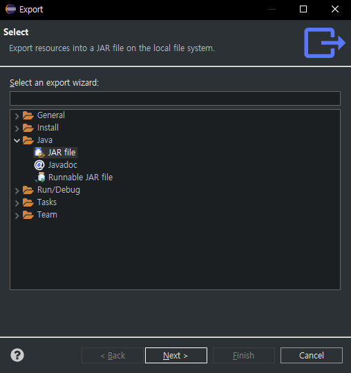
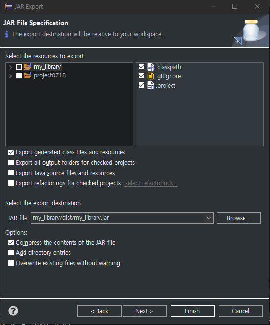
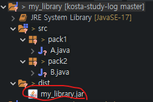
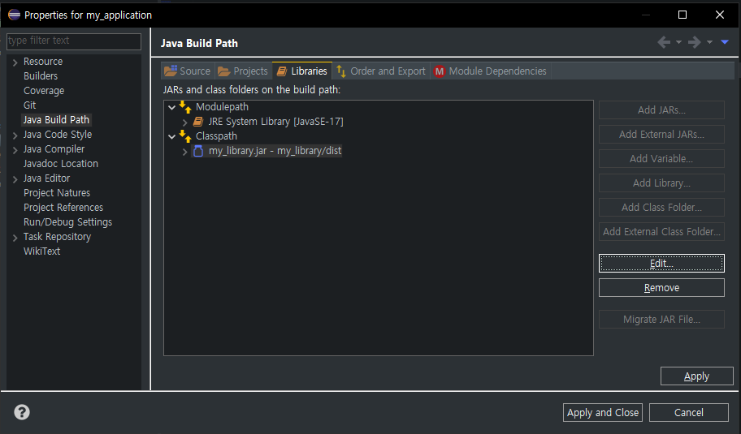
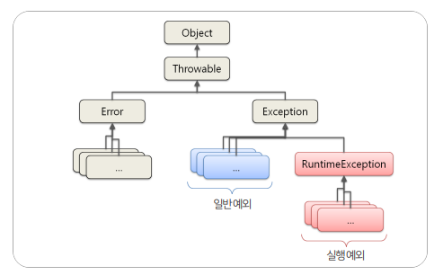
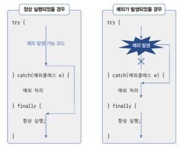
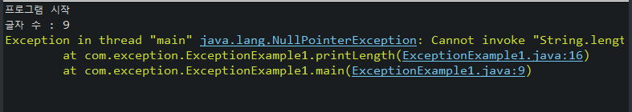
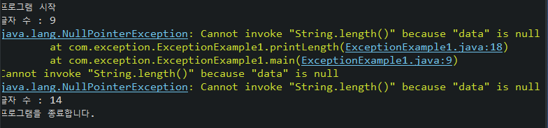
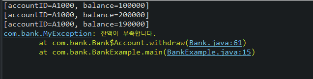

## 목차

- [중첩 클래스 - 바깥 클래스에 접근](#중첩-클래스---바깥-클래스에-접근)
- [중첩 인터페이스 (Nested Interface)](#중첩-인터페이스-nested-interface)
- [익명 객체(Anonymous Object)](#익명-객체anonymous-object)
	- [익명 자식 객체](#익명-자식-객체)
	- [익명 구현 객체](#익명-구현-객체)
- [라이브러리(Library)와 모듈(Module)](#라이브러리library와-모듈module)
	- [라이브러리](#라이브러리)
		- [라이브러리 생성해보기](#라이브러리-생성해보기)
	- [예외 종류에 따른 처리](#예외-종류에-따른-처리)
	- [예외 클래스의 상속 구조](#예외-클래스의-상속-구조)
		- [일반 예외 클래스](#일반-예외-클래스)
		- [실행 예외 클래스](#실행-예외-클래스)
	- [리소스 자동 닫기](#리소스-자동-닫기)
	- [예외 떠넘기기](#예외-떠넘기기)
	- [사용자 정의 예외](#사용자-정의-예외)


<br/>
<br/>
<br/>
<br/>
# 중첩 클래스 - 바깥 클래스에 접근
- 인스턴스 멤버 클래스는 바깥 클래스가 생성되어야 생성이 가능하다는 특징이 있다.
- 따라서 바깥 클래스의 모든 필드와 메소드에 접근 가능하다.
- 하지만 정적 클래스는 바깥 클래스 없어도 사용 가능해야 한다.
- 따라서 바깥 클래스의 인스턴스 필드와 인스턴스 메소드 접근은 불가능하고, 정적 필드와 정적 메소드만 접근할 수 있다.
- 만약 중첩 클래스 안에서 바깥 클래스의 객체를 얻기 위해서는 바깥클래스 이름에 `this`를 붙여주면 된다.
- 바깥 클래스에서 중첩 클래스의 인스턴스를 사용하려면 안쪽 인스텉스를 생성하고 사용해야 한다.
```java
public class Outter {
	// 바깥 클래스의 필드
	String name = "바깥쪽";

	// 바깥 클래스의 (인스턴스) 메소드
	void method() {
		System.out.println("\t바깥쪽 메소드");
	}

	// 바깥에서 바깥 필드와 (인스턴스) 메소드 사용
	void useOutter() {
		System.out.println("바깥에서 바깥 필드와 (인스턴스) 메소드 사용");
		System.out.println("\t" + name);
		method();
	}

	// 바깥에서 안쪽 필드와 (인스턴스) 메소드 사용
	// 바깥에서 안쪽 인스턴스를 생성하고 사용해야 한다.
	void useInner() {
		System.out.println("안쪽에서 안쪽 필드와 (인스턴스) 메소드 사용");

		// 안쪽 인스턴스 생성
		Inner i = new Inner();
		System.out.println("\t" + i.name);
		i.method();
	}

	// 중첩 (인스턴스 멤버) 클래스 선언
	class Inner {
		// 안쪽 클래스의 필드
		String name = "안쪽";

		// 안쪽 클래스의 (인스턴스) 메소드
		void method() {
			System.out.println("\t안쪽 메소드");
		}

		// 안쪽에서 안쪽 필드와 (인스턴스) 메소드 사용
		void useInner() {
			System.out.println("안쪽에서 안쪽 필드와 (인스턴스) 메소드 사용");
			System.out.println("\t" + name);
			method();
		}

		// 안쪽에서 바깥 필드와 (인스턴스) 메소드 사용
		void useOutter() {
			System.out.println("안쪽에서 바깥 필드와 (인스턴스) 메소드 사용");
			// System.out.println("\t" + name); => 안쪽 name 으로 출력
			// method(); => 안쪽 method 이용해서 출력
			System.out.println("\t" + Outter.this.name);
			Outter.this.method();

		}
	}

}
```
```java
public class OuterExample {
	public static void main(String[] args) {
		Outter o = new Outter();
		o.useOutter();
		// 바깥에서 바깥 필드와 (인스턴스) 메소드 사용
		// 바깥쪽
		// 바깥쪽 메소드
		o.useInner();
		// 바깥에서 안쪽 필드와 (인스턴스) 메소드 사용
		// 안쪽
		// 안쪽 메소드

		Outter.Inner i = o.new Inner();
		i.useInner();
		// 안쪽에서 안쪽 필드와 (인스턴스) 메소드 사용
		// 안쪽
		// 안쪽 메소드
		i.useOutter();
		// 안쪽에서 바깥 필드와 (인스턴스) 메소드 사용
		// 바깥쪽
		// 바깥쪽 메소드
	}
}
```

<br/>
<br/>
<br/>
<br/>

# 중첩 인터페이스 (Nested Interface)
- 클래스의 멤버로 선언된 인터페이스를 중첩 인터페이스라고 한다.
- 특정 클래스와 긴밀한 관계를 맺는 구현 객체를 만들기 위해서 중첩 인터페이스를 선언한다.
- 외부의 접근을 막지 않으려면 `public`을 붙이고, 클래스 내부에서만 사용하려면 `private`을 붙이고, 접근 제한자를 붙이지 않으면 같은 패키지 내에서만 접근 가능하다.
- 중첩 인터페이스는 암시적으로 `static`이므로 생략해도 항상 바깥 클래스(객체) 없이 인터페이스 사용이 가능하다.
```java
public class Button {
	// 중첩 인터페이스 선언 (static 생략)
	public /* static */ interface ClickListener {
		void onClick();
	}

	// 필드 선언
	private ClickListener clickListener;

	// method 선언 (setter)
	public void setClickListener(ClickListener clickListener) {
		this.clickListener = clickListener;
	}

	public void click() {
		this.clickListener.onClick();
	}
}
```
```java
import com.nested.interface1.Button.ClickListener;

public class ButtonExample {
	public static void main(String[] args) {
		Button btnOK = new Button();

		// 로컬 클래스 생성
		class OKListener implements ClickListener {
			// override 필수
			@Override
			public void onClick() {
				System.out.println("OK 버튼을 눌렀습니다");
			}
		}

		// 매개변수가 인터페이스인데 직접 생성할 수 없으므로 클래스를 생성하고 implements 한다
		// 중첩 클래스로 만들 수 있음
		btnOK.setClickListener(new OKListener());
		btnOK.click(); // OK 버튼을 눌렀습니다

		// 다른 버튼 생성
		Button btnCANCEL = new Button();

		class CANCELLIstener implements ClickListener {
			@Override
			public void onClick() {
				System.out.println("CANCEL 버튼을 눌렀습니다");
			}
		}

		btnCANCEL.setClickListener(new CANCELLIstener());
		btnCANCEL.click(); // CANCEL 버튼을 눌렀습니다
	}
}
```

<br/>
<br/>
<br/>
<br/>

# 익명 객체(Anonymous Object)
- 명시적으로 클래스를 선언하지 않은 이름이 없는 객체를 의미한다.
- 명시적으로 클래스를 선언하지 않았기 때문에 쉽게 객체 생성이 가능하다.
- 익명 객체는 필드값, 로컬변수값, 매개변수값으로 주로 사용된다.
- 익명 객체를 생성하기 위해서는 클래스를 상속하거나 인터페이스를 구현해야 한다.
  - 클래스를 상속해서 만들면 `익명 자식 객체`라고 한다.
  - 인터페이스를 구현해서 만들면 `익명 구현 객체`라고 한다.
```java
// 익명 객체
btnOK.setClickListener(new ClickListener() {
	@Override
	public void onClick() {
		System.out.println("OK 버튼을 눌렀습니다.");
	}
});
btnOK.click();
```

<br/>
<br/>

## 익명 자식 객체
- 부모 클래스를 상속받아 생성된다.
- 익명 자식 객체는 부모 타입의 필드, 로컬 변수, 매개변수의 값으로 대입할 수 있다.
```java
public class Car {
	// 필드에 Tire 객체 대입
	private Tire frontLeft = new Tire();
	private Tire frontRight = new KumhoTire();
	private Tire rearLeft = new HankookTire();

	// 필드에 익명 자식 객체 대입
	private Tire rearRight = new Tire() {
		@Override
		public void roll() {
			System.out.println("3. 익명 타이어 굴라간다.");
		}
	};

	// 필드 사용 메소드
	public void run1() {
		frontLeft.roll();
		frontRight.roll();
		rearLeft.roll();
		rearRight.roll();
	}

	// 로컬 변수 사용 메소드
	public void run2() {
		// 로컬 변수에 익명 자식 객체 대입
		Tire tire = new Tire() {
			@Override
			public void roll() {
				System.out.println("2. 익명 자식 객체 Tire가 굴러갑니다");
			}
		};
		tire.roll();
	}

	public void start() {
		Engine e = new Engine() {
			// 로컬 변수에 익명 자식 객체르 대입해서 사용 => 익명 엔진 생성
			@Override
			void use() {
				System.out.println("익명 엔진이 사용됩니다");
			}
		};
		e.use();
	}

	public void curve(Handle h) {
		h.turn();
	}
}
```
```java
public class CarExample {
	public static void main(String[] args) {
		Car c = new Car();
		c.run1();

		System.out.println();

		c.run2();

		System.out.println();

		c.start();

		System.out.println();

		c.curve(new Handle());
		c.curve(new PowerHandle());

		// 메소드의 매개변수 값으로 대입되는 익명 자식 객체
		// 필드 로컬 변수 매개값으로 사용하는 익명 자식 객체
		c.curve(new Handle() {
			@Override
			void turn() {
				System.out.println("익명 핸들을 돌립니다");
			}
		});
	}
}
```

<br/>
<br/>

## 익명 구현 객체
- 인터페이스를 구현해서 생성된다.
- 익명 구현 객체는 인터페이스 타입의 필드, 로컬 변수, 매개변수의 값으로 대입할 수 있다.
```java
public class Home {

	// 필드에 인터페이스 구현 객체 대입
	// private RemoteControl rc = new Television();

	// 필드에 인터페이스 익명 구현 객체 대입
	private RemoteControl rc = new RemoteControl() {
		@Override
		public void turnOn() {
			System.out.println("내 방 불 전원을 켭니다.");
		}

		@Override
		public void turnOff() {
			System.out.println("내 방 불 전원을 끕니다");
		}
	};

	public void play() {
		rc.turnOn();
	}

	public void useSwtich() {
		// 로컬 변수에 인터페이스 구현 객체 대입
		// Switch s = new BathRoomSwitch();

		// 로컬 변수에 인터페이스 익명 구현 객체 대입
		Switch s = new Switch() {
			@Override
			public void click() {
				System.out.println("익명 두꺼비집 동작시킵니다");
			}
		};
		s.click();
	}

	// 매개변수로 인터페이스 구현 객체 사용
	public void exercise(GymLink g) {
		g.use();
	}
}
```
```java
public class HomeExample {
	public static void main(String[] args) {
		Home home = new Home();
		home.play();

		System.out.println();
		home.useSwtich();

		System.out.println();

		// 매개변수 값으로 인터페이스 구현 객체 대입
		// home.exercise(new RunningMachine());

		// 매개변수 값으로 인터페이스 익명 구현 객체 대입
		home.exercise(new GymLink() {
			@Override
			public void use() {
				System.out.println("줄넘기를 하러 갑니다.");
			}
		});
	}
}
```

<br/>
<br/>
<br/>
<br/>


# 라이브러리(Library)와 모듈(Module)
- 라이브러리
  - 프로그램 개발 시 활용할 수 있는 클래스와 인터페이스들을 모아놓은 것을 의미
  - 일반적으로 `JAR(Java Archive)` 압축 파일 형태로 존재한다.
- 모듈
  - 패키지 관리 기능까지 포함된 라이브러리로, Java 9 부터 지원한다.
  - 라이브러리 일종이므로 `JAR` 파일 형태로 배포 가능하다.

<br/>

## 라이브러리
- 특정 클래스와 인터페이스가 응용 프로그램을 개발할 때 공통으로 자주 사용된다면, JAR 파일로 압축해서 라이브러리로 관리하는 것이 좋다.
- 프로그램 개발  라이브러리를 이용하려면 JAR 파일을 `ClassPath`(클래스 경로)에 추가해야 한다.
- ClassPath에 라이브러리를 추가하는 방법
  - 콘솔(명령프롬프트, 터미널등)에서 프로그램을 실행할 경우
    - java 명령어를 실행할 때­ classpath로 제공하거나 CLASSPATH 환경변수에 경로를 추가
  - 이클립스 프로젝트에서 실행할 경우
    - 프로젝트의 BuildPath에 추가
### 라이브러리 생성해보기
1. 프로젝트 만들기
2. 패키지와 클래스 생성
   1. project: my_library
   2. package pack1 > class A
   3. package pack2 > class B
3. 프로젝트 선택 후, 마우스 우클릭[New > Folder로  dist 폴더 생성]
4. export
      
      
   
5. 새로운 프로젝트 생성
6. 새 프로젝트에서 [Build Path > Configue Build Path] 클릭
7. Libraries  탭에 `JARs and class folders on the build path`에서 `Classpath` 항목을 선택하고, `Add External JARs` 버튼 클릭
   
8. Main 클래스에 적용해보기
   ```java
   package my_application;

	import pack1.A;
	import pack2.B;

	public class Main {

		public static void main(String[] args) {
			A a = new A();
			a.method();

			B b = new B();
			b.method();
		}

	}
	```


<br/>
<br/>
<br/>
<br/>


# 예외 처리 - 예외와 예외 클래스
- 컴퓨터 하드웨어의 고장으로 인해 프로그램 실행에 오류가 발생하는 것을 Java에서는 에러(error)라고 한다.
- 프로그램을 아무리 견고하게 잘 만들어도, 이런 에러는 대처할 방법이 없다.
- Java에서도 `예외(Exception)`이라고 부르는 오류가 있다. 잘못된 사용 또는 코딩으로 인한 프로그램 오류를 의미한다.
- 예외가 발생하면 프로그램이 곧바로 종료된다는 점에서 에러와 동일하지만, 예외는 처리를 통해 프로그램의 실행 상태를 유지할 수 있다.


- `일반 예외(Exception)` : 컴파일러가 예외처리 코드 여부를 검사하는 예외
- `실행 예외(Runtime Exception)` : 컴파일러가 예외처리 코드 여부를 검사하지 않는 예외

<br/>
<br/>

## 예외 처리 코드
- 예외가 발생했을 때 프로그램의 갑작스러운 종료를 막고 정상 실행을 유지할 수 있도록 처리하는 코드
- `try - catch - finally` 블록으로 구성된다
- 이 블록은 생성자 내부와 메소드 내부에서 작성된다.

<br/>


- try 블록에서 작성한 코드가 예외 없이 정상 실행되면, catch 블록은 실행되지 않고 finally  블록이 실행
- 예외가 발생하면 catch 블록이 바로 실행되고, 연이어 finally 블록이 실행된다.
- finally는 옵션으로 생략이 가능하다.

<hr/>

[예시]
```java
public class ExceptionExample1 {

	public static void main(String[] args) {
		System.out.println("프로그램 시작");

		printLength("exception");
		printLength(null);

		System.out.println("프로그램을 종료합니다.");

	}

	private static void printLength(String data) {
		int len = data.length();
		System.out.println("글자 수 : " + len);
	}

}
```

=> 에러가 발생한다.

```java
public class ExceptionExample1 {

	public static void main(String[] args) {
		System.out.println("프로그램 시작");

		printLength("exception");
		printLength(null);
		printLength("PLEASE SHOW ME");

		System.out.println("프로그램을 종료합니다.");

	}

	private static void printLength(String data) {
		try {
			int len = data.length();
			System.out.println("글자 수 : " + len);
		} catch (NullPointerException e) {
			// 예외 출력 방법 3가지
			// 1. e.printStackTrace(); : 에러 내용 출력 후 다시 진행
			e.printStackTrace();

			// 2. System.err.println(e.getMessage());
			System.err.println(e.getMessage());
			// Cannot invoke "String.length()" because "data" is null 출력

			// 3. e.toString()
			System.err.println(e.toString());
			// java.lang.NullPointerException: Cannot invoke "String.length()" because
			// "data" is null
		}
	}

}
```


<br/>
<br/>

 ## 예외 종류에 따른 처리
- try 블록에는 다양한 종류의 예외가 발생할 수 있는데, 이 경우 다중 catch를 이용해 발생하는 예외에 따라 처리를 다르게 할 수 있다.
- catch 블록의 예외 클래스는 try  블록에서 발생된 예외의 종류를 말하는데, 해당 타입의 예외가 발생하면 catch 블록이 선택되어 실행된다.
```java
public class ExceptionExample3 {

	public static void main(String[] args) {
		String[] classArr = { "java.lang.String", null };
		try {
			for (String s : classArr) {
				Class.forName(s);
				System.out.println(s + "이 존재합니다.");
			}
		} catch (ClassNotFoundException e) {
			System.out.println("클래스를 찾을 수 없습니다.");
		} catch (NullPointerException e) {
			System.out.println("값이 null입니다.");
		}

		System.out.println("프로그램을 종료합니다.");
	}

}
```
- 만약 두 개 이상의 예외를 하나의 catch  블록으로 동일하게 예외 처리 하고 싶다면, catch  블록에 예외 클래스를 기호( | )로 연결하면 된다.
```java
public class ExceptionExample4 {

	public static void main(String[] args) {
		String[] strArr = { "80", "90", null, "1oo" };

		for (int i = 0; i <= strArr.length; i++) {
			try {
				String str = strArr[i];
				int value = Integer.parseInt(str);
				System.out.println("strArr[" + i + "] : " + value);
			} catch (ArrayIndexOutOfBoundsException e) {
				System.out.println("배열 인덱스가 초과됨: " + e.getMessage());
			} catch (NumberFormatException | NullPointerException e) {
				System.out.println("데이터에 이상이 있음: " + e.getMessage());
			} catch (Exception e) {
				System.out.println("실행에 문제가 있습니다.");
			}
		}
	}

}
```
```
strArr[0] : 80
strArr[1] : 90
데이터에 이상이 있음: Cannot parse null string
데이터에 이상이 있음: For input string: "1oo"
배열 인덱스가 초과됨: Index 4 out of bounds for length 4
```

## 예외 클래스의 상속 구조
### 일반 예외 클래스
- 예외 처리를 하지 않으면 문법 오류를 발생시켜 컴파일 자체가 불가능하다
- InterruptedException : 일정 시간 동안 해당 쓰레드를 일시정지 상태로 만드는 Thread의 정적 메서드
- **ClassNotFountException : 해당 클래스의 정보를 담고 있는 Class 타입의 객체를 리턴
- FileNotFoundException : 파일을 읽을 때 해당 경로에 팔이 없을 때 발생
- CloneNotSupportedException : 
### 실행 예외 클래스
- ArithmeticException : 연산 자체가 불가능할 때 발생하는 실행 예외
- ClassCastException : 다운캐스팅이 불가능한 상황에서 다운캐스팅을 시도할 때 발생
- ArrayIndexOutOfBoundsException : 배열의 인덱스를 잘못 사용했을 때 발생
- NumberFormatException : 문자열을 정수값으로 변환할 때 숫자 형식이 아닐 때 반환 실패

<br/>
<br/>

## 리소스 자동 닫기
- 리소스(resource) : 데이터를 제공하는 객체
- 리소스는 사용하기 위해 열고(Open), 사용을 한 뒤에는 닫아야(Close) 한다.
- 리소스를 사용하다가 예외가 발생한 경우에도 안전하게 리소스를 닫아주는 것이 중요하다.
- try­ - with - ­resources 블록을 사용하는 것인데, 예외 발생 여부와 상관없이 리소스를 자동으로 닫아준다.
- try -­ with - ­resources 블록을 사용하기 위해서는 AutoCloseable 인터페이스를 구현해서 close() 메소드를 재정의해야 한다.
```java
try(FileInputStream fis = new FileInputStream("file.txt")) {
	// ...
} catch(IOException e) {
	// ...
}
```
- Java 9 이상부터는 외부 리소스 변수를 try 블록에 사용할 수 있다.


_리소스 관련 에러처리는 뒤에서 다시 알아봄_

<br/>
<br/>

## 예외 떠넘기기
- 메소드를 호출한 곳으로 예외를 떠넘길 수 있는데 이때 사용하는 키워드가 `throws`이다.
- `throws`는 메소드 선언부 끝에 작성하는데, 떠넘길 예외 클래스를 쉼표로 구분해서 나열해주면 된다.
```java
public class ExceptionExample5 {

	public static void main(String[] args) {
		try {
			findClass();
		} catch (ClassNotFoundException e) {
			e.printStackTrace();
		}

	}

	private static void findClass() throws ClassNotFoundException {
		Class.forName("java.lang.String2");
	}

}
```
- 만약 예외를 떠넘기려 할 때, 나열해야 할 예외 클래스가 많은 경우에는 쉼표(,)로 연결해서 작성하거나, `throws Exception`이나 `throws Throwable` 만으로 모든 예외를 간단히 떠넘길 수 있다.
- main() 메소드에서도 예외를 떠넘길 수 있는데, 그렇게 하게 되면 결국 JVM에서 최종적으로 예외를 처리하게 된다. 
- JVM은 예외의 내용을 콘솔에 출력하는 것으로 처리한다.

<br/>
<br/>

## 사용자 정의 예외
- 존재하지 않는 예외를 직접 예외 클래스로 정의해서 사용하는 것을 사용자 정의 예외라고 한다.
- 사용자 정의 예외는 컴파일러가 체크하는 일반 예외로 선언할 수도 있고, 컴파일러가 체크하지 않는 실행 예외로 선언할 수도 있다.
- 통상적으로 일반 예외는 Exception의 자식 클래스로 선언하고, 실행 예외는 Runtime Exception의 자식 클래스로 선언한다.
```java
public class MyException extends Exception {
	public MyException() {
		super();
	}

	public MyException(String message) {
		super(message);
	}
}
```
```java
// 은행 클래스
public class Bank {

	...

	// 은행에는 계좌 클래스가 있다
	class Account {

		...

		public void withdraw(int money) throws MyException {
			if (this.balance >= money) {
				this.balance -= money;
			} else {
				throw new MyException("잔액이 부족합니다.");
			}
		}

	}

}
```
```java
public class BankExample {
	public static void main(String[] args) {
		Bank b = new Bank("기업은행");
		Bank.Account acc1000 = b.openAccount();

		try {
			acc1000.deposit(100000);
			System.out.println(acc1000);
			acc1000.deposit(100000);
			System.out.println(acc1000);
			acc1000.withdraw(10000);
			System.out.println(acc1000);
			acc1000.withdraw(1000000);
			System.out.println(acc1000);
		} catch (MyException e) {
			e.printStackTrace();
		}
	}
}
```
