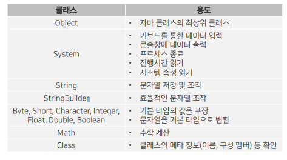

## 목차
- [API 도큐먼트](#api-도큐먼트)
- [java.base 모듈](#javabase-모듈)
  - [java.lang 패키지](#javalang-패키지)
- [Object 클래스](#object-클래스)
  - [equals](#equals)
  - [hascode](#hascode)
  - [toString](#tostring)
- [롬복(Lombok) 사용하기](#롬복lombok-사용하기)
- [Systrem 클래스](#systrem-클래스)
  - [out, in](#out-in)
  - [exit()](#exit)
  - [currentTimeMillis(), nanoTime()](#currenttimemillis-nanotime)
- [문자열 클래스](#문자열-클래스)
  - [String](#string)
  - [StringBuilder](#stringbuilder)
- [포장(Wrapper) 클래스](#포장wrapper-클래스)
- [수학(Math) 클래스](#수학math-클래스)
- [Random 클래스](#random-클래스)
- [날짜와 시간 클래스](#날짜와-시간-클래스)
- [리플렉션](#리플렉션)
- [어노테이션](#어노테이션)
      - [어노테이션의 용도](#어노테이션의-용도)
- [제네릭](#제네릭)
  - [제네릭 타입](#제네릭-타입)
  - [제한된 타입 파라미터](#제한된-타입-파라미터)
  - [와일드카드 타입 파라미터](#와일드카드-타입-파라미터)

<br/>
<br/>
<br/>
<br/>

# API 도큐먼트
- 자바 표준 모듈에서 제공하는 방대한 라이브러리들을 쉽게 찾아서 사용할 수 있도록 API 도큐먼트가 있다.
- API 도큐먼트 : 클래스와 인터페이스 집합인 라이브러리들의 사용 방법을 기술한 것
- [API 도큐먼트 바로가기](https://docs.oracle.com/en/java/javase/index.html
)

<br/>
<br/>
<br/>
<br/>

# java.base 모듈
- 모든 모듈이 의존하는 기본 모듈로, 모듈 중 유일하게 requires 하지 않아도 사용 가능하다.   

<br/>

|패키지|용도|
|---|---|
|java.lang|자바 언어의 기본 클래스를 제공|
|java.util|자료 구조와 관련된 컬렉션 클래스를 제공|
|java.text|날짜 및 숫자를 원하는 형태의 문자열로 만들어주는 포맷 클래스 제공|
|java.time|날짜 및 시간을 조작하거나 연산하는 클래스를 제공|
|java.io|입출력 스트림 클래스를 제공|
|java.net|네트워크 통신과 관련된 클래스를 제공|
|java.nio|데이터 저장을 위한 Buffer 및 새로운 입출력 클래스 제공|

<br/>

- String, System, Integer, Double, Exception, RuntimeException 등의 클래스는 모두 java.lang 패키지에 있고, Scanner는 java.util 패키지에 있다.
- java.lang 패키지는 import 없이 사용 가능하다.

## java.lang 패키지


<br/>
<br/>
<br/>
<br/>

# Object 클래스
- 클래스를 선언할 때 extends 키워드로 다른 클래스를 상속하지 않으면 암시적으로 Object 클래스를 상속하게 된다.
- 자바의 모든 클래스는 Object의 자식이거나 자손 클래스가 된다.
- Object가 가진 메소드는 모든 객체에서 사용 가능하다.
- boolean equals(Object obj) : 객체의 번지를 비교하고 결과를 반환
- int hashCode() : 객체의 해시코드를 반환
- String toString() : 객체의 문자 정보를 반환
## equals
- 일반적으로 재정의해서 동등 비교용으로 사용한다.
```java
public class Member {
	public String id;

	public Member(String id) {
		this.id = id;
	}

	@Override
	public boolean equals(Object obj) {
		if (obj instanceof Member) {
			Member target = (Member) obj;
			if (id.equals(target.id)) {
				return true;
			}
		}
		return false;
	}
}
```
```java
public class MemberExample {

	public static void main(String[] args) {
		Member m1 = new Member("정서연");
		Member m2 = new Member("정서연");
		Member m3 = new Member("오해원");

		System.out.println("m1: " + m1);
		System.out.println("m2: " + m2);
		System.out.println("m3: " + m3);
		// m1, m2, m3 메모리 주소는 다 다르다

		if (m1.equals(m2)) {
			System.out.println("m1과 m2는 같다."); // 출력
		} else {
			System.out.println("m1과 m2는 다르다.");
		}

		if (m2.equals(m3)) {
			System.out.println("m2과 m3는 같다.");
		} else {
			System.out.println("m2과 m3는 다르다."); // 출력
		}

		if (m1.equals(m3)) {
			System.out.println("m1과 m3는 같다.");
		} else {
			System.out.println("m1과 m3는 다르다."); // 출력
		}

	}

}
```

<br/>
<br/>

## hascode
- 객체 해시코드란 객체를 식별하는 정수를 말한다.
- 단방향 암호화
  - 비밀 번호 입력
  - 데이터베이스에 암호화되어 저장
  - 로그인 할 때 비밀번호 입력하면 해당 비밀번호를 암호화한 것이 저장된 암호화된 것과 동일한지 비교
- 객체의 메모리 주소를 이용해서 해시코드를 생성하기 때문에 객체마다 다른 정수값을 반환한다.
```java
public class Student {
	private int no;
	private String name;

	public Student(int no, String name) {
		this.no = no;
		this.name = name;
	}

	public int getNo() {
		return no;
	}

	public String getName() {
		return name;
	}

	@Override
	public int hashCode() {
		int hashCode = no + name.hashCode();
		return hashCode;
	}

	@Override
	public boolean equals(Object obj) {
		if (obj instanceof Student) {
			Student target = (Student) obj;
			if (no == target.getNo() && name.equals(target.getName())) {
				return true;
			}
		}
		return false;
	}

}
```
```java
public class StudentExample {

	public static void main(String[] args) {
		Student s1 = new Student(1, "홍길동");
		Student s2 = new Student(1, "홍길동");
		Student s3 = new Student(1, new String("홍길동"));

		System.out.println(s1.getName() == s2.getName()); // true
		System.out.println(s1.getName() == s3.getName()); // false

		System.out.println(s1.hashCode()); // 54150063
		System.out.println(s2.hashCode()); // 54150063
		System.out.println(s3.hashCode()); // 54150063
	}

}
```

<br/>
<br/>

## toString
- 객체의 문자 정보를 반환한다.
- 객체의 문자 정보란 객체를 문자열로 표현한 값을 말하며, 기본적으로 `클래스명@16진수해시코드`로 구성되어 있다.
- 객체의 문자 정보가 중요한 경우에는 toString() 메소드를 재정의해서 간결하고 유용한 정보를반환하도록 해야 한다.
- Date 클래스는 현재 날짜와 시간을 반환하고,  String 클래스는 저장된 문자열을 반환하도록 오버라이딩하고 있다.

<br/>
<br/>
<br/>
<br/>

# 롬복(Lombok) 사용하기
- JDK에 포함된 표준 라이브러리는 아니지만 개발자들이 즐겨쓰는 자동 코드 생성 라이브러리이다.
- DTO 클래스를 작성할 때 Getter, Setter, hashCode, equals, toString 메소드를 자동 생성하여 작성할 코드의 양을 줄여준다.
- DTO (Data Transfer Object, 데이터 전송 객체) : 데이터를 전송하기 위해 사용하는 객체로 주로 클라이언트와 서버가 데이터를 주고받을 때 사용한다.
- 설치하기 (https://projectlombok.org/download)
  - 다운로드 받은 lombok.jar 파일이 있는 곳으로 이동해서 `java -jar lombok.jar` 명령어 실행하면 설치가 진행된다.
  - 설치 완료 후 이클립스를 재시작해야 한다.
  - 재시작 후 Build Path에서 추가해준다.
      
- `@Data`가 붙게 되면 컴파일 과정에서 기본 생성자와 함께 Getter, Setter, hashCode(), equals(), toString() 메소드가 자동 생성된다.

- 어노테이션 사용


[예시]
```java
import lombok.AllArgsConstructor;
import lombok.Data;

@AllArgsConstructor
@Data
public class Employee {
	private int id;
	private String name;
	private String position;
	private String department;
	private int salary;

}
```
```java
public class EmployeeExample {
	public static void main(String[] args) {
		Employee emp = new Employee(1, "정서연", "과장", "개발팀", 20000);

		emp.setSalary(50000);
		emp.setPosition("대표");
		emp.setDepartment(null);
		System.out.println(emp);
	}
}
```

<br/>
<br/>
<br/>
<br/>

# Systrem 클래스
- Java는 운영체제 상에서 바로 실행되지 않고 JVM이라는 가상 머신 상에서 실행되기 때문에 운영 체제의 모든 기능을 Java에서 직접 접근하는 것은 어렵다.
- 하지만 java.lang 패키지에 속하는 System 클래스를 이용하면 운영 체제의 일부 기능을 이용할 수 있게 된다.
- System 클래스의 정적 필드와 메소드를 이용하면 프로그램 종료, 키보드 입력, 콘솔 출력, 현재 시간 읽기, 시스템 프로퍼티 읽기가 가능하다.


<br/>
<br/>

## out, in
```java
import java.io.IOException;

public class InExample {

	public static void main(String[] args) throws IOException {
		int speed = 0;
		int keyCode = 0;

		while (true) {
			if (keyCode != 13 && keyCode != 10) {
				if (keyCode == 49) {
					speed++;
				} else if (keyCode == 50) {
					speed--;
				} else if (keyCode == 51) {
					break;
				}

				System.out.println("------------------------");
				System.out.println("1. 증속 | 2. 감속 | 3. 중지");
				System.out.println("------------------------");
				System.out.println("현재 속도 = " + speed);
				System.out.print("선택 : ");
			}
			keyCode = System.in.read();
		}
		System.out.println("프로그램 종료");

	}

}
```
## exit()
- 운영체제는 실행 중인 프로그램을 프로세스로 관리한다.
- Java 프로그램을 시작하면 JVM 프로세스가 생성되고, 이 프로세스에서 main( ) 메소드를 호출한다.
- 프로세스를 강제 종료하고 싶다면 System.exit( )  메소드를 사용한다.
- exit( ) 메소드는 int 매개값이 필요한데, 이 값을 종료 상태값이라 한다.
- 종료 상태값에 어떤 값을 주더라도 프로세스는 종료되는데, 정상종료는 0, 비정상종료는 1 또는 -1을 주는 것이 관례이다.
## currentTimeMillis(), nanoTime()
- 1970년 1월 1일 0시부터 시작해서 현재까지 진행된 시간을 반환한다.
- 이 두메소드는 프로그램 처리 시작을 측정하는데 주로 사용된다.

<br/>
<br/>
<br/>
<br/>

# 문자열 클래스
## String
- 문자열 리터럴인 경우에 자동으로 String 객체로 생성된다.
- String 클래스의 다양한 생성자를 통해 직접 객체를 생성할 수도 있다.
- 예를 들어, 네트워크 통신으로 얻은 byte 배열을 원래 문자열로 변환하는 경우에 주로 쓰인다.
## StringBuilder
- String은 내부 문자열을 수정할 수 없다.
- 문자열을 변경이 가능한 것처럼 보이지만, 실제로는 새로운 String 객체를 생성하는 것이다.
- 새로운 String 객체가 생성되고 이전 객체는 계속 버려지기 때문에 효율성이 좋지 않다.
- StringBuilder는 내부버 퍼(데이터를 저장하는 메모리)에 문자열을 저장해두고, 그 안에서 추가, 수정, 삭제 작업이 가능하도록 설계되어 있다.
- 때문에 잦은 문자열 변경이 필요하다면 String보다는 StringBuilder를 사용하는 것이 좋다.
```java
public class StringBuilderExample {
	public static void main(String[] args) {
		StringBuilder sb = new StringBuilder();
		sb.append("자바 공부가 재미 없어요");
		sb.insert(6, " 너무");
		sb.delete(12, 13);
		sb.replace(12, 13, "있");

		System.out.println(sb); // 자바 공부가 너무 재미있어요

	}
}
```

<br/>
<br/>
<br/>
<br/>

# 포장(Wrapper) 클래스
- 기본 타입의 값을 갖는 객체를 생성할 수 있다. 이러한 객체를 포장 객체라한다.
- 포장 객체는 포장하고 있는 기본 타입의 값을 변경할 수는 없고, 오직 객체로 생성하는데 목적이 있다.
- 포장 객체가 필요한 이유는 컬렉션 객체 때문이다.
- 나중에 알아볼 컬렉션 객체는 기본 타입의 값은 저장할 수 없고, 객체만 저장 가능하다는특징이 있다.
- 기본 타입의 값을 포장 객체로 만드는 과정을 박싱(boxing)이라 하고, 반대로 포장 객체에서 기본 타입의 값을 얻어내는 과정을 언박싱(unboxing)이라 한다.
```java
Integer obj = 100;
int Value = obj;
```
- 언박싱은 연산 과정에서도 발생한다.
<hr/>

- 포장 클래스는 문자열을 기본 타입 값으로 변환할 때도 사용된다.
- 대부분의 포장 클래스에는 `parse + 기본타입` 으로 되어있는 정적 메소드가 있어서 문자열을 해당 기본 타입 값으로 변환한다.
- 포장 객체의 내부값을 비교하기 위해서는 == 이나 !=과 같은 비교 연산자를 사용할 수 없다.
- 엄밀히 말하면 범위의 값을 갖는 포장객체(boolean 또는char 또는 -128~127 범위의 byte, short, int)는 비교 연산자 사용이 가능하다.
- 하지만 포장 객체 내 어떤 값이 저장될 지 모르는 상황이라면, equals( ) 메소드로 내부값을 비교해야 한다.
```java
public class WrapperExample {

	public static void main(String[] args) {
		// 기본 데이터 타입 선언 및 할당
		int num = 10;
		double dNum = 15.5;
		char ch = 'A';

		// 기본 데이터 타입 => Wrapper 객체로 변환 (Boxing)
		// 개발자가 명시적으로 타입 변환을 말해주는 것
		// Integer numWrapper = Integer.valueOf(num);
		// Double dNumWrapper = Double.valueOf(dNum);
		// Character chWrapper = Character.valueOf(ch);

		// 기본 데이터 타입 => Wrapper 객체로 변호나 (Auto-Boxing)
		// vin에서 컴파일러가 실행해서 타입 변환 해주는 것
		Integer numWrapper = num;
		Double dNumWrapper = dNum;
		Character chWrapper = ch;

		System.out.println(numWrapper + ", " + dNumWrapper + ", " + chWrapper);
		System.out.println();

		// Wrapper 객체 => 기본 데이터 타입 (UnBoxing)
		// int numPrimitive = numWrapper.intValue();
		// double dNumPrimitive = dNumWrapper.doubleValue();
		// Character chPrimitive = chWrapper.charValue();

		// Wrapper 객체 => 기본 데이터 타입 (Auto-UnBoxing)
		int numPrimitive = numWrapper;
		double dNumPrimitive = dNumWrapper;
		Character chPrimitive = chWrapper;
		System.out.println(numPrimitive + ", " + dNumPrimitive + ", " + chPrimitive);

	}

}
```

<br/>
<br/>
<br/>
<br/>

# 수학(Math) 클래스
- 수학 계산에 사용할 수 있는 메소드를 정적 메소드로 제공


<br/>
<br/>
<br/>
<br/>

# Random 클래스
- 랜덤값을 얻기 위해서는 Math 클래스를 이용하는 방법 외에도 java.util.Random 클래스를 이용하는 방법도 있다.
```java
import java.util.Arrays;
import java.util.Random;

public class LottoExample {

	public static void main(String[] args) {
		int[] selectNum = new int[6];
		Random r = new Random();
		int count = 0;

		// random 숫자로 6개 배열 생성 (중복 시 다시 뽑기)
		while (count < selectNum.length) {
			int num = r.nextInt(45) + 1;
			boolean isUnique = true;

			for (int i = 0; i < count; i++) {
				if (selectNum[i] == num) {
					isUnique = false;
					break;
				}
			}

			if (isUnique) {
				selectNum[count] = num;
				count++;
			}
		}

		System.out.println(Arrays.toString(selectNum));

	}

}
```

<br/>
<br/>
<br/>
<br/>

# 날짜와 시간 클래스
- java.util 패키지 내 Date와 Calendar  클래스로 날짜와 시간을 구할 수 있으며,  LocalDateTime 클래스로 조작이 가능하다.
- Date 클래스에는 여러 개의 생성자가 선언되어 있으나,  대부분 Deprecated 되어 기본 생성자만 주로 사용된다.
- Calendar 클래스는 달력을 표현하는 추상 클래스이다.
- 날짜와 시간을 계산하는 방법은 차이가 있어 자식 클래스에서 구현하도록 되어 있다.
- 특별한 역법을 사용하는 경우가 아니라면, 직접 하위 클래스를 만들 필요 없이 getInstance() 메소드를 이용해 컴퓨터에 설정된 시간대를 기준으로 Calendar 하위 객체를 얻을 수 있다.
- Date와 Calendar는 날짜와 시간 정보를 얻기에는 충분하지만, 날짜와 시간을 조작할 수는 없다.
- 조작을 위해서는 java.time 패키지의 LocalDateTime 클래스가 제공하는 메소드를 이용할 수 있다.
```java
import java.time.LocalDateTime;
import java.time.format.DateTimeFormatter;

public class DateTimeOperationExample {

	public static void main(String[] args) {
		LocalDateTime now = LocalDateTime.now();
		DateTimeFormatter dtf = DateTimeFormatter.ofPattern("yyyy.MM.dd a HH:mm:ss");

		System.out.println(dtf.format(now));

		LocalDateTime minus3Weeks = now.minusWeeks(3);
		System.out.println(dtf.format(minus3Weeks));

	}

}
```
```java
import java.time.LocalDateTime;
import java.time.temporal.ChronoUnit;

public class DateTimeCompareExample {

	public static void main(String[] args) {
		LocalDateTime start = LocalDateTime.of(2024, 7, 1, 0, 0, 0);
		LocalDateTime end = LocalDateTime.of(2024, 11, 11, 0, 0, 0);

		LocalDateTime now = LocalDateTime.now();

		if (now.isBefore(start)) {
			System.out.println("최인규를 만나기 전");
		} else if (now.isAfter(end)) {
			System.out.println("최인규와 헤어진 후");
		} else {
			System.out.println("최인규를 만나는 중");
			long remainDays = now.until(end, ChronoUnit.DAYS);
			System.out.println("남은 날: " + remainDays);
		}

	}

}
```


<br/>
<br/>
<br/>
<br/>

# 리플렉션
- Java는 클래스와 인터페이스의 메타 정보(패키지 정보, 타입 정보, 멤버 정보 등)를 Class 객체로 관리한다.
- 메타 정보를 프로그램에서 읽고 수정하는 행위를 리플렉션(Reflection)이라 한다.
```java
package com.reflection;

import java.lang.reflect.Field;

public class ReflectionExample {

	public static void main(String[] args) {
		Class clazz = Car.class;
		System.out.println(clazz.getPackageName());
		System.out.println(clazz.getSimpleName());

		Field[] declareFields = clazz.getDeclaredFields();
		for (Field f : declareFields) {
			System.out.println(f.getType().getName() + " " + f.getName());
		}

	}

}
```


<br/>
<br/>
<br/>
<br/>

# 어노테이션
- 코드에서 @로 작성되는 요소를 어노테이션(Annotation)이라고 한다.
- 어노테이션은 클래스 또는 인터페이스를 컴파일하거나 실행할 때, 어떻게 처리해야 할 것인지를 알려주는 설정 정보이다.
<hr/>

#### 어노테이션의 용도
1. 컴파일 시 사용하는 정보 전달 (예- @Override)
2. 빌드 툴이 코드를 자동으로 생성할 때 사용하는 정보 전달 (예 - @Data, @Getter, @Setter)
3. 실행 시 특정 기능을 처리할 때 사용하는 정보 전찰 (예 - @Scheduled)

<hr/>

- 어노테이션은 자바 프로그램 개발 시 필수 요소가 되었다.
- 웹 개발 시 사용되는 Spring, SpringBoot 프레임워크에서는 다양한 종류이 어노테이션을 사용한다.
- 어노테이션도 하나의 타입이므로, 정의부터 해야 한다.
- 어노테이션의 정의는 인터페이스를 정의하는 것과 유사하다.
- 어노테이션은 타입과 이름으로 구성된 속성을 가질 수 있다. 속성의 기본값은 default 키워드로 지정할 수 있다.
- 기본값이 있는 속성은 생략 가능하고,  기본값이 없는 속성은 반드시 값을 기술해야 한다.
-  어노테이션은 설정 정보이기 때문에 어떤 대상에 설정 정보를 적용할 것인지 명시해야 한다.
- 적용 대상을 지정할 때는 @Target 어노테이션을 사용한다.


<br/>
<br/>
<br/>
<br/>

# 제네릭
- 제네릭(Generic)이란 결정되지 않은 타입을 파라미터로 처리하고, 실제 사용할 때 파라미터를 구체적인 타입으로 대체시키는 기능이다.
<hr/>
[예시]

```java
public class Box {
	public Object content;
}
```
- 다양한 내용물을 저장하는 Box 라는 클래스
- Box에 넣을 내용물로 content 필드를 선언하는 것이다.
```java
public class BoxExample {
	public static void main(String[] args) {
		Box box = new Box();

		// Object text = "안녕하세요";
		// Object text = new String("안녕하세요");
		box.content = "안녕하세요";

		// Integer i = 10;
		// Object number = 10;
		box.content = 10;

		box.content = new Member("최인규", 20);
	}
}
```
- 모든 객체는 부모 타입인 Object로 자동 타입 변환이 되므로, content 필드에는 어떤 객체든 대입이 가능해진다.
- 그러나 어떤 내용물이 저장되어있는지 모를 수 있다. 그래서 content 타입을 Object로 하는 것은 좋은 방법이 아니다.

**제네릭 적용**
```java
public class Box<T> {
	public T content;
}
```
- Box 생성할 때 저장할 내용물의 타입을 명시하면 Box는 content에 무엇이 대입되고, 읽을 때 어떤 타입으로 제공할지 알 수 있게 된다.
```java
public class BoxExample {
	public static void main(String[] args) {
		Box<String> box1 = new Box<>();
		box1.content = "안녕하세요";
		String data1 = box1.content; 

		Box<Integer> box2 = new Box<>();
		box2.content = 10;
		int data2 = box2.content;

		Box<Member> box3 = new Box<>();
		box3.content = new Member("정서연", 20);
		Member data3 = box3.content;
	}
}
```
- 강제 타입 변환 없이 얻을 수 있다.

<br/>
<br/>

## 제네릭 타입
- 제네릭 타입은 결정되지 않은 타입을 파라미터로 가지는 클래스와 인터페이스를 말한다.
- 제네릭 타입은 선언부에 ‘<>’  부호가 붙고 그 사이에 타입 파라미터들이 위치한다.
- 타입 파라미터는 일반적으로 대문자 알파벳 한 글자로 표현한다.
- 외부에서 제네릭 타입을 사용하기 위해서는 타입 파라미터에 구체적인 타입을 지정해야 한다.
- 만약 지정하지 않으면 Object 타입이 암묵적으로 사용된다.
<hr/>

[예시]
```java
import lombok.Getter;
import lombok.Setter;

@Getter
@Setter
public class Product<K, M> {
	private K kind;
	private M model;
}
```
```java
public class ProductExample {
	public static void main(String[] args) {
		Product<Car, String> carProduct = new Product<>();
		carProduct.setKind(new Car());
		carProduct.setModel("테슬라 S");

		Product<Television, String> tvProduct = new Product<>();
		tvProduct.setKind(new Television());
		tvProduct.setModel("스탠바이미");

		Product<Food, String> foodProduct = new Product<>();
		foodProduct.setKind(new Food());
		foodProduct.setModel("불백");
	}
}
```

<br/>
<br/>

## 제한된 타입 파라미터
- 경우에 따라서는 타입 파라미터를 대체하는 구체적인 타입을 제한할 필요가 있다.
- 예를 들어 숫자를 연산하는 제네릭 메소드는 Number  또는 자식클래스( Byte, Short, Integer, Long, Double)로 제한할 필요가 있다.
- 이처럼 모든 타입으로 대체할 수는 없고,  특정 타입과 자식 또는 구현 관계에 있는 타입만 대체할 수 있도록 하는 타입파라미터를 제한된 타입 파라미터(Bounded Type Parameter)라고 한다.
```java
public class GenericExample {

	public static void main(String[] args) {
		boolean result1 = compare(10, 20);
		System.out.println(result1); // false

		boolean result2 = compare(20L, 20D);
		System.out.println(result2); // true

		boolean result3 = compare(4.5, 4.5);
		System.out.println(result3); // true
	}

	public static <T extends Number> boolean compare(T t1, T t2) {
		// T 값 비교 (Number에 저장되어있는 메소드 이용)
		double v1 = t1.doubleValue();
		double v2 = t2.doubleValue();

		return v1 == v2;

	}

}
```

<br/>
<br/>

## 와일드카드 타입 파라미터
- 제네릭 타입을 매개값이나 반환 타입으로 사용할 때, 타입 파라미터로 와일드카드(?)를 사용할 수 있다.
- 와일드카드(?)는 범위에 있는 모든 타입으로 대체할 수 있다는 표시이다.

<hr/>

[예시]

```java
public class Person {

}

class Worker extends Person {
}

class Student extends Person {
}

class HighStudent extends Student {
}

class MiddleStudent extends Student {
}
```
```java
public class Course {
	// 모든 사람이 들을 수 있는 과정을 등록
	public static void registercourse1(Applicant<?> applicant) {
		String simpleName = applicant.kind.getClass().getSimpleName();
		System.out.println(simpleName + ": 코스1 등록");
	}

	// 학생만 들을 수 있는 과정을 등록
	public static void registercourse2(Applicant<? extends Student> applicant) {
		String simpleName = applicant.kind.getClass().getSimpleName();
		System.out.println(simpleName + ": 코스2 등록");
	}

	// 직장인과 일반인만 들을 수 있는 과정을 등록
	public static void registercourse3(Applicant<? super Worker> applicant) {
		String simpleName = applicant.kind.getClass().getSimpleName();
		System.out.println(simpleName + ": 코스3 등록");
	}
}
```
```java
import lombok.AllArgsConstructor;

@AllArgsConstructor
public class Applicant<T> {
	public T kind;
}
```
```java
public class CourseExample {

	public static void main(String[] args) {
		Applicant<Person> p = new Applicant<>(new Person());
		Applicant<Worker> w = new Applicant<>(new Worker());
		Applicant<Student> s = new Applicant<>(new Student());
		Applicant<HighStudent> hs = new Applicant<>(new HighStudent());
		Applicant<MiddleStudent> ms = new Applicant<>(new MiddleStudent());

		Course.registercourse1(p);
		Course.registercourse1(w);
		Course.registercourse1(s);
		Course.registercourse1(hs);
		Course.registercourse1(ms);
		System.out.println();

		Course.registercourse2(s);
		Course.registercourse2(hs);
		Course.registercourse2(ms);
		System.out.println();

		Course.registercourse3(p);
		Course.registercourse3(w);

	}

}
```