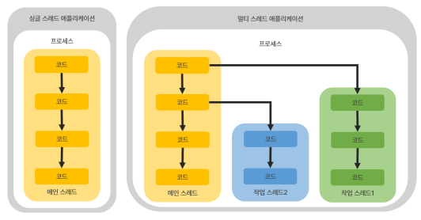
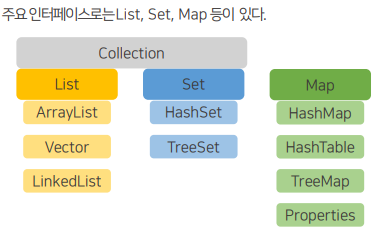
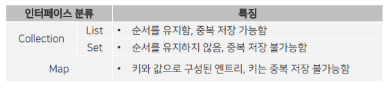
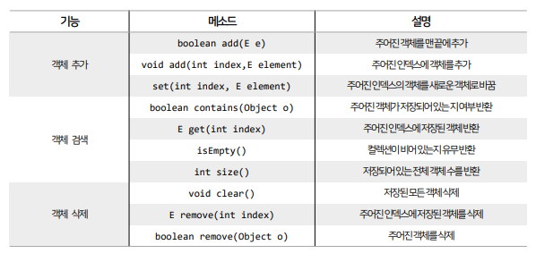
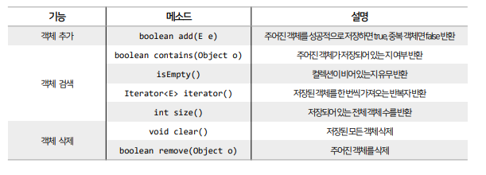
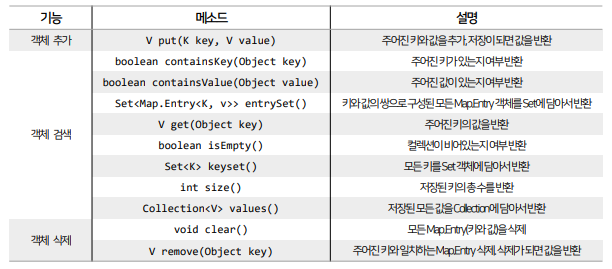

## 목차
- [멀티 스레드](#멀티-스레드)
  - [메인 스레드](#메인-스레드)
  - [작업 스레드 생성과 실행](#작업-스레드-생성과-실행)
  - [Thread 클래스로 스레드 직접 생성하기](#thread-클래스로-스레드-직접-생성하기)
  - [Thread 자식 클래스로 생성하기](#thread-자식-클래스로-생성하기)
  - [스레드 이름](#스레드-이름)
  - [스레드 상태](#스레드-상태)
  - [스레드 일시 정지](#스레드-일시-정지)
  - [스레드 양보](#스레드-양보)
  - [멀티 스레드 관련 내용](#멀티-스레드-관련-내용)
      - [스레드동기화 (중요)](#스레드동기화-중요)
      - [wait(),notify()](#waitnotify)
      - [스레드안전종료](#스레드안전종료)
      - [데몬스레드](#데몬스레드)
- [컬렉션 자료 구조](#컬렉션-자료-구조)
  - [List 컬렉션](#list-컬렉션)
    - [ArrayList](#arraylist)
    - [Vector](#vector)
    - [LinkedList](#linkedlist)
  - [Set 컬렉션](#set-컬렉션)
    - [HashSet](#hashset)
  - [TreeSet](#treeset)
  - [Map 컬렉션](#map-컬렉션)
    - [HashMap](#hashmap)
    - [Hashtable](#hashtable)

<br/>
<br/>
<br/>
<br/>

# 멀티 스레드
- 운영체제는 실행 중인 프로그램을 프로세스(Process)로 관리한다.
- 멀티태스킹은 두 가지 이상의 작업을 동시에 처리하는 것을 말하는데, 이때 운영체제는 멀티프로세스를 생성해서 처리한다.
- 그러나 멀티태스킹이 꼭 멀티프로세스를 의미하는 것은 아니다.
- 하나의 프로세스 내에서 멀티태스킹을 할 수 있도록 만들어진 프로그램도 있다. 
  - (예) 카카오톡: 채팅을 하면서 파일 전송 작업도 동시에 수행
- 하나의 프로세스가 두 가지 이상의 작업을 처리할 수 있는 이유는 멀티스레드(Multi Thread)가 있기 때문이다.
  - 멀티 프로세스 : 프로그램 단위의 멀티 태스킹
  - 멀티 스레드 : 프로세스 단위의 멀티 태스킹(프로그램 내부)
- 스레드(Thread)는 코드의 실행 흐름을 말하는데, 프로세스 내에 스레드가 두개라면 두개의 코드 실행 흐름이 생긴다는 의미이다.

<br/>
<br/>

## 메인 스레드
- 모든 Java 프로그램은 메인 스레드(Main Thread)가 main() 메소드를 싫행하면서 시작된다.
- 메인 스레드는 main() 메소드의 첫 코드부터 순차적으로 실행하고, main() 메소드의 마지막 코드를 실행하거나 return 문을 만난면 실행을 종료한다.
- 메인 스레드는 필요에 따라 추가 작업 스레드들을 만들어서 실행시킬 수 있다.



- 싱글 스레드에서는 메인 스레드가 종료되면 프로세스도 종료된다.
- 멀티 스레드 환경에서는 실행 중인 스레드가 하나라도 있으면 프로세스가 종료되지 않는다.

<br/>
<br/>

## 작업 스레드 생성과 실행
- 멀티 스레드로 실행되는 프로그램을 개발하려면 먼저 몇 개의 작업을 병렬로 실행할지 결정하고, 각각의 작업 별로 스레드를 생성해야 한다.
- 메인 스레드는 반드시 존재하기 때문에 추가적인 작업 수만큼 스레드를 생성한다.


- 작업 스레드도 객체로 관리하기 때문에 클래스가 필요하다.
  - Thread 클래스로 직접 객체를 생성하는 방법
  - 하위 클래스를 만들어 생성하는 방법

<br/>
<br/>

## Thread 클래스로 스레드 직접 생성하기
- java.lang 패키지에는 Thread 클래스로부터 작업 스레드 객체를 직접 생성하기 위해서는
Runnable 구현 객체를 매개값으로 갖는 생성자를 호출하면 된다.
- Runnable은 스레드가 작업을 실행할 때 사용하는 인터페이스로, 그 안에는run( ) 메소드가 정의되어 있다.
- 구현 클래스는 run( ) 메소드에 스레드가 실행할 코드를 재정의(오버라이딩)해주면 된다.
- 일반적으로는 명시적인 Runnable 구현 클래스를 작성하지 않고, 익명 구현 객체를 통해 작성하는 방식이 더 많이 사용된다.
- 작업 스레드를 실행하기 위해서는 스레드 객체의 start() 메소드를 호출해야 한다.

```java
package com.thread;

public class ThreadExample1 {

	public static void main(String[] args) {
		// Thread thread = new Thread(Runnable 인터페이스);
		// Thread thread = new Thread(new Task());

		Thread thread = new Thread(new Runnable() {
			@Override
			public void run() {
				for (int i = 10; i > 0; i--) {
					System.out.println("스레드 " + i);
					try {
						// thread를 일시정지 시키는 것
						Thread.sleep(500);
					} catch (Exception e) {
						e.printStackTrace();
					}
				}
			}
		});

		// 해당 스레드를 시작시킨다.
		thread.start();

		for (int i = 0; i < 10; i++) {
			System.out.println("메인 " + i);
			try {
				Thread.sleep(500);
			} catch (Exception e) {
				e.printStackTrace();
			}
		}

	}

}
```

<br/>
<br/>

## Thread 자식 클래스로 생성하기
- 작업 스레드 객체를 생성하는 또 다른 방법은 Thread의 자식 객체로 만드는 것이다.
- Thread 클래스를 상속한 다음 run( ) 메소드를 재정의해서 스레드가 실행할 코드를 작성하고 객체를 생성하면 된다.
- 일반적으로는 명시적인 자식 클래스를 생성하지 않고, 익명 자식 객체를 통해 작성하는 방식이 더 많이 사용된다.
```java
public class ThreadExample2 {

	public static void main(String[] args) {
		// Thread thread = new Thread의자식클래스();
		// Thread thread = new WorkerThread();

		// 익명 자식 객체를 통해 생성
		Thread thread = new Thread() {
			@Override
			public void run() {
				for (int i = 10; i > 0; i--) {
					System.out.println("스레드 " + i);
					try {
						// thread를 일시정지 시키는 것
						Thread.sleep(500);
					} catch (Exception e) {
						e.printStackTrace();
					}
				}
			}
		};

		thread.start();

		for (int i = 0; i < 10; i++) {
			System.out.println("메인 " + i);
			try {
				Thread.sleep(500);
			} catch (Exception e) {
				e.printStackTrace();
			}
		}

	}

}
```

<br/>
<br/>

## 스레드 이름
- 스레드는 각각 자신의 이름이 있다.
- 메인 스레드는 'main'이라는 이름을 가지고 있고, 작업 스레드는 자동적으로 'Thread-0, Thread-1, Thread-2, …'와 같은 이름을 갖는다.
- 만약'Thread-n' 대신 다른 이름을 설정하고 싶다면, Thread 클래스의 setName( ) 메소드를 사용하면 된다.
- 현재 코드를 어떤 스레드에서 실행하고 있는지 확인하기 위해서는 Thread 클래스의 정적 메소드인 currentThread( )로 스레드 객체의 참조를 얻은 다음, getName( ) 메소드를 사용하면 된다.
```java
public class ThreadNameExample {
	public static void main(String[] args) {
		// 1. Thread의 생성자 매개변수로 인터페이스 사용
		// 2. Thread의 자식 객체를 만들어 사용

		Thread thread1 = new Thread(new Runnable() {
			@Override
			public void run() {
				// 현재 해당되는 thread 가져오기
				Thread thread = Thread.currentThread();
				System.out.println(thread.getName());
			}
		});

		Thread thread2 = new Thread(new Runnable() {
			@Override
			public void run() {
				// 현재 해당되는 thread 가져오기
				Thread thread = Thread.currentThread();
				System.out.println(thread.getName());
			}
		});

		// 메인 thread 가져오기
		Thread thread = Thread.currentThread();
		System.out.println(thread.getName()); // main

		thread1.start(); // Thread-0
		thread2.start(); // Thread-1
	}
}
```

<br/>
<br/>

## 스레드 상태
- 스레드는 객체가 생성, 실행, 종료가 될 때까지 다양한 상태를 가진다.
- 각 스레드의 상태는 Thread.State 타입으로 정의되어 있고, 6가지의 상수 집합이다.
  - (NEW, RUNNABLE, TERMINATED, TIMED_WAITING, BLOCKED, WAITING)
- 처음 객체가 생성되면 NEW 상태를 가지며, 이후 start( ) 메소드로 실행하면 `RUNNABLE` 상태가 된다.
`- RUNNABLE 상태에서는 실행과 실행 대기를 반복하면서 CPU를 다른 스레드들과 나눠 사용한다.
- 이후 run( ) 메소드가 종료되면 `TERMINATED` 상태가 된다.
- RUNNABLE 상태에서는 상황에 따라 `TIMED_WAITING`, `BLOCKED`, `WAITING` 상태로 전환될 수 있다.
```java
public class ThreadStateExample {

	public static void main(String[] args) {
		// State : enum type (중첩 enum)
		// thread의 상태
		// NEW: 스레드가 생성된 후, start 전
		// RUNNABLE: start 후 실행 준비가 된 상태 (실행 중일 수도, 실행 대기일 수도 있음)
		// TERMINATED : 실행 종료
		Thread.State state;

		Thread thread = new Thread() {

			@Override
			public void run() {
				for (int i = 0; i < 1000000000; i++) {
					// 아무 동작도 출력 X
				}
			}

		};

		state = thread.getState();
		System.out.println("스레드 상태1: " + state); // NEW

		thread.start();
		state = thread.getState();
		System.out.println("스레드 상태2: " + state); // RUNNABLE

		try {
			thread.join();
		} catch (InterruptedException e) {
			e.printStackTrace();
		}
		state = thread.getState();
		System.out.println("스레드 상태3: " + state); // TERMINATED

	}

}
```

<br/>
<br/>

## 스레드 일시 정지
- 실행중인 스레드를 일정 시간 멈추게 하고 싶다면 Thread 클래스의 sleep( ) 메소드를 이용하면 된다.
- 매개값에는 얼마동안 일시정지 상태로 있을 것인지를 밀리세컨드 단위로 부여하면 된다.

- 스레드는 다른 스레드와 독립적으로 실행하지만, 가끔은 다른 스레드가 종료될 때까지기다렸다가 실행을 해야하는 경우도 있다.
  - (예) 스레드 B의 작업이 완료되고, 그 결과값을 받아 처리하는 스레드 A가 있는 경우
- 이를 위해서는 join( ) 메소드를 이용할 수 있다.
  - join()메서드는 sleep( ) 메서드와 다르게, 해당 스레드에게 CPU의 사용권도 넘겨준다는 특징이 있다.
```java
public class ThreadPauseExample {

	public static void main(String[] args) {
		Thread thread = new ThreadA();
		thread.start();
	}

}
```
```java
public class ThreadA extends Thread {
	@Override
	public void run() {
		Thread threadB = new ThreadB();
		threadB.start();
		try {
			threadB.join();
		} catch (InterruptedException e) {
			e.printStackTrace();
		}
		// 메소드 체이닝
		Thread.currentThread().setName("폴더 열기");
		String name = Thread.currentThread().getName();
		System.out.println(name + " 시작");
		System.out.println("폴더를 엽니다");
		System.out.println(name + " 끝");
	}
}
```
```java
public class ThreadB extends Thread {
	@Override
	public void run() {
		// 메소드 체이닝
		Thread.currentThread().setName("다운로드");
		String name = Thread.currentThread().getName();
		System.out.println(name + " 시작");

		for (int i = 0; i < 100; i = i + 10) {
			System.out.println("다운로드 : " + i + "%");
			try {
				Thread.sleep(500);
			} catch (InterruptedException e) {
				e.printStackTrace();
			}
		}

		System.out.println(name + " 끝");
	}
}
```
```
=> ThreadB가 먼저 실행된 다음에 ThreadA가 실행된다
```

<br/>
<br/>

## 스레드 양보
- 스레드가 처리하는 작업은 반복 처리가 많은 편인데, 가끔은 반복이 무의미한 반복으로 처리되는 경우가 있다.
- 이때는 다른 스레드에게 실행을 잠시 양보하고, 자신은 실행 대기 상태로 가는 것이 프로그램 성능에 도움을 준다.
- Thread는 yield( ) 메소드를제 공하여, yield()를 호출한 스레드는 실행 대기 상태로 돌아가고, 다른 스레드가 실행상태가 된다.
```java
public class ThreadLoopExample {

	public static void main(String[] args) {
		ThreadLoop thread0 = new ThreadLoop();
		ThreadLoop thread1 = new ThreadLoop();

		thread0.setName("첫번째 스레드");
		thread1.setName("두번째 스레드");

		thread0.start();
		thread1.start();

		try {
			Thread.sleep(5000);
		} catch (InterruptedException e) {
			e.printStackTrace();
		}

		thread0.work = false;

		try {
			Thread.sleep(5000);
		} catch (InterruptedException e) {
			e.printStackTrace();
		}
		thread0.work = true;
	}

}
```

<br/>
<br/>

## 멀티 스레드 관련 내용
#### 스레드동기화 (중요)
- 멀티스레드는 하나의 객체를 공유해서 작업도 할수 있다.
- 하지만 다른 스레드에서 객체를 조작한다면, 의도했던 결과와는 다른 결과를 초래할 수 있다.
- 스레드가 사용중인 객체를 다른 스레드가 변경할 수 없도록 객체에 잠금을 걸 수 있다.
- 동기화 메소드와 동기화 블록은 동시 접근이 불가능하다.
#### wait(),notify()
- 두 개의 스레드를 가지고 정확히 교대로 번갈아가며 작업하도록 처리할 수 있다.
- 한 스레드가 작업을 완료하면 notify( ) 메소드를 호출해, 일시정지에 있는 다른 스레드를 실행대기 상태로 만들고, 자신은 두 번 작업을 하지 않도록 wait( ) 메소드를 호출하여 일지정지 상태로 만든다.
- 주의할점은 wait(), notify() 메소드 모두 동기화 메소드 또는 동기화 블록내에서만 사용 가능하다는 것이다.
#### 스레드안전종료
- 조건 분기 처리 또는 interrupt( ) 메소드 사용으로 후, 리소스 정리 작업을 추가하는 것으로 스레드를 안전하게 종료할 수 있다.
#### 데몬스레드
- 데몬 스레드는 주 스레드의 작업을 돕는 보조적인 스레드로, 주 스레드가 종료되면 자동으로 종료된다.
- 데몬 스레드로 만들기 위해서는 start() 호출 전에 setDaemon(true)를 호출하면 된다.

<br/>
<br/>
<br/>
<br/>
<br/>
<br/>

# 컬렉션 자료 구조
- Java는 자료 구조(Data Structure)를 바탕으로 객체들을 효율적으로 이용할 수 있도록 관련된 인터페이스와 클래스들을 java.util 패키지에 포함시켜 놓았다.
- 이들을 총칭해서 컬렉션 프레임워크(Collection Framework)라고 부른다.
- 컬렉션 프레임워크는 몇 가지 인터페이스를 통해서 다양한 컬렉션 클래스를 이용할 수 있도록 설계되어 있다.


- List와 Set은 객체를 추가, 삭제, 검색하는 방법에 있어서 공통점이 있기 때문에 공통된 메소드만 따로 모아 Collection 인터페이스로 정의해두고 이것을 상속하고 있다.
- Map은 키와 값을 하나의 쌍으로 묶어서 관리하는 구조로 되어있어, List와 Set과는 사용법이 다르다.



<br/>
<br/>

## List 컬렉션
- 객체를 인덱스로 관리하기 때문에 객체를 저장하면 인덱스가 부여되고, 인덱스로 객체를 검색, 삭제할 수 있는 기능을 제공한다.
- List 컬렉션에는 ArrayList, Vector, LinkedList 등이 있다.
- List 컬렉션에서 공통적으로 사용 가능한 List 인터페이스 메소드

### ArrayList
- List 컬렉션에서 가장 많이 사용되는 컬렉션이다.
- ArrayList에 객체를 추가하면 내부 배열에 객체가 생성된다.
- 일반 배열은 고정된 길이라면 ArrayList는 제한 없이 객체를 추가할 수 있다는 차이가 있다.
```java
import java.util.ArrayList;

public class ArrayListExample1 {
	public static void main(String[] args) {
		// 문자열만 들어가는 ArrayList 생성
		ArrayList<String> list = new ArrayList<>();

		list.add("apple");
		list.add("banana");
		list.add("cherry");

		// ArrayList 전체 요소 출력
		System.out.println("초기화된 ArrayList: " + list); // [apple, banana, cherry]

		// ArrayList에서 특정 요소 제거
		list.remove("banana");
		System.out.println("바나나 삭제된 ArrayList: " + list); // [apple, cherry]

		// ArrayList에서 특정 위치 요소 제거
		list.remove(0);
		System.out.println("0번재 요소가 삭제된 ArrayList: " + list); // [cherry]

		// ArrayList에 요소 추가
		list.add("durian");
		System.out.println("맨 뒤에 두리안이 추가된 ArrayList: " + list); // [cherry, durian]

		// 원하는 위치에 요소 추가
		list.add(0, "blueberry");
		System.out.println("0번째에 블루베리가 추가된 ArrayList: " + list); // [blueberry, cherry, durian]

		// ArrayList에서 특정 위치 요소 수정
		list.set(1, "cacao");
		System.out.println("체리가 카카오로 수정된 ArrayList: " + list); // [blueberry, cacao, durian]

		// 찾는 요소가 있는지 여부
		boolean containsCacao = list.contains("cacao");
		System.out.println("카카오가 arrayList에 있는지 : " + containsCacao); // true

		// ArrayList 크기 구하기
		int size = list.size();
		System.out.println("현재 arrayList의 길이 : " + size); // 3

		// 반복문 돌리기
//		for(int i = 0; i < list.size(); i++) {
//			String item = list.get(i);
//		}
		for (String item : list) {
			System.out.println(item);
		}

		// ArrayList 전체 삭제
		list.clear();
		System.out.println("텅 빈 ArrayList: " + list); // []

	}
}
```
### Vector
- ArrayList와 동일한 내부 구조를 가지고 있으며, 동기화된 메소드로 구성되어 있어서 멀티 스레드가 동시에 Vector 메소드를 실행할 수 없다는 점에서 차이가 있다.
- 멀티 스레드 환경에서도 안전하게 객체를 추가, 삭제할 수 있다.
```java
Vector<Integer> list = new Vector<>();

// 멀티스레드에 안정적인 ArrayList 생성
List<Integer> list = Collections.synchronizedList(new ArrayList<>());
```
- 두 가지가 동일한데, 위의 Vector로 정의하는 것이 더 효율적이다. (멀티 스레드인 경우 안정적으로 사용 가능)
### LinkedList
- ArrayList와 사용 방법은 동일하지만 내부 구조는 완전히 다르다.
- ArrayList는 내부 배열에 객체를 저장하지만, LinkedList는 인접 객체를 사슬 형태로 연결해서 관리한다.
- LinkedList는 특정 위치에서 객체를 삽입하거나 삭제하면 바로 앞뒤 링크만 변경하면 되므로 빈번한 객체의 삭제와 삽입이 일어난다면, ArrayList보다 LinkedList를 사용하는 것이 더 바람직하다.
```java
import java.util.ArrayList;
import java.util.LinkedList;
import java.util.List;

public class LinkedListExample {

	public static void main(String[] args) {
		// ArrayList 객체 생성[문자열]
		List<String> list1 = new ArrayList<>();

		// LinkedList 객체 생성 [문자열]
		List<String> list2 = new LinkedList<>();

		// 시간 측정을 위한 변수 선언
		long startTime;
		long endTime;

		startTime = System.nanoTime();
		for (int i = 0; i < 10000; i++) {
			list1.add(0, String.valueOf(i));
		}
		endTime = System.nanoTime();

		System.out.println("걸린 시간 : " + (endTime - startTime));

		startTime = System.nanoTime();
		for (int i = 0; i < 10000; i++) {
			list2.add(0, String.valueOf(i));
		}
		endTime = System.nanoTime();

		System.out.println("걸린 시간 : " + (endTime - startTime));

		// 걸린 시간이 list1 > list2
		// LinkedList가 훨씬 더 빠르게 만들어진다
	}

}
```

<br/>
<br/>

## Set 컬렉션
- List 컬렉션은 저장 순서를 유지하지만, Set 컬렉션은 저장 순서가 유지되지 않는다.
또한 객체를 중복해서 저장할 수 없고, 하나의 null만 저장할 수 있다.
- Set 컬렉션은 수학의 집합에 비유될 수 있다.
- Set 컬렉션은 순서가 없기 때문에 인덱스로 관리하지 않는다. 즉, 인덱스를 매개값으로 갖는 메소드가 없다.
- Set 컬렉션에는 HashSet, LinkedHashSet, TreeSet 등이 있다.
- 공통적으로 사용 가능한 Set 인터페이스 메소드는 아래와 같다.
  

### HashSet
- Set 컬렉션 중에서 가장 많이 사용된다.
- hasCode()의 메소드의 리턴값이 같고, equals() 메소드가 true를 반환하면 동일한 객체로 판단하고 중복 저장하지 않는다.
```java
import java.util.HashSet;
import java.util.Set;

public class SetExample {
	public static void main(String[] args) {
		// HashSet 컬렉션 객체 생성
		Set<String> set = new HashSet<>();

		// 컬렉션 객체에 데이터 저장
		set.add("Java");
		set.add("JDBC");
		set.add("Servlet");
		set.add("JSP");
		set.add("MyBatis");
		set.add("JPA");
		set.add("Java");

		System.out.println("저장된 요소의 개수 : " + set.size());
		System.out.println(set);
		// set는 순서 상관없이 출력된다
		// 중복저장하지도 않는다.
	}
}
```
- Set 컬렉션은 인덱스로 객체를 가져올 수 없는 대신 객체를 한 개씩 반복해서 가져와야 한다.
```java
import java.util.HashSet;
import java.util.Iterator;
import java.util.Set;

public class SetExample3 {
	public static void main(String[] args) {
		Set<String> cookies = new HashSet<>();

		cookies.add("맛동산");
		cookies.add("새우깡");
		cookies.add("허니버터칩");
		cookies.add("꼬북칩");
		cookies.add("초코하임");

		// Iterator = 반복해주는 기계
		Iterator<String> iterator = cookies.iterator();

		while (iterator.hasNext()) {
			// 안에 하나라도 있는지 확인
			String cookie = iterator.next(); // 다음꺼 가져오기
			System.out.println(cookie);
		}
	}
}
```
## TreeSet
- 이진 트리(Binary Tree)를 기반으로 검색 기능을 강화한 Set 컬렉션이다.
- 이진 트리 : 여러 개의 노드(node)가 트리 형태로 연결된 구조로, 루트 노드라고 불리는 하나의 노드에서 시작해 각 노드에 최대 2개의 노드를 연결할 수 있는 구조를 가지고 있다.
- TreeSet에 저장되는 객체는 저장과 동시에 오름차순으로 정렬된다. (낮은 것은 왼쪽 자식 노드에, 높은 것은 오른쪽 자식 노드에 저장)
- 어떤 객체든지 오른차순으로 정렬될 수 있는 것은아 니고, Comparable 인터페이스를 구현하고 있는 객체만이 정렬가능하다.
- Comparable 인터페이스와 Comparator 인터페이스는 뒤에서 알아보도록 한다.
- Set 타입변수에 대입해도 되지만, TreeSet 타입으로 대입한 이유는 검색 관련 메소드가 TreeSet에만 정의되어 있기 때문이다.

<br/>
<br/>

## Map 컬렉션
- Map 컬렉션은 키(key)와 값(value)으로 구성된 엔트리(Entry) 객체를 저장한다.
- 키와 값은 모두 객체이고, 키는 중복 저장할 수 없지만 값은 중복 저장할 수 있다.
- 만약 동일한 키로 값을 저장하면, 기존의 값이 새로운 값으로 대치된다.
- Map 컬렉션에는 HashMap, HashTable, LinkedHashMap, Properties, TreeMap 등이 있다.
- Map 컬렉션에서 공통적으로 사용 가능한 Map 인터페이스 메소드

### HashMap
- HashMap은 키로 사용할 객체가 hashCode( ) 메소드의 리턴값이 같고, equals( ) 메소드가 true를 반환하는 경우,
동일 키로 간주하고 중복 저장을 허용하지 않는다.
- K, V는 타입 파라미터로 K에는 key의 타입, V에는 value의 타입을 기술한다.
- key의 타입과 value의 타입을 작성하지 않고 생성할 수 있지만, 그렇게 생성하는 경우는 거의 없다.
```java
public class MapExample1 {

	public static void main(String[] args) {
		// 이름과 나이를 가지고, HashMap 컬렉션 생성
		Map<String, Integer> map = new HashMap<>();

		map.put("김연아", 33);
		map.put("지민", 8);
		map.put("전지현", 42);
		map.put("박보검", 30);
		map.put("손흥민", 32);

		// 객체의 총 개수
		System.out.println("총 entry 수 : " + map.size());
		System.out.println(map);
		// {전지현=42, 김연아=33, 지민=8, 손흥민=32, 박보검=30}

		// 키 값은 동일하지만 value 변경하면 변경한 값으로 덮어진다
		map.put("지민", 28);
		System.out.println(map);
		// {전지현=42, 김연아=33, 지민=28, 손흥민=32, 박보검=30}

		// 키를 통해 값 얻기
		Integer sonAge = map.get("손흥민");
		System.out.println("손흥민의 나이 : " + sonAge);

		// 키로 구성된 set을 구해서 반복문을 통해 값만 구하기
		Set<String> keySet = map.keySet();
		Iterator<String> iterator = keySet.iterator();
		while (iterator.hasNext()) {
			String key = iterator.next();
			Integer value = map.get(key);
			System.out.println(key + " : " + value);
		}

		System.out.println();

		// 키와 값으로 구성된 set을 구해서, 반복문 통해 키와 값 구하기
		Set<Entry<String, Integer>> entrySet = map.entrySet();
		Iterator<Entry<String, Integer>> iterator2 = entrySet.iterator();
		// System.out.println(entrySet);
		while (iterator2.hasNext()) {
			Entry<String, Integer> item = iterator2.next();
			System.out.println(item.getKey() + " : " + item.getValue());
		}

		System.out.println();

		// forEach 사용해서 키와 값 구하기
		map.forEach((k, v) -> System.out.println(k + " : " + v));
	}

}
```
### Hashtable
- Hashtable은 HashMap과 동일한 내부 구조를 가지고 있으며, 동기화된 메소드로 구성되어 있어 멀티 스레드가 동시에 Hashtable 메소드를 실행할 수 없다는 점에서 차이가 있다.
- 멀티 스레드 환경에서도 안전하게 객체를 추가, 삭제할 수 있다.