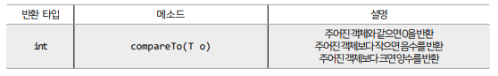
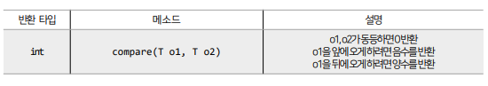
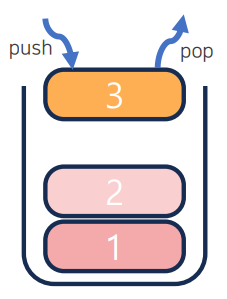
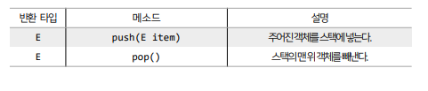
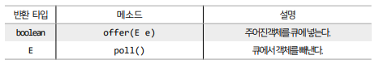
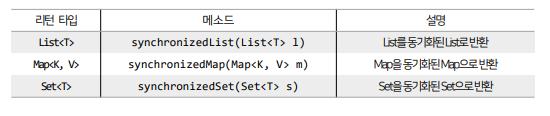
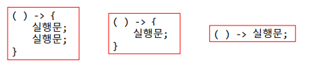
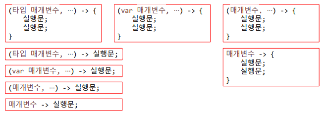
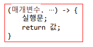
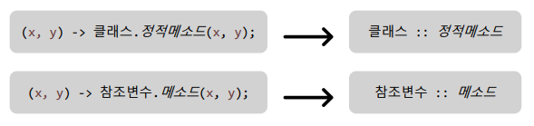

## 목차
- [컬렉션 자료구조](#컬렉션-자료구조)
  - [Map 컬렉션](#map-컬렉션)
    - [Properties](#properties)
    - [TreeMap](#treemap)
  - [Comparable과 Comparator](#comparable과-comparator)
  - [LIFO와 FIFO 컬렉션](#lifo와-fifo-컬렉션)
    - [스택(Stack)](#스택stack)
    - [큐](#큐)
  - [동기화된 컬렉션](#동기화된-컬렉션)
  - [수정할 수 없는 컬렉션](#수정할-수-없는-컬렉션)
- [람다식](#람다식)
  - [익명 구현 객체 생성](#익명-구현-객체-생성)
  - [익명 구현 객체 사용 (인터페이스 타입의 매개변수에 대입)](#익명-구현-객체-사용-인터페이스-타입의-매개변수에-대입)
  - [람다식 특징](#람다식-특징)
  - [메소드 참조](#메소드-참조)

<br/>
<br/>
<br/>
<br/>

# 컬렉션 자료구조
## Map 컬렉션
### Properties
- Properties는 Hashtable의 자식 클래스이기 때문에 Hashtable의 특징을 그대로 가지고 있다.
- Properties는 키와 값을 String  타입으로 제한한 컬렉션으로, 주로 확장자가 `.properties`인 프로퍼티 파일을 읽을 때 사용한다.
- 프로퍼티 파일은 키와 값이 = 기호로 연결되어 있는 텍스트 파일로, 일반 텍스트 파일과다르게 ISO 8859-1 문자셋으로 저장되며, 한글인 경우에는 \u+유니코드로 표현되어 저장된다.
- Properties를 사용하면 쉽게 프로퍼티의 파일 내용을 코드에서 읽어올 수 있다.
- 먼저 Properties 객체를 생성하고, load() 메소드로 프로퍼티 파일의 내용을 메모리로 로드한다.
- 일반적으로 프로퍼티 파일은 클래스 파일들과 함께 저장된다. 따라서 클래스 파일을 기준으로 상대 경로로 읽는 것이 편하다.
```java
import java.io.IOException;
import java.util.Properties;

public class PropertiesExample {
	public static void main(String[] args) {
		// Properties 생성
		Properties properties = new Properties();

		// 현재 클래스와 동일한 경로에 있는 database.properties 파일을 로드
		try {
			properties.load(PropertiesExample.class.getResourceAsStream("database.properties"));

			String driver = properties.getProperty("driver");
			String url = properties.getProperty("url");
			String user = properties.getProperty("user");
			String password = properties.getProperty("password");

			System.out.println(driver + ", " + url + ", " + user + ", " + password);
		} catch (IOException e) {
			e.printStackTrace();
		}
	}
}
```
  
<br/>
<br/>

### TreeMap
- TreeMap은 이진트리(Binary Tree)를 기반으로 검색 기능을 강화한 Map 컬렉션이다.
- TreeSet과의 차이점은 키와 값이 저장된 Entry를 저장한다는 점이다.
- TreeMap에 저장되는 객체는 저장과 동시에 오름차순으로 정렬된다. (키를 기준으로 낮은 것은 왼쪽 자식 노드에, 높은 것은 오른쪽 자식 노드에 저장)
- 어떤 객체든지 오름차순으로 정렬될 수 있는 것은 아니고, Comparable 인터페이스를 구현하고 있는 객체만이 정렬가능하다.
- Comparable 인터페이스와 Comparator 인터페이스는 뒤에서 알아보도록 한다.
- Map 타입 변수에 대입해도 되지만, TreeMap 타입으로 대입한 이유는 검색 관련 메소드가 TreeMap에만 정의되어 있기 때문이다.
```java
import java.util.Map.Entry;
import java.util.NavigableMap;
import java.util.Set;
import java.util.TreeMap;

public class TreeMapExample {

	public static void main(String[] args) {
		// 문자열 키와 정수 값을 갖는 TreeMap 생성
		TreeMap<String, Integer> treeMap = new TreeMap<>();

		// 엔트리 저장
		treeMap.put("오예스", 2000);
		treeMap.put("크리스피 포테이토", 200);
		treeMap.put("빠다코코넛", 1400);
		treeMap.put("단백질음료", 3000);
		treeMap.put("조청유과", 10000);
		treeMap.put("가나초콜릿", 5000);

		System.out.println(treeMap); // ㄱㄴㄷ순으로 출력

		Set<Entry<String, Integer>> entrySet = treeMap.entrySet();
		for (Entry<String, Integer> entry : entrySet) {
			String key = entry.getKey();
			Integer value = entry.getValue();
			System.out.println(key + " : " + value);
		}
		System.out.println();

		Entry<String, Integer> firstEntry = treeMap.firstEntry();
		System.out.println(firstEntry.getKey() + " : " + firstEntry.getValue());
		// 가나초콜릿 : 5000
		System.out.println();

		Entry<String, Integer> lastEntry = treeMap.lastEntry();
		System.out.println(lastEntry.getKey() + " : " + lastEntry.getValue());
		// 크리스피 포테이토 : 200
		System.out.println();

		Entry<String, Integer> lowerOhYesEntry = treeMap.lowerEntry("오예스");
		System.out.println(lowerOhYesEntry.getKey() + " : " + lowerOhYesEntry.getValue());
		// 빠다코코넛 : 1400
		System.out.println();

		// 내림차순 정렬
		NavigableMap<String, Integer> descendingMap = treeMap.descendingMap();
		Set<Entry<String, Integer>> decendingEntrySet = descendingMap.entrySet();
		for (Entry<String, Integer> entry : decendingEntrySet) {
			String key = entry.getKey();
			Integer value = entry.getValue();
			System.out.println(key + " : " + value);
		}
		System.out.println();

		System.out.println("가~자 까지 범위 검색");
		NavigableMap<String, Integer> fromGaToMaMap = treeMap.subMap("가", true, "자", true);
		System.out.println(fromGaToMaMap);
		// {가나초콜릿=5000, 단백질음료=3000, 빠다코코넛=1400, 오예스=2000}

	}

}
```


 
<br/>
<br/>

## Comparable과 Comparator
- TreeSet에 저장되는 객체와 TreeMap에 저장되는 키 객체는 저장과 동시에 오름차순으로 정렬된다.
- 어떤 객체든 정렬될 수 있는 건 아니고 객체가 Comparable 인터페이스를 구현하고 있어야 가능하다.
- Integer, Double, String 타입은 모두 Comparable을 구현하고 있기 때문에 상관 없지만, 사용자가 직접 정의한 객체를 저장할 때는 반드시 Comparable을 구현하고 있어야 한다.
- Comparable 인터페이스에는 `compareTo()` 메소드가 정의되어 있다. 
- 따라서 사용자 정의 클래스에서 이 메소드를 재정의해서 비교 결과를 정수값으로 반환해야 한다.

```java
import lombok.AllArgsConstructor;
import lombok.Data;

@AllArgsConstructor
@Data
public class Book implements Comparable<Book> {
	private String title, isbn;
	private int year;

	@Override
	public int compareTo(Book o) {

		// 연도별 정리
		// return Integer.valueOf(this.year).compareTo(o.getYear());

		// 제목 글자수 오름차순 정렬
		Integer thisTitleLength = this.title.length(); 
		Integer otherTitleLength = o.title.length(); 

		return thisTitleLength.compareTo(otherTitleLength);
	}

}
```

<hr/>

- Comparable 인터페이서가 구현되어 있지 않은 객체를 TreeSet에 저장하거나 TreeMap의 키로 저장하기 위해서는 TreeSet 또는 TreeMap을 생성할 때 비교자(Comparator)를 제공해야 한다.
- 비교자는 Comparator 인터페이스를 구현한 객체를 의미한다.
- Comaprator 인터페이스에는 `compare()` 메소드가 정의되어 있고, 이를 재정의해서 비교 결과를 정수값으로 반환하면 된다.

```java
import java.util.Comparator;
import java.util.TreeSet;

public class SortExample2 {

	public static void main(String[] args) {
		// 비교자(Comparator) 생성
		Comparator<Book2> yearComparator = new Comparator<Book2>() {
			// override가 1개 -> 인터페이스가 1개인 함수형 인터페이스
			@Override
			public int compare(Book2 o1, Book2 o2) {
				return o1.getYear() - o2.getYear();
//				Integer o1year = o1.getYear();
//				Integer o2year = o2.getYear();
//				return Integer.compare(o1year, o2year);
			}
		};
		TreeSet<Book2> bookSet = new TreeSet<>((o1, o2) -> o1.getYear() - o2.getYear());

		bookSet.add(new Book2("개를 훔치는 완벽한 방법", "B1", 2002));
		bookSet.add(new Book2("수상한 장미마을", "B2", 2000));
		bookSet.add(new Book2("위대한 개츠비", "B3", 1980));
		bookSet.add(new Book2("언어의 온도", "B4", 2015));
		bookSet.add(new Book2("아몬드", "B5", 2006));

		System.out.println(bookSet);

	}

}
```
 
<br/>
<br/>

## LIFO와 FIFO 컬렉션
- 후입선출(LIFO: Last In First Out) : 나중에 넣은 객체가 먼저 빠져나가는 구조
- 선입선출(FIFO: First In First Out) : 먼저 넣은 객체가 먼저 빠져나가는 구조
- 컬렉션 프레임워크는 LIFO 자료구조를 제공하는 스택(Stack) 클래스와 FIFO 자료구조를 제공하는 큐(Queue) 인터페이스를 제공하고 있다.
### 스택(Stack)

- LIFO 자료구조를 구현한 클래스
- 스택이 가진 주요 메소드

```java
import java.util.Stack;

public class StackExample {

	public static void main(String[] args) {
		Stack<Coin> coinBox = new Stack<>();

		coinBox.push(new Coin(500));
		coinBox.push(new Coin(100));
		coinBox.push(new Coin(50));
		coinBox.push(new Coin(10));
		coinBox.push(new Coin(5));
		coinBox.push(new Coin(1));

		while (!coinBox.isEmpty()) {
			Coin c = coinBox.pop();
			System.out.println("꺼낸 동전 : " + c.getValue());
			// 1 5 10 50 100 500 순서대로 출력
		}

	}

}
```
### 큐
- Queue 인터페이스는 FIFO 자료 구조에서 사용되는 메소드를 정의하고 있다.

- Queue 인터페이스를 구현하는 대표적인 클래스는 LinkedList이다.
```java
import java.util.LinkedList;
import java.util.Queue;

public class QueueExample {

	public static void main(String[] args) {
		Queue<Message> msgQueue = new LinkedList<>();

		msgQueue.offer(new Message("sendMail", "카리나"));
		msgQueue.offer(new Message("Call", "윈터"));
		msgQueue.offer(new Message("sendKakao", "지젤"));
		msgQueue.offer(new Message("CallDeny", "닝닝"));

		while (!msgQueue.isEmpty()) {
			Message msg = msgQueue.poll();
			switch (msg.getCommand()) {
			case "sendMail":
				System.out.println(msg.getTo() + "에게 메일을 보냅니다");
				break;
			case "Call":
				System.out.println(msg.getTo() + "에게 전화합니다");
				break;
			case "sendKakao":
				System.out.println(msg.getTo() + "에게 카톡합니다");
				break;
			case "CallDeny":
				System.out.println(msg.getTo() + "에게 오는 전화를 무시합니다");
				break;
			}
		}

	}

}
```
 
<br/>
<br/>

## 동기화된 컬렉션
- 컬렉션 프레임워크의 대부분 클래스들은 싱글 스레드 환경에서 사용할 수 있도록 설계되었다.
- 여러 스레드가 동시에 컬렉션에 접근하면 의도하지 않게 요소가 변경될 수 있는 불안전한 상태가 된다.
- Vector와 HashTable은 동기화된(Synchronized) 메소드로 구성되어 있기 때문에 멀티 스레드 환경에서 안전하게 요소를 처리할 수 있지만, 다른 것들은 동기화된 메소드로 구성되어 있지 않아 멀티 스레드 환경에서 안전하지 않다.
- 만약 멀티 스레드 환경에서 사용하고자 한다면,
비동기화된 메소드를 동기화된 메소드로 래핑하는 Collections의 synchronizedXXX() 메소드를 사용하면 된다.


<br/>
<br/>

## 수정할 수 없는 컬렉션
- 요소를 추가, 삭제할 수 없는 컬렉션을 수정할 수 없는 (unmodifable) 컬렉션이라 한다.
- 컬렉션 생성 시 저장된 요소를 변경하고 싶지 않을 때 사용할 수 있다.
- 수정할 수 없는 컬렉션을 만드는 방법
  - List, Set, Map 인터페이스의 정적 메소드인 `of()`로 생성
    ```java
    List<E> immutableList = List.of(E element1, …);
    Set<E> immutableSet = Set.of(E element2, …);
    Map<E> immutableMap = Map.of(K k1, V v1, …);
    ```
  - List, Set, Map 인터페이스의 정적 메소드인 `copyOf()`로 생성
    ```java
    List<E> immutableList = List.copyOf(Collection<E> coll);
    Set<E> immutableSet = Set.of(Collection<E> coll);
    Map<E> immutableMap = Map.of(Map<K, V> map);
    ```
  - 배열로부터 수정할 수 없는 List 컬렉션을 생성
    ```java
    String arr = { };
    List<String> immutableList = Arrays.asList(arr);
    ```

<br/>
<br/>
<br/>
<br/>

# 람다식
- 메서드를 `하나의 식`으로 표현한 것
- 하나의 식이기 때문에 훨신 간략하게 표현이 가능하다.
- 메서드의 이름과 반환값이 없어지므로 `익명 함수`라고도 한다.
- Java는 함수형 프로그래밍을 위해 Java 8부터 람다식(Lambda Expressions)을 지원한다.

<details>
<summary>함수형 프로그래밍(Functional Programming)</summary>
- 함수를 정의하고, 해당 함수를 데이터 처리부로 보내 데이터를 처리하는 기법 <br/>
- 데이터 처리부에서는 데이터만 가지고 있을 뿐, 데이터의 처리 방법이 정해져 있지 않기 때문에 외부에서 제공된 함수에 의존한다. <br/>
(추상 메소드를 정의하고 오버라이드 해서 메소드를 처리하는 것)
</details>

<br/>

- 람다식은 데이터 처리부에 제공되는 함수 역할을 하는 매개변수를 가진 중괄호 블록으로, 익명 구현 객체로 변환하여 동작한다.
- 익명 구현 객체를 람다식으로 표현하기 위해서는 인터페이스가 단 하나의 추상 메소드만을 가지고 있어야 한다.
- 단 하나의 추상메소드를 가지고 있는 인터페이스를 `함수형 인터페이스`라고 부르고, `@FunctionalInterface` 어노테이션을 붙인다.
- 람다식에서 매개변수가 하나인 경우에는 소괄호 생략이 가능하고, 실행문이 한 줄인 경우에는 중괄호 생략이 가능하다.
```java
public class CarExample {
	public static void main(String[] args) {
		Driver hello = new Driver();
		hello.drive(new K5());

		hello.drive(new Teslar());

		hello.drive(new Car() {
			@Override
			public void run() {
				System.out.println("모르는 차인데 운전 가능");
			}
		});

		hello.drive(() -> System.out.println("이름 없는 슈퍼카"));
	}
}
```

<br/>
<br/>

## 익명 구현 객체 생성
- 어노테이션은 선택사항이지만, 컴파일 과정에서 검사 할 수 있도록 해준다.
- 추상 메소드가 하나인 경우에만 lambda를 이용해 익명 구현 객체를 생성할 수 있다.
```java
public class LambdaExample {
	public static void main(String[] args) {
        // Lambda 사용한 익명 구현 객체 생성
		MyInterface li = (x) -> System.out.println("숫자 " + x + "을 활용한 동작");
		li.action(5);
	}
}
```

<br/>
<br/>

## 익명 구현 객체 사용 (인터페이스 타입의 매개변수에 대입)
```java
public class LambdaExample2 {
	public static void main(String[] args) {
		// action 메소드 사용하기 (lambda를 이용한 익명 구현 객체 생성)
		action((x) -> System.out.println("숫자 " + x + "을 활용한 동작"));
	}

	public static void action(MyInterface mi) {
		int x = 3;
		mi.action(x);
	}
}
```

<br/>
<br/>

## 람다식 특징
- 함수형 인터페이스의 추상 메소드가 매개변수를 가지고 있지 않은 경우, `() -> 실행문;` 형식으로 작성할 수 있다.

- 실행문이 두 개 이상인 경우에는 중괄호를 생략할 수 없고, 하나일 경우 생략 가능하다.
<hr/>

- 함수형 인터페이스의 추상 메소드에 매개변수가 있는 경우 `(매개변수) -> 실행문;` 형식으로 작성할 수 있다.
  
- 매개변수를 선언할 때 일반적으로 타입을 생략하지만, 구체적인 타입 대신에 var를 사용할 수도 있다.
- 매개변수가 하나일 경우에는 괄호를 생략할 수도 있는데, 이 때는 타입 또는 var를 붙일 수 없다.
<hr/>

- 함수형 인터페이스의 추상 메소드에 리턴값이 있을 경우 아래와 같이 작성 가능하다.

- return문이 하나만 존재하는 경우에는 중괄호와 함께 return 키워드를 생략할 수 있다.

<hr/>
[예시]

```java
import java.util.Scanner;

public class Calculator {
	public void calculate(Calculable calc) {
		Scanner sc = new Scanner(System.in);

		System.out.print("숫자를 입력하세요 -> ");
		int x = sc.nextInt();
		System.out.print("숫자를 입력하세요 -> ");
		int y = sc.nextInt();

		int result = calc.calculate(x, y);
		System.out.println(result);

	}
}
```
```java
public class CalculatorExample {
	public static void main(String[] args) {

		Calculator c = new Calculator();
		c.calculate((x, y) -> x + y);
		c.calculate((x, y) -> x - y);
		c.calculate((x, y) -> x * y);

	}
}
```
<br/>

[또 다른 예시]
```java
import lombok.AllArgsConstructor;
import lombok.Getter;

@Getter
@AllArgsConstructor
public class Person {
	private String name, job, nation;

	public void action1(Workable workable) {
		workable.work(name, job);
	}

	public void action2(Speakable speakable) {
		speakable.speak(nation);
	}
}
```
```java
public class PersonExample {

	public static void main(String[] args) {
		Person seoyeon = new Person("정서연", "학생", "대한민국");

		seoyeon.action1((name, job) -> {
			System.out.println("안녕하세요, 제 이름은 " + name + "입니다.");
			System.out.println("제 직업은 " + job + "입니다.");
		});

		seoyeon.action2(content -> {
			if (seoyeon.getNation().equals("대한민국")) {
				System.out.println("안녕하세요!");
			} else {
				System.out.println("Hello!");
			}
		});

	}

}
```

<br/>
<br/>

## 메소드 참조
- 메소드 참조(Method Reference)는 Java8에서 도입된 기능으로, 기존 메소드나 생정자를 참조하여 람다 표현식을 단축할 수 있다.
- 이를 통해 코드의 가독성을 향상시키고, 불필요한 매개변수를 제거할 수 있다.
- 람다식은 매개변수를 받아 값을 전달하는 역할을 할 수 있지만, 메소드 참조를 통해 불필요한 매개변수를 제외하고 더 간결하게 작성할 수 있다.



<hr/>
[예시]   

```java
@FunctionalInterface
public interface Calculable {
	double calc(double x, double y);
}
```
```java
public class Person {
	public void action(Calculable c) {
		double result = c.calc(10, 4);
		System.out.println("결과 : " + result);
	}
}
```
```java
public class CalculateService {
	public double sum(double x, double y) {
		return x + y;
	}

	public double multiply(double x, double y) {
		return x * y;
	}
}
```
```java
public class MethodReferenceExample {
	public static void main(String[] args) {
		Person p = new Person();
		CalculateService cs = new CalculateService();

		p.action(cs::sum);

		p.action(cs::multiply);
	}
}
```

<hr/>

[예시]   

```java
public class MethodReferenceExample {
	public static void main(String[] args) {
		Person p = new Person();

		p.action((x, y) -> CalculateService.sum(x, y));
		p.action(CalculateService::sum);

		p.action((x, y) -> CalculateService.sum(x, y));
		p.action(CalculateService::multiply);

	}
}
```
```java
public class CalculateService {
    public static double sum(double x, double y) {
		return x + y;
	}

	public static double multiply(double x, double y) {
		return x * y;
	}
}
```
