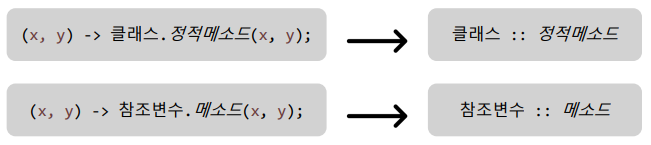
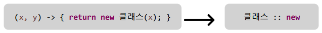
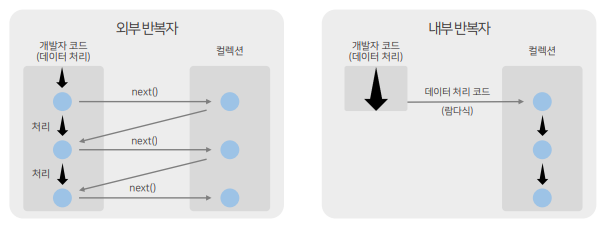
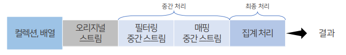
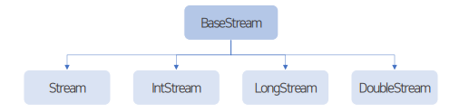
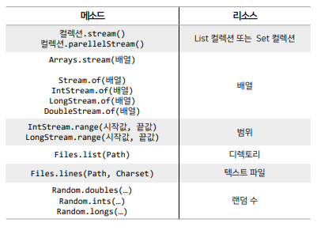
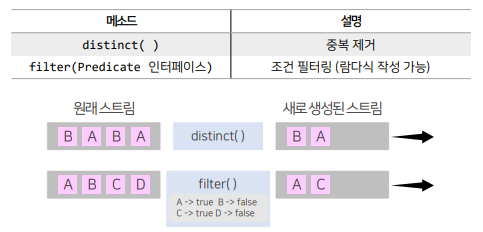
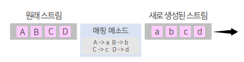
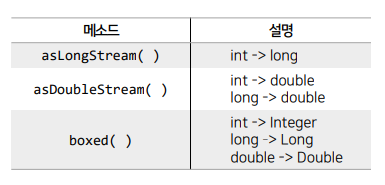

## 목차
- [람다식](#람다식)
  - [메소드 참조](#메소드-참조)
  - [매개변수의 메소드 참조](#매개변수의-메소드-참조)
  - [생성자 참조](#생성자-참조)
- [스트림](#스트림)
  - [내부 반복자](#내부-반복자)
  - [중간 처리와 최종 처리](#중간-처리와-최종-처리)
  - [리소스로부터 스트림 얻기](#리소스로부터-스트림-얻기)
    - [컬렉션](#컬렉션)
    - [배열](#배열)
    - [숫자 범위](#숫자-범위)
    - [파일](#파일)
  - [요소 걸러내기](#요소-걸러내기)
    - [필터링](#필터링)
    - [매핑](#매핑)
  - [요소 정렬](#요소-정렬)

<br/>
<br/>
<br/>
<br/>

# 람다식
## 메소드 참조
- 메소드 참조(Method Reference)는 자바 8에서 도입된 기능으로, 기존 메소드나 생성자를 참조하여 람다 표현식을 단축할 수 있다.
- 이를 통해 코드의 가독성을 향상시키고, 불필요한 매개변수를 제거할 수 있다.
  

- 람다식은 매개변수를 받아 값을 전달하는 역할을 할 수 있지만, 메소드 참조를 이용하면 불필요한 매개변수를 제외하고 더 간결하게 작성할 수 있다.
```java
TreeSet<Book> bookTreeSet = bm.getBookTreeSet();
System.out.println("\n 트리셋 출력");
//bookTreeSet.forEach(b -> System.out.println(b));
bookTreeSet.forEach(System.out::println);
```
<br/>
<br/>

## 매개변수의 메소드 참조
- 람다식에서 제공되는 두 개의 매개변수(x, y)에서 x의 메소드를 호출해서 y를 매개값으로 사용하는 경우 사용할 수 있다.


- 작성 방법은 정적 메소드 참조와 동일하지만, 매개변수의 인스턴스 메소드가 사용된다는 점에서 차이가 있다.
```java
public class MethodReferenceExample {
	public static void main(String[] args) {
		Person p = new Person();

		// 1. 익명 구현 객체로 매개변수 구현
		p.ordering(new Comparable() {

			@Override
			public int compare(String a, String b) {
				return a.compareTo(b);
			}

		});

		// 2. 람다식으로 변경
		// 인터페이스 이름, 추상 메소드 이름 알고 있다 -> 매개변수와 동작만 적어주면 된다
		p.ordering((String a, String b) -> a.compareToIgnoreCase(b));

		// 3. 메소드 참조로 변경
		// 매개변수를 활용해서 함축할 수 있다. -> 첫번째 매개변수 클래스 :: 메소드
		p.ordering(String::compareToIgnoreCase);
	}
}
```

<br/>
<br/>

## 생성자 참조
- 생성자를 참조한다는 것은 객체를 생성한다는 것을 의미한다.
- 람다식이 단순히 객체를 생성하고 반환하도록 구성된다면, 람다식을 생성자 참조로 대체할 수 있게 된다.


- 생성자가 오버로딩되어 여러 개가 있을 경우,
컴파일러는 함수형 인터페이스의 추상메소드와 동일한 매개변수 타입과 개수를 가지고 있는 생성자를 찾아 실행한다.

```java
public class ConstructorExample {
	public static void main(String[] args) {
		Person p = new Person();

		// 1. 익명 구현
		p.getMemeber1(new Creatable1() {
			@Override
			public Member create(String id) {
				return new Member(id);
			}
		});

		// 2. 람다식으로 변경
		p.getMemeber1((String id) -> new Member(id));

		// 3. 생성자 참조
		p.getMemeber1(Member::new);

		System.out.println();

		// 1. 익명 구현
		p.getMemeber2(new Creatable2() {
			@Override
			public Member create(String id, String name) {
				return new Member(id, name);
			}
		});

		// 2. 람다식으로 변경
		p.getMemeber2((String id, String name) -> new Member(id, name));

		// 3. 생성자 참조
		p.getMemeber2(Member::new);
	}
}
```

<br/>
<br/>
<br/>
<br/>

# 스트림
- Java 8부터는 컬렉션 및 배열의 요소를 반복처리하기 위한 또 다른 방법으로 스트림(Stream)을 사용할 수 있다.
- stream() 메소드로 Stream 객체를 얻고, forEach() 메소드로 요소를 어떻게 처리할지 람다식으로 제공한다.
- 스트림(Stream)은 Iterator와 비슷한 반복자이지만, 아래와 같은 차이를 가지고 있다.
  1. 내부 반복자이므로 보다 빠른 처리 속도를 가지고 있으며 병렬 처리에 효과적이다.
  2. 람다식으로 다양한 요소 처리를 정의할 수 있다.
  3. 중간처리와 최종처리를 수행하도록 파이프라인을 형성할 수 있다.

<br/>
<br/>

## 내부 반복자
- for문과 Iterator는 컬렉션의 요소를 컬렉션 바깥쪽으로 반복해서 가져와 처리하는 외부 반복자이다.
- 반면 스트림은 요소 처리 방법을 컬렉션 내부로 주입시켜서 요소를 반복 처리하는 내부 반복자이다.


- 외부 반복자는 컬렉션의 요소를 외부로 가져오는 코드와 처리하는 코드를 모두 개발자 코드가 가지고 있어야 한다.
- 하지만 내부 반복자는 개발자 코드에서 제공한 데이터 처리 코드(람다식)를 가지고 컬렉션 내부에서 요소를 반복처리 한다.
- 내부 반복자를 사용하면 멀티 CPU를 최대한 활용하기 위해 요소들을 분배시켜 병렬 작업을 할 수 있다.
- 이는 하나씩 처리하는 순차적 외부 반복자보다 효율적인 반복이 가능하다.
```java
import java.util.ArrayList;
import java.util.List;
import java.util.stream.Stream;

public class StreamExample {
	public static void main(String[] args) {
		List<String> languageList = new ArrayList<>();
		languageList.add("Java");
		languageList.add("JavaScript");
		languageList.add("Python");
		languageList.add("C");

		// 병렬 스트림 얻기
		Stream<String> ps = languageList.parallelStream();
		ps.forEach(name -> {
			System.out.println(name + " : " + Thread.currentThread().getName());
		});

		System.out.println();

		// for문으로 동작 시키기
		for (String name : languageList) {
			System.out.println(name + " : " + Thread.currentThread().getName());
		}

	}
}
```
```
JavaScript : ForkJoinPool.commonPool-worker-1
Java : ForkJoinPool.commonPool-worker-3
Python : main
C : ForkJoinPool.commonPool-worker-2

Java : main
JavaScript : main
Python : main
C : main
```

<br/>
<br/>

## 중간 처리와 최종 처리
- 스트림은 하나 이상 연결될 수 잇다.
- 컬렉션의 오리지널 스트림 뒤에 필터링 중간 스트림이 연결될 수 있고, 그 뒤에 매핑 중간 스트림이 연결될 수도 있다.
- 이처럼 스트림이 연결되어 있는 것을 스트림 파이프라인(Stream Pipeline)이라고 한다.
  

- 중간 스트림은 최종 처리를 위해 요소를 걸러내거나(필터링), 요소를 변환시키거나(매핑), 정렬하는 작업을 수행한다.
- 최종 처리는 중간 처리에서 정제된 요소들을 반복하거나, 집계 처리(카운팅, 총합, 평균) 작업을 수행한다.
```java
import java.util.Arrays;
import java.util.List;

public class StudentStreamExample {

	public static void main(String[] args) {
		// 불변 객체 생성
		List<Student> sList = Arrays.asList(new Student("Alice", 90), new Student("Bob", 80), new Student("Carol", 85),
				new Student("David", 95));

//		Stream<Student> originStream = sList.stream();
//		IntStream intStream = originStream.mapToInt(Student::getScore);
//		OptionalDouble optAverage = intStream.average();
//		double average = optAverage.getAsDouble();
		// 변수를 계속 생성해야 하는 번거로움이 있다.

		double average = sList.stream().mapToInt(Student::getScore).average().getAsDouble();

		System.out.println("평균 점수 : " + average); // 87.5

	}

}
```

<br/>
<br/>

## 리소스로부터 스트림 얻기
- java.util.stream 패키지에는 스트림과 관련한 인터페이스들이 있다.
- BaseStream 인터페이스를 부모로 한 자식 인터페이스는 아래와 같은 상속 관계를 이루고 있다.

- BaseStream에는 모든 스트림에서 사용할 수 있는 공통 메소드들이 정의되어 있으며,
- Stream은 객체 요소를 처리하는 스트림이고
- IntStream, LongStream, DoubleStream은 각각 기본 타입인 int, long, double 요소를 처리하는 스트림이다.
- 스트림 인터페이스들은 주로 컬렉션과 배열에서 얻는다. 뿐만 아니라 다양한 리소스로부터 얻을 수 있다.


### 컬렉션
- java.util.Collection 인터페이스는 stream() 메소드와 parallelStream() 메소드를 가지고 있기 때문에 
- 자식 인터페이스인 List와 Set 인터페이스를 구현한 모든 컬렉션에서 객체 스트림을 얻을 수 있다.
```java
import java.util.ArrayList;
import java.util.List;
import java.util.stream.Stream;

public class ProductExample {

	public static void main(String[] args) {
		List<Product> pList = new ArrayList<>();

		for (int i = 1; i <= 5; i++) {
			Product p = new Product(i, (int) (10000 * Math.random()), "상품" + i, "회사명");
			pList.add(p);
		}

		Stream<Product> stream = pList.stream();
		stream.forEach(p -> System.out.println(p));

		double average = pList.stream().mapToInt(Product::getPrice).average().getAsDouble();
		System.out.println("평균 가격 : " + average);
	}

}
```
### 배열
- java.util.Arrays 클래스를 이용하면 다양한 종류의 배열로부터 스트림을 얻을 수 있다.
```java
import java.util.Arrays;
import java.util.stream.IntStream;
import java.util.stream.Stream;

public class StreamExample {

	public static void main(String[] args) {
		String[] strArr = { "맥북", "아이폰", "에어팟" };
		// 배열로부터 스트림 얻는 두 가지 방법
		Stream<String> strStream1 = Stream.of(strArr);
		Stream<String> strStream2 = Arrays.stream(strArr);

		strStream1.forEach(i -> System.out.print(i + ", "));
		System.out.println();
		strStream2.forEach(i -> System.out.print(i + ", "));

		System.out.println("\n");

		int[] intArr = { 3, 1, 4, 1, 5, 9, 2 };
		// 배열로부터 스트림 얻는 두 가지 방법
		IntStream intStream1 = IntStream.of(intArr);
		IntStream intStream2 = Arrays.stream(intArr);

		intStream1.forEach(i -> System.out.print(i + ", "));
		System.out.println();
		intStream2.forEach(i -> System.out.print(i + ", "));
	}

}
```
### 숫자 범위
- intStream 또는 LongStream()의 정적 메소드인 range()와 rangeClosed() 메소드를 이용하면, 특정 범위의 정수 스트림을 얻을 수 있다.
- range() 와 rangeClosed() 메소드의 첫번째 매개값은 시작 수이고, 두번째 매개값은 끝수이다.
- range() 메소드는 끝수를 포함하지 않고, rangeClosed() 메소드는 끝수를 포함한다.

```java
import java.util.stream.IntStream;

public class StreamExample {

	public static void main(String[] args) {

		// 특정 범위의 정수 스트림을 만들기
		int sum1 = IntStream.range(1, 10).sum(); // 1 이상 10 미만
		System.out.println(sum1 + "\n"); // 45

		int sum2 = IntStream.rangeClosed(1, 10).sum(); // 1 이상 10 이하
		System.out.println(sum2); // 55

	}

}
```
### 파일
- java.nio.file.Files의lines( ) 메소드를 이용하면 텍스트 파일의 행단위 스트림을 얻을 수 있어서, 텍스트파일에서 한 행씩 읽고 처리할 때 유용하게 사용할 수 있다.
```java
import java.nio.charset.Charset;
import java.nio.file.Files;
import java.nio.file.Path;
import java.nio.file.Paths;
import java.util.stream.Stream;

public class StreamExample {

	public static void main(String[] args) throws Exception {
		String absolutePath = "C:\\Users\\WD\\Desktop\\kosta-study-log\\7주차\\240724\\data.txt";
		Path path = Paths.get(absolutePath);

		Stream<String> stream = Files.lines(path, Charset.defaultCharset());
		stream.forEach(line -> System.out.println(line));
		stream.close();

	}

}
```

<br/>
<br/>

## 요소 걸러내기
### 필터링
- 요소를 걸러내는 중간 처리 기능으로, `distinct()`와 `filter()` 메소드가 필터링에 쓰인다.


- Predicate 인터페이스는 함수형 인터페이스로 객체를 조사하는 인터페이스로 아래와 같은 종류가 있다.
  - Predicate는 객체 요소를 조사하는 인터페이스이고,
  - IntPredicate, LongPredicate, DoublePredicate는 각각 기본 타입인 int, long, double 요소를 처리하는 스트림이다.
- Predicate 인터페이스에는 매개값을 조사한 후,boolean을 반환하는 test() 메소드가있다.
```java
import java.util.Arrays;
import java.util.List;
import java.util.stream.Collectors;

public class StreamFilterExample {

	public static void main(String[] args) {
		List<String> nameList = Arrays.asList("우상혁", "황선우", "김우민", "서채현", "신유빈", "우상혁");

		// distinct로 중복된 요소가 제거
		nameList.stream().distinct().forEach(n -> System.out.print(n + ", "));
		System.out.println();

		// filter로 '우'가 들어간 이름만 출력
		nameList.stream().filter(n -> n.contains("우")).forEach(n -> System.out.print(n + ", "));
		System.out.println();

		// distnct로 중복된 요소가 제거되고, filter로 "우"가 들어간 이름만 출력
		// .collect(Collectors.toList()) => ArrayList를 반환한다
		// 수정이 허용되고, Null 값이 허용된다
		List<String> filteredList = nameList.stream().distinct().filter(n -> n.contains("우"))
				.collect(Collectors.toList());
		System.out.println(filteredList);
	}

}
```
### 매핑
- 매핑은 스트림의 요소를 다른 요소로 변환하는 중간 처리 기능으로, 매핑에 사용되는 메소드로는 mapXxx(), asDoubleStream(), asLongStream(), boxed(), flatMapXxx() 등이 있다.


- mapXxx() 메소드의 종류는 상당히 다양하며, 해당 요소를 변환할 때 사용된다.
  - map( ), mapToInt( ), mapToLong( ), mapToDouble( ), mapToObj( )…
- mapXxx( ) 메소드의 매개변수에는 Function 인터페이스 타입이 들어오는데, Function은 함수형 인터페이스이다.
- 모든 Function 인터페이스에는 매개값을 반환값으로 매핑(변환)하는 applyXxx( ) 메소드가 있다.
```java
import java.util.Arrays;
import java.util.List;

public class MappingExample {

	public static void main(String[] args) {
		List<Student> sList = Arrays.asList(new Student("Aclice", 90), new Student("Bob", 80), new Student("Carol", 85),
				new Student("David", 95));

		sList.stream().map(Student::getName).forEach(System.out::println);

	}

}
```
- asDoubleStream(), asLongStream() 메소드는 기본 타입 간의 변환에 사용된다.
- boxed() 메소드는 기본 타입 요소를 래퍼 객체 요소로 반환될 때 사용된다.



<br/>

[예시]
```java
// 1부터 1000까지 숫자 생성
// 스트림으로 소수만 포함하는 새로운 리스트로 반환
List<Integer> primeList = IntStream.rangeClosed(1, 1000).filter(x -> isPrime(x)).boxed()
				.collect(Collectors.toList());
System.out.println(primeList);

System.out.println();

// 1부터 5까지 IntStream 생성, double 타입으로 반환하고 출력하기
IntStream.range(1, 6).asDoubleStream().forEach(v -> System.out.println(v));

System.out.println();

// 1부터 5까지 IntStream 생성, double 타입의 리스트로 변환하고 출력하기
IntStream.range(1, 6).asDoubleStream().boxed().collect(Collectors.toList());
```
- flatMapXxx() 메소드는 하나의 요소를 복수 개의 요소들로 변환해 새로운 스트림을 반환한다.
- flatMapXxx() 메소드의 종류는 상당히 다양하며, 해당 요소를 반환할 때 사용된다.
  - flatMap(), flatMapToInt(), faltMapToLong(), flatMapToDouble()...
- flatMapXxx() 메소드의 매개변수에도 MapXxx()와 동일하게 Function 인터페이스 타입이 들어온다.
```java
import java.util.ArrayList;
import java.util.Arrays;
import java.util.List;

public class FlatMappingExample {

	public static void main(String[] args) {
		List<String> msgList = new ArrayList<>();
		msgList.add("안녕? 난 최인규야");
		msgList.add("우리 같이 열심히 공부하자");
		msgList.add("서영훈님 보고 싶어요.");

		msgList.stream() // Stream<String>
				.flatMap(msg -> Arrays.stream(msg.split(" "))) /// Stream<String> 11개로 쪼개짐
				.forEach(word -> System.out.println(word));

		System.out.println();

		List<String> strNums = Arrays.asList("10, 20, 30", "40, 50", "60");
		strNums.stream() // Stream<String>
				.flatMapToInt(e -> {
					String[] strArr = e.split(","); // ["10", " 20", " 30"]
					int[] intArr = new int[strArr.length];
					for (int i = 0; i < strArr.length; i++) {
						intArr[i] = Integer.parseInt(strArr[i].trim());
					}
					return Arrays.stream(intArr);
				}) // IntStream
				.forEach(System.out::println);
		;
	}

}
```


<br/>
<br/>

## 요소 정렬
- 스트림의 중간 처리 기능으로 정렬이 있고, 이는 `sorted()` 메소드로 가능하다.
- `sorted()` 메소드는 요소가 Comparable을 구현하고 있어야만 사용 가능하다.
- 만약 Comparable을 구현하지 않은 객체로 구성된 스트림인 경우에는 ClassCastException이 발생한다.
```java
import java.util.ArrayList;
import java.util.List;

public class SortExample {

	public static void main(String[] args) {
		List<Student> sList = new ArrayList<>();
		sList.add(new Student("박명수", 60));
		sList.add(new Student("유재석", 100));
		sList.add(new Student("정준하", 40));

		// score 기준으로 오름차순 정렬된다
		// Student 클래스에 implements Comparable<Student>가 없으므로 ClassCastException 에러 발생
		// sList.stream().sorted().forEach(s -> System.out.println(s));

		// 익명 구현 객체를 넣어서 Comparable을 구현한다
		sList.stream().sorted((s1, s2) -> s1.getScore() - s2.getScore()).forEach(s -> System.out.println(s));

		System.out.println();

		// score 기준 내림차순 정렬
		sList.stream().sorted((s1, s2) -> s2.getScore() - s1.getScore()).forEach(s -> System.out.println(s));

	}

}
```