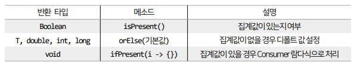
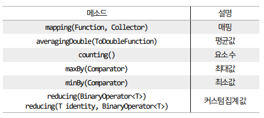
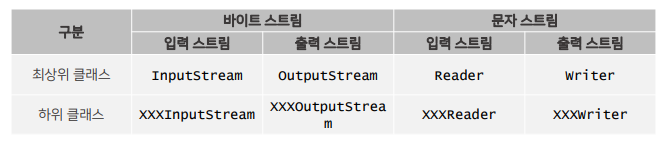
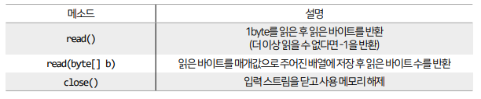
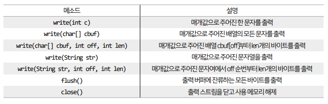
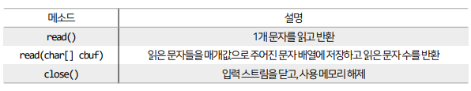
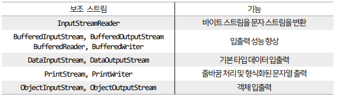
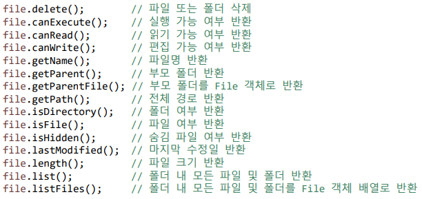
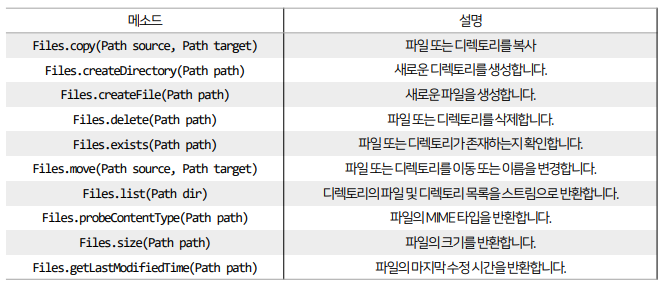

## 목차
- [스트림](#스트림)
  - [요소를 하나씩 처리](#요소를-하나씩-처리)
  - [요소 조건 만족 여부(매칭)](#요소-조건-만족-여부매칭)
  - [요소 기본 집계](#요소-기본-집계)
  - [요소 커스텀 집계](#요소-커스텀-집계)
  - [요소 수집](#요소-수집)
  - [요소 그룹핑](#요소-그룹핑)
- [입출력 스트림](#입출력-스트림)
  - [바이트 스트림 (출력)](#바이트-스트림-출력)
  - [바이트 스트림 (입력)](#바이트-스트림-입력)
  - [문자 스트림 (출력)](#문자-스트림-출력)
  - [문자 스트림(입력)](#문자-스트림입력)
  - [보조 스트림](#보조-스트림)
  - [성능 향상 스트림 (버퍼)](#성능-향상-스트림-버퍼)
  - [File과 Files 클래스](#file과-files-클래스)
- [데이터, 정보, 지식](#데이터-정보-지식)
- [데이터베이스와 SQL](#데이터베이스와-sql)

<br/>
<br/>
<br/>
<br/>

# 스트림
## 요소를 하나씩 처리
- 스트림에서 요소를 하나씩 반복해서 가져와 처리하는 것을 루핑(Looping)이라 한다.
- 루핑 메소드에는 `peek()`와 `forEach()`가 있다.
- `peek()` 메소드는 스트림을 반환하는 메소드로 중간 처리 메소드이다.
  - 최종 처리가 뒤에 붙지 않으면 동작하지 않는다.
- `forEach()` 메소드는 void를 반환하는 최종 처리 메소드이다.
```java
import java.util.Arrays;

public class LoopExample {

	public static void main(String[] args) {
		int[] intArr = { 1, 2, 3, 4, 5 };
		int total = Arrays.stream(intArr).filter(i -> i % 2 == 0).peek(System.out::println).sum();
		System.out.println("총합 : " + total + "\n");

		Arrays.stream(intArr).filter(i -> i % 2 != 0).forEach(System.out::println);

	}

}
```

<br/>
<br/>

## 요소 조건 만족 여부(매칭)
- 요소들이 특정 조건에 만족하는지 여부를 조사하는 최종 처리 기능을 매칭이라 한다.
- `allMatch()` : 모든 요소가 만족하는지 여부
- `anyMatch()` : 최소한 하나의 요소가 만족하는지 여부
- `noneMatch()` : 모든 요소가 만족하지 않는지 여부
```java
import java.util.Arrays;
import java.util.stream.IntStream;

public class MatchExample {

	public static void main(String[] args) {
		int[] intArr1 = { 2, 4, 6, 8, 10 };
		int[] intArr2 = { 2, 3, 4, 6, 8 };

		// 모두 2의 배수이면 true를 반환
		boolean allEvenResult1 = Arrays.stream(intArr1).allMatch(i -> i % 2 == 0);
		boolean allEvenResult2 = IntStream.of(intArr2).allMatch(i -> i % 2 == 0);

		System.out.println("1번 배열이 모두 짝수인가? " + allEvenResult1); // true
		System.out.println("2번 배열이 모두 짝수인가? " + allEvenResult2); // false

		// 하나라도 2의 배수가 있으면 true를 반환
		boolean anyOddResult1 = Arrays.stream(intArr1).anyMatch(i -> i % 2 != 0);
		boolean anyOddResult2 = IntStream.of(intArr2).anyMatch(i -> i % 2 != 0);

		System.out.println("1번 배열 중 하나라도 홀수가 있는가? " + anyOddResult1); // false
		System.out.println("2번 배열 중 하나라도 홀수가 있는가? " + anyOddResult2); // true

		// 10의 배수가 없으면 true를 반환
		boolean notInTenTimes1 = Arrays.stream(intArr1).noneMatch(i -> i % 10 == 0);
		boolean notInTenTimes2 = IntStream.of(intArr2).noneMatch(i -> i % 10 == 0);

		System.out.println("1번 배열 중에는 10의 배수가 없는가? " + notInTenTimes1); // false
		System.out.println("2번 배열 중에는 10의 배수가 없는가? " + notInTenTimes2); // true

	}

}
```

<br/>
<br/>

## 요소 기본 집계
- 집계(Aggregate)는 최종 처리 기능으로 요소들을 처리해서 카운팅, 합계, 최대값, 최소값 등과 같이 하나의 값으로 산출하는 것을 말한다.
- 대량의 데이터를 가공해서 하나의 값으로 축소하는 리덕션(Reduction)이라고 볼 수 있다.
- 최종 집계 처리 메소드
  |반환 타입|메소드|설명|
  |---|---|---|
  |long|count()|요소 개수|
  |Optional, OptionalInt, OptionalLong, OptionalDouble|findFirst()|첫번째 요소|
  |Optioanl<t>, OptionalInt, OptionalLong, OptionalDouble|max(Comparator<T>), max()| 최대 요소
  |Optioanl<t>, OptionalInt, OptionalLong, OptionalDouble|min(Comparator<T>), min()| 최소 요소
  |OptionalDouble|average()|요소 평균|
  |int, long, double|sum()|요소 총합|
- 컬렉션의 요소는 동적으로 추가되는 경우가 많다.
- 만약 컬렉션에 요소가 존재하지 않으면 집계 값을 산출할 수 없으므로 `NoSuchElementException` 예외가 발생한다.
- `Optional` 클래스는 집계값만을 저장하는 것이 아니라, Optional 클래스가 제공하는 메소드이다.
  - 집계값이 존재하지 않을 경우, 디폴트 값을 설정하거나, 집계값을 처리하는 Conumser를 등록할 수 있다.
  
```java
import java.util.Arrays;
import java.util.OptionalDouble;

public class ReductionExample {

	public static void main(String[] args) {
		int[] intArr = {};

		OptionalDouble optAvg = Arrays.stream(intArr).average();

		// 집계값이 없는 경우 대비하는 방법 1
		// isPresent() 메소드를 통해 조건문을 만들고, true를 반환할 때만 집계값을 얻는다
		if (optAvg.isPresent()) {
			System.out.println("평균 : " + optAvg.getAsDouble());
		} else {
			System.out.println("평균 : " + 0.0);
		}

		// 집계값이 없는 경우 대비하는 방법 2
		// orElse() 메소드를 통해 집계값이 없는 경우의 디폴트 값을 정해 놓는다.
		double avg = Arrays.stream(intArr).average().orElse(10.0);
		System.out.println("평균 : " + avg);

		// 집계값이 없는 경우 대비하는 방법 3
		// ifPresent() 메소드를 통해 집계값이 있는 경우에만 동작하는 Consumer 람다식을 사용
		// 집계값이 없으면 아예 찍히지 않는다.
		Arrays.stream(intArr).average().ifPresent(a -> System.out.println("평균 : " + a));
	}

}
```

<br/>
<br/>

## 요소 커스텀 집계
- 스트림은 기본 집계 외에도 다양한 집계 결과물을 만들 수 있도록 `reduce()` 메소드도 제공한다.
- `reduce()` 메소드도 마찬가지로 스트림에 요소가 없을 경우, 예외를 발생시킨다.
- 매개변수로 `identity` 매개값을 추가하면, 해당 값을 초기값으로 하기 때문에 예외를 발생시키지 않는다.
```java
import java.util.Arrays;

public class ReductionExample3 {

	public static void main(String[] args) {
		int[] intArr = { 1, 2, 3, 4 };

		int result = Arrays.stream(intArr).reduce((a, b) -> a * b).getAsInt();

		// 초기값 설정 가능
		// 초기값을 설정하면 초기값이 int이므로 getAsInt()를 추가하지 않아도 된다.
		int result2 = Arrays.stream(intArr).reduce(100, (a, b) -> a * b);

		System.out.println("요소의 곱 : " + result);
		System.out.println("요소의 곱 : " + result2);

		System.out.println();

		// 초기값에서 계속 각 요소들을 곱하는 것
		int result3 = Arrays.stream(intArr).reduce(100, (a, b) -> {
			System.out.println(a); // 누적값
			System.out.println(b); // 각 요소
			return a * b;
		});
		System.out.println("요소의 곱 : " + result3);

	}

}
```

<br/>
<br/>

## 요소 수집
- 스트림은 요소들을 중간 처리(필터링, 매핑)한 후 요소들을 수집하는 최종 처리 메소드인 `collect()` 메소드를 제공한다.
- 이 메소들을 이용하는 필요한 요소만을 컬렉션에 담을 수 있으며, 요소들을 그룹핑하여 집계도 할 수 있다.
```java
import java.util.ArrayList;
import java.util.List;
import java.util.Map;
import java.util.Set;
import java.util.stream.Collectors;

public class CollectionExample {
	public static void main(String[] args) {
		List<Beverage> bList = new ArrayList<>();
		bList.add(new Beverage("아이스 아메리카노", 1500, true));
		bList.add(new Beverage("따뜻한 바닐라 라떼", 3500, false));
		bList.add(new Beverage("제로 콜라", 2000, true));
		bList.add(new Beverage("솔의눈", 2000, true));
		bList.add(new Beverage("실론티", 2000, true));
		bList.add(new Beverage("실론티", 2000, true));

		// 2000원짜리 리스트
		List<Beverage> two$List = bList.stream().filter(b -> b.getPrice() == 2000) // Stream<Beverage>
				.collect(Collectors.toList());
		// .toList()만 쓸 수도 있다
		System.out.println(two$List);

		System.out.println();

		// 음료수 이름이 3글자인 것
		Set<Beverage> threeSet = bList.stream().filter(b -> b.getName().length() == 3).collect(Collectors.toSet());
		System.out.println(threeSet);
		// 실눈티가 하나만 나온다 (set이므로 중복 x)
		System.out.println();

		// 음료 이름과 가격으로만 구성되어있는 Map 만들기
		/// toMap() -> 두 개의 매개변수 필요 (키와 값)
		Map<String, Integer> iceMap = bList.stream().distinct().filter(b -> b.isIce())
				.collect(Collectors.toMap(b -> b.getName(), b -> b.getPrice()));
		System.out.println(iceMap);
	}
}
```

<br/>
<br/>

## 요소 그룹핑
- 스트림에서 제공하는 `collect()` 메소드는 단순히 요소를 수집하는 기능 이외에 컬렉션의 요소들을 그룹핑해서 Map 객체를 생성하는 기능도 있다.
- `collect()` 메소드의 매개변수에 `Collectors.groupingBy()` 메소드에서 얻은 Collector를 제공하면 된다.
```java
import java.util.ArrayList;
import java.util.List;
import java.util.Map;
import java.util.stream.Collectors;

public class CollectionExample2 {
	public static void main(String[] args) {
		List<Beverage> bList = new ArrayList<>();

...(생략)

		// 상품명과 ice인지 아닌지
		Map<String, Boolean> list1 = bList.stream().collect(Collectors.toMap(b -> b.getName(), b -> b.isIce()));
		System.out.println(list1);

		System.out.println();

		// ice는 ice끼리, hot은 hot끼리 그룹핑
		Map<Boolean, List<Beverage>> isIceMap = bList.stream().collect(Collectors.groupingBy(b -> b.isIce()));
		for (Map.Entry<Boolean, List<Beverage>> entry : isIceMap.entrySet()) {
			System.out.println(entry.getKey() + " : ");
			for (Beverage b : entry.getValue()) {
				System.out.println("\t" + b);
			}
		}

		List<Beverage> iceList = isIceMap.get(true);
		List<Beverage> hotList = isIceMap.get(false);

		System.out.println();
		System.out.println(iceList);
		System.out.println(hotList);

        System.out.println();

		Map<Boolean, Double> isIceAvgPriceMap = bList.stream()
				.collect(Collectors.groupingBy(b -> b.isIce(), Collectors.averagingDouble(b -> b.getPrice())));
		System.out.println(isIceAvgPriceMap);

	}
}
```
- `Collectors.groupingBy()` 메소드는 그룹핑 후 매핑 및 집계를 할 수 있도록, 두번째 매개값으로 Collector를 가질 수 있다.
- 두 번째 매개값으로 사용되어 Collector를 얻을 수 있는 Collectors의 정적 메소드들


<br/>
<br/>
<br/>
<br/>

# 입출력 스트림
- Java는 입력 스트림과 출력 스트림을 통해 데이터를 입력하고 출력한다.
- 스트림(Stream)은 단방향으로 흐르는 것을 의미한다.
- 프로그램을 기준으로 데이터가 들어오면 입력 스트림(Input Stream), 데이터가 나가면 출력 스트림(Output Stream)이 된다.
- 프로그램에서 다른 프로그램과 데이터를 교환하기 위해서는 양쪽 모두 입력 스트림과 출력 스트림이 필요하다.
- 바이트 스트림 : 그림, 멀티미디어, 문자 등 모든 종류의 데이터를 입출력할 때 필요
- 문자 스트림 : 문자만 입출력할 때 사용
- Java에서는 데이터 입출력과 관련된 라이브러리를 java.io 패키지에서 제공하고 있다.

<br/>



- 최상위 클래스를 상속받는 자식 클래스는 접미사가 붙는다.   
    (예) FileInputStream, FileOutputStream...

<br/>
<br/>

## 바이트 스트림 (출력)
- `OutputStream`은 바이트 출력 스트림의 최상위 클래스인데, 추상 클래스이다.
- 모든 바이트 출력 클래스는 OutputStream 클래스를 상속받아 만들어진다.
- FileOutputStream, PrintStream, BufferedOutputStream, DataOutputStream
- OutputStream 클래스에는 모든 바이트 출력 스트림이 기본적으로 가져야 할 메소드가 정의되어 있다.

<br/>


|메소드|설명|
|---|---|
|write(int b)|1 byte 출력|
|write(byte[] b)|매개값으로 주어진 배열 b의 모든 바이트를 출력|
|write(byte[] b, int off, int len)|매개값으로 주어진 배열 b[off]부터 len개의 바이트를 출력|
|flush()|출력 버퍼에 잔류하는 모든 바이트를 출력|
|close()|출력 스트림을 닫고 사용 메모리 해제|

<br/>

```java
import java.io.FileOutputStream;
import java.io.OutputStream;

public class WriteExample {
	public static void main(String[] args) {
		try {
			OutputStream os = new FileOutputStream("C:\\Users\\WD\\output.txt");

//			byte a = 65;
//			byte b = 66;
//			byte c = 67;
//			os.write(a);
//			os.write(b);
//			os.write(c);

//			byte[] arr = { 68, 69, 70, 71, 72, 73 };
//			os.write(arr);

			byte[] arr = { 65, 66, 67, 76, 79, 86, 69 }; // ABCLOVE라고 입력
			os.write(arr, 3, 4); // LOVE만 출력

			os.flush();
			os.close();
		} catch (Exception e) {
			e.printStackTrace();
		}

	}
}
```

<br/>
<br/>

## 바이트 스트림 (입력)
- `InputStream`은 바이트 입력 스트림의 최상위 클래스인데, 추상 클래스이다.
- 모든 바이트 입력 스트림 클래스는 InputStream 클래스를 상속받아 만들어 진다.   
 (FileInputStream, BufferedInputStream, DataInputStream)
- InputStream 클래스에는 모든 바이트 출력 스트림이 기본적으로 가져야 할 메소드가 정의되어 있다.

 

 <br/>

 ```java
 import java.io.FileInputStream;
import java.io.InputStream;

public class ReadExample {

	public static void main(String[] args) {
		try {
			InputStream is = new FileInputStream("C:\\Users\\WD\\output.txt");

//			while (true) {
//				int data = is.read();
//				if (data == -1)
//					break;
//				System.out.println(data);
//			}

			byte[] data = new byte[4];
			while (true) {
				int num = is.read(data);
				if (num == -1)
					break;
			}

			for (byte b : data) {
				System.out.println(b);
			}

			is.close();

		} catch (Exception e) {
			e.printStackTrace();
		}

	}

}
```

<br/>
<br/>

## 문자 스트림 (출력)
- Writer는 문자 출력 스트림의 최상위 클래스인데,  추상 클래스이다.
- 모든 문자 출력 스트림 클래스는 Writer 클래스를 상속 받아 만들어진다.   
  (FileWriter, BufferedWriter, PrintWriter, OutputStreamWriter)
- Writer 클래스에는 모든 문자 출력 스트림이 기본적으로 가져야 할 메소드가 정의되어 있다.


```java
import java.io.FileWriter;
import java.io.IOException;
import java.io.Writer;

public class WriteExample {

	public static void main(String[] args) {
		try {
			Writer w = new FileWriter("C:\\Users\\WD\\output.txt");

			char a = 'A';
			w.write(a);

			char[] arr1 = { 'B', 'C', 'D' };
			w.write(arr1);

			char[] arr2 = { 'C', 'D', 'E', 'F', 'G' };
			w.write(arr2, 2, 3);

			String str1 = "HIJK";
			w.write(str1);
			String str2 = "JKLMNOP";
			w.write(str2, 2, 5);

			w.flush();
			w.close();

		} catch (IOException e) {
			e.printStackTrace();
		}

	}

}
```

<br/>
<br/>

## 문자 스트림(입력)
- Reader는 문자 입력 스트림의 최상위 클래스인데,  추상 클래스 이다.
- 모든 문자 입력 스트림 클래스는 Reader 클래스를 상속받아 만들어 진다.   
    (FileReader, BufferedReader, InputStreamReader)
- Reaer 클래스에는 모든 문자 입력 스트림이 기본적으로 가져야 할 메소드가 정의되어 있다.

```java
import java.io.FileReader;
import java.io.IOException;
import java.io.Reader;

public class ReadExample {

	public static void main(String[] args) {
		try {
			Reader r = new FileReader("C:\\Users\\WD\\output.txt");

//			while (true) {
//				int data = r.read();
//				if (data == -1)
//					break;
//				System.out.println((char) data);
//
//			}

			char[] cArr = new char[17];
			while (true) {
				int num = r.read(cArr);
				if (num == -1)
					break;
			}

			for (char ch : cArr) {
				System.out.println(ch);
			}

			r.close();
		} catch (IOException e) {
			e.printStackTrace();
		}

	}

}
```

<br/>
<br/>

## 보조 스트림
- 다른 스트림과 연결되어 여러 가지 편리한 기능을 제공해주는 스트림을 말한다.
- 자체적으로 입출력을 수행할 수 없기 때문에 입출력 소스로부터 직접 생성된 입출력 스트림에 연결해서 사용해야 한다.
- 입출력 스트림에 보조 스트림을 연결하기 위해서는 보조 스트림 생성 시, 생성자 매개값으로 입출력 스트림을 제공하면 된다.


<br/>
<br/>

## 성능 향상 스트림 (버퍼)
- CPU와 메모리가 아무리 뛰어나도 하드디스크의 입출력이 늦어지면, 프로그램의 실행 성능은 하드디스크 처리 속도에 맞춰진다.
- 네트워크로 데이터를 전송할 때도 느린 네트워크 환경이라면 컴퓨터 사양이 아무리 좋아도 메신저와 게임 속도는 느릴 수밖에 없다.
- 프로그램이 입출력 소스와 직접 작업하지 않고 중간에 메모리버퍼(Buffer)와 작업함으로써 실행 성능을 향상시킬 수 있다.
- 버퍼는 데이터가 쌓이기를 기다렸다가 꽉차게 되면, 데이터를 한꺼번에 하드디스크로 보낸다. 이로써 출력 횟수를 줄여준다.
- 문자 입력 스트림 Reader에 BuffereReader를 연결하면 성능 향상뿐만 아니라, readLine() 메소드도 제공한다.
  - readLine( ) 메소드는 행단 위 문자열을 읽기 때문에 매우 편리하다.
```java
import java.io.BufferedReader;
import java.io.BufferedWriter;
import java.io.FileReader;
import java.io.FileWriter;

public class BufferExample {

	public static void main(String[] args) {
		String inputPath = "C:\\Users\\WD\\input.txt";
		String outputPath = "C:\\Users\\WD\\output.txt";

		try {
			// 파일 읽기 위한 BufferedReader
			BufferedReader br = new BufferedReader(new FileReader(inputPath));
			// 파일 쓰기 위한 BufferedWriter
			BufferedWriter bw = new BufferedWriter(new FileWriter(outputPath));

			String line;

			// 파일의 각 줄을 읽는다(line)
			while ((line = br.readLine()) != null) {
				bw.write(line);
				bw.newLine(); // 각 라인마다 새로운 줄 추가(\n 추가)
			}

			br.close();
			bw.flush();
			bw.close();
		} catch (Exception e) {
			e.printStackTrace();
		}

	}

}
```


<br/>
<br/>

## File과 Files 클래스
- java.io 패키지와 java.nio.file 패키지는 파일과 디렉토리 정보를 가지고 있는 File과 Files 클래스를제 공한다.
- Files는 Fiie을 개선한 클래스로, 더 많은 기능을 가지고 있다.
- 파일 또는 디렉토리가 존재하는 경우 사용할 수 있는 메소드


```java
import java.io.File;
import java.io.IOException;

public class FileExample {

	public static void main(String[] args) throws IOException {
		File file = new File("C:\\Users\\WD\\my_directory\\my\\data.txt");

		if (!file.exists()) {
			// file.mkdir(); // 폴더 생성
			// file.mkdirs(); // 여러 폴더 생성

			file.createNewFile(); // 새 파일 생성
		}

		// 디렉토리 존재 여부 묻기
		System.out.println(file.exists());

	}

}
```
```java
import java.io.BufferedWriter;
import java.io.File;
import java.io.FileWriter;
import java.io.IOException;

public class FileExample {

	public static void main(String[] args) throws IOException {
		String dataPath = "C:\\Users\\WD\\data.txt";
		File file = new File(dataPath);

		if (file.createNewFile()) {
			System.out.println("파일이 생성되었습니다.");
		} else {
			System.out.println("이미 존재하는 파일입니다.");
		}

		System.out.println();
		System.out.println("파일 경로 : " + file.getAbsolutePath()); // 절대경로 출력
		System.out.println("쓰기 가능 여부 : " + file.canWrite());
		System.out.println("읽기 가능 여부 : " + file.canRead());
		System.out.println("파일 크기 : " + file.length() + "바이트");
		System.out.println();

		BufferedWriter bw = new BufferedWriter(new FileWriter(dataPath));
		bw.write("사건은 다가와 ah, ho, ayy");
		bw.newLine();
		bw.write("거세게 커져가 ah, oh, ayy");
		bw.newLine();
		bw.write("That tick, that tick, tick bomb");
		bw.newLine();
		bw.write("That tick, that tick, tick bomb");
		bw.newLine();
		bw.write("감히 건드리지 못할 걸 (누구도 말이야)");
		bw.newLine();
		bw.write("지금 내 안에선 su-su-su-supernova");
		bw.newLine();

		bw.close();

		System.out.println("파일 크기 : " + file.length() + "바이트"); // 227바이트

	}

}
```

<hr/>

- Files 클래스는 정적 메소드로 구성되어 있기 때문에 File 클래스처럼 객체를 생성할 필요가 없다.
- Files의 정적 메소드는 운영체제 파일 시스템에게 파일 작업을 수행하도록 위임하여 동작한다.


<br/>
<br/>
<br/>
<br/>

# 데이터, 정보, 지식
- 데이터 : 관찰의 결과로 나타난 정량적 혹은 정성적인 실제 값
- 정보 : 데이터에 의미를 부여한 것
- 지식 : 사물이나 현상에 대한 이해

<br/>
<br/>
<br/>
<br/>

# 데이터베이스와 SQL
- 데이터 : 컴퓨터가 처리할 수 있는 문자, 숫자, 소리, 그림 따위의 형태로 된 자료
- 데이터베이스 (DB)
  - 데이터의 집합.
  - '데이터의 저장 공간' 자체.
  - 논리적으로 연관된 데이터를 모아 일정한 형태로 저장해 놓은 것.
  - 여러 명의 사용자나 응용프로그램이 공유하는 데이터 (동시 접근 가능)
  - 응용 시스템들이 공용으로 사용하기 위해 통합, 저장한 데이터 집합
- DBMS(Database Management System)
  - 데이터베이스를 관리 및 운영하는 소프트웨어
  - 대부분 테이블로 구성된 관계형 DBMS(RDBMS) 형태로 사용(MySQL, Oracle, SQL 서버, MariaDB 등)
  - DBMS를 이용하여 데이터의 입력, 수정, 삭제 등의 기능을 제공
- DBMS가 설치되어 데이터를 가진 쪽은 서버(Server), 데이터를 요청하는 쪽을 클라이언트(Client)라고 한다.

- 데이터베이스 시스템은 데이터의 검색(select)과 변경(insert, delete, update 등) 작업을 수행해서 필요한 정보들을 구조적으로 관리한다.
<hr/>

- 데이터 베이스의 특징
  1. 실시간 접근성 : DB는 실시간으로 서비스된다.
사용자가 데이터를 요청하면 수 초 내에 결과를 서비스한다.
   1. 계속적인 변화 : DB에 저장된 내용은 한 순간의 상태이지만,
  데이터 값은 시간에 따라 항상 바뀐다.
  1. 동시 공유 : DB는 서로 다른 업무, 여러 사용자에게 동시에 공유된다.
  2. 내용에 따른 참조 : DB에 저장된 데이터는 물리적인 위치가 아니라 값에 따라 참조된다.

