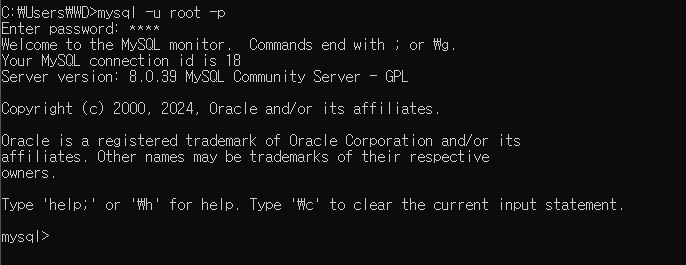

## 목차
- [데이터베이스](#데이터베이스)
  - [데이터베이스의 특징](#데이터베이스의-특징)
  - [데이터베이스의 개념](#데이터베이스의-개념)
  - [데이터베이스의 종류](#데이터베이스의-종류)
  - [관계형 DBMS(R-DBMS)](#관계형-dbmsr-dbms)
- [SQL (STructured Query Language)](#sql-structured-query-language)
  - [SQL의 구조](#sql의-구조)
    - [DDL(Data Definition Language)](#ddldata-definition-language)
    - [DML(Data Manipulation Language)](#dmldata-manipulation-language)
    - [DCL(Data Control Language)](#dcldata-control-language)
- [MySQL](#mysql)
  - [명령 프롬프트로 mysql 실행하기](#명령-프롬프트로-mysql-실행하기)
  - [테이블 조회 - SELECT](#테이블-조회---select)
  - [테이블 구조와 자료형](#테이블-구조와-자료형)
  - [테이블 검색](#테이블-검색)
    - [열 지정 검색](#열-지정-검색)
    - [별명 (alias)](#별명-alias)
    - [계산](#계산)
    - [컬럼 연결 (concat)](#컬럼-연결-concat)
    - [DISTNICT](#distnict)
    - [정렬 (ORDER BY)](#정렬-order-by)
    - [조건문 (WHERE)](#조건문-where)
      - [비교 연산자](#비교-연산자)
      - [NULL](#null)
      - [논리 연산자](#논리-연산자)
      - [LIKE](#like)
      - [와일드 카드](#와일드-카드)

<br/>
<br/>
<br/>
<br/>

# 데이터베이스
## 데이터베이스의 특징
1. 실시간 접근성 : DB는 실시간으로 서비스된다.
   - 사용자가 데이터를 요청하면 수 초 내에 결과를 서비스한다.
2. 계속적인 변화 : DB에 저장된 내용은 한 순간의 상태이지만, 데이터 값은 시간에 따라 항상 바뀐다.
3. 동시 공유 : DB는 서로 다른 업무, 여러 사용자에게 동시에 공유된다.
4. 내용에 따른 참조 : DB에 저장된 데이터는 물리적인 위치가 아니라 값에 따라 참조된다.
## 데이터베이스의 개념
1. 통합된 데이터 : 데이터를 통합하는 개념.
각자 사용하던 데이터의 중복을 최소화하여 중복으로 인한 데이터 불일치 제거
 2. 저장된 데이터 : 문서로 보관된 데이터가 아니라 컴퓨터 저장장치에 저장된 데이터
3. 운영 데이터 : 조직의 목적을 위해 사용되는 데이터
4. 공용 데이터 : 한 사람 또는 한 업무를 위해 사용되는 데이터가 아니라 공동으로 사용되는 데이터
## 데이터베이스의 종류
1. 관계형 데이터베이스 (RDBMS)
   - 행과 열을 가지는 표 형식의 데이터 모델, SQL을 이용
   - 다양한 용도로 사용 가지며, 높은 신뢰성(데이터 무결성) 보장
   - 데이터 분류, 정렬, 탐색 속도가 빠름
2. 키-값 데이터베이스 (NoSQL)
   - 키와 값을 한 쌍으로 갖는 형태로 대표적인 NoSQL(Not Only SQL)
   - 단순한 구조로 속도가 빠르며, 분산 저장 시 용이
   - 데이터를 자주 변경하지 않고, 읽기를 자주하는 경우 주로 사용

    (이외에는 알아만 두면 좋다)
## 관계형 DBMS(R-DBMS)
- 데이터베이스를 테이블(릴레이션, 엔티티)이라는 최소 단위로 구성
- 테이블은 하나 이상의 열(column)로 이루어져 있다.
- 열 = 컬럼, 필드, 속성, 애트리뷰트
- 행 = 로우, 튜플, 레코드


<br/>
<br/>
<br/>
<br/>


# SQL (STructured Query Language)
- 관계형 데이터베이스에서 데이터 조작과 정의를 위해 사용되는 단어
- 관계형 DBMS를 배우려면 SQL을 필수로 익혀야 한다.
- SQL을 사용하는 DBMS를 만드는 회사가 여러 곳이기 때문에 표준 SQL이 각 회사의 제품의 특성을 모두 포용하지 못한다.
  - DBMS를 만드는 회사에서는 되도록 표준 SQL을 준수하되, 각 제품의 특성을 반영한 SQL을 사용하고 있다.
- DBMS 제작 회사와 독립적
- 다른 시스템으로 이식성이 좋음
- 표준이 계속 발전 중
- 대화식 언어
- 분산형 클라이언트/서버 구조
## SQL의 구조
### DDL(Data Definition Language)
- 데이터를 정의하는 명령어
- 데이터를 담는 그릇(객체)를 만들거나 삭제할 때 사용
- `CREATE` : 데이터베이스 또는 테이블을 생성
- `ALTER` : 테이블을 수정
- `DROP` : 데이터베이스 또는 테이블 삭제
- `TRUNCATE` : 테이블을 초기화
### DML(Data Manipulation Language)
- 데이터를 조작하는 명령어
- 데이터의 추가, 삭제, 갱신과 같은 작업 시 사용
- `SELECT` : 데이터를 검색
- `INSERT` : 데이터를 입력
- `UPDATE` : 데이터를 수정
- `DELETE` : 데이터를 삭제
### DCL(Data Control Language)
- 데이터를 제어하는 명령어
- 트랜잭션을 제어하거나 데이터 접근권한을 제어할 때 사용
- 트랜잭션을 제어하는 명령만을 분리해 TCL이라 한다.
  - `COMMIT` : 트랜잭션 작업을 완료하는 역할
  - `ROLLBACK` : 트랜잭션 작업을 취소하거나 이전 상태로 복구하는 역할
- `GRANT` : 특정 수행 권한을 부여
- `REVOKE` : 특정 수행 권한을 삭제

<br/>
<br/>
<br/>
<br/>


# MySQL
- SQL에 기반을 둔 관계형 DBMS
- 3개의 상용 에디션(Standard, Enterprise, Cluster CGE)과 1개의 무료 에디션(Community)
- 리눅스, 유닉스, 윈도우 등 거의 모든 운영체제에서 사용 가능
- 처리가 빠르고 대용량 데이터 처리에 용이
## 명령 프롬프트로 mysql 실행하기
- MySQL 루트 계정 접숙


- 데이터베이스 목록 보기


- 데이터베이스 실행

 
- MySQL 접속 종료   


- bash에서 mySQL 사용하기


- Workbench 실행 기본 화면


## 테이블 조회 - SELECT
- DML에 속하는 명령으로 데이터베이스의 데이터를 읽어올 수 있다.
- 이를 '조회', '질의' 또는 '쿼리'라 부르기도 한다.
- SQL에서 가장 자주 사용된다


```sql
SELECT [ALL | DISTINCT] 열이름
    FROM 테이블명
    [WHERE 조건]
    [GROUP BY 열이름]
    [HAVING 검색조건]
    [ORDER BY [열이름] [ASC | DESC]];
테이블 조회 - SELECT
```
실행 순서 : FROM -> WHERE -> GROUP BY -> HAVING -> SELECT -> ORDER BY

<hr/>
[예시]


<br/>

+ git bash 로 편하게 MySQL 사용하기
   

<br/>

## 테이블 구조와 자료형
- SELECT 명령을 실행하면, 표(테이블) 형태의 데이터가 출력된다.
- 각각의 열은 오직 하나의 자료형만 가지게 된다.
- 자료형은 숫자, 문자, 날짜 등이 있으며, 데이터를 식별하는 분류체계이다.


- Field : 열 이름
- Type : 자료형
- Null : NULL 허용 여부
- Key : PK 또는 Unique 여부
- Default : 기본값
- Extra : 기타 정보

<hr/>

- INTEGER 형 : 수치 자료형 중 하나로 정수값을 저장할 수 있는 자료형
- CHAR : 고정된 길이의 문자열을 저장할 수 있는 자료형
- VARCHAR : 데이터의 크기에 맞춰 저장공간의 크기가 변경되는 가변 길이 문자열 자료형
- DATE : 2022년 11월 7일과 같이 연월일의 데이터를 저장할 수 있는 날짜 자료형
- TIME : 7시 10분 25초와 같이 시분초의 데이터를 저장할 수 있는 시간 자료형

<br/>

## 테이블 검색
### 열 지정 검색
```sql
SELECT 열이름1, 열이름2, 열이름3, … FROM 테이블명;
```


### 별명 (alias)
- SELECT문으로 조회하게 되면 테이블 형태의 결과가 나타난다.
- 가장 위에 컬럼명이 나타나는데, 사용자가 읽기에 직관적이지 못한 경우 별명을 지정해서 컬럼명 대신 별명을 출력할 수 있다.
- 별명은 고유해야 하며, AS는 생략 가능하다.
- 만약 별명에 공백, 특수문자, 대문자가 있거나 한글로 지정하는 경우에는 백틱(`)을 사용해 지정하는 것을 권장한다.

```sql
SELECT
    name AS `도시명`, popu AS `인구(만명)`
FROM
    tcity
WHERE
    metro = 'n';
```

### 계산
- 데이터가 조회되는 방식을 수정하거나 계산을 수행하고자 할 때, 산술표현식을 사용한다.
- SELECT 문에서 산술표현식은 FROM 절을 제외한 모든 절에서 사용 가능하다.


### 컬럼 연결 (concat)
```sql
SELECT
    concat(name, "", garde)
FROM
    tstaff;
```
- 매개변수를 연결한 문자열을 반환하는 함수
- 한 개 이상의 매개변수를 가질 수 있다.


### DISTNICT
- 특별히 명시되지 않는다면 SELECT문은 중복되는 행을 제거하지 않고, 결과를 반환한다.
- 결과에서 중복되는 행을 제거하기 위해서는 SELECT 뒤에 DISTINCT를 입력해야 한다


### 정렬 (ORDER BY)
- SELECT 문에서 순서에 대한 지정이 없는 경우에는 DBMS의 순서를 따른다.
  - (Oracle은 데이터의 입력 순서, MySQL은 기본키에 대한 오름차순 정렬)
- 기본형식 : `ORDER BY 컬럼명 [ASC | DESC]`
- 오름차순인 경우에는 `ASC`, 내림차순인 경우에는 `DESC`를 지정한다.
- 기본값은 `ASC`로 생략이 가능하다.
- 2개 이상의 컬럼으로 정렬을 지정할 수도 있다.
  - 이 경우 첫 번재 기준 컬럼의 값이 같으면 두 번째 기준 컬럼을 통해 정렬을 하게 된다.


### 조건문 (WHERE)
- WHERE 절을 이용해 조건을 지정할 수 있다.
- WHERE 절은 SELECT 문 뿐만 아니라 삭제를 위한 DELETE, 수정을 위한 UPDATE 절에도 쓰인다.
- `SELECT * FROM 테이블명 WHERE 조건식;`
#### 비교 연산자
  - A = B
  - A > B, A < B
  - A >= B, NOT (A < B)
  - A <= B, NOT (A > B)
  - A <> B, A != B, NOT (A = B) [같지 않다]
- 문자열 또는 날짜의 비교는 따옴표로 감싸주어야 한다.


#### NULL
- 값이 입력되어 있지 않은 특수한 상태로,
값을 알 수 없거나, 아직 결정할 수 없다는 의미이기에 0, " "과는 다르다.
- NULL 여부를 표현할 때는 = NULL, != NULL 이 아닌 `IS NULL`, `IS NOT NULL`을 사용한다


#### 논리 연산자
   
  - 두 개 이상의 조건을 동시에 점검할 때는 AND, OR 연산자를 사용한다.
  - AND는 두 조건이 모두 참인 결과를 반환하며,
  - OR는 두 조건 중 하나라도 참인 결과를 반환한다.
  -NOT 연산자를 통해 진위 여부를 반대로 변경할 수 있다

#### LIKE
- 등호(=)를 통한 비교 연산은 완전히 일치하는 조건식을 표현
- LIKE 연산자는 와일드 카드를 사용한 패턴으로 부분 문자열을 검색
#### 와일드 카드
- `%` : 길이에 구애받지 않는 임의 문자열
- `_` : 한 개의 임의 문자
- 와일드카드에 사용되는 문자를 검색할 때는 `\` 또는 `ESCAPE`를 이용


