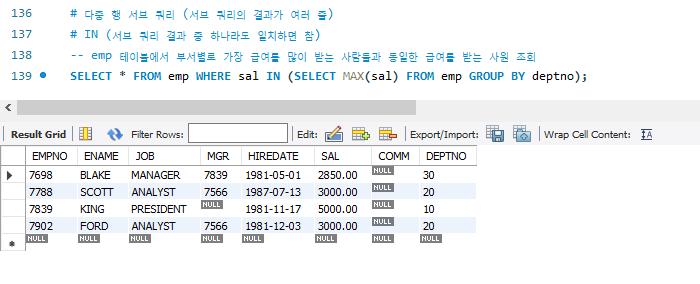
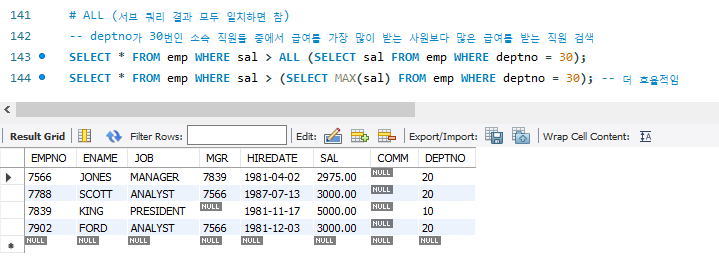

## 목차
- [CASE](#case)
- [그룹화 - GROUP BY](#그룹화---group-by)
- [데이터 집계](#데이터-집계)
- [그룹화 조건 - HAVING](#그룹화-조건---having)
  - [SELECT 문이 실행되는 과정](#select-문이-실행되는-과정)
- [집합 연산자 (SET operator)](#집합-연산자-set-operator)
- [서브 쿼리 (Sub Query)](#서브-쿼리-sub-query)
  - [다중 열(Multi Column) 서브 쿼리](#다중-열multi-column-서브-쿼리)
  - [다중 행(Multi Row) 서브 쿼리](#다중-행multi-row-서브-쿼리)
    - [IN 연산자](#in-연산자)
    - [ALL 연산자](#all-연산자)
    - [ANY 연산자](#any-연산자)
    - [EXISTS 연산자](#exists-연산자)
- [조인 (JOIN)](#조인-join)
  - [INNER JOIN](#inner-join)
    - [CROSS JOIN](#cross-join)
    - [NATURAL JOIN,](#natural-join)
    - [SELF JOIN](#self-join)
  - [OUTER JOIN](#outer-join)
    - [LEFT OUTER JOIN](#left-outer-join)
    - [RIGHT OUTER JOIN](#right-outer-join)
    - [FULL OUTER JOIN](#full-outer-join)
  - [다중 조인](#다중-조인)
- [데이터 추가 - INSERT](#데이터-추가---insert)
- [데이터 삭제 - DELETE](#데이터-삭제---delete)
- [데이터 갱신 - UPDATE](#데이터-갱신---update)

 
 
 
 

# CASE
- 조건에 따른 값을 지정하기 위해 사용
- 이를 통해 기존 연산자와 함수로 처리가 불가능한 것들 중 간단한 것들을 처리할 수 있다.
- CASE 문은 `검색 CASE`와 `단순 CASE`로 나눌 수 있다.

 

[예제]

- SELECT구 뿐만 아니라 WHERE구와 ORDER BY구에서도 사용할 수 있다.
- ELSE를 생략하면 자동적으로 ELSE null로 처리된다.
- 단순 CASE문에서의 NULL 값 비교는 불가능하다.

 

[예제]

 
 
 
 

# 그룹화 - GROUP BY
- 집계 함수는 그룹화와 함께 사용하여 SELECT 문의 활용 범위를 넓힌다.
- `GROUP BY` 구에는 그룹화할 열을 지정하며, 복수의 컬럼 지정도 가능하다.

 

[예제]

 
 
 
 

# 데이터 집계
- 복수의 값에서 하나의 값을 계산해내는 함수
- 데이터를 그룹화해서 통계를 계산해주는 함수로 숫자나 날짜 데이터에 사용된다.
- 문자열 데이터는 최소값과 최대값 조회만 가능하다.

  -  MAX, MIN 값은 사전식 정렬을 통한 최대, 최소값을 반환한다.

- `SUM()` : 그룹의 누적 합계를 반환
- `AVG()` : 그룹의 평균을 반환
- `COUNT()` : 그룹의 총 개수를 반환
- `MAX()` : 그룹의 최대값을 반환
- `MIN()` : 그룹의 최소값을 반환
- `STDDEV()`: 그룹의 표준편차를 반환
- `VARIANCE()`: 그룹의 분산을 반환

 
[예제]

 
 
 
 

# 그룹화 조건 - HAVING
- GROUP BY와 함께 쓰이며, 출력할 그룹의 조건을 지정한다.

 
 

## SELECT 문이 실행되는 과정

 
 
 
 

# 집합 연산자 (SET operator)
- 2개 이상의 SELECT 문을 연결하여 작성 가능하다
- SELECT 문의 컬럼 개수와 데이터 타입은 일치해야 한다.
- 검색 결과의 헤더는 앞쪽 SELECT 문에 의해 결정된다.
- ORDER BY 절을 사용할 때는 문장의 제일 마지막에 사용한다 
  
   

- `UNION` : 합집합 (중복되는 값은 한번 출력)
- `UNION ALL` : 합집합 (중복되는 값 모두 출력)
- `INTERSECT` : 교집합
- `EXCEPT` : 차집합 (다른 DBMS에서 MINUS)

 
 
 
 

# 서브 쿼리 (Sub Query)
- 하나의 SQL 안에 포함되어 있는 SQL 문
- 메인 쿼리가 서브 쿼리를 포함하는 종속적인 관계이다.
- 항상 Main Query의 기준으로 결과를 나타낸다.
- Sub Query는 반드시 괄호로 감싸서 사용한다.
- Sub Query는 Main Query 실행 전에 한 번 실행된다.
- Sub Query에서 ORDER BY 절은 사용 불가하다.
- FROM 절에 Sub Query를 사용하는 것을 ‘인라인 뷰’라 한다.

 

[예제]

 
 

## 다중 열(Multi Column) 서브 쿼리
- Sub Query의 수행 결과가 여러 개의 열로 된 경우

## 다중 행(Multi Row) 서브 쿼리
- Sub Query에서 반환되는 결과가 하나 이상의 행일 때 사용
- 다중 행 서브 쿼리는 다중 행 연산자와 함께 사용

### IN 연산자
- 반환되는 여러 개의 행 중에서 하나만 참이 되어도 참

### ALL 연산자
- Sub Query 결과와 모든 값이 일치하면 참

### ANY 연산자
- Sub Query의 검색 결과에서 하나만 일치하면 참

### EXISTS 연산자
- Sub Query로 어떤 데이터 존재 여부를 확인 (참 또는 거짓 반환)

 
 
 
 

# 조인 (JOIN)
- 두 개 이상의 테이블을 엮어서 언하는 결과를 가져오고자 할 때 사용

## INNER JOIN
- 두 테이블의 공통된 컬럼의 데이터를 활용한 조인
- 두 테이블을 조인할 때, 두 테이블에 모두 지정한 열의 데이터가 있어야 한다
- 두 테이블을 연결할 때 가장 많이 사용

### CROSS JOIN
- 2개 이상의 테이블의 모든 집합의 JOIN
- 한쪽 테이블에 다른 쪽 테이블의 모든 행을 교차곱하는 조인
- 조인 결과의 전체 행 개수는 두 테이블의 각 행의 개수를 곱한 수이고,
이를 카티션 곱(CARTESIAN PRODUCT)이라 한다
### NATURAL JOIN,
- 두 테이블의 각각 조인을 정의한 컬럼명이 동일할 떄 사용
- `USING` 절에서 조인할 컬럼을 지정할 수 도 있다.

### SELF JOIN
- 테이블이 자기 사진의 테이블과 조인
- 하나의 테이블 내에서 조인을 해야만 원하는 자료를 얻는 경우에 사용
- 자기 자신 조인, 1개의 테이블 사용
- 별도의 문법이 있는 것이 아니라 테이블 한 개로 조인한 것을 셀프조인이라 한다.

 
 

## OUTER JOIN
- 두 테이블을 조인할 때, 한 쪽 테이블에만 데이터가 있어도 결과가 나온다. 

### LEFT OUTER JOIN
- 왼쪽 테이블의 모든 값이 출력

### RIGHT OUTER JOIN
- 오른쪽 테이블의 모든 값이 출력

### FULL OUTER JOIN
- 왼쪽 또는 오른쪽 테이블의 모든 값이 출력
- MySQL에서는 미지원하기 때문에,
LEFT OUTER JOIN, RIGHT OUTER JOIN 을 합쳐서 FULL OUTER JOIN 구현

 
 

## 다중 조인
- 조인을 중첩하면 여러 개의 테이블을 조인할 수 있다.

 
 
 
 

# 데이터 추가 - INSERT
- INSERT INTO 뒤에 추가할 테이블을 입력하고,
행의 데이터는 VALUES 구를 사용해 작성한다.
- 값을 지정할 때는 해당 열의 데이터 형식에 맞도록 지정해야 한다
- INSERT문을 실행하면 처리상태만 표시되기 때문에
SELECT문을 이용해야 입력된 데이터를 직접 확인할 수 있다.
- INSERT문은 저장할 열을 지정할 수 있다.
- 지정되지 않은 열은 기본값 또는 null이 저장된다.

- INSERT SELECT

 
 
 
 

# 데이터 삭제 - DELETE
- 만약 WHERE구를 생략하게 되면 해당 테이블의 모든 데이터가 삭제된다.
- 따라서 DELETE 명령을 실행할 때는 주의를 기울여야 한다.

 
 
 
 

# 데이터 갱신 - UPDATE
- 데이터 갱신 작업은 시스템을 다루는 과정에서 빈번히 발생한다.
- UPDATE는 셀 단위로 데이터가 갱신된다.
- WHERE 구를 생략한 경우에는 테이블의 모든 행이 갱신된다.
- 갱신해야 할 열이 복수인 경우에는 콤마(,)로 구분하여 지정할 수 있다.