## 목차
- [테이블 관련 명령](#테이블-관련-명령)
  - [테이블 생성](#테이블-생성)
  - [데이터 타입](#데이터-타입)
    - [숫자](#숫자)
    - [문자](#문자)
    - [날짜](#날짜)
  - [테이블 옵션](#테이블-옵션)
  - [테이블 변경](#테이블-변경)
  - [실습](#실습)
  - [제약 조건](#제약-조건)
    - [NULL 허용 여부](#null-허용-여부)
    - [기본값](#기본값)
    - [체크](#체크)
    - [제약조건의 키](#제약조건의-키)
    - [기본키 (Primary Key) 설정 방법](#기본키-primary-key-설정-방법)
    - [UNIQUE](#unique)
  - [AUTO\_INCREMENT](#auto_increment)
  - [참조 무결성](#참조-무결성)
    - [2개의 테이블 생성 (외래키 미설정 상태)](#2개의-테이블-생성-외래키-미설정-상태)
    - [2개의 테이블 생성 (외래키 설정)](#2개의-테이블-생성-외래키-설정)
    - [참조 무결성 옵션](#참조-무결성-옵션)
- [데이터 모델링](#데이터-모델링)
  - [관계형 데이터베이스](#관계형-데이터베이스)
  - [관계형 데이터베이스를 구성하는 용어](#관계형-데이터베이스를-구성하는-용어)
  - [외래키 관계 설정 종류](#외래키-관계-설정-종류)
  - [ERD (Entity-Relationship Diagram)](#erd-entity-relationship-diagram)
- [데이터베이스 설계](#데이터베이스-설계)
  - [설계 과정](#설계-과정)
    - [1. 요구 사항에 대한 분석](#1-요구-사항에-대한-분석)
    - [2. 개념적 설계](#2-개념적-설계)
    - [3. 논리적 설계](#3-논리적-설계)
    - [4. 물리적 설계](#4-물리적-설계)
  - [무결성 제약 조건 (Integrity Constraint)](#무결성-제약-조건-integrity-constraint)
  - [함수적 종속(Functional Dependency)](#함수적-종속functional-dependency)
  - [이상 현상 (Anomaly)](#이상-현상-anomaly)
  - [정규화 (Data Nomalization)](#정규화-data-nomalization)
    - [제 1 정규화](#제-1-정규화)
    - [제 2 정규화](#제-2-정규화)
    - [제 3 정규화](#제-3-정규화)
    - [보이스-코드 정규화 (BCNF)](#보이스-코드-정규화-bcnf)
    - [제 4 정규화](#제-4-정규화)
    - [제 5 정규화](#제-5-정규화)
    - [정규화의 장점](#정규화의-장점)
    - [정규화의 단점](#정규화의-단점)

<br/>
<br/>
<br/>
<br/>

# 테이블 관련 명령
## 테이블 생성
  - `CREATE TABLE 테이블명 ... [CONSTRAINT 제약조건 이름]`
## 데이터 타입
### 숫자
- INT : 정수
### 문자
- CHAR : 고정 길이 문자열
- VARCHAR : 가변길이 문자형
- ENUM : 열거형 데이터 값
### 날짜
- DATE : YYYY-MM-DD
- DATETIME : YYYY-MM-DD HH:MM:SS
- TIMESTAMP : 임의 시간을 출력
- BOOL : true / false
- JSON : 5.7.8 버전 이후에서 제공

<br/>
<br/>
<br/>
<br/>

## 테이블 옵션
- ENGINE : 데이터를 디스크에 '쓰기'하거나 저장된 데이터를 '읽기'하는 역할
- InnoDB
  - 기본값으로 설정되는 스토리지 엔진
  - Transaction-safe, Commit, Rollback, 데이터 복구 기능, Row-Level Locking 제공
  - 외래키 제약을 제공하여 데이터 무결성을 보장
- auto_increment : 시퀀스의 초기 값 설정
- DEFAULT CHARSET : 인코딩 방식 설정 (UTF 8로 설정하지 않으면 한글 사용 불가능)

<br/>
<br/>
<br/>
<br/>

## 테이블 변경
- 테이블 이름 수정
  - `ALTER TABLE 이전테이블명 RENAME 새로운테이블명;`
- 테이블 컬럼 추가
  - `ALTER TABLE 테이블명 ADD COLUMN 컬럼명1 데이터타입, 컬럼명2 데이터타입;`
- 테이블  컬럼 삭제
  - `ALTER TABLE 테이블명 DROP 컬럼명1, 컬럼명2;`

<br/>
<br/>
<br/>
<br/>

## 실습
- workbench 테이블 보는 방법
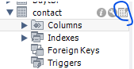
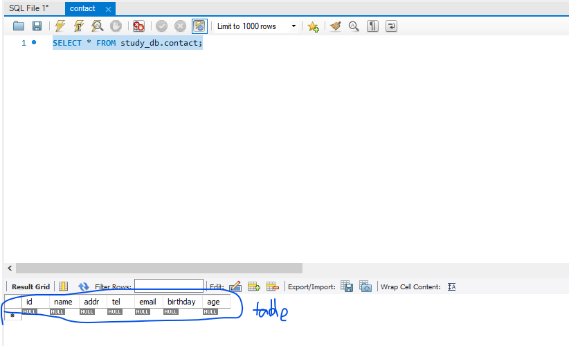

- 테이블 생성
  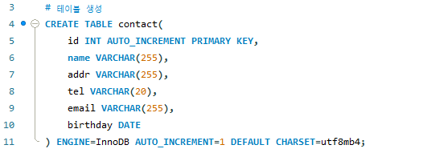
- 테이블에 컬럼 생성/삭제
  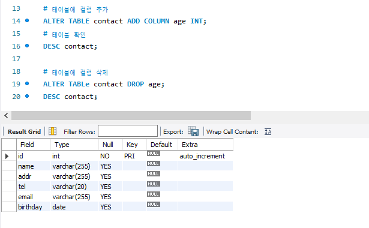
- 테이블 기존 컬럼 자료형과 이름 변경
 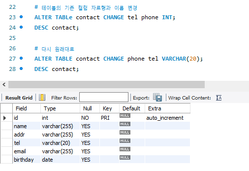
- 테이블 기존 컬럼 자료형만 변경
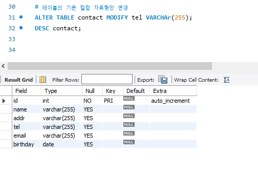
- worbench에서 직접 테이블 생성
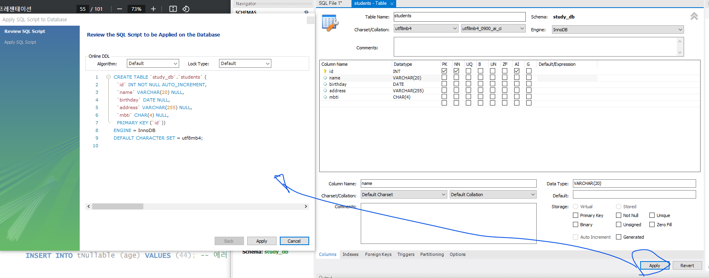
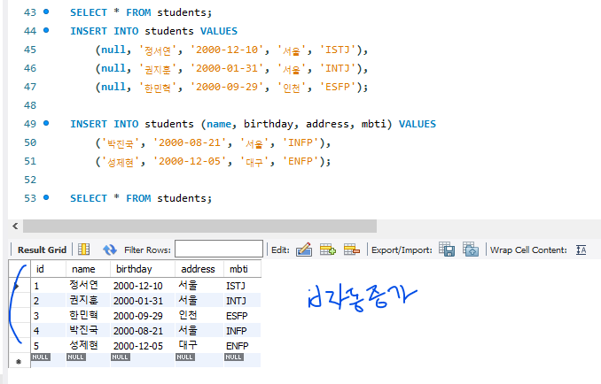
- enum 타입 데이터 추가
 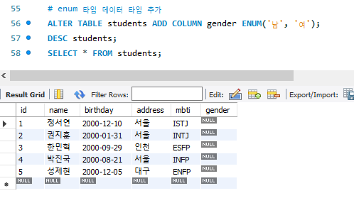

<br/>
<br/>
<br/>
<br/>

## 제약 조건
### NULL 허용 여부
- 기본은 NULL을 허용하는 것이며, 
- 컬럼 제약조건에 NOT NULL을 설정하면, NULL 입력 불가

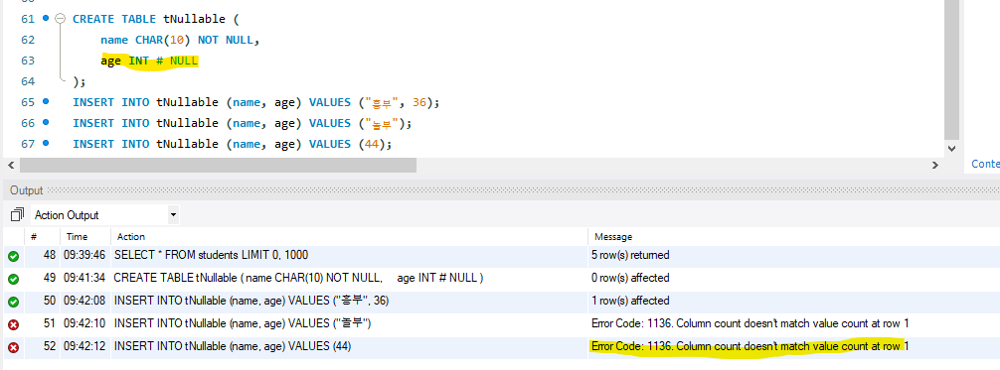
### 기본값
- 필드 값을 입력하지 않았을 때, 자동으로 입력할 값을 설정할 수 있다
- 숫자형은 0, 문자열은 비워두거나 N/A 등을 많이 사용한다.
- DEFAULT 키워드와 함께 기본값을 지정

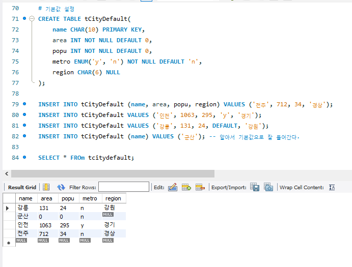
### 체크
- 필드의 값 종류 제한
- 컬럼 선언문에 CHECK 키워드와 함께 컬럼값으로 가능한 값을 지정

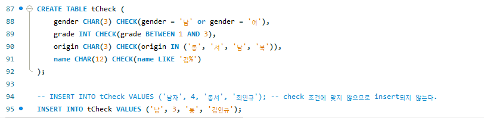
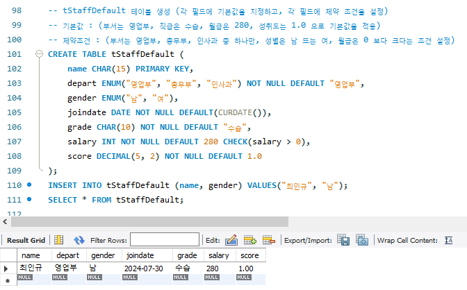
### 제약조건의 키
- 슈퍼키(Super Key)
  - 각 행을 유일하게 식별할 수 있는 하나 또는 그 이상의 속성들의 집합
  - 슈퍼키는 유일성만 만족하면 슈퍼키가 될 수 있다.
- 후보키(Candidate Key)
  - 각 행을 유일하게 식별할 수 있는 최소한의 속성들의 집합
- 기본키(Primary Key)
  - 후보키 중에서 선정한 키로 테이블에서 오직 1개만 지정 가능
  - 레코드를 상징하는 값으로 자주 참조하는 속성이어야 한다.
### 기본키 (Primary Key) 설정 방법
- 기본키는 NOT NULL 속성을 겸하기 때문에 NOT NULL을 붙일 필요 없음
- 제약조건이름은 나중에 편집이나 삭제 등을 편리하게 하기 위해서 사용
- 복합키로 기본키를 설정하는 경우에는 테이블 제약조건 형태로 설정
- 2개 이상 컬럼의 조합으로 기본키를 설정하는 것을 복합키라고 한다.

<br/>
<br/>

[예제]
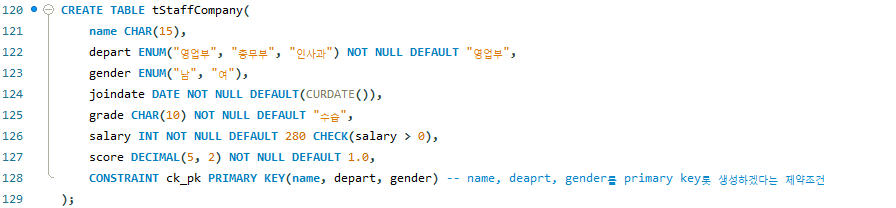
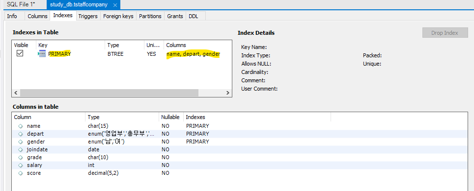
### UNIQUE
- 필드의 중복값을 방지하여 모든 필드가 고유한 값을 가지도록 강제
- 기본키와 차이점
  - UNIQUE는 NULL을 허용
  - 즉, UNIQUE와 NOT NULL을 설정하면 기본키와 유사해진다

<br/>
<br/>
<br/>
<br/>

## AUTO_INCREMENT
- 필드 선언문에 AUTO_INCREMENT라고 선언하면 자동 증가하는 일련번호가 매겨짐
- [실습](#실습) 참고

<br/>

[예제]
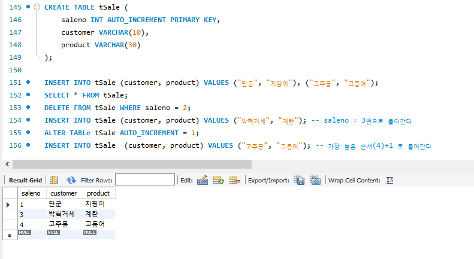
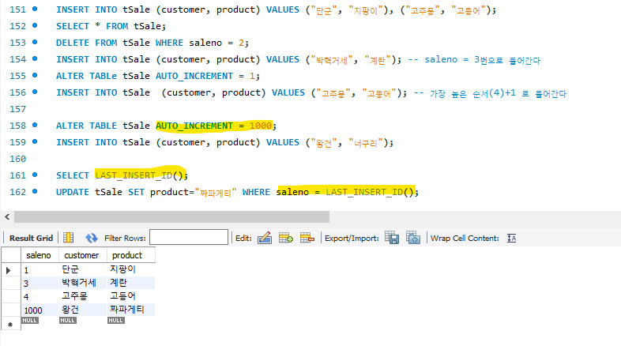

<br/>
<br/>
<br/>
<br/>

## 참조 무결성
### 2개의 테이블 생성 (외래키 미설정 상태)
- 기본 키와 참조 키 간의 관계가 항상 유지됨을 보장할 수 없다.
```sql
CREATE TABLe tEmployee (
	name CHAR(10) PRIMARY KEY,
    salary INT NOT NULL,
    addr VARCHAR(30) NOT NULL
);
INSERT INTO tEmployee VALUES
	("아이린", 650, "대구"),
    ("슬기", 480, "안산"),
    ("웬디", 625, "서울");
SELECT * FROM tEmployee;

CREATE TABLE tProject(
	projectID INT PRIMARY KEY,
    employee CHAR(10) NOT NULL,
    proejct VARCHAR(30) NOT NULL,
    cost INT
);
INSERT INTO tProject VALUES
	(1, "아이린", "홍콩 수출건", 800),
    (2, "아이린", "TV 광고건", 3400),
    (3, "아이린", "매출 분석건", 200),
    (4, "슬기", "경영 혁신안 작성", 120),
    (5, "슬기", "대리점 계획", 85),
    (6, "웬디", "노조 협상건", 24);
SELECT * FROM tProject;

-- JOIN을 사용해서 대구 출신 직원들이 진행 중인 프로젝트 조회
SELECT * FROM tEmployee e JOIN tProject p ON e.name = p.employee WHERE e.addr = "대구";

INSERT INTO tProject VALUES(7, "조이", "원자재 매입", 9000); -- 무결성이 깨져버림
DELETE FROM tEmployee WHERE name = "아이린";
-- 멋대로 삭제 가능, 프로젝트가 있는데 담당자를 찾을 수 없으므로 무결성이 깨져버림
```
### 2개의 테이블 생성 (외래키 설정)
- 기본 키와 참조 키 간의 관계가 항상 유지됨을 보장한다.
- 외래키를 설정하면 무결성을 깨뜨리는 일을 만들지 않는다.

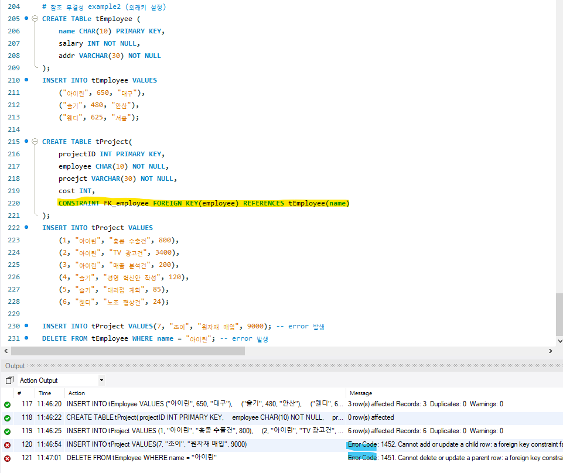
### 참조 무결성 옵션
- 참조된 행이 삭제되거나 업데이트될 때 수행할 작업을 지정
- `ON DELETE { NO ACTION | CASCADE | SET NULL | SET DEFAULT }`
- `ON UPDATE { NO ACTION | CASCADE | SET NULL | SET DEFAULT }`
<hr/>

- `NO ACTION` : 참조된 행이 수정, 삭제될 때 아무런 작업을 하지 않음
- `CASCADE` : 참조된 행이 수정, 삭제될 때 해당 행을 참조하는 모든 행도 함께 수정, 삭제
- `SET NULL` : 참조된 행이 수정, 삭제될 때 해당 외래 키를 포함하는 열의 값을 NULL로 설정
- `SET DEFAULT` : 참조된 행이 수정, 삭제될 때 해당 외래 키를 포함하는 열의 값을 기본값으로 설정

<br/>
<br/>
<br/>
<br/>
<br/>
<br/>

# 데이터 모델링
## 관계형 데이터베이스
- RDBMS (Relational DataBase Management System)
- 데이터베이스를 테이블의 집합으로 설명하는 데이터베이스 관리 시스템
- 상용 RDBMS : Oracle, IBM DB2, MS-SQL Server 등
- 오픈 소스 RDBMS : MySQL, PostgreSQL, SQLite, MariaDB 등

<br/>
<br/>
<br/>
<br/>

## 관계형 데이터베이스를 구성하는 용어
- `릴레이션(Relation)`: 정보 저장의 기본 형태가 2차원 구조인 테이블
- `속성(attribute)`: 테이블의 각 열(Column, Field)
- `도메인(Domain)`: 속성이 가질 수 있는 값들의 집합
- `튜플(Tuple)`: 테이블이 한 행을 구성하는 속성들의 집합(Record, Row)
- `카디널리티(Cardinality)`: 서로 다른 테이블 사이에 대응되는 수 (고유 값의 수)
- `키(key)` : 각 튜플들을 유일하게 식별할 수 있는 속성 또는 속성의 집합
    [예시 : 학번, {학번, 이름}, {학번, 학년}, {학번, 이름, 학과}]
- `후보키(Candidate Key)` : 유일성과 최소성을 만족하는 속성 또는 속성의 집합
    [예시 : 학번]
- `기본키(Primary Key)` : 후보키 중에서 선정한 키로, 튜플들을 유일하게 식별할 수 있는 키
  - 기본키는 null이거나 중복될 수 없음
- `대체키(Alternate Key)` : 기본키를 제외한 나머지 후보키
- `외래키(Foreign Key)` : 다른 테이블의 행을 식별할 수 있는 속성

<br/>
<br/>
<br/>
<br/>

## 외래키 관계 설정 종류
- `1 : 1 관계` : 양쪽 테이블의 기본키를 서로 다른 테이블의 외래키로 추가
- `1 : M 관계` : 1 쪽 테이블의 기본키를, M 쪽 테이블의 외래키로 추가
- `N : M 관계` : 양쪽 테이블의 기본키를 가지는 별도 테이블을 생성해서 외래키로 설정

<hr/>

- 테이블에서 참조할 수 없는 외래키를 가져서는 안된다.
- 즉, 참조하고 있는 테이블에 존재하는 값이거나 null이어야 한다.


<br/>
<br/>
<br/>
<br/>

## ERD (Entity-Relationship Diagram)
- 모델링 : 복잡한 현실 세계를 일정한 표기법에 의해 표현하는 것
- 기획 > 분석 (업무 파악) > 설계 (모델링) > 구현 (프로그램 작성) > 테스트 > 수정
<hr/>

[ERD 예시]
- 모든 학생은 고유한 학번을 갖고 특정 학과에 소속되며 이름, 주소, 생년월일, 나이를 관리
- 학과는 학과명, 학과사무실 위치, 전화번호 등을 관리하고 학교 내에서 같은 이름의 학과는 없음
- 학생은 수강할 과목을 등록하는데 과목에는 과목번호, 과목명, 과목개요 등이 있음
- 과목은 여러 섹션으로 나누어질 수 있는데 섹션에는 고유한 섹션번호가 있으며 모든 과목이 섹션으로 나
누어지는 것이 아니므로 섹션은 과목이 없으면 존재할 필요가 없고 또한 다른 과목의 섹션은 같은 섹션번
호를 가질 수 있음
- 교수는 교수번호로 식별할 수 있고 교수이름, 전공분야, 보유기술 등을 관리하며 교수는 여러 개의 보유기
술을 가질 수 있음
- 교수는 과목을 강의하고 학생에 대해 전공지도를 하는데 일부는 학과의 학과장이 되고 학과마다 학과장
은 한 명씩 있음

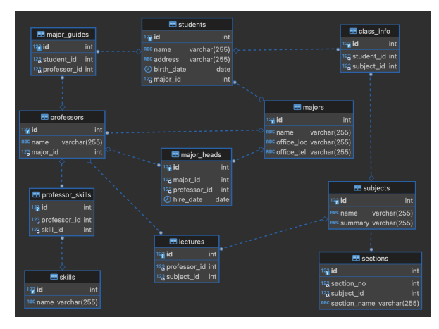

<hr/>

- [ERD Cloud](https://www.erdcloud.com/)
  - ERD를 직접 만들 수 있다

<br/>
<br/>
<br/>
<br/>
<br/>
<br/>

# 데이터베이스 설계
- 모델링을 통해서
현실 세계의 업무적인 데이터 항목들과 프로세스를 추상화한 것을
실제적으로 구현하여 물리적으로 데이터베이스화 시켜가는 일련의 과정
## 설계 과정
### 1. 요구 사항에 대한 분석
- DB 구축에 필요한 분석 과정으로 구축 대상이 되는 조직에 대한 분석, 부서 간의 업무 영역, 부서의 업무 내용
등을 파악하고 제약 사항은 무엇인지 알아내는 과정
- 만약, 기존 시스템(Legacy System)이 있다면 이를 분석해서 문제점이나 개선할 내용을 조사하는 것도 이 단
계에서 수행한다.
- DB 설계의 각 단계 중에서 가장 많은 시간을 할애해야 하는 단계
- `데이터 흐름도 (DFD, Data Flow Digagram)` 만드는 단계
  - 시스템을 몇 개의 기능 단위로 나누고 다시 기능을 세분화한 단위로 나누며 기능과 기능
사이의 관계를 명확히 정의
### 2. 개념적 설계
- 상향식 설계 : DB를 구축하려는 대상에서 데이터 항목을 모두 추출해 낸 후에 비슷한 애트리뷰트를 그룹 지
어 엔티티를 만들어서 설계하는 방식
- 하향식 설계 : DB를 구축하려는 대상을 전체적으로 분석한 후에 엔티티, 애트리뷰트, 관계를 추출해 내서
설계하는 방식
- 개념적 설계는 DB 관리 시스템의 종류에 상관없다
- DB 시스템이 갖는 제약조건에 구애받지 않는다.
### 3. 논리적 설계
- DB 관리 시스템을 무엇으로 할지 선정하고, 정해진 DB 관리 시스템의 스키마를 만든다.
- 정책적인 사항 : 시장 점유율이나 기존 시스템과의 호환성, 동일 분야에서 많이 사용되는가 등
- 기술적인 사항 : 데이터 모델에 따라서 사용되는 언어, 제공되는 기능, 구현 도구, 인터페이스 등을 결정
### 4. 물리적 설계
- 주어진 응용 프로그램에 대한 성능을 향상시키기 위해서 DB 파일의 저장 구조와 접근 경로를 결정
- 응답 시간 : 질의에서 응답까지의 시간. 보통 평균 응답 시간과 부하가 걸려있을 때의 응답 시간을 모두 고려
- 저장 공간 : 질의 중간 과정에서나 최종 저장 메모리를 모두 고려

<br/>
<br/>

## 무결성 제약 조건 (Integrity Constraint)
- 데이터의 내용이 서로 모순되는 일이 없고 데이터베이스에 걸린 제약을 완전히 만족하게 되는 성질
로 데이터베이스의 정합성과 안정성을 준다.
- 개체 무결성
  - 기본키를 구성하는 어떠한 속성값이라도 중복값이나 NULL을 가질 수 없음
- 참조 무결성 
  - 참조할 수 없는 외래키 값은 가질 수 없음   
  - (외래키는 NULL을 가질 수 없으며 참조하는 릴레이션의 기본키와 동일해야 함)
- 도메인 무결성
  - 각 속성 값은 반드시 정의된 도메인만을 가져야 함

<br/>
<br/>

## 함수적 종속(Functional Dependency)
- 완전 함수 종속 (Full Functional Dependency)
  - 기본키를 구성하는 모든 속성이 포함된 기본키의 집합에 종속된 경우,
  - 기본키가 하나의 속성으로 구성된 경우는 모든 속성이 기본키에 대하여 무조건 완전 함수적 종속
- 부분 함수 종속 (Partial Functional Dependency)
  - 기본키가 여러 속성으로 구성되어 있을 경우 기본키를 구성하는 속성 중 일부에 종속되는 경우
- 이행적 함수 종속 (Transitive Functional Dependency)
    - X, Y, Z라는 3 개의 속성이 있을 때 X→Y, Y→Z 이란 종

<br/>
<br/>

## 이상 현상 (Anomaly)
- 정규화를 거치지 않은 DB 내에 데이터들이 불필요하게 중복되어 릴레이션 조작 시 발생하는 예기치 않은 현상
- 삽입 이상(Insertion Anomaly)
    - 새 데이터를 삽입하기 위해 불필요한 데이터도 함께 삽입해야 하는 문제
- 변경 이상(Modification Anomaly)
    - 중복된 데이터들 중 일부만 수정하여 데이터가 불일치하게 되는 모순이 발생하는 문제
- 삭제 이상(Deletion Anomaly)
    - 데이터를 삭제하면 필요한 데이터까지 함께 삭제하여 데이터가 손실되는 연쇄 삭제 문제

<br/>
<br/>

## 정규화 (Data Nomalization)
- 논리 데이터 모델을 일관성이 있고 안정성 있는 자료 구조로 만드는 단계
- 데이터의 일관성, 최소한의 데이터 중복, 최대한의 데이터 유연성을 위한 방법으로 데이터를 분해하는 과정
- 데이터 모델의 독립성을 확보하기 위한 방법
- 정규화를 수행하면 비지니스의 변경에 유연하게 대처해서 데이터 모델의 변경을 최소화 할 수 있음
- 1차 정규화부터 BCNF(Boyce-Codd Normal Form)을 포함한 5차 정규화까지로 구성
### 제 1 정규화
- 한 릴레이션을 구성하는 모든 도메인이 원자값으로 구성

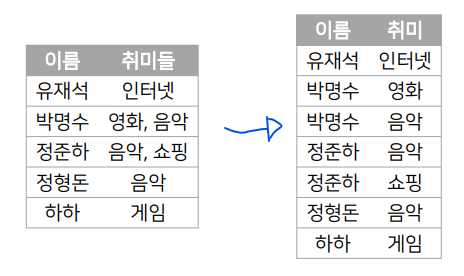
### 제 2 정규화
- 제 1정규화를 만족하면서 모든 속성이 기본키에 완전 함수 종속이 되도록 테이블을 분해

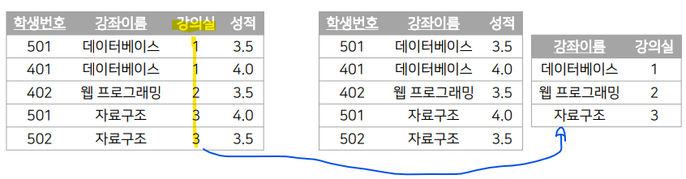
### 제 3 정규화
- 제 2정규화를 만족하면서 이행적 함수 종속 관계를 없애고 비이행적 함수 종속 관계를 만족하도록 분해
- 기본키의 직접적인 종속을 따른다.
- 기본키에 각각 종속시킨다.

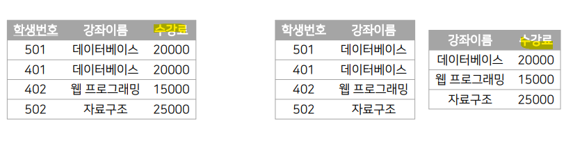
### 보이스-코드 정규화 (BCNF)
- 제 3 정규형을 만족하면서 모든 결정자가 후보키가 되도록 테이블을 분해

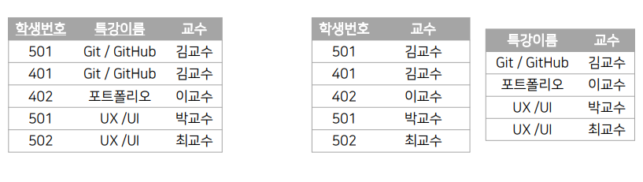
### 제 4 정규화
- BCNF를 만족하면서 테이블에서 다치 종속 관계를 제거
- 다치 종속(Multi-valued Dependency) : 같은 테이블 내의 독립적인 두 개 이상의 컬럼이 또 다른 컬럼에 종속되는 것

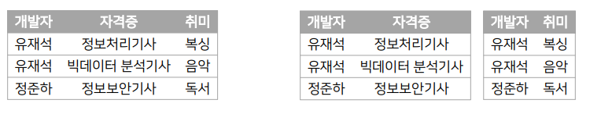

### 제 5 정규화
-  제4정규화를 만족하면서 후보키를 통하지 않은 조인종속(Join Dependency)을 제거
- 조인 종속(Joint Dependency) : 여러 개의 테이블로 분해 후, 다시 조인했을 때 데이터 손실이 없고 필요 없는 데이터가 생기는 것
- 필요없는 데이터가 생길 수도 있다.
- 제 5정규화까지 하는 경우는 거의 없다. (너무 복잡해지기 때문)

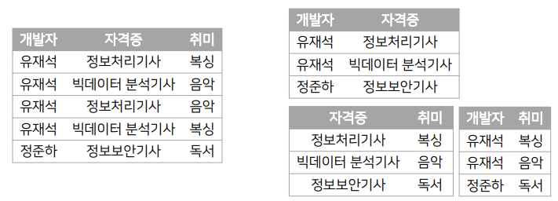
### 정규화의 장점
- 업무 변경에 유연한 대처가 가능, 높은 확장성
- 인덱스 수의 감소
- 속성 추가의 가능성이 높을 때 사용
### 정규화의 단점
- 빈번한 Join 연산의 증가
- 부자연스러운 DB
- 조회/검색 위주의 응용시스템에 부적합
- 기억장치의 성능이 좋아지고, 저렴해지면서 정규화의 중요성이 저하되고, 성능을 우선 시하게 되는 경향이 있다.