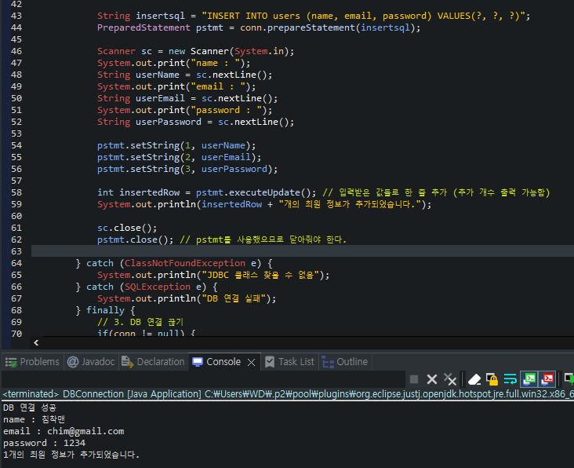

## 목차
- [데이터베이스 입출력](#데이터베이스-입출력)
  - [DriverManager 클래스](#drivermanager-클래스)
  - [Connection 인터페이스](#connection-인터페이스)
  - [Statement 인터페이스](#statement-인터페이스)
  - [PreParedStatement 인터페이스](#preparedstatement-인터페이스)
  - [ResultSet 인터페이스](#resultset-인터페이스)
- [DB 연동](#db-연동)
- [DB 연결](#db-연결)
  - [1. JDBC 드라이버 로딩](#1-jdbc-드라이버-로딩)
  - [2. Database 연결](#2-database-연결)
  - [3. Database 연결 끊기](#3-database-연결-끊기)
  - [DB 연결 관련 전체 코드](#db-연결-관련-전체-코드)
  - [Statement \[실습\]](#statement-실습)
  - [PreparedStatement \[실습\]](#preparedstatement-실습)
- [DB 연결 - 데이터 삽입](#db-연결---데이터-삽입)
  - [게시판 데이터 삽입하기 \[실습\]](#게시판-데이터-삽입하기-실습)
- [DB 연결 - 데이터 수정](#db-연결---데이터-수정)
- [DB 연결 - 데이터 삭제](#db-연결---데이터-삭제)
- [DB 연결 - 데이터 읽기](#db-연결---데이터-읽기)

<br/>
<br/>
<br/>
<br/>

# 데이터베이스 입출력
- 자바는 DB와 연결해서 데이터 입출력 작업을 할 수 있도록 JDBC(Java Database Connectivity) 라이브러리를 제공한다.
- JDBC Driver : JDBC 인터페이스를 구현한 것으로 DBMS마다 별도로 라이브러리를 다운받아 사용한다.
- DB 연결을 위해서는 IP 주소, DBMS 포트번호, 사용자 이름 및 비밀번호, 접속하려는 DB 이름이 필요하다.


- DB를 연결하기 위해서는 JDBC Driver를 먼저 메모리로 로딩하는 작업이 필요하다.
- JDBC Driver 클래스의 static 블록이 실행되면, DriverManager에 JDBC Driver 객체를 등록한다.
```java 
Class.forName("com.mysql.cj.jdbc.Driver")
```
## DriverManager 클래스
- JDBC Driver를 등록 및 관리하고, DB와 연결을 생성하는 클래스
- 정적메소드 getConnection( )을 통해 연결하고, Connection 구현 객체를 반환한다.
```java
String url =
"jdbc:mysql://localhost:3306/kostagram";
String user = "root";
String password = "1234";
Connection conn = DriverManager.getConnection(url, user, password);
```
## Connection 인터페이스
- 데이터베이스 연결을 나타내는 인터페이스
- SQL에 요청할 객체를 생성할 때 사용된다.
- createStatement() 메서드로 Statement 구현 객체를 반환한다.
- prepareStatement() 메서드로 PreparedStatement 구현 객체를 반환한다.
```java
Statement stmt = conn.createStatement();

String sql = "SELECT * FROM users where id = ?";
PreparedStatement pstmt = conn.prepareStatement(sql);
```
## Statement 인터페이스
- executeQuery( ) 메소드를 통해 SQL문 실행 요청을 하고, 결과를 ResultSet 구현 객체로 반환한다.
- 주로 정적 SQL문을 실행할 때 사용된다.
```java
ResultSet rs = stmt.executeQuery("SELECT * FROM users");
```
## PreParedStatement 인터페이스
- setXXX( ) 메소드로 SQL문에 ‘?’ 표시된 파라미터 값을 설정한다.
- executeQuery( ) 메소드를 통해 SQL문 실행 요청을 하고, 결과를 ResultSet 구현 객체로 반환한다
```java
pstmt.setInt(1, 1);
ResultSet rs = pstmt.executeQuery();
```
## ResultSet 인터페이스
- SQL문의 실행 결과를 나타내는 인터페이스이다.
- next( ) 메소드로 결과 집합의 다음 레코드로 이동한다.
- getXXX() 메소드로 결과 집합의 값을 가져온다.
```java
while (rs.next()) {
    System.out.println(
        rs.getInt("id") + "\t" + rs.getString("email") + "\t" +
        rs.getString("nickname") + "\t" + rs.getString("password")
    );
}
```

<br/>
<br/>
<br/>
<br/>

# DB 연동
- Java와 DBMS를 연동하면, 값을 저장하고, 데이터를 가져오고, 수정 또는 삭제를 하는 작업을 Java에서 할 수 있게 된다.
- Java에 작성된 특정 코드가 실행되면, 지정된 DBMS으로 쿼리를 전송하고 결과를 얻어 오게끔 하는 것이다.
- 쉽게 말해, Java를 통해 데이터베이스에 접근할 수 있는 별도의 프로그램을 하나 만드는 것이라 볼 수 있다.

<hr/>

- [MySQL Connector/J](https://dev.mysql.com/downloads/connector/j/) 다운로트
  - MySQL에서 제공하는 JDBC Driver
  - 다운로드 받은 `.jar` 파일은 Build path에 추가하여 사용하면 된다.

<br/>
<br/>
<br/>
<br/>

# DB 연결
- 클라이언트 프로그램에서 DB와 연결하려면 몇 가지 준비가 필요하다.
  1. 해당 DBMS의 JDBC Driver
  2. DBMS가 설치된 컴퓨터의 IP 주소
  3. DBMS가 허용하는 포트(Port) 번호
  4. DB 사용자 계정 및 비밀번호
  5. 사용하고자 하는 DB 이름
- IP 주소는 컴퓨터를 찾아가기 위해, PORT 번호는 DBMS로 연결하기 위해 필요하다.
- 또한 여러 개의 DB 중 사용할 DB의 이름과 사용자 인증을 위한 계정과 비밀번호도 필요하다.
## 1. JDBC 드라이버 로딩
- Class.forName( ) 메소드는 문자열로 주어진 JDBC Driver 클래스를 Build Path에서 찾고, 메모리에 로딩한다.

- 이 과정에서 JDBC Driver 클래스의 static 블록이 실행되면서 DriverManager에 JDBC Driver 객체를 등록하게 된다.
- 만약 Build Path에서 JDBC Driver 클래스를 찾지 못하면 ClassNotFoundException을 발생시킨다.
```java
Class.forName("com.mysql.cj.jdbc.Driver");
```
## 2. Database 연결
- `getConnection()`이라는 정적 메소드로 DB와 연결
```java
String url =
"jdbc:mysql://localhost:3306/board";
String user = "root";
String password = "1234";
Connection conn = DriverManager.getConnection(url, user, password);
```
## 3. Database 연결 끊기
- DB 연결을 끊기 위해서는 Connection 객체의 `close()` 메소드를 호출한다.
```java
if (conn != null) {
    try {
        conn.close();
    } catch (SQLException e) {
        e.printStackTrace();
    }
}
```

## DB 연결 관련 전체 코드
```java
import java.sql.Connection;
import java.sql.DriverManager;
import java.sql.SQLException;

public class DBConnection {
	private static Connection conn = null; // DB 연결 객체

	public static void main(String[] args) {
		try {
			// 1. JDBC 드라이버 로딩
			Class.forName("com.mysql.cj.jdbc.Driver");
			// 2. DB 연결
			String url = "jdbc:mysql://localhost:3306/kostagram";
			String user = "root";
			String password = "1234";
			conn = DriverManager.getConnection(url, user, password);
			System.out.println("DB 연결 성공");

		} catch (ClassNotFoundException e) {
			System.out.println("JDBC 클래스 찾을 수 없음");
		} catch (SQLException e) {
			System.out.println("DB 연결 실패");
		} finally {
			// 3. DB 연결 끊기
			if(conn != null) {
				try {
					conn.close();
				} catch (SQLException e) {
					System.out.println("conn 객체 종료 실패");
				}
			}
		}

	}

}
```
## Statement [실습]


- Statement는 정적인 메소드에서만 사용해야 한다.
- 만약 로그인 할 때, 아이디만 제대로 입력한다면 로그인이 될 수도 있기 때문이다.
- 그래서 Statement 대신 PreparedStatement를 사용한다.
## PreparedStatement [실습]


<br/>
<br/>
<br/>
<br/>

# DB 연결 - 데이터 삽입


- 값을 `?(물음표)`로 대체한 매개변수화 된 INSERT문으로 데이터 저장
- `PreparedStatement`를 통해 입력받은 문자열을 실행한다.
- Connection의 `prepareStatement()` 메소드로부터 PreparedStatement 구현 객체를 얻을 수 있다.
- "?" 에 들어갈 값을 지정해주어야 하는데, "?"는 순서에 따라 1번부터 번호가 부여된다.
- 값의 타입에 따라 Setter 메소드를 선택한 후, 순서와 값을 매개변수로 전달한다.
- 값을 지정한 후, PreparedStatement의 executeUpdate( ) 메소드를 호출하면,
SQL문이 실행되면서 users 테이블에 1개의 행이 저장된다.
- executeUpdate( ) 메소드는 저장된 행의 개수를 int 값으로 반환한다.
- 만약 PreparedStatement를 더 이상 사용하지 않는다면, close( ) 메소드를 호출해 메모리를 해제해준다
## 게시판 데이터 삽입하기 [실습]
- 사용자 번호 설정 후 글 작성하기


- 사용자 아이디 번호 입력 받아 글 작성하기


<br/>
<br/>
<br/>
<br/>

# DB 연결 - 데이터 수정


<br/>
<br/>
<br/>
<br/>

# DB 연결 - 데이터 삭제


<br/>
<br/>
<br/>
<br/>

# DB 연결 - 데이터 읽기

- ResultSet은 SELECT 문에 기술된 컬럼으로 구성되어 있는 행의 집합이다.
- 만약 가져오려는 데이터가 1개의 행으로 구성된 경우에는 while 대신에 if를 사용할 수 있다.
- 만약 SQL 컬럼명에 별명이 있다면, 별명이 컬럼 이름이 된다.