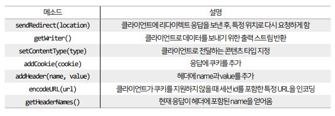
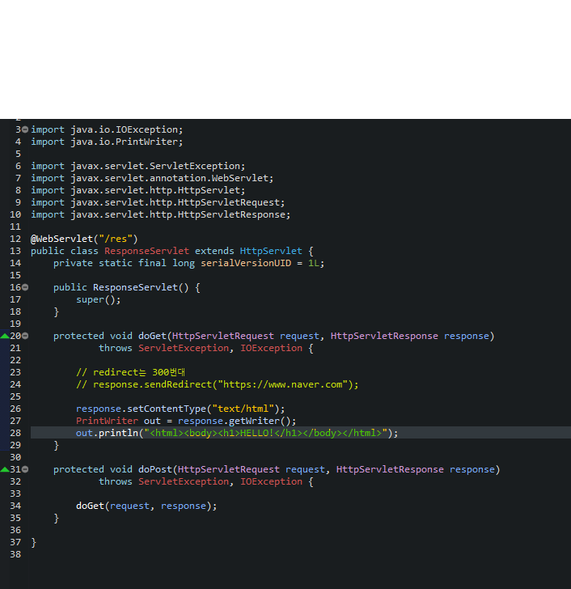

## 목차
- [Web](#web)
  - [Web의 동작 구조](#web의-동작-구조)
- [네트워크](#네트워크)
- [프로토콜](#프로토콜)
    - [UDP (User Datagram Protocol)](#udp-user-datagram-protocol)
  - [TCP/IP (Transmission Control Protocol)](#tcpip-transmission-control-protocol)
    - [TCP 네트워킹](#tcp-네트워킹)
- [IP 주소 (Internet Protocol Address)](#ip-주소-internet-protocol-address)
- [인터넷 기반 서비스](#인터넷-기반-서비스)
- [Port](#port)
- [서버와 클라이언트](#서버와-클라이언트)
- [Web Application](#web-application)
  - [웹 애플리케이션의 구성 요소](#웹-애플리케이션의-구성-요소)
  - [요청과 응답](#요청과-응답)
- [HTTP](#http)
  - [HTTP 헤더](#http-헤더)
  - [HTTP 상태 코드](#http-상태-코드)
    - [200번대 코드](#200번대-코드)
    - [300번대 코드](#300번대-코드)
    - [400번대 코드](#400번대-코드)
    - [500번대 코드](#500번대-코드)
  - [HTTP 요청 메소드](#http-요청-메소드)
    - [GET](#get)
    - [POST](#post)
    - [PUT](#put)
    - [PATCH](#patch)
    - [DELETE](#delete)
    - [OPTIONS](#options)
- [서블릿 컨테이너 (Servel Container)](#서블릿-컨테이너-servel-container)
- [웹 애플리케이션 개발 환경 구축](#웹-애플리케이션-개발-환경-구축)
  - [웹 프로젝트 구조](#웹-프로젝트-구조)
    - [`src/main/webapp`](#srcmainwebapp)
    - [`src/main/webapp/WEB-INF`](#srcmainwebappweb-inf)
    - [`src/main/webapp/WEB-INF/classes`](#srcmainwebappweb-infclasses)
    - [`src/main/webapp/WEB-INF/lib`](#srcmainwebappweb-inflib)
    - [`src/main/webapp/WEB-INF/web.xml`](#srcmainwebappweb-infwebxml)
- [JSP 실습](#jsp-실습)
  - [JSP 파일 만들어보기](#jsp-파일-만들어보기)
  - [실행해보기](#실행해보기)
- [서블릿 (Servlet)](#서블릿-servlet)
  - [장점과 단점](#장점과-단점)
    - [장점](#장점)
    - [단점](#단점)
  - [서블릿 클래스의 구조](#서블릿-클래스의-구조)
  - [Servlet 실습](#servlet-실습)
    - [`Java Reosurces`에서 servlet 생성](#java-reosurces에서-servlet-생성)
    - [HttpServletRequest 실습](#httpservletrequest-실습)
    - [HttpServletResponse 실습](#httpservletresponse-실습)

<br/>
<br/>
<br/>
<br/>

# Web
- World Wide Web
- 인터넷은 컴퓨터 네트워크망을 의미하고, 웹은 인터넷 서비스 중 하나를 의미한다.
- 웹은 인터넷 상의 정보를 하이퍼텍스트 방식과 멀티미디어 환경에서 검색할 수 있게 해주는 정보 검색 시스템을 말한다.
- 웹은 HTTP라는 프로토콜을 사용하며, HTML로 작성된 문서를 연결하여 다양한 콘텐츠를 제공한다
## Web의 동작 구조

- HTML로 만들어진 콘텐츠는 웹 서버(Web Server)라고 하는 별도의 서버 소프트웨어를 통해 서비스로 제공된다.
- 웹 서버 소프트웨어로는 아파치(Apache)가 대표적이다.
- 또한 웹 서비스를 요청한 클라이언트에서 서비스를 이용하기 위해서는 웹 브라우저(Web Browser)가 필요하다

<br/>
<br/>
<br/>
<br/>

# 네트워크
- 여러 컴퓨터들을 통신 회선으로 연결한 것을 말한다.
- LAN (Local Area Network) : 가정, 회사, 건물, 특정 영역에 존재하는 컴퓨터를 연결한 것
- WAN (Wide Area Network) : LAN을 연결한 것으로, 우리가 흔히 말하는 인터넷은 WAN이다.
- 웹은 인터넷 기반 서비스 중 하나이고, 인터넷은 전 세계를 연결한 컴퓨터 네트워크이다.
- 네트워크(Network)는 컴퓨터와 컴퓨터를 연결해주는 망(Net)으로,
네트워크를 구축하기 위해서는 컴퓨터 간의 연결 규격, 규약이 필요하다.

<br/>
<br/>
<br/>
<br/>

# 프로토콜
- 컴퓨터 간의 연결 규격, 규약을 프로토콜(Protocol)이라 한다.
- 컴퓨터 간의 통신을 할 수 있도록 만든 프로토콜에는 TCP 통신과 UDP 통신이 있다

### UDP (User Datagram Protocol)
- 발신자가 일방적으로 수신자에게 데이터를 보내는 방식으로, TCP/IP 처럼 연결 요청 및 수락 과정이 없기 때문에 TCP보다 데이터 전송 속도가 상대적으로 빠르다.
- 여러 회선을 통해 데이터가 전송되기 때문에
특정 회선의 속도에 따라 데이터가 순서대로 전달되지 않거나, 잘못된 회선으로 인해 데이터 손실이 발생할 수 있다

## TCP/IP (Transmission Control Protocol)
- 클라이언트의 연결 요청과 서버의 연결 수락으로 통신 회선이 고정되어, 데이터가 손실없이 순서대로 전달된다.
- TCP는 IP와 함께 사용하기 때문에 TCP/IP라고 한다.
- 웹 브라우저가 웹 서버에 연결할 때, 이메일 전송, 파일 전송, DB 연동 등에 쓰인다
- 개방형 구조를 갖는 TCP/IP는 하드웨어, 운영체제, 접속 매체와 관계없이 동작할 수 있다. 
<hr/>

- OSI(Open Systems Interconnection) 7계층에서 유래한 것으로 4계층 구조로 구성되어 있다.
  - 응용 계층 : WWW, FTP, Telnet, SMTP와 같은 네트워크 프로그램
  - 전송 계층 : 각 시스템을 연결하고 TCP 프로토콜을 이용해 데이터를 전송
  - 인터넷 계층 : IP 프로토콜을 이용해 데이터를 정의하고 경로를 배정
  - 물리 계층 : 실제 네트워크에 접근할 수 있도록 하는 물리적인 부분
### TCP 네트워킹 
- Java는 TCP 네트워킹을 위해 java.net의 ServerSocket 클래스와 Socket 클래스를 제공한다.
- ServerSocket은 클라이언트의 연결을 수락하는 서버 쪽 클래스이고,
- Socket은 클라이언트에서 연결을 요청할 때 또는 클라이언트와 서버 양쪽에서 데이터를 주고받을 때 사용되는 클래스이다.

<br/>
<br/>
<br/>
<br/>

# IP 주소 (Internet Protocol Address)
- 컴퓨터의 고유한 주소이다.
- TCP/IP로 연결된 네트워크에서 각각의 컴퓨터를 구분하기 위해 사용하는 주소이다.
- 4개로 구분된 10진수 숫자로 구성되어 있다.
- IP 주소는 네트워크 어댑터(LAN 카드)마다 할당된다.
- 만약 컴퓨터에 두 개의 네트워크 어댑터가 장착되어 있다면, 두 개의 IP 주소를 할당 받을 수 있다.
- 네트워크 어댑터에 어떤 IP 주소가 부여되어 있는지 확인하려면 터미널에 명령어를 입력하면 된다.
  - 윈도우 : `ipconfig`
  - 맥OS : `ifconfig`
- 프로그램에서는 DNS(Domain Network System)를 이용해 컴퓨터의 IP 주소를 검색한다. 
  -  DNS는 도메인 이름으로, IP를 등록하는 저장소이다.
-  웹 브라우저는 웹 서버와 통신하는 클라이언트로,
사용자가 입력한 도메인 이름으로 DNS에서 IP 주소를 검색해 찾아 웹 서버와 연결하고 웹 페이지를 받아온다.

<br/>
<br/>
<br/>
<br/>

# 인터넷 기반 서비스
- 인터넷 기반의 대표적인 서비스는 웹 이외에도 이메일, FTP, Telnet, DNS 등이 있다.
- 인터넷 기반 서비스는 각각에 해당하는 프로토콜과 포트가 정해져 있다.

<br/>
<br/>
<br/>
<br/>

# Port
- 하나의 컴퓨터에서 여러 개의 네트워크 서비스를 제공하는 경우, 이들을 구분하기 위한 목적으로 사용한다.
- 한 대의 컴퓨터에는 하나 이상의 다양한 서버 프로그램들이 실행될 수 있다.
- 웹 서버, 데이트베이스 관리 시스템, FTP 서버 등이 하나의 IP 주소를 갖는 컴퓨터에서 동시에 실행될 수 있다.
- IP는 컴퓨터의 네트워크 어댑터까지 갈 수 있는 정보이고, 컴퓨터 내부에서는 실행하는 서버를 선택하기 위해 추가적인 Port 번호가 필요하다.
- 즉, Port는 운영체제가 관리하는 서버 프로그램의 연결 번호이다.
- 서버는 시작할 때 특정 Port 번호에 바인딩 된다.


- Java에서 IP 주소를 java.net 패키지의 InetAddress로 표현한다.
- InetAddress를 이용하면 로컬 컴퓨터의 IP 주소를 얻을 수 있고,
도메인 이름으로 DNS에서 검색한 후 IP 주소를 가져올 수도 있다.

```java
import java.net.InetAddress;
import java.net.UnknownHostException;

public class IPExample {
	public static void main(String[] args) {
		// IP 주소를 확인할 때는 java.net 패키지의 InetAddress 클래스를 사용한다.
		try {
			InetAddress local = InetAddress.getLocalHost();
			String myIP = local.getHostAddress();
			System.out.println(myIP);

			InetAddress[] remoteArr = InetAddress.getAllByName("google.com");
			for (InetAddress remote : remoteArr) {
				String naverIP = remote.getHostAddress();
				System.out.println("구글 IP 주소 > " + naverIP);
			}
		} catch (UnknownHostException e) {
			e.printStackTrace();
		}
	}
}
```


<br/>
<br/>
<br/>
<br/>

# 서버와 클라이언트

- 서버(Server) : 서비스를 제공하는 프로그램
- 클라이언트(Clieint) : 서비스를 요청하는 프로그램

<br/>
<br/>
<br/>
<br/>

# Web Application
- 웹 애플리케이션은 웹에서 실행되는 응용프로그램을 뜻하며, 인터넷을 통한 여러가지의 서비스를 일컫는다.
- 사용자는 필요한 데이터를 Request(요청)하고,
서버에서는 사용자의 Request를 수행하며, 요청한 데이터를 Response(응답)하게 되는 형식이다.

## 웹 애플리케이션의 구성 요소
1. 웹 브라우저 : 클라이언트에서 요청을 하고, 전달받은 페이지를 볼 수 있는 환경
2. 웹 서버 : 서버에 저장된 리소스를 클라이언트에 전달하는 역할 (주로 정적 콘텐츠)
3. 웹 애플리케이션 서버 : WAS라 부르며, 서버에서 필요한 기능을 수행하고, 그 결과를 웹 서버에 전달하는 역할
4. 데이터베이스 : 서비스에 필요한 데이터를 보관, 갱신 등 관리를 수행하는 역할
## 요청과 응답
- 서버는 클라이언트가 있기에 동작한다.
- 클라이언트에서 서버로 요청(request)을 보내고, 서버에서는 요청의 내용을 읽고 처리한 뒤 클라이언트에 응답(response)을 보낸다.
- 모든 요청과 응답은 헤더(Header)와 본문(Body)을 가지고 있다.
  - 헤더는 요청 또는 응답에 대한 정보를 가지고 있는 곳이고
  - 본문은 서버와 클라이언트 간에 주고받을 실제 데이터를 담아두는 공간이다.

<br/>
<br/>
<br/>
<br/>

# HTTP
- HTTP는 HTML 문서와 같은 리소스들을 가져올 수 있도록 해주는 프로토콜이다.
- HTTP는 웹에서 이루어지는 모든 데이터 교환의 기초이며, 클라이언트-서버 프로토콜이기도 하다.
- 클라이언트와 서버들은 (데이터 스트림과 대조적으로) 개별적인 메시지 교환에 의해 통신한다.
- 클라이언트에 의해 전송되는 메시지를 요청(requests)이라고 부르며, 그에 대해 서버에서 응답으로 전송되는 메시지를 응답(responses)이라고 부른다
## HTTP 헤더
- 클라이언트와 서버가 요청 또는 응답으로 부가적인 정보를 전송할 수 있도록 해준다.
- 콜론(:)을 기준으로 키와 값으로 이루어져 있다.
- HTTP 헤더의 키는 대소문자 구분을 하지 않으며, 값은 줄바꿈을 인식하지 않고,
맨 앞의 빈 문자열은 무시된다는 특징이 있다
- `일반 헤더(General header)` : 요청과 응답 모두에 적용되지만 Body에서 전송되는 데이터와는 관련이 없는 헤더.
- `요청 헤더(Request header)`: Fetch될 리소스나 클라이언트 자체에 대한 자세한 정보를 포함하는 헤더.
- `응답 헤더(Response header)`: 응답에 대한 부가적인 정보(위치 또는 서버 자체에 대한 정보 등)를 갖는 헤더.
- `엔티티 헤더(Entity header)`: 콘텐츠 길이나 MIME 타입과 같이 Entity Body에 대한 자세한 정보를 포함하는 헤더.
## HTTP 상태 코드
### 200번대 코드 
- 성공을 알리는 상태코드. 
- [ 200(성공), 201(작성됨) ]
### 300번대 코드
- 리다이렉션(다른 페이지로 이동)을 알리는 상태 코드. 
- 다른 주소의 페이지로 넘어갈 때 이 코드가 사용된다.
### 400번대 코드 
- 요청 자체에 오류가 있을 때 표시되는 상태 코드. 
- [ 401(권한없음), 403(금지됨), 404(찾을 수 없음) ]
### 500번대 코드
- 요청은 제대로 왔지만 서버에 오류가 생겼을 때 발생하는 상태 코드.
## HTTP 요청 메소드
### GET 
- URL 주소에 정보들이 다 있다.
- 서버 자원을 가져오고자 할 때 사용하며, 요청의 본문에 데이터를 넣지 않는다.
- 데이터를 서버로 보내야 한다면 쿼리스트링을 사용한다. ( ?name=최인규&age=20 )
### POST 
- 서버에 자원을 새로 등록하고자 할 때 사용하며, 요청의 본문에 새로 등록할 데이터를 넣어 보낸다.
### PUT 
- 서버의 자원을 요청에 들어 있는 자원으로 치환하고자 할 때 사용하며, 요청의 본문에 치환할 데이터를 넣어 보냅니다.
### PATCH 
- 서버 자원의 일부만 수정하고자 할 때 사용하며, 요청의 본문에 일부 수정할 데이터를 넣어 보냅니다.
### DELETE 
- 서버의 자원을 삭제하고자 할 때 사용하며. 요청의 본문에 데이터를 넣지 않는다.
### OPTIONS
- 요청을 하기 전에 통신 옵션을 설명하기 위해 사용한다.

<br/>
<br/>
<br/>
<br/>

# 서블릿 컨테이너 (Servel Container)
- WAS(Web Application Server)는 웹 애플리케이션을 구동하는 서버를 의미한다.
- 서버 컴퓨터가 WAS로 동작하기 위해서는 Java EE 또는 아파치 톰캣(Tomcat)과 같은 서블릿 컨테이너가 필요하다.
- WAS는 단순히 Java EE 또는 서블릿 컨테이너의 구동을 위해 존재하는 것은 아니고,
운영 및 관리, 장애 대응 등 여러 가지 역할을 하는 시스템이다

<br/>
<br/>
<br/>
<br/>

# 웹 애플리케이션 개발 환경 구축
1. Help > Eclipse MarketPlace 선택

2. 설치 후 Java EE로 설정 변경 후 재시작

3. TOMCAT 9 설치
   - create a dynamic web project 선택 후 targaet runtime 설정에서 설치


4. 프로젝트 설치 완료
    - web.xml : 웹 애플리케이션 관련 정보를 서블릿 컨테이너에 제공하기 위한 설정 파일 (옵션)
## 웹 프로젝트 구조

### `src/main/webapp`
- HTML, JSP, JavaScript, CSS 및 이미지 파일들이 위치
- 해당 위치에 놓이는 파일들은 웹 애플리케이션이 배치될 때 그대로 옮겨진다.
### `src/main/webapp/WEB-INF`
- 웹 애플리케이션의 설정 파일들
- WEB-INF 내에 있는 파일들은 클라이언트에서 요청할 수 없다.
- HTML, JavaScript 같은 정적 자원은 바로 읽을 수 없다.
### `src/main/webapp/WEB-INF/classes`
- 컴파일된 자바 클래스 파일이 있다
- src에 선언된 package가 동일하게 생성된다.
### `src/main/webapp/WEB-INF/lib`
- 실행에 필요한 라이브러리(jar) 파일을 모아두는 디렉토리
### `src/main/webapp/WEB-INF/web.xml`

- 웹 애플리케이션 배치 설명서 파일
- 서블릿 컨테이너는 web.xml를 참조해서 서블릿, 필터, 매개변수 등을 찾고 실행한다.

<br/>
<br/>
<br/>
<br/>

# JSP 실습
## JSP 파일 만들어보기
- java를 품은 HTML
```jsp
<%@ page language="java" contentType="text/html; charset=UTF-8"
    pageEncoding="UTF-8"%>
<%@ page import="java.time.LocalDateTime" %>
<!DOCTYPE html>
<html>
<head>
	<meta charset="UTF-8">
	<title>첫 웹 프로젝트</title>
</head>
<body>
	<h1>Hello World</h1>
	<hr>
	<p>
		현재 날짜와 시간은 <%=LocalDateTime.now() %> 입니다.
	</p>
</body>
</html>
```

## 실행해보기


- 실행해보면 아래와 같은 화면이 나온다.

- `hello.jsp` 파일을 보려면 뒤에 경로를 추가해줘야 된다.


<br/>
<br/>
<br/>
<br/>

# 서블릿 (Servlet)
- 서블릿이란 Java 기반의 Web 프로그램 개발을 위해 만들어진 기술이다.
- 서블릿을 실행하기 위해서는 톰캣과 같은 서블릿 컨테이너가 필요하며, 이를 일반적으로 WAS라 부른다.
- 데스크톱이나 스마트폰에서 실행되는 일반적인 애플리케이션과 달리 웹 프로그램은 서버에서 접속해야 화면을 볼 수 있다.
- 이 때 HTML은 정적 파일이므로 실시간으로 변하는 뉴스 기사, 날씨 정보, 쇼핑몰의 상품 정보 등을 가지고 있을 수 없다.
- 웹 요청과 응답 과정은 다음과 같다.
  - 클라이언트(웹 브라우저)가 서버에 페이지(index.html)를 요청한다.
  - 서버는 클라이언트에 요청받은 파일(html)을 응답한다.
  - 클라이언트는 수신받은 파일(html) 내용을 해석(CSS, JavaScript)하여, 화면에 표시한다.
- 이 때, HTML을 정적 파일이므로, 실시간으로 변하는 정보 등을 가지고 있을 수 없다.
- 변경된 정보를 표시하고 싶다면, 다시 요청을 보내 DB에서 가지고 온 정보로 재구성된 HTML로 클라이언트에 재전달해야 한다.
- 서블릿은 이러한 기능들을 수행할 수 있도록 설계된 특수한 목적의 자바 프로그램이다.

## 장점과 단점
### 장점
- Java API를 모두 사용할 수 있다.
- 운영체제나 하드웨어의 영향을 받지 않으므로, 한 번 개발된 애플리케이션은 다양한 서버 환경에서도 실행 가능하다.
- 다양한 오픈소스 라이브러리와 개발 도구를 활용할 수 있다.
### 단점
- HTML 응답을 위해서는 출력문으로 문자열 결합을 사용해야 한다.
- 서블릿에 HTML이 포함된 경우, 화면 수정이 어렵다.
- HTML 폼 데이터 처리가 불편하다.
- 기본적으로 단일 요청과 응답을 처리하는 구조이기 때문에 다양한 경로의 URL 접근을 하나의 클래스에서 처리하기 어렵다.
<hr/>

- 단점을 보완하기 위해 JSP가 생겨났으며, HTML 문서 내에 Java 코드를 삽입하는 방식이기 때문에 HTML 파일을 직접 수정하는 것이 가능해졌다.
## 서블릿 클래스의 구조
- 서블릿 자체는 Java로 구현하지만 서블릿 컨테이너에 해당 클래스가 서블릿임을 알려야 하며,
어떤 URL 접근에 실행해야 하는지 등록하는 과정이 필요하다.
- 서블릿 클래스는 Serlvet 인터페이스를 구현한 추상 클래스인 GenericServlet 클래스 또는 HttpServlet 클래스 중 하나를 상속해 구현된다. (대부분 HttpServlet 사용)
- `HttpServletRequest` : HTTP 프로토콜의 요청 정보를 서블릿에 전달하기 위한 목적으로 사용

- `HttpServletResponse` : 요청을 보낸 클라이언트로 응답하기 위한 목적으로 사용

- 서블릿은 컨테이너에 의해 동작하므로 객체의 생성 과정과 종료 과정도 컨테이너 안에서 이뤄진다.
  - 서블릿 객체의 생성과 종료에 이르는 과정을 `서블릿 생명주기`라고 한다
- 서블릿 클래스는 기본적으로 doGet(), doPost()와 같은 HTTP 요청 메소드에 따라 필요한 메소드를 오버라이딩해 구현하며, 컨테이너에 의해 객체의 생성과 소멸 등이 관리되므로 필요에 따라 특정 생명 주기 이벤트에 동작하는 메소드를 구현해야 한다.


<br/>
<br/>

## Servlet 실습
### `Java Reosurces`에서 servlet 생성


- 실행해보기


파일을 직접 수정하는 것이 가능해졌다.

<hr/>

### HttpServletRequest 실습

  
- hobby 여러게 적어보기 (name은 하나만 출력된다)


- 다른 정보들 출력해보기

### HttpServletResponse 실습
- redirect를 네이버로 설정하면 네이버로 이동


- html 코드를 직접 입력해보기


- JSON 형식 출력


- cookie 출력 (60초 뒤에 만료된다)


- header에 value 추가


- thread unsafe
