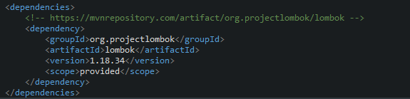

## 목차
- [서블릿 (Servlet)](#서블릿-servlet)
  - [redirect](#redirect)
    - [프로젝트 생성 시](#프로젝트-생성-시)
    - [서블릿 생성 시](#서블릿-생성-시)
  - [dispatch](#dispatch)
  - [쿠키](#쿠키)
    - [쿠키의 특징](#쿠키의-특징)
    - [실습](#실습)
  - [세션](#세션)
    - [세션의 특징](#세션의-특징)
    - [실습](#실습-1)
- [JSP](#jsp)
  - [JSTL/EL](#jstlel)
  - [커스텀 태그](#커스텀-태그)
  - [EL (Expression Lanugage)](#el-expression-lanugage)
  - [JSTL](#jstl)
    - [실습](#실습-2)
    - [JSTL 여러 문법 예제](#jstl-여러-문법-예제)
- [JSTL 이용한 로그인/로그아웃 실습](#jstl-이용한-로그인로그아웃-실습)
- [빌드 도구](#빌드-도구)
- [Maven 프로젝트 생성하기](#maven-프로젝트-생성하기)
- [MVC 패턴](#mvc-패턴)
  - [모델 (Model)](#모델-model)
    - [DAO (Data Access Object)](#dao-data-access-object)
    - [DO (Data Object) / 엔티티(Entity) 클래스](#do-data-object--엔티티entity-클래스)
  - [뷰 (View)](#뷰-view)
  - [컨트롤러 (Controller)](#컨트롤러-controller)
    - [컨트롤러 설계](#컨트롤러-설계)
      - [URL 파라미터를 이용](#url-파라미터를-이용)
      - [프론트 컨트롤러 이용](#프론트-컨트롤러-이용)

<br/>
<br/>
<br/>
<br/>

# 서블릿 (Servlet)
## redirect
- 사용자 요청을 처리한 후에는 적절한 화면으로 넘어갈 수 있다.
- 만약 별도의 데이터를 포함하지 않는다면, 해당 페이지로 바로 리다이렉션할 수 있다.
- 세션에 데이터를 저장한 경우라면, 세션이 유효한 동안 리다이렉션을 통해서도 데이터 참조가 가능하다.
- 데이터를 포함하여 이동해야 하는 경우라면, request 속성으로 데이터를 넣은 후 원하는 페이지로 포워딩해야 한다.

```java
package com.servlet;

import java.io.IOException;

import javax.servlet.ServletException;
import javax.servlet.annotation.WebServlet;
import javax.servlet.http.HttpServlet;
import javax.servlet.http.HttpServletRequest;
import javax.servlet.http.HttpServletResponse;

// 프로젝트 생성 시 contextRoot : 프로젝트 명
// contentDirectory : src/main/webapp
// http://localhost:8080/프로젝트명/redirect.html
// => 프로젝트 내 src/main/webapp 폴더에 있는 redirect.html을 열여서 보여준다
// http://localhost:8080/프로젝트명/image.jpg
// => 프로젝트 내 src/main/webapp 폴더에 있는 image.jpg을 열어서 보여준다.

// 서블릿 생성 시
// URL Mapping: `@WebServlet("/서블릿매핑")`
// http://localhost:8080/프로젝트명/서블릿매핑

// http://localhost:8080/page_web/RedirectServlet
@WebServlet("/RedirectServlet")
public class RedirectServlet extends HttpServlet {

	private static final long serialVersionUID = 1L;

	protected void doGet(HttpServletRequest request, HttpServletResponse response)
			throws ServletException, IOException {

		// sendRedirect를 통한 화면 전환은 별도의 데이터를 추가로 전달할 수 없다.
		// 주소가 변경된다
		// 세션을 통한 데이터 전달은 가능하다.
		response.sendRedirect("redirect.html");

		// response.sendRedirect("https://www.naver.com");
	}

	protected void doPost(HttpServletRequest request, HttpServletResponse response)
			throws ServletException, IOException {

		doGet(request, response);
	}
```


- `sendRedirect`를 통한 화면 전환은 별도의 데이터를 추가로 전달할 수 없다.
- 주소가 변경된다
- 세션을 통한 데이터 전달은 가능하다.


### 프로젝트 생성 시 
- contextRoot : 프로젝트 명
- contentDirectory : `src/main/webapp`
- http://localhost:8080/프로젝트명/redirect.html
- => 프로젝트 내 `src/main/webapp` 폴더에 있는 redirect.html을 열여서 보여준다
- http://localhost:8080/프로젝트명/image.jpg
- => 프로젝트 내 `src/main/webapp` 폴더에 있는 image.jpg을 열어서 보여준다.


### 서블릿 생성 시
- URL Mapping: `@WebServlet("/서블릿매핑")`
- http://localhost:8080/프로젝트명/서블릿매핑

## dispatch


## 쿠키
- 클라이언트에 저장하는 작은 정보를 의미한다.
- 서버의 요청에 의해 브라우저가 저장하게 되며, 서버가 요청할 때 제공하는 형식이다.
### 쿠키의 특징
- 파일로 클라이언트 컴퓨터에 저장되는 방식으로 보안상 문제가 될 수 있다.
- 광고 혹은 기타 목적으로 사용자 이용 행태 추적에 이용될 수 있으며, 이러한 경우에는 사용자 동의가 필요하다.
- 연속되는 페이지 이동에 대한 정보보다는 재방문 등의 확인 용도로 많이 사용된다.
- 'name=value' 형식이며 유효 기간, 요청 경로, 도메인 지정 등의 부가 속성을 포함한다.
- 주로 자바스크립트를 통해 처리하지만 HttpOnly 설정으로 서버에서만 사용할 수 있도록 설정할 수 있다.
### 실습


## 세션
- 클라이언트가 웹 애플리케이션 서버에 접속할 대 서버 쪽에 생성되는 공간이다.
- 내부적으로는 세션 아이디를 통해 참조된다.
- 즉, 브라우저는 서버에 접속할 때 발급받은 세션ID를 기억하고 서버는 해당 세션ID로 할당된 영역에 접근하는 형식이다.
- 서버에 저장되므로 쿠키보다 보안이 더 좋다.
### 세션의 특징
- 세션 유효 시간이나 브라우저 종료 전까지 유지되므로 서로 다른 페이지에서도 정보 공유가 가능하다.
- 로그인 유지, 장바구니, 컨트롤러 구현 등에서 다양하게 사용된다.
- 사용자마다 생성되는 공간으로, 동시에 많은 사용자가 접속하는 경우 충분한 메모리를 비롯한 세션 관리 대책이 필요하다.

### 실습


<br/>
<br/>
<br/>
<br/>

# JSP
- Java Server Page or Jarkarta Server Page
- HTML 코드에 Java 코드를 사용하여, 동적 웹 페이지를 생성하는 웹 어플리케이션 도구(라이브러리)
- 서블릿에서 HTML과 데이터 결합을 손쉽게 처리하기 위해 만들어졌다.
- HTML에 Java 코드를 더한 형태(HTML이 Java 코드를 품고 있는 형태)로, 컨테이너에 의해 서블릿 형태의 자바 코드로 변환 후 컴파일되어 컨테이너에 적재되는 구조이다. 
- 게시판이나 상품 목록과 같이 데이터를 반복해서 출력하거나 조건을 체크해야 하는 경우에는 단순한 HTML 문법으로 처리가
불가능하기 때문에 Java 코드를 HTML 내부에 중간중간 사용해야 한다는 문제점이 있다.
## JSTL/EL
- JSP의 구조적 문제를 해결하기 위해 커스텀 태그를 기반으로 하는 JSTL(JSP Standard Tag Library)과 EL(Expression Language)가 도입되었다.
- JSP보다 훨씬 구조적이고 가독성도 높아졌으며,
이와 같은 프로그램 구조는 MVC 패턴과 함께 서블릿과 결합되어 오랫동안 Java 웹 개발의 정석으로 자리 잡아왔다.
- 이러한 구조에도 단점은 있는데, SSR 구조(서버에서 빌드하는 구조)이기 때문에
모든 실행이 서블릿 컨테이너를 통해야 한다는 점이다.
- 따라서 사소한 디자인 변경도 서버를 통해 실행해야 하며, 이는 개발 생산성과 디자이너와의 협업 등에서 큰 문제가 되게 된다.
## 커스텀 태그
- 사용자 정의 태그
- 스크립트릿(<% %>의 사용을 줄이고,
태그와 같은 형태로 프로그램 코드를 대체하거나 재활용 가능한 구조를 활용하고자 개발된 규적
- 커스텀 태그 기술로 만들어진 JSTL(JSP Standard Tag Library)이 사용되게 되었다.
## EL (Expression Lanugage)
- 현재 페이지의 Java 객체에 손쉽게 접근하고 사용할 수 있게 해준다.
- 데이터를 표현하기 위한 용도로 설계되었지만, 단순한 출력 외에도 제한된 객체 참조가 가능하며, 해당 객체의 메소드 호출, 사칙, 비교, 3항 연산 등을 지원한다.

```jsp
${data}
${dataArr[0]}
${dataMap["data"]}
```
## JSTL
- JSP에서 Java 코드 블록(스크립트릿)을 사용하지 않고 HTML 형식을 유지하면서 조건문, 반복문, 간단한 연산 등
유용한 기능을 손쉽게 사용할 수 있도록 지원하기 위해 만들어진 표준 커스텀 태그 라이브러리이다.
- JSTL 라이브러리를 구현한 여러 버전이 있지만, [Apache Standard Taglib](https://tomcat.apache.org/download-taglibs.cgi)을 주로 사용한다
  - Impl(taglibs-standard-impl-1.2.5.jar)
  - Spec(taglibs-standard-spec-1.2.5.jar)
  - 저장 후 `webapp/WEB-INF/lib` 폴더에 복사
- JSTL을 JSP에서 사용하기 위해서는 taglib 지시어를 추가해야 한다.
### 실습


### JSTL 여러 문법 예제
```jsp
	<c:set var="title" value="<h1>JSP</h1>" />
	${title}

	<c:set var="greeting" value="안녕하세요!" />
	${greeting}

	<!--<c:set var="numArr" value="${[1,2,3,4,5]}" />
	${numArr[2]}-->

	<c:set var="loginUser" value="${sessionScope.loginUser }" />

	<c:if test='${loginUser != null}'>
		<p>${greeting }${loginUser }님</p>

		<!-- 로그아웃 form -->
		<form action="/jstl_web/logout" method="post">
			<button>로그아웃</button>
		</form>
	</c:if>
	<c:if test="${loginUser == null}">
		<p>로그인부터 해주세요.</p>

		<!-- 로그인 화면 만들기 -->
		<form action="/jstl_web/login" method="post">
			<input type="text" name="name" />
			<button>로그인</button>
		</form>
	</c:if>


	<c:choose>
		<c:when test="${loginUser == null}">
			<p>로그인부터 해주세요.</p>

			<!-- 로그인 화면 만들기 -->
			<form action="/jstl_web/login" method="post">
				<input type="text" name="name" />
				<button>로그인</button>
			</form>
		</c:when>
		<c:when test="${loginUser.equals(\"최인규\")}">
			<p>드디어 최인규님이 오셨네요.</p>
			<form action="/jstl_web/logout" method="post">
				<button>로그아웃</button>
			</form>
		</c:when>
		<c:otherwise>
			<p>${greeting }${loginUser }님</p>

			<!-- 로그아웃 form -->
			<form action="/jstl_web/logout" method="post">
				<button>로그아웃</button>
			</form>
		</c:otherwise>
	</c:choose>

	<c:forEach var="u" items="${userList}">
		<p>${u.getName()}</p>
	</c:forEach>

```


<br/>
<br/>
<br/>
<br/>

# JSTL 이용한 로그인/로그아웃 실습
- JSPServlet


- jstl.jsp


- LoginServlet


- LogoutServlet


- 로그인/로그아웃 화면


<br/>
<br/>
<br/>
<br/>

# 빌드 도구
- 실제 프로젝트 환경은 수십 개의 클래스와 여러 외부 라이브러리로 구성되므로 프로젝트의 소스를 체계적으로 컴파일하고 관련 라이브러리의 버전이나 종속성 관리를 도와줄 방법이 필요해졌다.
- 이를 위해 Java 빌드 도구가 생겨났다.
- `Maven`은 오랜 기간 거의 모든 프로젝트에서 사용하는 빌드 도구가 되었고 스프링 프레임워크에서도 기본 빌드 도구로 활용되었다.
- 2012년 이후부터는 `Gradle`이 나왔기 때문에 이를 주로 사용하고 있다.
- `Maven` : 빌드 설정을 pom.xml 파일에 작성하게 된다.
- `Gradle` : Groovy라고 하는 JVM 기반 언어를 통해 프로그램 구조로 설정한다. (Maven에 비해 10~100배 성능 향상)

<br/>
<br/>
<br/>
<br/>

# Maven 프로젝트 생성하기
1. dynamic web proejct 생성
2. 프로젝트 마우스 우클릭 수 configure > Convert to Maven Project 클릭   

3. Maven 프로젝트로 변경

   - Group Id : 프로젝트 고유 식별자로 기본 패키지 이름 규칙에 따라 작성
   - Artifact Id : 생성되는 jar(war) 파일의 이름으로 소문자로 작성
   - Version : 버전 관리 번호
   - Packaging : 빌드 산출물 형태 (jar 또는 war)
<hr/>

- lombok 라이브러리 추가해보기
  - [라이브러리 추가](https://mvnrepository.com/artifact/org.projectlombok/lombok/1.18.34)
  - pom.xml에 추가
  


<br/>
<br/>
<br/>
<br/>

# MVC 패턴

- Model - View - Controller
- 주로 GUI 기반 애플리케이션 개발에 사용되는 디자인 패턴이다.
- 현재 백엔드 기반 웹 애플리케이션 개발의 기본 모델이 되었다.
- 모바일 앱 및 프론트앤드 기반의 웹 개발이 늘어나면서 MVP(Model - View - Presenter), MVVM(Model -View - ViewModel)과 같은 패턴도 사용되고 있다.
- 패턴들의 공통적인 목적은 화면과 데이터 처리를 분리하여 코드 간의 종속성을 줄이는 것에 있다.
- 즉, 구성 요소 간 역할을 명확하게 하여 코드를 쉽게 분리하고 협업을 용이하게 만드는 것이다.
## 모델 (Model)
- 데이터를 처리하는 영역
- 일반적으로 DB 연동을 위한 DAO 클래스와 데이터 구조를 표현하는 DO, 엔티티 클래스 등으로 구성된다.
- JPA를 사용하는 경우, DAO는 생략되거나 구현범위가 축소될 수 있으며, 비즈니스 로직에 따라 DTO를 추가로 사용하기도 한다. (주로 서비스 영역)
### DAO (Data Access Object)
- 데이터베이스와의 상호작용을 담당하는 클래스
- CRUD 작업을 수행
- 데이터베이스의 데이터에 접근하고 조작하는 역할
### DO (Data Object) / 엔티티(Entity) 클래스
- 데이터베이스의 테이블과 매핑되는 클래스
- 각 필드는 데이터베이스의 컬럼에 대응되며, 데이터 구조를 표현
## 뷰 (View)
- 화면 구성을 담당하는 영역
- 기본적으로 모델, 컨트롤러와의 종속성이 없도록 구현해야 한다.
- 데이터를 직접 가져오는 방식보다, 주어진 데이터를 출력하는 용도로만 사용하는 것이 바람직하다.
- 뷰 영역의 구현을 위해 뷰 템플릿 엔진이 사용되며, 그 중 대표적인 것이 `JSP`이다.
- 스프링 프레임워크에서는 주로 `타임리프`, `프리마커` 등이 대표적인 뷰 템플릿 엔진이다.
## 컨트롤러 (Controller)
- MVC 패턴의 핵심으로 모든 사용자 요청의 중심에 위치하는 영역
- 사용자의 요청은 특정 뷰에 바로 전달되지 않고, 컨트롤러를 통해 전달된다.
- 컨트롤러는 사용자의 요청에 따라 모델을 통해 데이터베이스와 연동하여 데이터를 처리하고 뷰에 결과를 전달한다.
### 컨트롤러 설계
- 클라이언트의 요청을 단일 컨트롤러에서 처리할 것인지, 개별 컨트롤러에서 처리할 것인지 결정해야 한다.
- 같은 단위의 업무라면 하나의 컨트롤러에서 처리하도록 하는 것이 구조적으로 관리가 쉽다.
  - (예) `/member/add` & `/member/delete`
  -  두 URL이 모두 GET 방식으로 요청이 들어온다면, 하나의 서블릿에서는 동일한 doGet( ) 메소드가 호출되기 때문에 각각의 URL 요청을 별도의 서블릿으로 구현해야 한다.
  -  하지만 같은 단위의 업무이므로 하나의 컨트롤러에서 처리하도록 하는 것이 관리가 쉽다.
-  사용자의 요청을 구분해서 하나의 서블릿에서 처리하기 위해서는 두 가지 방법이 있다.
   -  URL 파라미터를 이용
   -  프론트 컨트롤러 구현
#### URL 파라미터를 이용
- URL 요청을 별도의 파라미터를 두어, 구분하는 방식이다.
- 컨트롤러에서는 request.getParameter("action")을 통해 분기 처리를 진행할 수 있게 된다.
- 비교적 간단한 방법이지만, 파라미터 구조가 변경되면 HTML, JSP, 컨트롤러 모두 수정해야 한다는 단점이 있다.

[예제]


#### 프론트 컨트롤러 이용
- 모든 요청의 진입점이 되는 컨트롤러를 만들고, 여기에서 서브 컨트롤러를 호출하는 구조이다.
- 보다 복잡한 구조를 체계적으로 처리할 수 있다는 장점이 있다.
- 프론트 컨트롤러 패턴은 여러 구현에 응용되는 디자인 패턴이다.
- 중요한 것은 컨트롤러가 단순히 서블릿으로 요청을 처리하기만 하면 되는 것이 아니라
체계적인 구조로 이루어져야 한다는 것이다.
