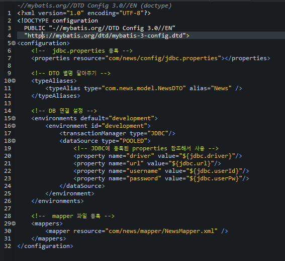
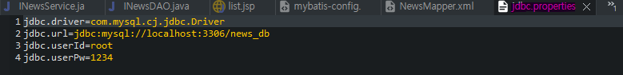
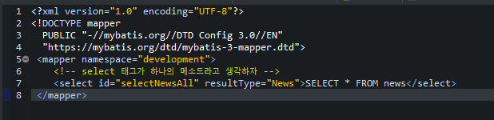
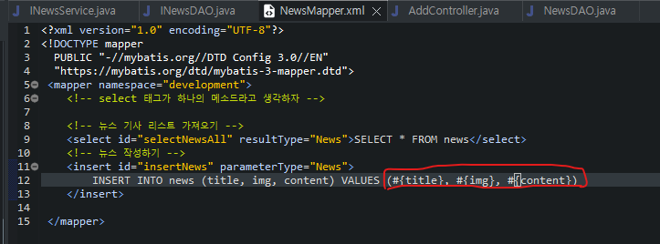
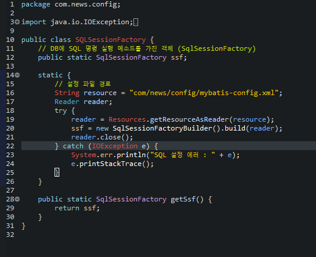
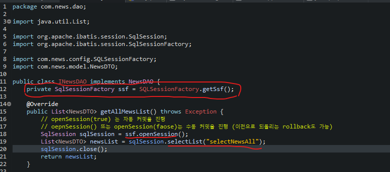

# MyBatis
- 자바 오브젝트와 SQL 사이의 자동 매핑 기능을 지원하는 ORM(Object Relational Mapping) 프레임워크이다.
- SQL, 동적 쿼리, 저장 프로시저 그리고 고급 매핑을 지원하는 SQL Mapper이다.
- MyBatis는 JDBC를 통해 RDBMS에 액세스하는 작업을 캡슐화하고 기존 JDBC의 중복작업을 간소화해준다
- XML 파일의 형태인 Mapper를 통해 프로그램 코드로부터 SQL 쿼리가 분리되는 환경을 제공하고 Java 객체와 매핑하는 작업을 도와준다.
## MyBatis 특징
1. 기존 JDBC보다 사용하기 편리하다
2. SQL문과 프로그래밍 코드의 분리로 이식성이 좋다.
   - SQL에 변경이 있을 때마다 자바 코드를 수정하거나 컴파일 하지 않아도 된다.
   - SQL을 별도의 파일로 분리해서 관리하게 해준다.
3. 간단하다
   - 객체 프로퍼티로 파리미터와 결과를 객체(DTO, Map 등)로 자동 매핑을 지원한다.
   - Spring 연동 모듈을 제공해주기 때문에 Spring 설정이 간단하다.
4. 다양한 프로그래밍 언어로 구현 가능하다

 
 

# `mybatis-config.xml`
- mybatis에서 사용될 DB를 연동하기 위한 설정값들과 mapper.xml을 등록하기 위한 xml
- typeAliases : 매칭할 mapper의 sql 태그의 parameter type 별칭을 설정
- envrionment : DB 연결 설정
- mappers : mapper.xml 파일 연결

 
 

# `mybatic-mapper.xml`
- mybatis에서 사용될 SQL 구문을 담고 있는 xml
- mapper 태그의 namespace 속성 설정
- sql문을 담은 태그 설정
	- id 속성 설정
	- parameter type 속성 설정 (별칭 설정 시 별칭으로 사용 가능)
- 가져오는 파라미터값 설정 ${} 형태와 #{} 형태 사용
	- ${} : 데이터에 따른 ''(문자열) 처리를 해주지 않는다. (statement 방식)
	- #{} : 자동으로 데이터 타입 처리 (prearedstatement 방식)

 
 

# `SQLSessionFactory` 파일

 
 

# DAO 클래스에서 DB 연동
